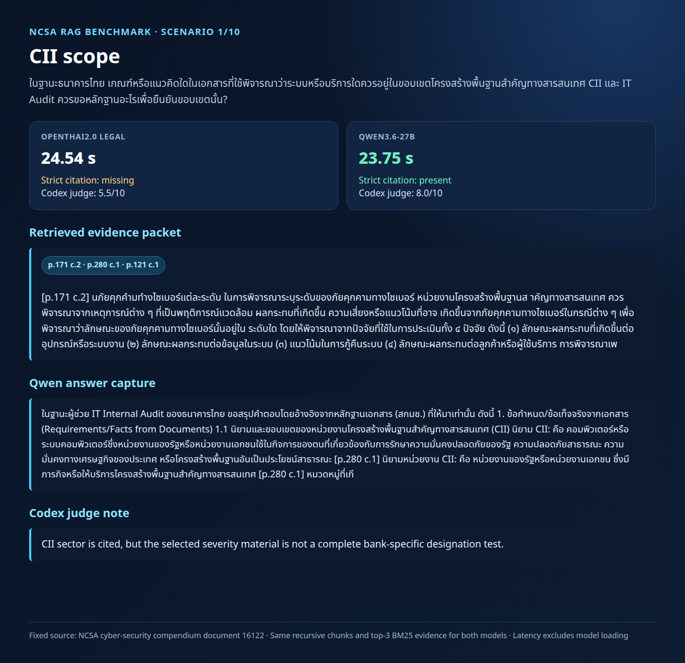
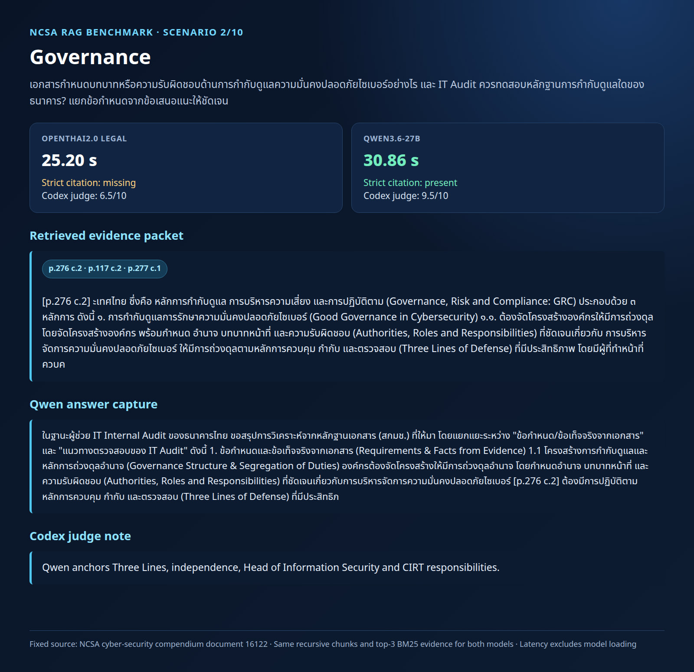
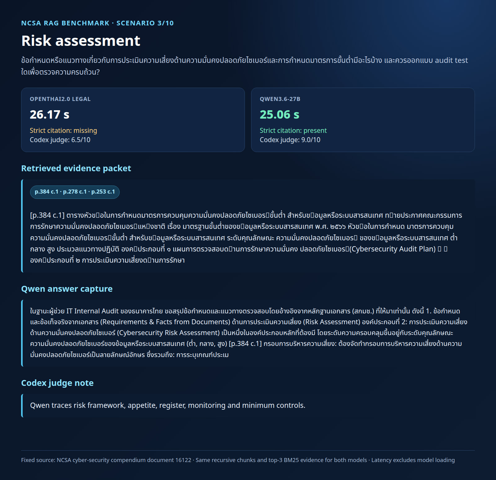
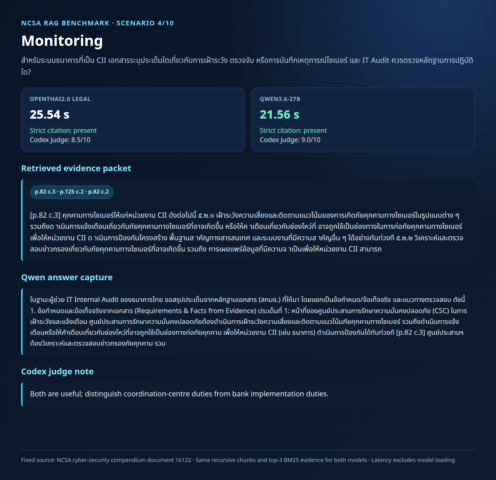
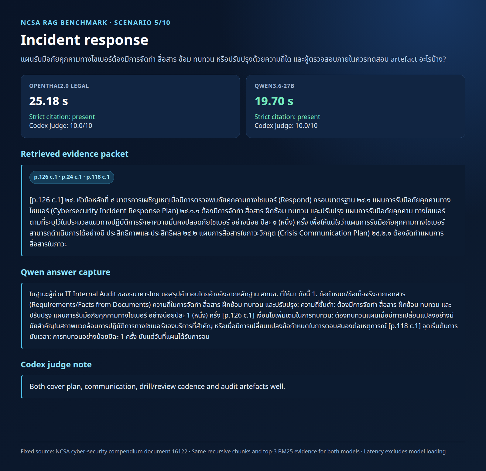
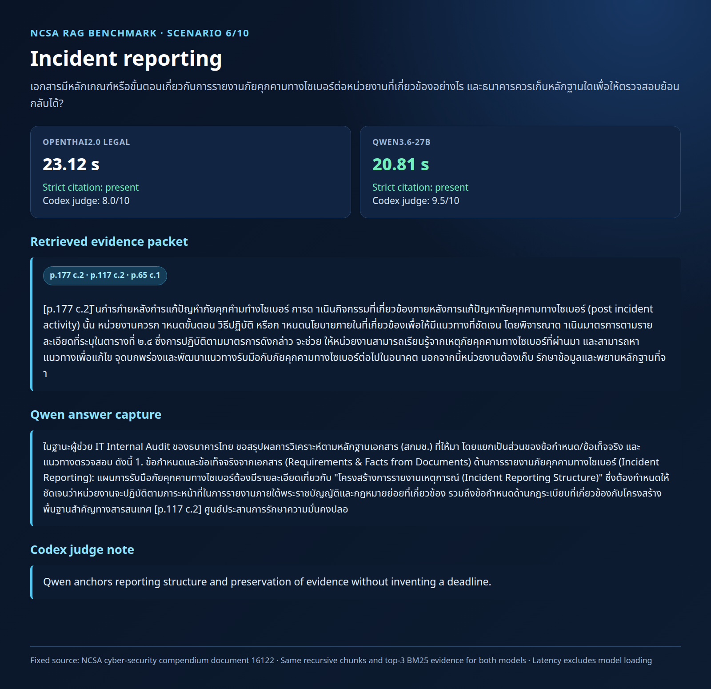
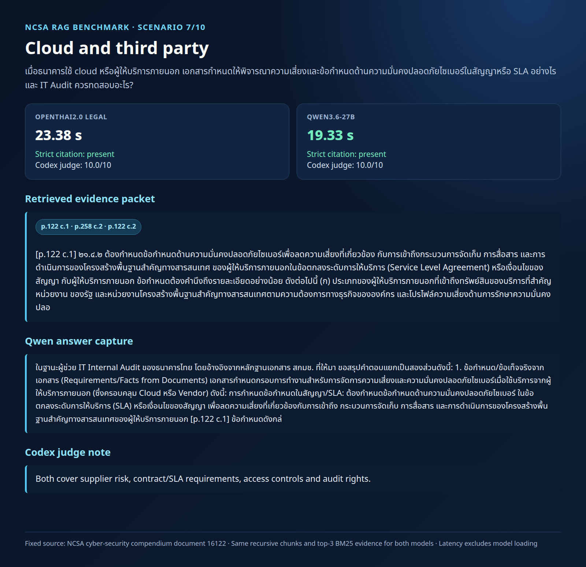
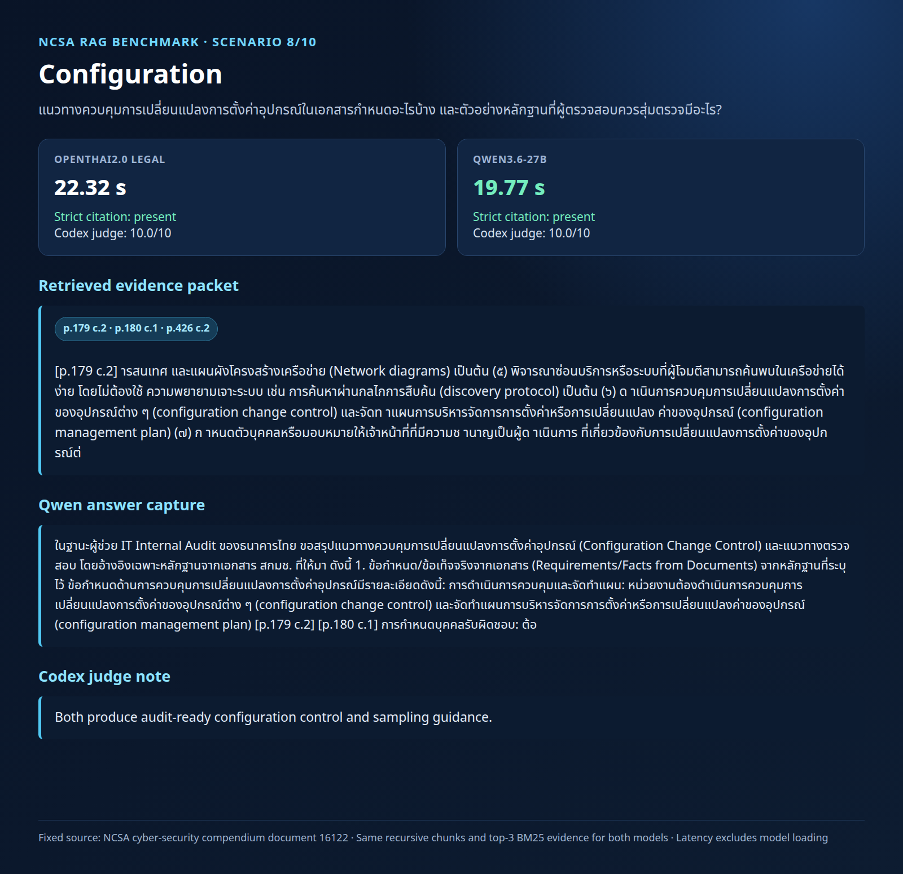
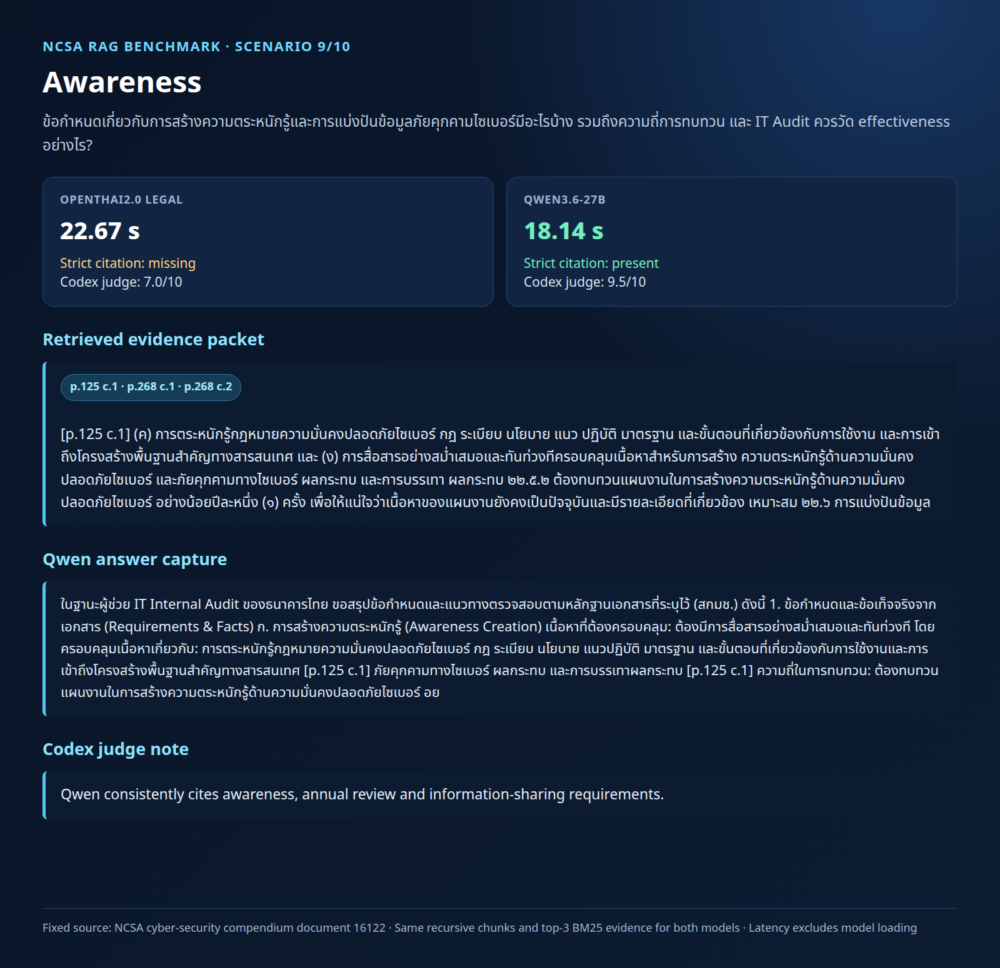
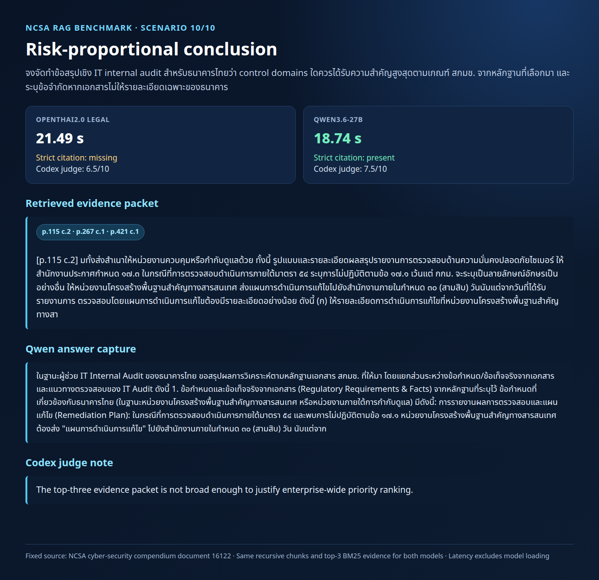

# OpenThai 2.0 Legal — Test Results and Local RAG Web UI

This repository contains reproducible local test artefacts for `iapp/openthai2.0-legal-thaillm-nemotron-3-nano-30b-a3b`:

- a dependency-light RAG web UI that calls an OpenAI-compatible vLLM service;
- a small, page-source-preserved Bank of Thailand (BOT) corpus for evaluation;
- inference, RAG, groundedness, and session-persistence reports.

No model weights, API tokens, database credentials, or chat-session contents are included.

## NCB structural RAG benchmark and Open WebUI

The official consolidated Credit Information Act PDF was parsed by legal structure rather than fixed windows. The current-law Open WebUI package contains 73 active sections with PDF page anchors; amendment-history appendices are retained separately so duplicate amendment section numbers cannot overwrite the consolidated law.

Thirteen NCB scenarios were tested across access logging, consent, loan brokers, correction/dispute, adverse decisions, definitions, licensing, data lifecycle, member reporting, confidentiality, credit models, penalties, and unlawful disclosure.

| Evidence mode | Scenarios | Relevant citation result |
|---|---:|---:|
| Exact structural sections | 13 | **100% precision / 100% recall** |
| Dense Qwen embedding top-4 — original five | 5 | 40.0% precision / 66.7% recall |
| Dense Qwen embedding top-4 — extended eight | 8 | 51.0% precision / 81.2% recall |

The result shows that OpenThai performs strongly when supplied the correct complete sections. Production retrieval should combine BM25 and Qwen embeddings, deduplicate by legal section, rerank, and inject only the best 1–3 complete sections.

Start the hardened local Open WebUI profile at `127.0.0.1:3000` with [the supplied Compose file](openwebui_3000/docker-compose.yml). It connects OpenThai at port `3033`, Qwen3-Embedding-4B at port `8082`, uses hybrid retrieval, enriches section metadata, and reranks candidate sections.

The final live Open WebUI run used an 8,192-token vLLM context, a 2,048-token
answer cap, and `enable_thinking=false`. All five audit answers completed with
`finish_reason=stop` (580–1,213 generated tokens); the largest observed
prompt-plus-answer was 5,015 tokens. Mean retrieval/chat times were
12.42s/41.80s. Hybrid top-3 retrieval reached 46.7% macro precision and 63.3%
macro recall, so answer truncation is fixed while multi-section retrieval
remains the primary improvement target.

Key resources:

- [Structural chunk tutorial](reports/STRUCTURAL_CHUNK_NCB_TUTORIAL.md)
- [Extended NCB benchmark](reports/NCB_OPENTHAI_EXTENDED_RAG_BENCHMARK.md)
- [Open WebUI and RAG test report](reports/CREDIT_INFO_ACT_NCB_OPENWEBUI_RAG_TEST.md)
- [Live Open WebUI 8,192/2,048 benchmark](openwebui_ncb_live_test_8192_2048_20260729/report.md)
- [1,024-token truncation control](openwebui_ncb_live_test_8192_20260729/report.md)
- [`$extract-structural-legal-chunks` reusable skill](skills/extract-structural-legal-chunks/SKILL.md)
- [73 section-level Open WebUI files](data/credit_info_act/openwebui_knowledge/README.md)

## NCSA page-grounded RAG benchmark — OpenThai2.0 vs Qwen3.6-27B

This evaluation has two layers against a 629-page NCSA cyber-security compendium. The original 10-scenario run uses BM25-retrieved chunks; the newer **controlled 7-scenario rerun** locks the exact evidence chunks per question, so retrieval quality cannot obscure synthesis/citation quality. Codex reviewed each answer against its supplied source chunks.

| Metric | OpenThai2.0 Legal | Qwen3.6-27B | Outcome |
|---|---:|---:|---|
| Controlled mean model-request latency | 21.60 s | **19.33 s** | Qwen faster by **10.5%** |
| Controlled strict `[p.x c.y]` citation syntax | 4/7 | **7/7** | Qwen stronger |
| Controlled Codex concept coverage | 25/26 | **26/26** | Both grounded; Qwen more consistent |

The comparison is an operational RAG replay rather than a pure model-quality study: OpenThai used vLLM and Qwen used llama.cpp with a Q8 GGUF build. Model loading is excluded from latency metrics. The controlled result is the primary comparison; see [the controlled report](reports/NCSA_CONTROLLED_FIXED_EVIDENCE_BENCHMARK.md). The earlier retrieval-inclusive result is retained in [the original NCSA report](reports/NCSA_OPENTHAI_VS_QWEN36_27B_BENCHMARK.md).

### Scenario captures

Each capture is produced from the saved test outputs; it shows the Thai question, retrieved page/chunk evidence, model latency, citation state, Qwen answer excerpt, and Codex judge note.

<details>
<summary>Scenario 1 — CII scope</summary>


</details>

<details>
<summary>Scenario 2 — Governance</summary>


</details>

<details>
<summary>Scenario 3 — Risk assessment</summary>


</details>

<details>
<summary>Scenario 4 — Monitoring</summary>


</details>

<details>
<summary>Scenario 5 — Incident response</summary>


</details>

<details>
<summary>Scenario 6 — Incident reporting</summary>


</details>

<details>
<summary>Scenario 7 — Cloud and third party</summary>


</details>

<details>
<summary>Scenario 8 — Configuration</summary>


</details>

<details>
<summary>Scenario 9 — Awareness</summary>


</details>

<details>
<summary>Scenario 10 — Risk-proportional conclusion</summary>


</details>

## Contents

- `web/rag_webui_8083/` — browser UI and Python service on port `8083`
- `web/rag_webui_8083/data/legal_corpus.json` — five BOT evaluation chunks with source URLs
- `reports/BOT_RAG_EVALUATION_20260729.md` — eight BOT-grounded test scenarios and findings
- `reports/INFERENCE_RAG_TEST_REPORT.md` — initial model/inference measurements
- `reports/RAG_WEBUI_8083.md` — architecture and API notes
- `reports/NCSA_OPENTHAI_VS_QWEN36_27B_BENCHMARK.md` — NCSA recursive-chunk replay, latency comparison, and Codex judge rubric
- `reports/NCSA_CONTROLLED_FIXED_EVIDENCE_BENCHMARK.md` — primary controlled rerun with locked evidence per scenario
- `reports/STRUCTURAL_CHUNK_NCB_TUTORIAL.md` — hands-on Thai legal structural chunking guide
- `reports/NCB_OPENTHAI_EXTENDED_RAG_BENCHMARK.md` — eight additional NCB scenarios
- `openwebui_3000/` — Open WebUI v0.9.5 profile for OpenThai + Qwen embeddings
- `skills/extract-structural-legal-chunks/` — reusable validated Codex skill and extractor
- `data/credit_info_act/openwebui_knowledge/` — current-law section files ready for Knowledge upload
- `captures/` — 10 rendered scenario captures generated from saved benchmark JSON
- `tools/generate_scenario_captures.js` — reproducible capture renderer

## Run locally

Start an OpenAI-compatible vLLM server first. The example UI expects it at `127.0.0.1:3033` and uses the served model name `openthai2.0-legal-thaillm-nemotron-3-nano-30b-a3b`.

The RAG UI persists chat sessions in PostgreSQL. Create a database named `opengpt` and set its connection values only in your shell or deployment secret store:

```bash
export OPENGPT_DB_HOST=127.0.0.1
export OPENGPT_DB_PORT=5432
export OPENGPT_DB_NAME=opengpt
export OPENGPT_DB_USER='your_user'
export OPENGPT_DB_PASSWORD='your_password'
python3 web/rag_webui_8083/server.py
```

Open `http://localhost:8083`.

The service needs Python `psycopg2` for PostgreSQL session persistence. It has no frontend build step.

## BOT source boundary

The corpus is a small evaluation set, not a complete legal/regulatory database. Verify any answer against the linked primary source and current official notices. See the BOT evaluation report for observed limitations, especially citation compliance in synthesis answers.
