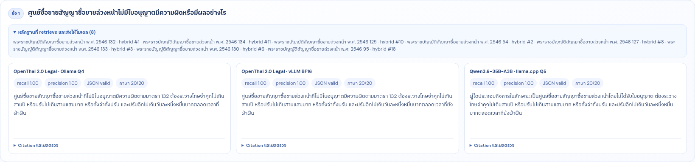
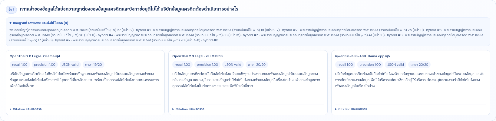
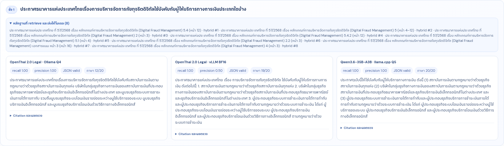

# OpenThai 2.0 Legal: Thai Legal RAG benchmark

การทดสอบแบบตรวจย้อนกลับได้ของ
[OpenThai 2.0 Legal](https://huggingface.co/iapp/openthai2.0-legal-thaillm-nemotron-3-nano-30b-a3b)
กับ RAG เอกสารภาษาไทย เปรียบเทียบผลที่บันทึกไว้ของ 3 runtime

| Model / runtime | รูปแบบรัน |
|---|---|
| OpenThai 2.0 Legal · Ollama Q4 | quantized Q4 ผ่าน Ollama |
| OpenThai 2.0 Legal · vLLM BF16 | local safetensors BF16 ผ่าน vLLM 0.25.1 |
| Qwen3.6-35B-A3B · llama.cpp Q5 | quantized Q5 ผ่าน llama.cpp |

> ผลทั้งหมดเป็น **preliminary / unreviewed** ไม่ใช่คำแนะนำหรือคำวินิจฉัยทางกฎหมาย
> การนำไปใช้จริงต้องให้ผู้เชี่ยวชาญกฎหมายไทยตรวจตัวบทฉบับปัจจุบัน ข้อเท็จจริง และข้อยกเว้น

## Latest: official parent-explicit test — 13 August 2026

รอบล่าสุดทดสอบคำถามคงที่ 10 ข้อ โดยใช้ dataset ทางการที่จัดโครงสร้างใหม่: NCB 5 ข้อ และ
BOT Digital Fraud 5 ข้อ. ทุกคำถามใช้ final evidence packet เดียวกันจาก run Qwen/Q4 เดิม
(4 children ต่อคำถาม) แล้ว replay request เดิมให้ OpenThai BF16 บน vLLM เพื่อแยกผลของ
การสร้างคำตอบออกจากผล retrieval. Expected sections ใช้ **หลัง inference เท่านั้น**.

| Dataset / 5 cases | Model/runtime | JSON valid | all citations grounded | expected-citation recall | citation precision | mean answer time |
|---|---|---:|---:|---:|---:|---:|
| NCB | OpenThai Q4 / Ollama | 5/5 | 5/5 | 1.00 | 1.00 | 3.3457 s |
| NCB | OpenThai BF16 / vLLM | 5/5 | 5/5 | 1.00 | 1.00 | 0.9189 s |
| NCB | Qwen3.6-35B-A3B Q5 / llama-server 8081 | 5/5 | 5/5 | 1.00 | 1.00 | 2.4168 s |
| Digital Fraud | OpenThai Q4 / Ollama | 3/5 | 3/5 | 0.40 | 0.60 | 3.9413 s |
| Digital Fraud | OpenThai BF16 / vLLM | 5/5 | 5/5 | 0.80 | 1.00 | 2.1100 s |
| Digital Fraud | Qwen3.6-35B-A3B Q5 / llama-server 8081 | 5/5 | 5/5 | 0.80 | 1.00 | 2.4952 s |

OpenThai BF16 was served by vLLM 0.25.1 with `dtype=bfloat16`, `max_model_len=32768`,
Triton MoE, temperature 0.0, top_p 1.0, max_tokens 2,048, and seed 42. The runtime used
the native sampler (`VLLM_USE_FLASHINFER_SAMPLER=0`) to avoid an environment-specific
FlashInfer JIT path issue; this is a serving-backend setting, not a change to model weights.

### Evidence-grounded answer review

Codex Sol reviewed the generated answers against the **rendered evidence actually sent to the
model**, not citation metrics alone. The baseline BF16 review found 5 pass, 3 partial, 0 needs
correction, and 2 evidence-limited answers. Qwen/Q4 counts below are the original review of
the same frozen packets; all three results remain preliminary and require legal-expert
adjudication.

| Model/runtime | pass | partial | needs correction | evidence-limited |
|---|---:|---:|---:|---:|
| OpenThai Q4 / Ollama | 4 | 1 | 4 | 1 |
| OpenThai BF16 / vLLM | 5 | 3 | 0 | 2 |
| Qwen3.6-35B-A3B Q5 / llama-server 8081 | 7 | 1 | 1 | 1 |

The test verifies direct parent provenance for all 40 selected rows: every child carries
`parent_id`, `parent_section`, `parent_heading`, and `parent_relation=child_of`; all ten
rendered prompts expose parent section and heading.

### Follow-up: full grouped-child renderer validation

The Digital Fraud prompt renderer has now been repaired and revalidated with OpenThai BF16.
It uses a 30,000-character total budget, an 18,000-character per-evidence allowance, and a
1,200-character reservation for every remaining evidence row. For all four frozen packets
that select child `5.3`, its complete 16,830-character body—including source headings
`5.3.1`–`5.3.6`—reached the model without truncation. It remains one retrievable/citable
`5.3` block; no `X.X.X` evidence row or citation target was created.

This follow-up is a **generation-only renderer validation**, not a fresh retrieval benchmark:
it reuses the five question/evidence selections from the baseline, restores raw content from
the active corpus by ID, and changes the renderer and citation instruction. It therefore does
not replace the comparison table above or claim a latency comparison.

| BOT validation / 5 cases | Result |
|---|---:|
| full `5.3` packets with no truncation | 4/4 |
| valid JSON | 5/5 |
| cited ID occurs in selected evidence | 5/5 |
| expected-section recall (post-inference diagnostic) | 0.40 |
| mean answer time | 2.506 s |
| Codex Sol review: pass / partial / needs correction / evidence-limited | 1 / 1 / 2 / 1 |

`cited ID occurs in selected evidence` is identifier-level grounding only. In the full-text
validation, monitoring accurately used `5.3` content but cited `5.4`; reporting accurately
used nested source item `5.3.5` but cited `5.2`. These are model citation-selection errors,
not truncation. The scope packet still lacks expected `4.1`–`4.3`, so it remains
evidence-limited and needs a separate retrieval fix.

The local artifacts are
`user_scoped_parent_explicit_vllm_bf16_20260813_072622` (baseline 10 packets) and
`bot_parent_explicit_full_child_json_contract_vllm_bf16_20260813_074325` (the 5-packet
renderer validation, including a Codex Sol answer review). Raw benchmark packets are not
republished here because this README reports the result summary only.

## Current official datasets

| Dataset | แหล่งข้อมูล | Retrieval corpus | Provenance |
|---|---|---:|---|
| พ.ร.บ. การประกอบธุรกิจข้อมูลเครดิต (NCB) | [BOT principal text Updated-2559](https://www.bot.or.th/content/dam/bot/documents/th/laws-and-rules/laws-and-regulations/legal-department/7-ncb-act/7-1-ncb-act/7.1.2-Law_TH_CreditBureau%20Updated-2559.pdf) | 9 parents + exactly 66 primary article children | official PDF pages 1–18; retrieve/cite at `มาตรา` only; 20/1 and 31/1 are incorporated into articles 20 and 31, not duplicate rows; repeating footer removed |
| BOT Digital Fraud Management | [BOT 2568/0254](https://www.bot.or.th/content/dam/bot/fipcs/documents/FPG/2568/ThaiPDF/25680254.pdf) | 6 parents + exactly 11 `X.X` children | official PDF pages 2–13; retrieve/cite at `X.X` only; deeper `X.X.X` content is grouped in its owning `X.X` child, never a separate retrieval/citation row |

NCB และ Digital Fraud เป็นการ extract ตัวบทให้แยกข้อกำหนดและ citation ได้ ไม่ใช่ scenario Q&A
จากเหตุการณ์จริง จึงควรวัดต่อกับโจทย์ข้อเท็จจริงที่หลากหลายก่อนใช้งานจริง

## Archived 15-question comparison — 12 August 2026

The following published NitiBench/NCB/Digital Fraud comparison is retained as a separate
historical run. Its corpus counts, screenshots, evidence packets, and metrics are not the
current parent-explicit official-dataset run above.

### วิธีทดสอบและ leakage controls

ใช้คำถามคงที่ 15 ข้อ (3 datasets × 5) โดย Q4 และ Qwen รับ final evidence ที่ retrieve/rerank
มาแล้วชุดเดียวกัน ส่วน BF16 reconstruct final evidence ชุดเดียวกันจากไฟล์ frozen ที่ไม่มี label
และ **ไม่ได้ rerun retriever** เพราะ VRAM ถูกใช้กับ BF16 model อยู่

```text
Question
  ├─ Dense: Qwen3-Embedding-4B, 2,560 dims, L2
  ├─ Sparse: lexical / Thai n-gram
  └─ Hybrid fusion + rerank
          ↓
    top_k = 8 final evidence packet
          ↓
    OpenThai Q4 · OpenThai BF16 · Qwen Q5
          ↓
   JSON answer + citation → score หลัง inference เท่านั้น
```

| Parameter | ค่า |
|---|---:|
| retrieval top_k | 8 |
| dense embedding | Qwen3-Embedding-4B, 2,560 dimensions, L2-normalized |
| generation temperature / top_p | 0.0 / 1.0 |
| generation max_tokens | 2,048 |
| seed | 42 |
| output contract | JSON answer + grounded citations |
| BF16 vLLM | vLLM 0.25.1, max model len 32,768, eager + Triton MoE |

`expected citation`, `reference answer` และเฉลยไม่เข้าสู่ embedding, retriever, reranker,
frozen evidence input หรือ generation prompt ใช้หลัง inference เพื่อวัด metric เท่านั้น

## ตัวอย่าง UI: คำถาม + evidence เดียวกัน + คำตอบ 3 โมเดล

หน้า `ผลทดสอบ` ของ Legal RAG Lab แสดง evidence ที่ส่งให้โมเดลเพียงครั้งเดียวเหนือ answer cards
จึงเปรียบเทียบคำตอบและ citation ของทั้งสามโมเดลได้โดยไม่ต้องใช้ภาพจำนวนมาก

### NitiBench



### พ.ร.บ. การประกอบธุรกิจข้อมูลเครดิต (NCB)



### BOT Digital Fraud Management



### ผลเชิงเทคนิคหลัง inference

`Expected-citation recall` และ `citation precision` ด้านล่างคำนวณหลังโมเดลตอบแล้ว
จึงไม่ใช่สัญญาณว่ามีเฉลยอยู่ใน RAG context; metric เหล่านี้ไม่ตัดสินความถูกต้องทางกฎหมาย

### 1) NitiBench — 5 ข้อ

| Metric | OpenThai Q4 | OpenThai BF16 | Qwen Q5 |
|---|---:|---:|---:|
| candidate recall@8 | 100% | 100% (frozen packet) | 100% (shared packet) |
| expected-citation recall | 100% | 100% | 100% |
| citation precision | 100% | 100% | 100% |
| JSON valid | 5/5 | 5/5 | 5/5 |
| grounded citations | 5/5 | 5/5 | 5/5 |

### 2) พ.ร.บ. การประกอบธุรกิจข้อมูลเครดิต (NCB) — 5 ข้อ

| Metric | OpenThai Q4 | OpenThai BF16 | Qwen Q5 |
|---|---:|---:|---:|
| candidate recall@8 | 100% | 100% (frozen packet) | 100% (shared packet) |
| expected-citation recall | 100% | 100% | 100% |
| citation precision | 100% | 90% | 100% |
| JSON valid | 5/5 | 5/5 | 5/5 |
| grounded citations | 5/5 | 5/5 | 5/5 |

### 3) BOT Digital Fraud Management — 5 ข้อ

| Metric | OpenThai Q4 | OpenThai BF16 | Qwen Q5 |
|---|---:|---:|---:|
| candidate recall@8 | 100% | 100% (frozen packet) | 100% (shared packet) |
| expected-citation recall | 70% | 80% | 100% |
| citation precision | 100% | 83.33% | 100% |
| JSON valid | 5/5 | 5/5 | 5/5 |
| grounded citations | 5/5 | 5/5 | 5/5 |

ผล BF16 รอบนี้ใช้ evidence เดิม จึงบอกได้เฉพาะความต่างของการเรียบเรียงคำตอบ/citation
หลังรับ context เดียวกัน—not a fresh end-to-end retrieval or latency comparison

### คุณภาพการเรียบเรียงภาษาไทย — Codex Sol blind review

Codex Sol ประเมินคำตอบ 45 ชิ้นแบบ blind: ต่อหนึ่งข้อสลับคำตอบเป็น A/B/C แบบ deterministic
และปิดชื่อโมเดล, evidence, citation, expected/reference answer, score เดิม, เวลา และ token ก่อนตรึงคะแนน
เกณฑ์มี 4 ด้าน ด้านละ 0–5: ความลื่นไหลภาษาไทย, ความชัดของ actor/condition/exception
ตามที่สื่อ, การจัดลำดับ/ความตรงประเด็น และความครอบคลุมที่สื่อออกมา

| Model / runtime | เฉลี่ย /20 | Median | รวม /300 | ชนะเดี่ยว | มีส่วนในผลเสมอ |
|---|---:|---:|---:|---:|---:|
| OpenThai 2.0 Legal · Ollama Q4 | 15.87 | 16 | 238 | 0 | 4 |
| OpenThai 2.0 Legal · vLLM BF16 | 19.13 | 19 | 287 | 2 | 8 |
| Qwen3.6-35B-A3B · llama.cpp Q5 | 19.47 | 20 | 292 | 4 | 9 |

| Dataset | OpenThai Q4 | OpenThai BF16 | Qwen Q5 |
|---|---:|---:|---:|
| NitiBench | 17.00 | 19.20 | 19.60 |
| NCB | 16.60 | 19.40 | 19.80 |
| Digital Fraud | 14.00 | 18.80 | 19.00 |

| มิติ /5 | OpenThai Q4 | OpenThai BF16 | Qwen Q5 |
|---|---:|---:|---:|
| ความลื่นไหลและอ่านง่าย | 3.33 | 4.87 | 4.93 |
| ความชัด actor / condition / exception ตามที่เขียน | 3.80 | 4.80 | 5.00 |
| การจัดลำดับและความตรงประเด็น | 4.33 | 4.73 | 4.53 |
| ความครอบคลุมที่สื่อออกมา | 4.40 | 4.73 | 5.00 |

ภายใน 15 คำตอบที่บันทึกไว้ BF16 เพิ่มจาก Q4 เฉลี่ย **3.27/20** และคะแนนรวมต่าง Qwen
เพียง **5/300**; BF16 สูงกว่า Q4 10 ข้อ, เท่ากัน 4 ข้อ และต่ำกว่า 1 ข้อ
ส่วน Qwen สูงกว่า BF16 5 ข้อ, BF16 สูงกว่า Qwen 2 ข้อ และเสมอ 8 ข้อ

ผลนี้วัด **เฉพาะภาษาและการสื่อสาร** ไม่วัด retrieval, grounding, citation correctness,
ความเร็ว หรือความถูกต้องทางกฎหมาย และ Codex Sol ไม่ใช่ผู้เชี่ยวชาญกฎหมายไทย
การตัดสินสาระสำคัญควรใช้ Thai legal-expert adjudication แบบปิดชื่อโมเดลร่วมกับตัวบทจริง

### ไฟล์ผลลัพธ์ครบทุกข้อ ทุกโมเดล ทุก dataset

ผลที่เผยแพร่ถูกย่อให้มีเฉพาะคำถาม, evidence ที่คัดเลือก, คำตอบ, citation, เวลา, metric หลัง inference
และคะแนน blind language review ไม่มี raw prompt, reference answer หรือ expected-citation label

- [Manifest และขอบเขตไฟล์](results/three-model-benchmark-20260812/manifest.json)
- [ผลรวม 15 ข้อ / 3 โมเดล](results/three-model-benchmark-20260812/all_cases.json)
- [ผลรายข้อแยก 15 ไฟล์](results/three-model-benchmark-20260812/cases/)
- [Codex Sol blind language review (Markdown)](results/three-model-benchmark-20260812/language_blind_review.md)
- [Codex Sol blind language review (JSON)](results/three-model-benchmark-20260812/language_blind_review.json)

SHA-256 ของ source artifacts, จำนวน case และรายการไฟล์อยู่ใน manifest เพื่อให้ตรวจการแปลงผลได้

## ข้อจำกัด

- Current NCB/Digital Fraud comparison has only 10 fixed questions; it is neither a random
  sample nor a coverage measurement of either instrument.
- A long grouped child can be complete in the corpus yet incomplete in the model prompt. Fix
  prompt rendering or deterministically segment a long child while preserving its single
  `X.X` citation before treating the later nested requirements as available evidence.
- The Digital Fraud scope question must retrieve 4.1–4.3 before a complete scope answer can
  be evaluated.
- เป็น fixed benchmark 15 ข้อ ไม่ใช่ตัวอย่างสุ่มหรือการวัด coverage ของกฎหมายไทยทั้งหมด
- BF16 ใช้ frozen final evidence ชุดเดียวกับ Q4/Qwen; ยังไม่มีผลรอบ fresh retrieval ของ BF16
- เวลาแต่ละ run อยู่คนละ runtime/cache จึงไม่ควรใช้ตัดสิน production latency หรือ concurrency
- Citation metric ตรวจความสอดคล้องกับ label หลัง inference ไม่แทนการอ่านตัวบทหรือการตีความทางกฎหมาย
- ต้องเพิ่มโจทย์หลายมาตรา ข้อยกเว้น กฎหมายชื่อใกล้กัน และข้อเท็จจริงจริง พร้อม human review ก่อนใช้งาน
- repository นี้ไม่เก็บ model weights, credential, token หรือ chat session
