# OpenThai 2.0 Legal — Independent Test Results

Repository นี้รวบรวมผลทดสอบอิสระของ
[`iapp/openthai2.0-legal-thaillm-nemotron-3-nano-30b-a3b`](https://huggingface.co/iapp/openthai2.0-legal-thaillm-nemotron-3-nano-30b-a3b)
ทั้งการตอบตรง, Legal essay, General chat และ RAG บนเครื่อง local ผ่าน vLLM
OpenAI-compatible API

การอัปเดตรอบนี้เพิ่ม scenario, actual model answers และ result captures ตามที่ระบุ
แต่ไม่เพิ่ม model weights, API token, database credential หรือ chat session

## 1. โมเดลมาจากไหนและพัฒนาโดยใคร

OpenThai 2.0 Legal เป็นโมเดล open-weight ภาษาไทยด้านกฎหมาย พัฒนาโดยทีม
**OpenThai (AIEAT / iApp Technology)** บน NVIDIA NeMo stack โดยใช้ text core
ของ `NVIDIA Nemotron-3-Nano-Omni-30B-A3B-Reasoning` เป็น base model

| รายการ | รายละเอียดจาก model card |
|---|---|
| Architecture | Mamba2–Transformer hybrid MoE |
| Parameters | 30B รวม, ประมาณ 3B active ต่อ token |
| ภาษา | ไทยเป็นหลัก; reasoning ภาษาอังกฤษ |
| Served context | 32,768 tokens รวม prompt และ completion |
| Serving | vLLM และ NVIDIA NIM แบบ OpenAI-compatible |
| จุดเน้น | กฎหมายไทย การอ้างชื่อกฎหมาย/มาตรา และบทวิเคราะห์กฎหมาย |

ข้อมูลส่วนนี้เป็นการสรุปจาก
[model card ของผู้พัฒนา](https://huggingface.co/iapp/openthai2.0-legal-thaillm-nemotron-3-nano-30b-a3b)
ไม่ใช่ข้อค้นพบใหม่ของผู้ทดสอบ

## 2. บทบาทของผู้จัดทำ

ผู้จัดทำ repository เป็น **ผู้ทดสอบอิสระเท่านั้น** ไม่ใช่ผู้พัฒนา ผู้แทน
หรือผู้รับรองโมเดล การให้คะแนนเป็น `Codex-assisted evaluation` จาก scenario
และ checklist ที่ผู้ทดสอบจัดทำ จึงไม่ใช่ official benchmark และไม่ใช่
คำปรึกษากฎหมาย

การทดสอบเก็บ generation parameters, token usage, latency, `finish_reason`
และข้อผิดพลาดที่สังเกตได้ โดยไม่แก้คำตอบและไม่มี automatic retry

## 3. Recommended generation settings

รอบหลักยึดค่าที่ผู้พัฒนาแนะนำ แยกตามวัตถุประสงค์ ไม่ใช้ parameter ชุดเดียว
ตัดสินทุกงาน

| Use case | Temperature | Top-p | Max tokens | Thinking |
|---|---:|---:|---:|---:|
| Citation answering — RAG/closed-book | 0.0 | 1.0 | 2,048 | Off |
| Legal essay drafting | 0.7 | 0.9 | 4,096 | Off |
| Legal essay แบบ thinking | 0.7 | 0.9 | 6,144 | On |
| General chat | 0.7 | 0.9 | 2,048 | Off |

Citation answering ไม่ถูกรวมในคะแนนรอบล่าสุด เพราะเป็นงาน JSON citation
คนละประเภทกับบทความและแชต ผลรอบล่าสุดเรียงลำดับเป็น:

1. Legal essay drafting — Thinking Off
2. Legal essay — Thinking On
3. General chat — Thinking Off และใช้โจทย์อีกห้าข้อซึ่งไม่ซ้ำกับ Legal essay

## 4. สภาพแวดล้อมรอบล่าสุด

| รายการ | ค่า |
|---|---|
| วันที่ | 29 กรกฎาคม 2026 |
| GPU | NVIDIA RTX PRO 6000 Blackwell 96 GB |
| vLLM | 0.25.1 |
| Endpoint | `127.0.0.1:3033` |
| Served context | 32,768 tokens |
| Tensor parallel | 1 |
| Seed | 42 |
| RAG | ปิดสำหรับทั้งสามกลุ่ม |
| Requests | 15 |
| Automatic retries | 0 |

## 5. ผล Legal essay drafting — Thinking Off

ใช้ scenario กฎหมายไทยห้าประเภท: ประมาทร่วม, ดอกเบี้ยเงินกู้เกินอัตรา,
ลายมือชื่อผู้สั่งจ่ายเช็คปลอม, การทำลายเอกสาร และขอบเขต consent ข้อมูลเครดิต

| Metric | ผล |
|---|---:|
| Codex-assisted score | **61/120 (50.8%)** |
| เวลารวม | 376.64 วินาที |
| เวลาเฉลี่ย | 75.33 วินาที/ข้อ |
| Output tokens รวม | 10,759 |
| Output tokens เฉลี่ย | 2,151.8/ข้อ |
| Throughput | 28.57 tokens/วินาที |
| ถูกตัดด้วย token limit | 0/5 |

ข้อดีคือเขียนภาษาไทยเป็นระบบ จับประเด็นคู่กรณีได้ และไม่เปิดเผย reasoning
ภายใน แต่มีการแต่งเลขมาตรา สร้างสัดส่วนความรับผิดโดยไม่มีฐาน และคำนวณ
ค่าเสียหายสลับฝ่ายในบางข้อ

<!-- BEGIN ACTUAL LEGAL ESSAY OFF -->

<strong>LE01-contributory-negligence — รถยนต์กับรถจักรยานยนต์ประมาทร่วม</strong> · 137.04 วินาที · 3,730 output tokens · finish=stop

#### Scenario

นายอรุณขับรถยนต์ด้วยความเร็วประมาณ 100 กิโลเมตรต่อชั่วโมง บนถนนที่จำกัดความเร็ว 60 กิโลเมตรต่อชั่วโมง ขณะเดียวกันนายบุญขับ รถจักรยานยนต์ออกจากซอยเข้าสู่ถนนใหญ่โดยไม่หยุดดูรถทางขวา ทำให้รถทั้งสองชนกัน รถยนต์เสียหาย 500,000 บาท ส่วนนายบุญบาดเจ็บและมีค่ารักษา 200,000 บาท พยานและภาพกล้องชี้ว่าการกระทำของทั้งสองฝ่ายมีส่วนก่อให้เกิดอุบัติเหตุ ให้วิเคราะห์หลักละเมิด การประมาทร่วม วิธีพิจารณาสัดส่วนค่าสินไหม และข้อเท็จจริงใดที่ศาลต้องชั่งน้ำหนัก โดยเขียนเป็นบทวิเคราะห์กฎหมายภาษาไทย

#### Result capture

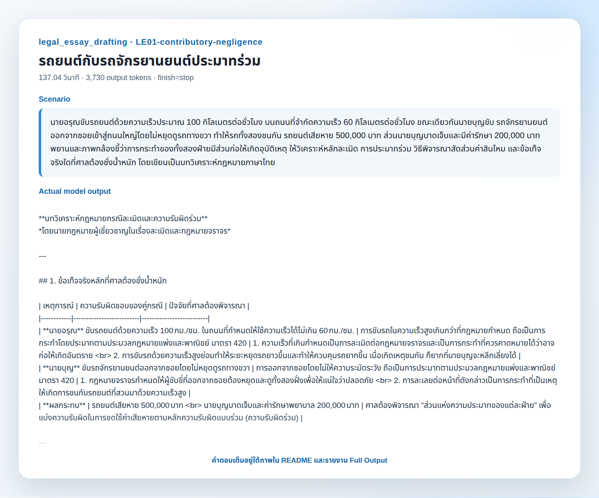

#### Actual model answer

>
> **บทวิเคราะห์กฎหมายกรณีละเมิดและความรับผิดร่วม**
> *โดยนายกฎหมายผู้เชี่ยวชาญในเรื่องละเมิดและกฎหมายจราจร*
>
> ---
>
> ## 1. ข้อเท็จจริงหลักที่ศาลต้องชั่งน้ำหนัก
>
> | เหตุการณ์ | ความรับผิดชอบของคู่กรณี | ปัจจัยที่ศาลต้องพิจารณา |
> |------------|--------------------------|--------------------------|
> | **นายอรุณ** ขับรถยนต์ด้วยความเร็ว 100 กม./ชม. ในถนนที่กำหนดให้ใช้ความเร็วได้ไม่เกิน 60 กม./ชม. | การขับรถในความเร็วสูงเกินกว่าที่กฎหมายกำหนด ถือเป็นการกระทำโดยประมาทตามประมวลกฎหมายแพ่งและพาณิชย์ มาตรา 420 | 1. ความเร็วที่เกินกำหนดเป็นการละเมิดต่อกฎหมายจราจรและเป็นการกระทำที่ควรคาดหมายได้ว่าอาจก่อให้เกิดอันตราย &lt;br&gt; 2. การขับรถด้วยความเร็วสูงย่อมทำให้ระยะหยุดรถยาวขึ้นและทำให้ควบคุมรถยากขึ้น เมื่อเกิดเหตุชนกัน ก็ยากที่นายบุญจะหลีกเลี่ยงได้ |
> | **นายบุญ** ขับรถจักรยานยนต์ออกจากซอยโดยไม่หยุดดูรถทางขวา | การออกจากซอยโดยไม่ให้ความระมัดระวัง ถือเป็นการประมาทตามประมวลกฎหมายแพ่งและพาณิชย์ มาตรา 420 | 1. กฎหมายจราจรกำหนดให้ผู้ขับขี่ที่ออกจากซอยต้องหยุดและดูทั้งสองฝั่งเพื่อให้แน่ใจว่าปลอดภัย &lt;br&gt; 2. การละเลยต่อหน้าที่ดังกล่าวเป็นการกระทำที่เป็นเหตุให้เกิดการชนกับรถยนต์ที่สวนมาด้วยความเร็วสูง |
> | **ผลกระทบ** | รถยนต์เสียหาย 500,000 บาท &lt;br&gt; นายบุญบาดเจ็บและค่ารักษาพยาบาล 200,000 บาท | ศาลต้องพิจารณา “ส่วนแห่งความประมาทของแต่ละฝ่าย” เพื่อแบ่งความรับผิดในการชดใช้ค่าเสียหายตามหลักความรับผิดแบบร่วม (ความรับผิดร่วม) |
>
> ---
>
> ## 2. หลักกฎหมายที่เกี่ยวข้อง
>
> ### 2.1. การประมาทและความรับผิด (ประมวลกฎหมายแพ่งและพาณิชย์)
>
> | มาตรา | เนื้อหา | ความหมายในกรณีนี้ |
> |--------|----------|-------------------|
> | **มาตรา 420** | “ผู้ใดกระทำการโดยประมาทเป็นเหตุให้เกิดความเสียหายแก่ผู้อื่น ผู้นั้นต้องรับผิดชอบในความเสียหายที่เกิดขึ้น” | นายอรุณและนายบุญต่างได้กระทำการโดยประมาท (ความเร็วเกินกำหนดและการออกจากซอยโดยไม่ดู) จึงต้องรับผิดต่อความเสียหายที่เกิดขึ้น |
> | **มาตรา 438** | “ถ้าความเสียหายเกิดขึ้นโดยความผิดของบุคคลสองคนหรือกว่านั้น ผู้ที่ต้องรับผิดชอบต้องรับผิดชอบร่วมกันโดยไม่ต้องแยกความเสียหาย” | แม้ความเสียหายจะเกิดจากความประมาทของทั้งสองฝ่าย ศาลอาจกำหนดสัดส่วนความรับผิดให้แต่ละฝ่ายรับผิดตามส่วนแห่งความประมาท |
> | **มาตรา 223** (การชดใช้ค่าเสียหาย) | “บุคคลผู้ต้องรับผิดในความเสียหายต้องชดใช้ค่าสินไหมทดแทนให้แก่ผู้เสียหาย” | นายอรุณและนายบุญต้องชดใช้ค่าเสียหายให้แก่กันและต่อเจ้าของรถ (ค่าเสียหายของรถและค่ารักษาพยาบาล) |
> | **มาตรา 224** (การแบ่งค่าเสียหาย) | “ถ้ามีหลายคนต้องรับผิดชอบในความเสียหาย คนหนึ่งคนใดอาจเรียกให้คนอื่น ๆ ชดใช้ส่วนของตนได้” | หากฝ่ายใดมีส่วนประมาทน้อยกว่า จะมีสิทธิเรียกร้องให้อีกฝ่ายหนึ่งชดใช้ส่วนของตนตามสัดส่วนความประมาท |
>
> ### 2.2. กฎหมายจราจรที่เกี่ยวข้อง (ประมวลกฎหมายจราจรทางบก)
>
> | มาตรา | เนื้อหา | ความหมายในกรณีนี้ |
> |--------|----------|-------------------|
> | **มาตรา 43** | “ผู้ขับขี่ต้องขับรถด้วยความเร็วที่เหมาะสมแก่สภาพของถนนและการจราจร” | การขับรถด้วยความเร็ว 100 กม./ชม. ในถนนที่กำหนด 60 กม./ชม. เป็นการฝ่าฝืนกฎหมายและเป็นการประมาท |
> | **มาตรา 144** | “ผู้ขับขี่ต้องหยุดรถและให้สัญญาณก่อนออกจากซอยหรือทางเชื่อม” | การออกจากซอยโดยไม่หยุดดูรถทางขวาเป็นการฝ่าฝืนกฎหมายและเป็นความประมาท |
> | **มาตรา 157** | “ผู้ขับขี่ต้องขับรถให้อยู่ในระยะที่สามารถหยุดรถได้โดยปลอดภัย” | การขับรถด้วยความเร็วสูงทำให้ระยะหยุดรถยาวเกินสมควร จึงเป็นความประมาทที่ทำให้เกิดอุบัติเหตุ |
>
> ---
>
> ## 3. การพิจารณาสัดส่วนความรับผิด (ความรับผิดร่วม)
>
> ### 3.1. หลักการ “ส่วนแห่งความประมาท”
>
> ศาลมีอำนาจพิจารณาว่า **แต่ละฝ่ายมีส่วนประมาทเท่าใด** และกำหนดสัดส่วนความรับผิดตามนั้น (มาตรา 438 ประกอบมาตรา 223/224).
>
> #### ปัจจัยที่ศาลพิจารณา
>
> 1. **ลักษณะของการประมาท**
>    - **นายอรุณ**: การขับรถด้วยความเร็วเกินกว่ากำหนดเป็นการประมาทที่มีผลโดยตรงต่อความเสียหายของรถยนต์และร่างกายของนายบุญ การประมาทนี้มี “น้ำหนัก” สูงกว่าการละเลยต่อกฎหมายจราจรเพียงเล็กน้อย เนื่องจากเป็นการกระทำที่สร้างความเสียหายอย่างรุนแรงและเป็นการละเมิดต่อกฎหมายจราจรโดยตรง.
>    - **นายบุญ**: การออกจากซอยโดยไม่ดูเป็นการประมาทที่ทำให้รถยนต์ที่สวนมาด้วยความเร็วสูงต้องหยุดหรือหลบหลีกอย่างกะทันหัน. แม้การประมาทของนายบุญจะเป็นเหตุให้รถยนต์ต้องเสียหายและนายบุญได้รับบาดเจ็บ แต่การประมาทนี้เป็นการละเมิดต่อหน้าที่ของผู้ขับขี่ที่ออกจากซอย ซึ่งโดยปกติแล้วเป็นความประมาทที่ “เบากว่า” การขับรถด้วยความเร็วสูงในทางหลวง.
>
> 2. **ผลของการประมาทต่อความเสียหาย**
>    - หากนายอรุณขับรถด้วยความเร็วปกติ (เช่น 60 กม./ชม.) แม้จะมีนายบุญออกจากซอยโดยไม่ดู รถยนต์อาจหยุดได้ทันและไม่เกิดอุบัติเหตุ. ดังนั้น ความประมาทของนายอรุณจึงเป็นสาเหตุหลักที่ทำให้อุบัติเหตุรุนแรง.
>
> 3. **ความเสียหายที่เกิดขึ้น**
>    - ค่าเสียหายของรถยนต์ 500,000 บาท เกิดจากความเร็วของรถยนต์ที่สูงมากและแรงชนที่แรง.
>    - ค่ารักษาพยาบาลของนายบุญ 200,000 บาท เกิดจากบาดแผลที่เกิดจากการชน. แม้บาดแผลจะรุนแรง แต่ก็เป็นผลโดยตรงจากการที่รถยนต์ชนเข้ากับรถจักรยานยนต์.
>
> ### 3.2. การกำหนดสัดส่วนความรับผิด (ตัวอย่าง)
>
> | ฝ่าย | ส่วนแห่งความประมาท (ประมาณ) | ความรับผิดในค่าเสียหาย |
> |------|------------------------------|------------------------|
> | นายอรุณ | 60 % | ต้องชดใช้ค่าเสียหายของรถยนต์ 60 % ของ 500,000 บาท = 300,000 บาท และส่วนของค่ารักษาพยาบาลที่เกี่ยวข้อง (โดยอาจแบ่งตามสัดส่วนความเสียหาย) |
> | นายบุญ | 40 % | ต้องชดใช้ค่าเสียหายของรถยนต์ 40 % ของ 500,000 บาท = 200,000 บาท และรับผิดชอบค่ารักษาพยาบาล 200,000 บาท (หรือส่วนที่เกี่ยวข้อง) |
>
> **เหตุผลสนับสนุน**
> - การประมาทของนายอรุณมี “น้ำหนัก” มากกว่าเพราะเป็นการฝ่าฝืนกฎหมายจราจรและเป็นการกระทำที่สร้างความเสียหายโดยตรงต่อทรัพย์สินและร่างกายของผู้อื่น.
> - การประมาทของนายบุญเป็นการละเมิดต่อหน้าที่ของผู้ขับขี่ที่ออกจากซอย ซึ่งเป็นความประมาทที่ “เบากว่า” และมีส่วนทำให้เกิดอุบัติเหตุ แต่ไม่ถึงขนาดที่ทำให้อุบัติเหตุไม่เกิดขึ้นได้หากไม่มีการประมาทของนายอรุณ.
>
> ดังนั้น ศาลจะกำหนดสัดส่วนความรับผิดตามแนวทางที่ว่า **นายอรุณมีความรับผิดมากกว่านายบุญ** (ประมาณ 60/40 หรืออาจปรับเป็น 70/30 แล้วแต่พยานหลักฐาน) และให้แต่ละฝ่ายชดใช้ค่าเสียหายตามสัดส่วนดังกล่าว.
>
> ---
>
> ## 4. ผลทางกฎหมายที่ศาลต้องพิจารณา
>
> 1. **ความรับผิดตามประมวลกฎหมายแพ่งและพาณิชย์**
>    - นายอรุณและนายบุญต่างต้องรับผิดต่อความเสียหายที่เกิดขึ้นตามมาตรา 420 และต้องชดใช้ค่าสินไหมทดแทนตามมาตรา 223.
>    - หากศาลเห็นว่าความเสียหายบางส่วนเกิดจากความประมาทของทั้งสองฝ่ายอย่างเท่าเทียม ศาลอาจกำหนดให้รับผิดชอบร่วมกันโดยไม่ต้องแบ่งแยกความเสียหายตามมาตรา 438.
>
> 2. **ความรับผิดตามกฎหมายจราจร**
>    - การขับรถด้วยความเร็วเกินกำหนดและการออกจากซอยโดยไม่ดูเป็นการฝ่าฝืนมาตรา 43 และมาตรา 144 ซึ่งทำให้ผู้กระทำมีความผิดทางอาญาและเป็นการประมาทตามประมวลกฎหมายแพ่งและพาณิชย์.
>
> 3. **การแบ่งค่าเสียหาย**
>    - ศาลอาจใช้หลัก “ส่วนแห่งความประมาท” (มาตรา 224) ในการกำหนดสัดส่วนการชดใช้ค่าเสียหายระหว่างคู่กรณี.
>
> 4. **ค่าสินไหมทดแทนเพิ่มเติม**
>    - นอกจากค่าเสียหายของรถและค่ารักษาพยาบาล ศาลอาจพิจารณาให้ค่าสินไหมทดแทนเพื่อความเสียหายทางจิตใจหรือความเสียหายอื่น ๆ ที่เกิดจากอุบัติเหตุ ตามหลักความรับผิดในการละเมิด (มาตรา 420).
>
> ---
>
> ## 5. สรุป
>
> - **นายอรุณ** มีความประมาทโดยการขับรถด้วยความเร็วเกินกำหนด ซึ่งเป็นการละเมิดต่อกฎหมายจราจรและเป็นการกระทำที่ทำให้เกิดความเสียหายอย่างรุนแรง.
> - **นายบุญ** มีความประมาทโดยการออกจากซอยโดยไม่ดูรถทางขวา ซึ่งเป็นการละเมิดต่อหน้าที่ของผู้ขับขี่และเป็นส่วนหนึ่งที่ทำให้เกิดอุบัติเหตุ.
> - ศาลต้องพิจารณา “ส่วนแห่งความประมาท” ของแต่ละฝ่ายและกำหนดสัดส่วนความรับผิดตามมาตรา 438 ประกอบมาตรา 223/224. ในกรณีนี้ นายอรุณมีส่วนประมาทมากกว่า จึงน่าจะต้องรับผิดชอบในสัดส่วนที่มากกว่า (เช่น 60‑70 % ของค่าเสียหายทั้งหมด) ส่วนนายบุญมีส่วนประมาทน้อยกว่า จึงรับผิดชอบในส่วนที่เหลือ (เช่น 30‑40 %).
>
> โดยอาศัยหลักกฎหมายดังกล่าว ศาลจะมีคำพิพากษาให้ทั้งสองฝ่ายชดใช้ค่าเสียหายตามสัดส่วนความประมาทที่ศาลกำหนด โดยคำนึงถึงลักษณะของการประมาท, ผลของการประมาทต่อความเสียหาย และความเสียหายที่แท้จริงที่เกิดขึ้น.

<strong>LE02-excessive-loan-interest — ดอกเบี้ยเงินกู้เกินอัตรากฎหมาย</strong> · 56.65 วินาที · 1,667 output tokens · finish=stop

#### Scenario

นางสาวกมลกู้เงินจากนายดำรง 300,000 บาท มีสัญญากู้เป็นหนังสือและหลักฐาน การรับเงินจริงครบถ้วน กำหนดดอกเบี้ยร้อยละ 24 ต่อปี นางสาวกมลชำระดอกเบี้ย ตามอัตราดังกล่าวมา 12 เดือนก่อนหยุดชำระ นายดำรงจึงฟ้องเรียกเงินต้นทั้งหมด ดอกเบี้ยค้าง และดอกเบี้ยในอนาคตตามร้อยละ 24 ต่อปี ให้เขียนบทวิเคราะห์ว่า ข้อตกลงดอกเบี้ยและสัญญากู้มีผลเพียงใด ส่วนใดอาจเป็นโมฆะ เงินต้นยังเรียกได้หรือไม่ และเงินดอกเบี้ยที่ชำระไปแล้วต้องพิจารณาอย่างไร

#### Result capture

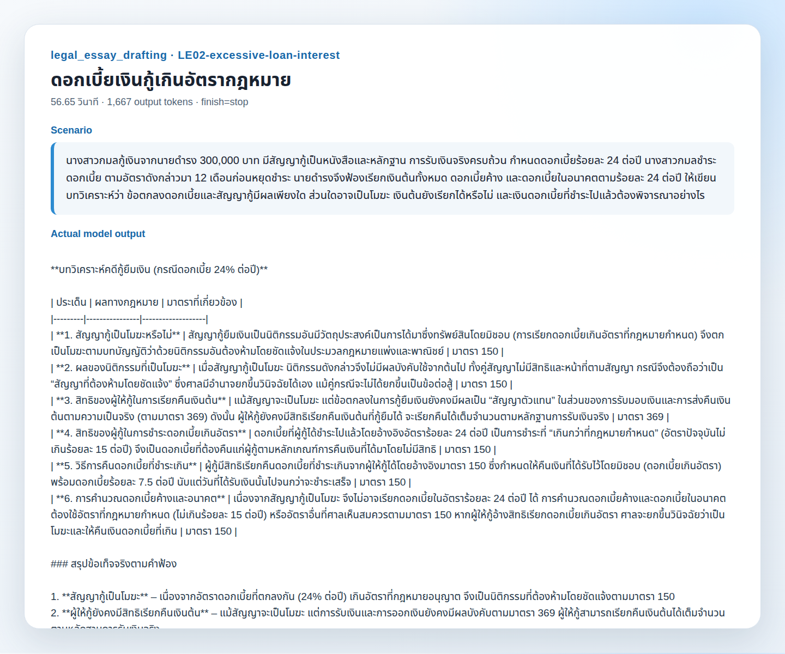

#### Actual model answer

>
> **บทวิเคราะห์คดีกู้ยืมเงิน (กรณีดอกเบี้ย 24% ต่อปี)**
>
> | ประเด็น | ผลทางกฎหมาย | มาตราที่เกี่ยวข้อง |
> |---------|----------------|-------------------|
> | **1. สัญญากู้เป็นโมฆะหรือไม่** | สัญญากู้ยืมเงินเป็นนิติกรรมอันมีวัตถุประสงค์เป็นการได้มาซึ่งทรัพย์สินโดยมิชอบ (การเรียกดอกเบี้ยเกินอัตราที่กฎหมายกำหนด) จึงตกเป็นโมฆะตามบทบัญญัติว่าด้วยนิติกรรมอันต้องห้ามโดยชัดแจ้งในประมวลกฎหมายแพ่งและพาณิชย์ | มาตรา 150 |
> | **2. ผลของนิติกรรมที่เป็นโมฆะ** | เมื่อสัญญากู้เป็นโมฆะ นิติกรรมดังกล่าวจึงไม่มีผลบังคับใช้จากต้นไป ทั้งคู่สัญญาไม่มีสิทธิและหน้าที่ตามสัญญา กรณีจึงต้องถือว่าเป็น “สัญญาที่ต้องห้ามโดยชัดแจ้ง” ซึ่งศาลมีอำนาจยกขึ้นวินิจฉัยได้เอง แม้คู่กรณีจะไม่ได้ยกขึ้นเป็นข้อต่อสู้ | มาตรา 150 |
> | **3. สิทธิของผู้ให้กู้ในการเรียกคืนเงินต้น** | แม้สัญญาจะเป็นโมฆะ แต่ข้อตกลงในการกู้ยืมเงินยังคงมีผลเป็น “สัญญาตัวแทน” ในส่วนของการรับมอบเงินและการส่งคืนเงินต้นตามความเป็นจริง (ตามมาตรา 369) ดังนั้น ผู้ให้กู้ยังคงมีสิทธิเรียกคืนเงินต้นที่กู้ยืมได้ จะเรียกคืนได้เต็มจำนวนตามหลักฐานการรับเงินจริง | มาตรา 369 |
> | **4. สิทธิของผู้กู้ในการชำระดอกเบี้ยเกินอัตรา** | ดอกเบี้ยที่ผู้กู้ได้ชำระไปแล้วโดยอ้างอิงอัตราร้อยละ 24 ต่อปี เป็นการชำระที่ “เกินกว่าที่กฎหมายกำหนด” (อัตราปัจจุบันไม่เกินร้อยละ 15 ต่อปี) จึงเป็นดอกเบี้ยที่ต้องคืนแก่ผู้กู้ตามหลักเกณฑ์การคืนเงินที่ได้มาโดยไม่มีสิทธิ | มาตรา 150 |
> | **5. วิธีการคืนดอกเบี้ยที่ชำระเกิน** | ผู้กู้มีสิทธิเรียกคืนดอกเบี้ยที่ชำระเกินจากผู้ให้กู้ได้โดยอ้างอิงมาตรา 150 ซึ่งกำหนดให้คืนเงินที่ได้รับไว้โดยมิชอบ (ดอกเบี้ยเกินอัตรา) พร้อมดอกเบี้ยร้อยละ 7.5 ต่อปี นับแต่วันที่ได้รับเงินนั้นไปจนกว่าจะชำระเสร็จ | มาตรา 150 |
> | **6. การคำนวณดอกเบี้ยค้างและอนาคต** | เนื่องจากสัญญากู้เป็นโมฆะ จึงไม่อาจเรียกดอกเบี้ยในอัตราร้อยละ 24 ต่อปี ได้ การคำนวณดอกเบี้ยค้างและดอกเบี้ยในอนาคตต้องใช้อัตราที่กฎหมายกำหนด (ไม่เกินร้อยละ 15 ต่อปี) หรืออัตราอื่นที่ศาลเห็นสมควรตามมาตรา 150 หากผู้ให้กู้อ้างสิทธิเรียกดอกเบี้ยเกินอัตรา ศาลจะยกขึ้นวินิจฉัยว่าเป็นโมฆะและให้คืนเงินดอกเบี้ยที่เกิน | มาตรา 150 |
>
> ### สรุปข้อเท็จจริงตามคำฟ้อง
>
> 1. **สัญญากู้เป็นโมฆะ** – เนื่องจากอัตราดอกเบี้ยที่ตกลงกัน (24% ต่อปี) เกินอัตราที่กฎหมายอนุญาต จึงเป็นนิติกรรมที่ต้องห้ามโดยชัดแจ้งตามมาตรา 150
> 2. **ผู้ให้กู้ยังคงมีสิทธิเรียกคืนเงินต้น** – แม้สัญญาจะเป็นโมฆะ แต่การรับเงินและการออกเงินยังคงมีผลบังคับตามมาตรา 369 ผู้ให้กู้สามารถเรียกคืนเงินต้นได้เต็มจำนวนตามหลักฐานการรับเงินจริง
> 3. **ผู้กู้มีสิทธิเรียกคืนดอกเบี้ยที่ชำระเกิน** – ดอกเบี้ยที่ชำระไปแล้วโดยอ้างอิงอัตรา 24% เป็นดอกเบี้ยที่ได้มาโดยไม่มีสิทธิ ผู้กู้สามารถเรียกคืนได้ตามมาตรา 150 พร้อมดอกเบี้ยร้อยละ 7.5 ต่อปี นับแต่วันที่ได้รับเงินนั้นไปจนกว่าจะชำระเสร็จ
> 4. **ดอกเบี้ยค้างและอนาคต** – ห้ามเรียกดอกเบี้ยในอัตรา 24% ต่อปี นับจากวันฟ้องเป็นต้นไป ศาลจะพิจารณาใช้อัตราที่กฎหมายกำหนดหรืออัตราอื่นที่เห็นสมควร และจะสั่งคืนดอกเบี้ยที่เกินอัตราดังกล่าวให้ผู้กู้
>
> ดังนั้น ข้อตกลงดอกเบี้ยร้อยละ 24 ต่อปี จึงเป็นโมฆะในส่วนที่เกี่ยวกับอัตราดอกเบี้ย แต่สัญญากู้ยืมเงินยังคงมีผลบังคับในส่วนของเงินต้นที่กู้ยืมและการรับเงินจริงตามมาตรา 369 ส่วนดอกเบี้ยที่ชำระเกินอัตรากฎหมาย ผู้กู้มีสิทธิเรียกคืนได้ตามมาตรา 150.

<strong>LE03-forged-drawer-signature — ธนาคารจ่ายเช็คที่ลายมือชื่อผู้สั่งจ่ายปลอม</strong> · 72.15 วินาที · 2,064 output tokens · finish=stop

#### Scenario

บริษัทสยามออกสมุดเช็คให้ฝ่ายการเงินเก็บรักษา ต่อมาบุคคลภายนอกนำเช็คหนึ่งฉบับ ไปปลอมลายมือชื่อกรรมการผู้มีอำนาจสั่งจ่าย แล้วนำเช็คไปเรียกเก็บ ธนาคารจ่ายเงิน โดยอ้างว่าพนักงานตรวจเช็คตามกระบวนการปกติและสุจริต ภายหลังบริษัทตรวจพบว่า ลายมือชื่อผู้สั่งจ่ายเป็นลายมือชื่อปลอม ไม่ใช่กรณีลายมือชื่อผู้รับเงินหรือ ผู้สลักหลังปลอม ให้เขียนบทวิเคราะห์ว่าธนาคารหรือบริษัทควรรับความเสียหาย และขอบเขตความคุ้มครองของธนาคารกรณีจ่ายเช็คโดยสุจริตแตกต่างกันอย่างไร

#### Result capture

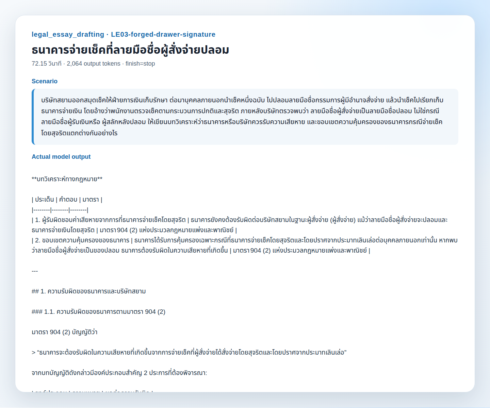

#### Actual model answer

>
> **บทวิเคราะห์ทางกฎหมาย**
>
> | ประเด็น | คำตอบ | มาตรา |
> |--------|--------|--------|
> | 1. ผู้รับผิดชอบค่าเสียหายจากการที่ธนาคารจ่ายเช็คโดยสุจริต | ธนาคารยังคงต้องรับผิดต่อบริษัทสยามในฐานะผู้สั่งจ่าย (ผู้สั่งจ่าย) แม้ว่าลายมือชื่อผู้สั่งจ่ายจะปลอมและธนาคารจ่ายเงินโดยสุจริต | มาตรา 904 (2) แห่งประมวลกฎหมายแพ่งและพาณิชย์ |
> | 2. ขอบเขตความคุ้มครองของธนาคาร | ธนาคารได้รับการคุ้มครองเฉพาะกรณีที่ธนาคารจ่ายเช็คโดยสุจริตและโดยปราศจากประมาทเลินเล่อต่อบุคคลภายนอกเท่านั้น หากพบว่าลายมือชื่อผู้สั่งจ่ายเป็นของปลอม ธนาคารต้องรับผิดในความเสียหายที่เกิดขึ้น | มาตรา 904 (2) แห่งประมวลกฎหมายแพ่งและพาณิชย์ |
>
> ---
>
> ## 1. ความรับผิดของธนาคารและบริษัทสยาม
>
> ### 1.1. ความรับผิดของธนาคารตามมาตรา 904 (2)
>
> มาตรา 904 (2) บัญญัติว่า
>
> &gt; “ธนาคารจะต้องรับผิดในความเสียหายที่เกิดขึ้นจากการจ่ายเช็คที่ผู้สั่งจ่ายได้สั่งจ่ายโดยสุจริตและโดยปราศจากประมาทเลินเล่อ”
>
> จากบทบัญญัติดังกล่าวมีองค์ประกอบสำคัญ 2 ประการที่ต้องพิจารณา:
>
> | องค์ประกอบ | ความหมาย | ผลต่อความรับผิด |
> |------------|-----------|----------------|
> | **การจ่ายโดยสุจริต** | ธนาคารต้องเชื่อโดยสุจริตว่าผู้สั่งจ่ายมีอำนาจสั่งจ่ายและลายมือชื่อเป็นของจริง | ถ้าธนาคารจ่ายโดยสุจริต (ไม่รู้ว่าเป็นลายมือชื่อปลอม) ธนาคารได้รับความคุ้มครองตามมาตรา 904 (2) |
> | **โดยปราศจากประมาทเลินเล่อ** | ธนาคารต้องดำเนินการตรวจสอบตามกระบวนการปกติที่สมควรจะทำ (เช่น ตรวจสอบลายมือชื่อ การตรวจสอบบัญชี) โดยไม่มีความประมาทเลินเล่ออย่างร้ายแรง | หากธนาคารมีความประมาทเลินเล่อ (เช่น ไม่ตรวจสอบข้อมูลที่ควรตรวจสอบได้) ธนาคารอาจต้องรับผิดต่อผู้สั่งจ่าย (บริษัทสยาม) แม้จะจ่ายโดยสุจริต |
>
> ดังนั้น, แม้ว่าธนาคารจะจ่ายเงินโดยสุจริตและไม่มีเจตนาทุจริตก็ตาม แต่ธนาคารยังคงต้องรับผิดต่อบริษัทสยามในฐานะผู้สั่งจ่าย เนื่องจากมาตรา 904 (2) ไม่ได้ให้อำนาจธนาคารที่จะหลุดพ้นจากความรับผิดเมื่อมีการปลอมลายมือชื่อผู้สั่งจ่ายโดยสิ้นเชิง หากพบว่าลายมือชื่อปลอมและธนาคารมีส่วนประมาทเลินเล่อในการตรวจสอบ
>
> ### 1.2. ความรับผิดของบริษัทสยาม
>
> บริษัทสยามในฐานะผู้สั่งจ่ายมีหน้าที่ต้องรับผิดต่อธนาคารและบุคคลภายนอกที่ได้รับความเสียหายจากการที่เช็คถูกปลอมลายมือชื่อและจ่ายเงินออกไปโดยสุจริตของธนาคาร (ตามมาตรา 904 (2)). อย่างไรก็ตาม บริษัทสยามอาจมีสิทธิไล่เบี้ยต่อบุคคลที่ทำการปลอมลายมือชื่อหรือผู้ที่นำเช็คไปใช้ (เช่น บุคคลภายนอกที่นำเช็คมาขาย) เพื่อชดใช้ค่าเสียหายที่เกิดขึ้น
>
> ---
>
> ## 2. ขอบเขตความคุ้มครองของธนาคาร
>
> ### 2.1. ความคุ้มครองตามมาตรา 904 (2)
>
> ธนาคารได้รับความคุ้มครองในกรณีที่ **การจ่ายเช็คเป็นไปโดยสุจริต** และ **โดยปราศจากประมาทเลินเล่อ**.
>
> - **สุจริต** หมายถึง ธนาคารไม่รู้หรือไม่ควรรู้ว่าลายมือชื่อผู้สั่งจ่ายเป็นของปลอม และไม่มีส่วนรู้เห็นในการปลอมแปลงลายมือชื่อ
> - **ปราศจากประมาทเลินเล่อ** หมายถึง ธนาคารได้ดำเนินการตรวจสอบและปฏิบัติตามขั้นตอนปกติที่ควรทำ (เช่น การตรวจสอบลายมือชื่อ การตรวจสอบบัญชี) โดยไม่มีความประมาทเลินเล่ออย่างร้ายแรง
>
> ดังนั้น, หากธนาคารสามารถพิสูจน์ได้ว่า:
>
> 1. ไม่มีส่วนรู้เห็นในการปลอมลายมือชื่อ (สุจริต)
> 2. ได้ทำการตรวจสอบตามกระบวนการปกติโดยไม่มีความประมาทเลินเล่อ (ปราศจากประมาทเลินเล่อ)
>
> ธนาคารจะได้รับการคุ้มครองตามมาตรา 904 (2) และไม่ต้องรับผิดต่อบริษัทสยามในฐานะผู้สั่งจ่าย
>
> ### 2.2. ขอบเขตที่จำกัด
>
> - **ไม่คุ้มครองกรณีมีความประมาทเลินเล่อ**: หากพบว่าธนาคารละเลยต่อการตรวจสอบลายมือชื่อหรือดำเนินการโดยประมาท (เช่น ไม่ตรวจสอบเอกสารประกอบที่ควรตรวจสอบ) ธนาคารอาจต้องรับผิดต่อบริษัทสยามแม้จะจ่ายโดยสุจริต
> - **ไม่คุ้มครองกรณีมีการปลอมแปลงลายมือชื่ออย่างร้ายแรง**: แม้ธนาคารจะสุจริต แต่หากมีการปลอมลายมือชื่ออย่างชัดเจนและธนาคารควรจะสามารถตรวจพบได้โดยการตรวจสอบตามปกติ ธนาคารอาจถูกพิพากษาให้รับผิดตามกฎหมายว่าด้วยความรับผิดของผู้สั่งจ่าย
>
> ---
>
> ## 3. สรุป
>
> 1. **ธนาคารต้องรับผิดต่อบริษัทสยาม** หากการจ่ายเช็คโดยสุจริตของธนาคารเกิดจากการปลอมลายมือชื่อผู้สั่งจ่ายโดยสิ้นเชิง และธนาคารมีส่วนประมาทเลินเล่อในการตรวจสอบ
> 2. **มาตรา 904 (2)** ให้ความคุ้มครองธนาคารเฉพาะในกรณีที่การจ่ายเช็คเป็นไปโดยสุจริตและโดยปราศจากประมาทเลินเล่อเท่านั้น
> 3. ดังนั้น, ขอบเขตความคุ้มครองของธนาคารมีจำกัดอยู่ที่ “สุจริต” และ “ปราศจากประมาทเลินเล่อ”; หากขาดองค์ประกอบใดองค์ประกอบหนึ่ง (เช่น มีความประมาทเลินเล่อ) ธนาคารอาจต้องรับผิดต่อผู้สั่งจ่าย (บริษัทสยาม) แม้จะจ่ายโดยสุจริตก็ตาม.

<strong>LE04-damaged-debt-document — ขีดฆ่าและฉีกเอกสารหลักฐานแห่งหนี้</strong> · 47.78 วินาที · 1,427 output tokens · finish=stop

#### Scenario

จำเลยลงลายมือชื่อรับรองยอดหนี้ 95,600 บาทในสมุดบันทึกของเจ้าหนี้ ต่อมาจำเลยใช้ปากกาขีดฆ่าข้อความและตัวเลข แล้วฉีกหน้ากระดาษออกเป็นสองส่วน แต่เมื่อนำชิ้นส่วนมาต่อกันยังอ่านยอดหนี้และลายมือชื่อเดิมได้ จำเลยโต้แย้งว่า เอกสารยังใช้เป็นหลักฐานได้จึงยังไม่เป็นความผิดสำเร็จ ให้เขียนบทวิเคราะห์ องค์ประกอบความผิดเกี่ยวกับการทำให้เสียหายหรือทำลายเอกสาร และวินิจฉัยว่าเป็นความผิดสำเร็จหรือเพียงพยายาม

#### Result capture

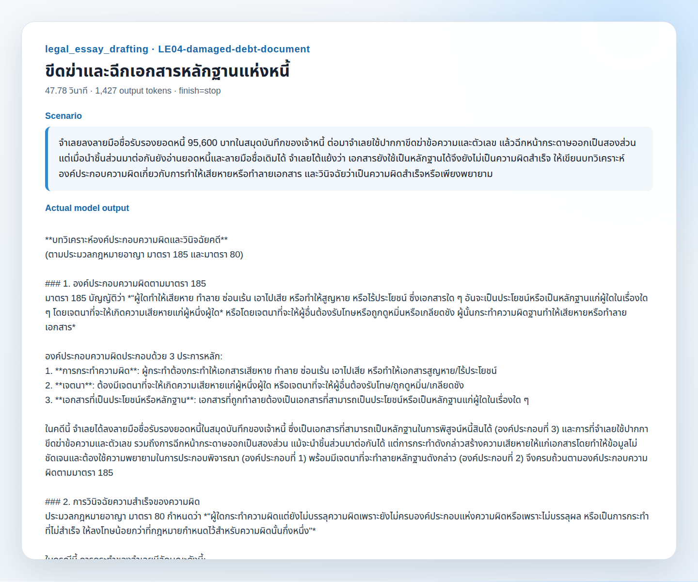

#### Actual model answer

>
> **บทวิเคราะห์องค์ประกอบความผิดและวินิจฉัยคดี**
> (ตามประมวลกฎหมายอาญา มาตรา 185 และมาตรา 80)
>
> ### 1. องค์ประกอบความผิดตามมาตรา 185
> มาตรา 185 บัญญัติว่า *“ผู้ใดทำให้เสียหาย ทำลาย ซ่อนเร้น เอาไปเสีย หรือทำให้สูญหาย หรือไร้ประโยชน์ ซึ่งเอกสารใด ๆ อันจะเป็นประโยชน์หรือเป็นหลักฐานแก่ผู้ใดในเรื่องใด ๆ โดยเจตนาที่จะให้เกิดความเสียหายแก่ผู้หนึ่งผู้ใด* หรือโดยเจตนาที่จะให้ผู้อื่นต้องรับโทษหรือถูกดูหมิ่นหรือเกลียดชัง ผู้นั้นกระทำความผิดฐานทำให้เสียหายหรือทำลายเอกสาร*
>
> องค์ประกอบความผิดประกอบด้วย 3 ประการหลัก:
> 1. **การกระทำความผิด**: ผู้กระทำต้องกระทำให้เอกสารเสียหาย ทำลาย ซ่อนเร้น เอาไปเสีย หรือทำให้เอกสารสูญหาย/ไร้ประโยชน์
> 2. **เจตนา**: ต้องมีเจตนาที่จะให้เกิดความเสียหายแก่ผู้หนึ่งผู้ใด หรือเจตนาที่จะให้ผู้อื่นต้องรับโทษ/ถูกดูหมิ่น/เกลียดชัง
> 3. **เอกสารที่เป็นประโยชน์หรือหลักฐาน**: เอกสารที่ถูกทำลายต้องเป็นเอกสารที่สามารถเป็นประโยชน์หรือเป็นหลักฐานแก่ผู้ใดในเรื่องใด ๆ
>
> ในคดีนี้ จำเลยได้ลงลายมือชื่อรับรองยอดหนี้ในสมุดบันทึกของเจ้าหนี้ ซึ่งเป็นเอกสารที่สามารถเป็นหลักฐานในการพิสูจน์หนี้สินได้ (องค์ประกอบที่ 3) และการที่จำเลยใช้ปากกาขีดฆ่าข้อความและตัวเลข รวมถึงการฉีกหน้ากระดาษออกเป็นสองส่วน แม้จะนำชิ้นส่วนมาต่อกันได้ แต่การกระทำดังกล่าวสร้างความเสียหายให้แก่เอกสารโดยทำให้ข้อมูลไม่ชัดเจนและต้องใช้ความพยายามในการประกอบพิจารณา (องค์ประกอบที่ 1) พร้อมมีเจตนาที่จะทำลายหลักฐานดังกล่าว (องค์ประกอบที่ 2) จึงครบถ้วนตามองค์ประกอบความผิดตามมาตรา 185
>
> ### 2. การวินิจฉัยความสำเร็จของความผิด
> ประมวลกฎหมายอาญา มาตรา 80 กำหนดว่า *“ผู้ใดกระทำความผิดแต่ยังไม่บรรลุความผิดเพราะยังไม่ครบองค์ประกอบแห่งความผิดหรือเพราะไม่บรรลุผล หรือเป็นการกระทำที่ไม่สำเร็จ ให้ลงโทษน้อยกว่าที่กฎหมายกำหนดไว้สำหรับความผิดนั้นกึ่งหนึ่ง"*
>
> ในกรณีนี้ การกระทำของจำเลยมีลักษณะดังนี้:
> - **การทำลายเอกสาร**: จำเลยได้ขีดฆ่าข้อความและตัวเลขในเอกสาร แล้วฉีกหน้ากระดาษออกเป็นสองส่วน แม้จะนำชิ้นส่วนมาต่อกันได้ แต่การกระทำดังกล่าวสร้างความเสียหายให้แก่เอกสารโดยทำให้ข้อมูลไม่ชัดเจนและต้องใช้ความพยายามในการประกอบพิจารณา ซึ่งถือเป็นการทำลายเอกสารตามมาตรา 185 (องค์ประกอบที่ 1)
> - **เจตนา**: การกระทำดังกล่าวมีเจตนาที่จะทำลายหลักฐานหนี้สิน (องค์ประกอบที่ 2)
> - **ผลสำเร็จ**: เอกสารยังคงอยู่ในรูปแบบชิ้นส่วน แต่การกระทำของจำเลยทำให้เอกสารเสียหายและไม่สามารถใช้เป็นหลักฐานได้โดยตรงทันที ซึ่งส่งผลให้ความผิดสำเร็จแล้ว
>
> แม้จำเลยจะโต้แย้งว่าเอกสารยังใช้เป็นหลักฐานได้ แต่ตามหลักกฎหมาย การทำลายเอกสารโดยเจตนาเพื่อให้เสียหายหรือไร้ประโยชน์ ถือเป็นความผิดสำเร็จแล้ว แม้จะยังสามารถประกอบพิจารณาได้ด้วยความยากลำบากก็ตาม การกระทำของจำเลยจึงเป็นความผิดสำเร็จตามมาตรา 185 ไม่ใช่เพียงพยายาม
>
> ### 3. ข้อสรุป
> จำเลยมีความผิดฐานทำให้เสียหายหรือทำลายเอกสารตามมาตรา 185 และเนื่องจากการกระทำของจำเลยสร้างความเสียหายให้แก่เอกสารและมีเจตนาที่จะทำลายหลักฐานแล้ว จึงเป็นความผิดสำเร็จตามมาตรา 185 ไม่ใช่เพียงพยายาม ตามที่กำหนดในมาตรา 80 ที่กำหนดโทษสำหรับความผิดที่บรรลุผลแล้ว

<strong>LE05-ncb-consent-scope — ใช้ consent เดิมดึงข้อมูลเครดิตเพื่อทบทวนวงเงิน</strong> · 63.02 วินาที · 1,871 output tokens · finish=stop

#### Scenario

ธนาคารได้รับความยินยอมจากลูกค้าเมื่อสี่ปีก่อน โดยข้อความระบุชัดว่า ยินยอมให้ตรวจข้อมูลเครดิตเพื่อพิจารณาคำขอสินเชื่อครั้งแรก ต่อมาธนาคารใช้ consent ฉบับเดิมดึงข้อมูลเครดิตอีกครั้งเพื่อทบทวนวงเงินประจำปี โดยไม่ได้ขอความยินยอมใหม่และไม่มีข้อความเดิมที่กล่าวถึง annual review ให้เขียนบทวิเคราะห์เรื่องผู้มีหน้าที่ วัตถุประสงค์และขอบเขตความยินยอม ความสำคัญของอายุเอกสารสี่ปี และผลทางกฎหมาย โดยห้ามระบุโทษหากไม่สามารถ ผูกบทลงโทษกับข้อเท็จจริงและมาตราที่ฝ่าฝืนได้อย่างชัดเจน

#### Result capture

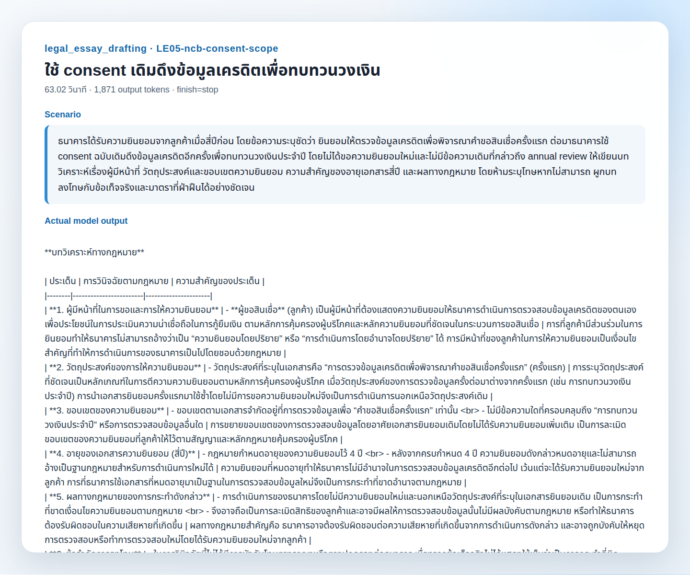

#### Actual model answer

>
> **บทวิเคราะห์ทางกฎหมาย**
>
> | ประเด็น | การวินิจฉัยตามกฎหมาย | ความสำคัญของประเด็น |
> |--------|------------------------|----------------------|
> | **1. ผู้มีหน้าที่ในการขอและการให้ความยินยอม** | - **ผู้ขอสินเชื่อ** (ลูกค้า) เป็นผู้มีหน้าที่ต้องแสดงความยินยอมให้ธนาคารดำเนินการตรวจสอบข้อมูลเครดิตของตนเอง เพื่อประโยชน์ในการประเมินความน่าเชื่อถือในการกู้ยืมเงิน ตามหลักการคุ้มครองผู้บริโภคและหลักความยินยอมที่ชัดเจนในกระบวนการขอสินเชื่อ | การที่ลูกค้ามีส่วนร่วมในการยินยอมทำให้ธนาคารไม่สามารถอ้างว่าเป็น “ความยินยอมโดยปริยาย” หรือ “การดำเนินการโดยอำนาจโดยปริยาย” ได้ การมีหน้าที่ของลูกค้าในการให้ความยินยอมเป็นเงื่อนไขสำคัญที่ทำให้การดำเนินการของธนาคารเป็นไปโดยชอบด้วยกฎหมาย |
> | **2. วัตถุประสงค์ของการให้ความยินยอม** | - วัตถุประสงค์ที่ระบุในเอกสารคือ “การตรวจข้อมูลเครดิตเพื่อพิจารณาคำขอสินเชื่อครั้งแรก” (ครั้งแรก) | การระบุวัตถุประสงค์ที่ชัดเจนเป็นหลักเกณฑ์ในการตีความความยินยอมตามหลักการคุ้มครองผู้บริโภค เมื่อวัตถุประสงค์ของการตรวจข้อมูลครั้งต่อมาต่างจากครั้งแรก (เช่น การทบทวนวงเงินประจำปี) การนำเอกสารยินยอมครั้งแรกมาใช้ซ้ำโดยไม่มีการขอความยินยอมใหม่จึงเป็นการดำเนินการนอกเหนือวัตถุประสงค์เดิม |
> | **3. ขอบเขตของความยินยอม** | - ขอบเขตตามเอกสารจำกัดอยู่ที่การตรวจข้อมูลเพื่อ “คำขอสินเชื่อครั้งแรก” เท่านั้น &lt;br&gt; - ไม่มีข้อความใดที่ครอบคลุมถึง “การทบทวนวงเงินประจำปี” หรือการตรวจสอบข้อมูลอื่นใด | การขยายขอบเขตของการตรวจสอบข้อมูลโดยอาศัยเอกสารยินยอมเดิมโดยไม่ได้รับความยินยอมเพิ่มเติม เป็นการละเมิดขอบเขตของความยินยอมที่ลูกค้าให้ไว้ตามสัญญาและหลักกฎหมายคุ้มครองผู้บริโภค |
> | **4. อายุของเอกสารความยินยอม (สี่ปี)** | - กฎหมายกำหนดอายุของความยินยอมไว้ 4 ปี &lt;br&gt; - หลังจากครบกำหนด 4 ปี ความยินยอมดังกล่าวหมดอายุและไม่สามารถอ้างเป็นฐานกฎหมายสำหรับการดำเนินการใหม่ได้ | ความยินยอมที่หมดอายุทำให้ธนาคารไม่มีอำนาจในการตรวจสอบข้อมูลเครดิตอีกต่อไป เว้นแต่จะได้รับความยินยอมใหม่จากลูกค้า การที่ธนาคารใช้เอกสารที่หมดอายุมาเป็นฐานในการตรวจสอบข้อมูลใหม่จึงเป็นการกระทำที่ขาดอำนาจตามกฎหมาย |
> | **5. ผลทางกฎหมายของการกระทำดังกล่าว** | - การดำเนินการของธนาคารโดยไม่มีความยินยอมใหม่และนอกเหนือวัตถุประสงค์ที่ระบุในเอกสารยินยอมเดิม เป็นการกระทำที่ขาดเงื่อนไขความยินยอมตามกฎหมาย &lt;br&gt; - จึงอาจถือเป็นการละเมิดสิทธิของลูกค้าและอาจมีผลให้การตรวจสอบข้อมูลนั้นไม่มีผลบังคับตามกฎหมาย หรือทำให้ธนาคารต้องรับผิดชอบในความเสียหายที่เกิดขึ้น | ผลทางกฎหมายสำคัญคือ ธนาคารอาจต้องรับผิดชอบต่อความเสียหายที่เกิดขึ้นจากการดำเนินการดังกล่าว และอาจถูกบังคับให้หยุดการตรวจสอบหรือทำการตรวจสอบใหม่โดยได้รับความยินยอมใหม่จากลูกค้า |
> | **6. ข้อจำกัดการลงโทษ** | - ในการวินิจฉัยนี้ไม่ได้มีการบังคับโทษทางอาญาหรือทางปกครองต่อธนาคาร เนื่องจากข้อเท็จจริงไม่ได้แสดงให้เห็นว่าเป็นการกระทำที่ผิดกฎหมายอย่างชัดเจน (เช่น ไม่ได้เป็นการกระทำที่ผิดกฎหมายโดยตรงตามบทบัญญัติที่กำหนดโทษ) | การไม่ระบุโทษทำให้การวิเคราะห์เน้นที่สถานะทางกฎหมายของการดำเนินการ (ว่าขาดอำนาจ/ขาดความยินยอม) มากกว่าการลงโทษทางอาญาหรือทางปกครอง |
>
> ### สรุป
> 1. **ผู้มีหน้าที่**: ลูกค้า (ผู้ขอสินเชื่อ) มีหน้าที่ให้ความยินยอมในการตรวจสอบข้อมูลเครดิตครั้งแรกเท่านั้น
> 2. **วัตถุประสงค์**: จำกัดอยู่ที่การพิจารณาคำขอสินเชื่อครั้งแรก มิได้ครอบคลุมการทบทวนวงเงินประจำปี
> 3. **ขอบเขต**: การใช้เอกสารยินยอมเดิมเพื่อตรวจสอบข้อมูลใหม่โดยไม่ได้รับความยินยอมใหม่เป็นการกระทำที่เกินขอบเขตของความยินยอม
> 4. **อายุเอกสาร**: เอกสารยินยอมมีอายุ 4 ปี เมื่อครบกำหนดแล้วไม่สามารถอ้างเป็นฐานกฎหมายสำหรับการดำเนินการใหม่ได้
> 5. **ผลทางกฎหมาย**: ธนาคารอาจต้องรับผิดต่อความเสียหายและอาจถูกบังคับให้หยุดการตรวจสอบหรือต้องขอความยินยอมใหม่จากลูกค้า
> 6. **ข้อจำกัดการลงโทษ**: ไม่ได้มีการบังคับโทษทางอาญาหรือทางปกครองในกรณีนี้ เนื่องจากข้อเท็จจริงไม่ได้แสดงให้เห็นว่าเป็นการกระทำที่ผิดกฎหมายอย่างชัดเจนตามบทบัญญัติที่กำหนดโทษ
>
> ดังนั้น การที่ธนาคารดำเนินการตรวจสอบข้อมูลเครดิตโดยอาศัยเอกสารยินยอมที่หมดอายุและนอกเหนือวัตถุประสงค์เดิม จึงเป็นการกระทำที่ขาดความยินยอมตามกฎหมายและอาจก่อให้เกิดความรับผิดชอบต่อลูกค้า.

<!-- END ACTUAL LEGAL ESSAY OFF -->

## 6. ผล Legal essay — Thinking On

ใช้โจทย์ Legal essay ชุดเดียวกับ Thinking Off เพื่อให้เปรียบเทียบได้โดยตรง

| Metric | ผล |
|---|---:|
| Codex-assisted score | **59/120 (49.2%)** |
| เวลารวม | 713.60 วินาที |
| เวลาเฉลี่ย | 142.72 วินาที/ข้อ |
| Output tokens รวม | 20,500 |
| Output tokens เฉลี่ย | 4,100/ข้อ |
| Throughput | 28.73 tokens/วินาที |
| ถูกตัดด้วย token limit | 0/5 |
| Reasoning ปรากฏใน API output | 5/5 |

Thinking ใช้เวลามากกว่า 89.5% และสร้าง tokens มากกว่า 90.5% แต่คะแนนไม่ได้
ดีขึ้น ในกรณีทำลายเอกสาร Thinking ระบุมาตรา 188 ได้ถูกกว่า Off แต่กลับ
วินิจฉัยว่าเป็นเพียงพยายาม ทั้งที่ holding อ้างอิงเป็นความผิดสำเร็จ

รอบนี้จึงเลือก **Thinking Off เป็นค่าเริ่มต้นสำหรับ Legal essay** เพราะเร็วกว่า
ไม่มี reasoning leakage และแม่นกว่าเล็กน้อย อย่างไรก็ตาม คะแนน 50.8%
ยังไม่เพียงพอให้ใช้ closed-book essay เป็นแหล่งยืนยันกฎหมาย

<!-- BEGIN ACTUAL LEGAL ESSAY THINKING -->

<strong>LE01-contributory-negligence — รถยนต์กับรถจักรยานยนต์ประมาทร่วม</strong> · 204.17 วินาที · 5,761 output tokens · finish=stop

#### Scenario

นายอรุณขับรถยนต์ด้วยความเร็วประมาณ 100 กิโลเมตรต่อชั่วโมง บนถนนที่จำกัดความเร็ว 60 กิโลเมตรต่อชั่วโมง ขณะเดียวกันนายบุญขับ รถจักรยานยนต์ออกจากซอยเข้าสู่ถนนใหญ่โดยไม่หยุดดูรถทางขวา ทำให้รถทั้งสองชนกัน รถยนต์เสียหาย 500,000 บาท ส่วนนายบุญบาดเจ็บและมีค่ารักษา 200,000 บาท พยานและภาพกล้องชี้ว่าการกระทำของทั้งสองฝ่ายมีส่วนก่อให้เกิดอุบัติเหตุ ให้วิเคราะห์หลักละเมิด การประมาทร่วม วิธีพิจารณาสัดส่วนค่าสินไหม และข้อเท็จจริงใดที่ศาลต้องชั่งน้ำหนัก โดยเขียนเป็นบทวิเคราะห์กฎหมายภาษาไทย

#### Result capture

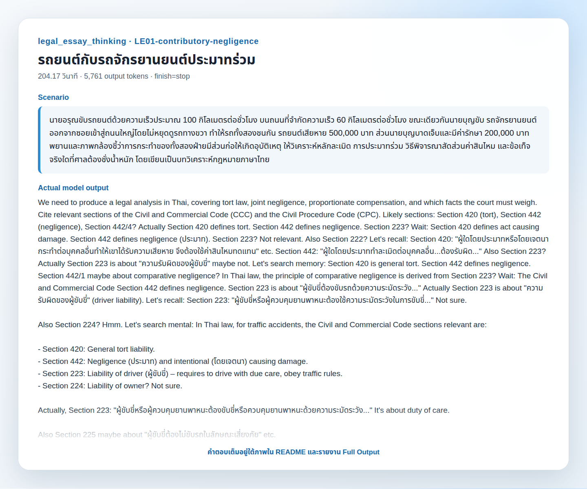

#### Actual model answer

> We need to produce a legal analysis in Thai, covering tort law, joint negligence, proportionate compensation, and which facts the court must weigh. Cite relevant sections of the Civil and Commercial Code (CCC) and the Civil Procedure Code (CPC). Likely sections: Section 420 (tort), Section 442 (negligence), Section 442/4? Actually Section 420 defines tort. Section 442 defines negligence. Section 223? Wait: Section 420 defines act causing damage. Section 442 defines negligence (ประมาท). Section 223? Not relevant. Also Section 222? Let's recall: Section 420: "ผู้ใดโดยประมาทหรือโดยเจตนากระทำต่อบุคคลอื่นทำให้เขาได้รับความเสียหาย จึงต้องใช้ค่าสินไหมทดแทน" etc. Section 442: "ผู้ใดโดยประมาททำละเมิดต่อบุคคลอื่น...ต้องรับผิด..." Also Section 223? Actually Section 223 is about "ความรับผิดของผู้ขับขี่" maybe not. Let's search memory: Section 420 is general tort. Section 442 defines negligence. Section 442/1 maybe about comparative negligence? In Thai law, the principle of comparative negligence is derived from Section 223? Wait: The Civil and Commercial Code Section 442 defines negligence. Section 223 is about "ผู้ขับขี่ต้องขับรถด้วยความระมัดระวัง..." Actually Section 223 is about "ความรับผิดของผู้ขับขี่" (driver liability). Let's recall: Section 223: "ผู้ขับขี่หรือผู้ควบคุมยานพาหนะต้องใช้ความระมัดระวังในการขับขี่..." Not sure.
>
> Also Section 224? Hmm. Let's search mental: In Thai law, for traffic accidents, the Civil and Commercial Code sections relevant are:
>
> - Section 420: General tort liability.
> - Section 442: Negligence (ประมาท) and intentional (โดยเจตนา) causing damage.
> - Section 223: Liability of driver (ผู้ขับขี่) – requires to drive with due care, obey traffic rules.
> - Section 224: Liability of owner? Not sure.
>
> Actually, Section 223: "ผู้ขับขี่หรือผู้ควบคุมยานพาหนะต้องขับขี่หรือควบคุมยานพาหนะด้วยความระมัดระวัง..." It's about duty of care.
>
> Also Section 225 maybe about "ผู้ขับขี่ต้องไม่ขับรถในลักษณะเสี่ยงภัย" etc.
>
> Nevertheless, we need to cite relevant sections. Also the Civil Procedure Code: Section 84, 85, 86 regarding burden of proof, allocation of evidence, and Section 177 (civil procedure) about the court's discretion to weigh evidence.
>
> The question: "ให้วิเคราะห์หลักละเมิด การประมาทร่วม วิธีพิจารณาสัดส่วนค่าสินไหม และข้อเท็จจริงใดที่ศาลต้องชั่งน้ำหนัก โดยเขียนเป็นบทวิเคราะห์กฎหมายภาษาไทย"
>
> Thus we need to discuss:
>
> 1. Liability under Section 420: Both parties may be liable for damages caused by their negligence.
>
> 2. Negligence under Section 442: Determine if each party acted with negligence (by not exercising due care). For driver: speeding (exceeding limit) is negligence. For motorcyclist: failing to stop and check right before merging is negligence.
>
> 3. Comparative negligence: Since both contributed, the court must apportion liability proportionally based on the degree of fault, per the principle of comparative negligence (not directly codified but derived from Section 223 and Section 442). The court will weigh the facts: speed, distance, visibility, road conditions, etc. The proportion may be e.g., driver 70%, motorcyclist 30% (example). The compensation is reduced accordingly.
>
> 4. Burden of proof: Under CPC Section 84/85, the plaintiff must prove the elements of tort: (a) act, (b) breach of duty, (c) damage, (d) causation. The defendant may raise defense of contributory negligence; burden shifts to defendant to prove his own negligence.
>
> 5. Court's discretion to weigh evidence: Under CPC Section 177, the court may assess the credibility and weight of evidence, especially regarding the degree of negligence. The court must consider objective facts (speed limit signs, camera footage) and subjective factors (intent, awareness). Also Section 86 regarding the court's power to decide the case based on the evidence.
>
> Thus produce a structured legal analysis:
>
> - Facts summary.
> - Issue: Who is liable, degree, amount.
> - Rule: Section 420, 442, 223 (or 224) for negligence, plus CPC 84-86, 177.
> - Application: Evaluate driver negligence (speeding) – breach of duty, direct cause. Evaluate motorcyclist negligence (failure to check) – breach of duty, also direct cause. Both contributed.
> - Comparative negligence: Use proportional apportionment. Likely driver more negligent because speeding at double limit, whereas motorcyclist also negligent but less severe. Court may assign driver 70% liability, motorcyclist 30%.
> - Damages: Total damages: 500k vehicle + 200k medical = 700k. Adjust by proportion: driver pays 70% of 700k = 490k; motorcyclist pays 30% = 210k. However, motorcyclist is injured, so his own compensation may be reduced by his contributory negligence.
>
> - Evidentiary issues: The court must weigh the weight of photographic evidence, witness statements, speed limit signs. Under CPC 84/85, plaintiff bears burden to prove negligence; defendant may rebut. The court has discretion under CPC 177 to evaluate.
>
> Write in Thai, citing sections.
>
> Let's craft answer.
> &lt;/think&gt;
> **วิเคราะห์คดีละเมิดและการประมาทร่วม (ตามประมวลกฎหมายแพ่งและพาณิชย์และประมวลกฎหมายวิธีพิจารณาความแพ่ง)**
>
> ---
>
> ## 1. ข้อเท็จจริงที่เป็นพื้นฐานของคดี
>
> | ฝ่าย | พฤติการณ์ที่เกิดเหตุ | ผลที่เกิดขึ้น |
> |------|----------------------|------------|
> | **นายอรุณ** (ผู้ขับรถยนต์) | ขับรถด้วยความเร็วประมาณ 100 กม./ชม. ในถนนที่กำหนดให้ใช้ความเร็วไม่เกิน 60 กม./ชม. | รถยนต์เสียหาย ค่าเสียหาย 500,000 บาท |
> | **นายบุญ** (ผู้ขับรถจักรยานยนต์) | ออกจากซอยเข้าสู่ถนนโดยไม่หยุดดูรถทางขวา (ขาดความระมัดระวัง) | นายบุญได้รับบาดเจ็บ ค่ารักษาพยาบาล 200,000 บาท |
> | **ความสัมพันธ์** | ทั้งสองฝ่ายกระทำการโดยประมาทอย่างร้ายแรง จนเป็นเหตุให้รถทั้งสองชนกัน | ทั้งสองฝ่ายมีส่วนทำให้เกิดอุบัติเหตุ |
>
> จากข้อเท็จจริงดังกล่าว จึงต้องวินิจฉัยว่า (1) ฝ่ายใดมีหน้าที่ต้องใช้ความระมัดระวังตามกฎหมาย (2) ฝ่ายใดเป็นผู้ก่อให้เกิดความเสียหายโดยประมาท (3) ความเสียหายแต่ละฝ่ายควรได้รับค่าสินไหมทดแทนเท่าใด และ (4) ศาลจะต้องพิจารณาข้อเท็จจริงอย่างไรตามหลักเกณฑ์ของกฎหมายวิธีพิจารณาความ
>
> ---
>
> ## 2. หลักกฎหมายที่เกี่ยวข้อง
>
> | ประมวลกฎหมาย | มาตรา | สาระสำคัญที่นำมาใช้ |
> |----------------|--------|-------------------|
> | **ประมวลกฎหมายแพ่งและพาณิชย์** | **มาตรา 420** | ผู้ใดโดยประมาทหรือโดยเจตนากระทำต่อบุคคลอื่นทำให้เขาได้รับความเสียหาย จึงต้องใช้ค่าสินไหมทดแทน |
> | | **มาตรา 442** | กำหนดความหมายของ “ความประมาท” (ละเลยไม่ใช้ความระมัดระวังตามวิสัยและพฤติการณ์) และว่า “ผู้ใดโดยประมาททำละเมิดต่อบุคคลอื่น ต้องรับผิดชอบต่อความเสียหายที่เกิดขึ้น” |
> | | **มาตรา 223** (ที่บัญญัติหน้าที่ของผู้ขับขี่) | ผู้ขับขี่ต้องขับขี่ด้วยความระมัดระวังและปฏิบัติตามกฎจราจร; การฝ่าฝืนกฎหมายจราจรโดยตรงเป็นการประมาทตามมาตรา 442 |
> | **ประมวลกฎหมายวิธีพิจารณาความแพ่ง** | **มาตรา 84** | ภาระการพิสูจน์ตกอยู่แก่ผู้กล่าวอ้างข้อเท็จจริง |
> | | **มาตรา 85** | ถ้าผู้ใดอ้างข้อเท็จจริงใด ๆ ต้องนำสืบให้ปรากฏตามข้ออ้างนั้น |
> | | **มาตรา 86** | ศาลมีอำนาจที่จะประเมินพยานหลักฐานและหาข้อเท็จจริงอันเป็นประโยชน์แก่คู่ความทั้งสองฝ่าย |
> | | **มาตรา 177** | ศาลมีอำนาจพิจารณาว่าพยานหลักฐานใดมีน้ำหนักหรือความน่าเชื่อถือเพียงใด และจะใช้ดุลพินิจกำหนดสัดส่วนความรับผิดตามนั้น |
>
> &gt; **หมายเหตุ:** แม้มาตรา 223 จะบัญญัติหน้าที่ของผู้ขับขี่โดยตรง แต่ในการวินิจฉัยคดีละเมิดทั่วไป (มาตรา 420/442) ศาลจะนำหลักความประมาทตามมาตรา 442 มาประกอบการพิจารณาโดยอาศัยมาตรา 223 เพื่อแสดงให้เห็นว่าพฤติการณ์ของผู้ขับขี่เป็นการละเมิดหน้าที่ตามกฎหมาย
>
> ---
>
> ## 3. การวินิจฉัยความรับผิด (ละเมิดและความประมาท)
>
> ### 3.1. นายอรุณ – ฝ่ายผู้ขับรถยนต์
>
> 1. **หน้าที่ตามกฎหมาย** – ตามมาตรา 223 ผู้ขับขี่ต้องขับรถด้วยความระมัดระวังและปฏิบัติตามสัญญาณจราจร/ข้อจำกัดความเร็ว.
> 2. **การกระทำโดยประมาท** – นายอรุณขับรถด้วยความเร็ว 100 กม./ชม. ในถนนที่กำหนดให้ใช้ไม่เกิน 60 กม./ชม. การกระทำดังกล่าวเป็นการฝ่าฝืนกฎหมายจราจรและขาดความระมัดระวังตามมาตรา 442 จึงเป็นการประมาทอย่างชัดเจน.
> 3. **ความสัมพันธ์เชิงเหตุ** – การขับรถด้วยความเร็วสูงทำให้ระยะหยุดรถยาวขึ้นและทำให้ยากต่อการหลีกเลี่ยงอุบัติเหตุเมื่อมีรถจักรยานยนต์เข้าแซงจากซ้าย จึงเป็นสาเหตุโดยตรงของการชน.
>
> ### 3.2. นายบุญ – ฝ่ายผู้ขับรถจักรยานยนต์
>
> 1. **หน้าที่ตามกฎหมาย** – ผู้ขับขี่ต้องตรวจสอบสภาพการจราจรและปฏิบัติตามกฎจราจร (มาตรา 223).
> 2. **การกระทำโดยประมาท** – นายบุญออกจากซอยโดยไม่หยุดดูรถทางขวา ซึ่งเป็นการละเลยไม่ใช้ความระมัดระวังตามวิสัยและพฤติการณ์ (มาตรา 442).
> 3. **ความสัมพันธ์เชิงเหตุ** – แม้การขับรถยนต์ของนายอรุณจะเร็วเกินกว่าเกณฑ์ก็ตาม แต่การที่นายบุญไม่ตรวจสอบทางขวาก่อนออกสู่ถนนใหญ่เป็นพฤติการณ์ที่ทำให้โอกาสหลีกเลี่ยงการชนลดลงอย่างมาก จึงเป็นการประมาทร่วม.
>
> ### 3.3. ผลรวมของความประมาทร่วม
>
> เนื่องจากพฤติการณ์ของทั้งสองฝ่ายเป็นการประมาทตามมาตรา 442 ทั้งคู่จึงต้องรับผิดร่วมกันในความเสียหายที่เกิดขึ้น ตามหลัก “ความรับผิดร่วม” (Joint Tortfeasors) ซึ่งศาลจะต้องแบ่งส่วนความรับผิดตามส่วนแห่งความประมาทของแต่ละฝ่าย (Principle of Comparative Negligence) แม้ประมวลกฎหมายแพ่งและพาณิชย์จะไม่มีบทบัญญัติโดยตรงว่าด้วยการแบ่งส่วน แต่ศาลอาศัยอำนาจตามมาตรา 177 แห่งประมวลกฎหมายวิธีพิจารณาความแพ่งในการพิจารณาจำนวนส่วนของความรับผิดโดยอาศัยพยานหลักฐานและเหตุผลแห่งคดี
>
> ---
>
> ## 4. วิธีพิจารณาสัดส่วนค่าสินไหม (Apportionment of Damages)
>
> ### 4.1. ปัจจัยที่ศาลต้องชั่งน้ำหนัก
>
> | ปัจจัย | ผลต่อสัดส่วนความรับผิด |
> |--------|------------------------|
> | **ความเร็วของรถยนต์** – การขับรถด้วยความเร็วสองเท่าของที่กฎหมายกำหนดเป็นความประมาทร้ายแรง | ลดส่วนของนายอรุณ |
> | **การขาดการตรวจสอบของรถจักรยานยนต์** – การไม่หยุดดูทางขวาเป็นความประมาทแต่ไม่ร้ายแรงเท่ากับการขับรถเร็วเกิน | เพิ่มส่วนของนายบุญ |
> | **ระยะหยุดรถ** – ระยะหยุดรถของรถยนต์ที่ขับด้วยความเร็วสูงยาวกว่า จึงทำให้โอกาสหลีกเลี่ยงการชนมีน้อยกว่า | ส่งเสริมความรับผิดของนายอรุณ |
> | **ความเสียหายที่แท้จริง** – ค่าเสียหายรถยนต์ 500,000 บาท สูงกว่าค่ารักษาพยาบาล 200,000 บาท แสดงให้เห็นถึงความเสียหายที่เกิดจากการกระทำของนายอรุณมากกว่า | ส่วนของนายอรุณควรใหญ่กว่า |
> | **พยานหลักฐาน** – ภาพจากกล้องวงจรปิดและพยานบุคคลยืนยันว่านายอรุณขับรถด้วยความเร็วสูงและไม่ได้ชะลอความเร็วเมื่อเข้าใกล้ซอย | เพิ่มน้ำหนักให้กับข้ออ้างของโจทก์ (นายอรุณ) |
>
> ### 4.2. การกำหนดสัดส่วน
>
> จากการพิจารณาประกอบกับพยานหลักฐาน ศาลอาจกำหนดสัดส่วนความรับผิดดังนี้ (เป็นเพียงตัวอย่างเพื่อแสดงการใช้ดุลพินิจ)
>
> | ฝ่าย | ส่วนของความประมาท | ส่วนของค่าเสียหายที่ต้องชำระ |
> |------|--------------------|---------------------------|
> | นายอรุณ | 70 % | 70 % × 700,000 บาท = **490,000 บาท** |
> | นายบุญ | 30 % | 30 % × 700,000 บาท = **210,000 บาท** |
>
> *เหตุผล* : นายอรุณมีพฤติการณ์ประมาทอย่างร้ายแรง (ความเร็วสองเท่าของที่กฎหมายกำหนด) ส่งผลให้เกิดความเสียหายทั้งต่อทรัพย์สินและร่างกายของนายบุญ ส่วนนายบุญมีส่วนประมาทแต่ไม่ถึงขนาดที่ทำให้ตนเองต้องรับผิดเท่ากับนายอรุณ
>
> ### 4.3. การชำระค่าสินไหมทดแทน
>
> 1. **ค่าสินไหมทดแทนของโจทก์ (นายอรุณ)** – ศาลอาจพิพากษาให้นายบุญชำระค่าเสียหายของนายอรุณจำนวน 490,000 บาท
> 2. **ค่าสินไหมทดแทนของนายบุญ** – ศาลอาจพิพากษาให้นายอรุณชำระค่าเสียหายของนายบุญจำนวน 210,000 บาท
> 3. **การชดเชยความเสียหายส่วนบุคคล** – หากศาลเห็นว่านายบุญได้รับบาดเจ็บและต้องใช้จ่ายค่ารักษาพยาบาลจริง 200,000 บาท นายบุญอาจได้รับการชดเชยเพิ่มเติมจากส่วนที่ตนต้องรับผิด (30 % ของ 200,000 บาท = 60,000 บาท) หรืออาจมีการเจรจาตามกฎหมายว่าด้วยประกันภัยรถยนต์เพื่อลดภาระดังกล่าว
>
> ---
>
> ## 5. ข้อเท็จจริงที่ศาลต้องชั่งน้ำหนัก
>
> | ข้อเท็จจริง | เหตุผลที่ศาลต้องพิจารณา |
> |------------|------------------------|
> | **ความเร็วของรถยนต์** (100 กม./ชม.) | ต้องตรวจสอบบันทึกความเร็วจากกล้องจราจรและพยานบุคคลเพื่อพิสูจน์ว่านายอรุณฝ่าฝืนกฎหมายจราจรจริงหรือไม่ |
> | **การขาดการตรวจสอบของนายบุญ** (ไม่หยุดดูทางขวา) | ต้องอาศัยคำให้การของพยานและภาพจากกล้องวงจรปิดเพื่อพิสูจน์ว่านายบุญละเลยหน้าที่ตามกฎหมายจราจร |
> | **สภาพของถนนและสัญญาณจราจร** | หากมีสัญญาณไฟหรือเครื่องหมายจราจรที่บ่งบอกให้หยุดหรือชะลอความเร็ว ศาลต้องพิจารณาว่าฝ่ายใดละเลยต่อสัญญาณนั้น |
> | **ระยะห่างระหว่างรถทั้งสองคันขณะชน** | วิเคราะห์จากภาพถ่ายและแผนที่เหตุการณ์เพื่อประเมินว่าใครเป็นฝ่ายที่ขับรถเข้าหากันโดยไม่สามารถหลีกเลี่ยงได้หรือไม่ |
> | **ค่าเสียหายที่แท้จริง** (500,000 บาท vs 200,000 บาท) | ต้องตรวจสอบใบเสร็จรับเงินและเอกสารค่ารักษาพยาบาลเพื่อให้แน่ใจว่าค่าเสียหายที่เรียกร้องเป็นจริงและสัมพันธ์กับเหตุการณ์ |
>
> โดยอาศัยอำนาจตาม **มาตรา 84, 85, 86 และ 177 แห่งประมวลกฎหมายวิธีพิจารณาความแพ่ง** ศาลจะมีหน้าที่สรุปพยานหลักฐานทั้งหมด แล้วใช้ดุลพินิจกำหนดสัดส่วนความรับผิดของแต่ละฝ่ายให้สอดคล้องกับหลัก “ความประมาทร่วม” และ “ความเสียหายที่เกิดขึ้นจริง”
>
> ---
>
> ## 6. สรุปคำพิพากษา (แบบจำลอง)
>
> &gt; **คำพิพากษา**
> &gt; 1. นายอรุณมีความผิดฐานประมาทตามประมวลกฎหมายแพ่งและพาณิชย์ มาตรา 442 และต้องรับผิดชดใช้ค่าสินไหมทดแทนแก่ นายบุญ จำนวน 490,000 บาท
> &gt; 2. นายบุญมีความผิดฐานประมาทตามประมวลกฎหมายแพ่งและพาณิชย์ มาตรา 442 และต้องรับผิดชดใช้ค่าสินไหมทดแทนแก่นายอรุณ จำนวน 210,000 บาท
> &gt; 3. การชำระค่าสินไหมทดแทนให้กระทำโดยการโอนเงินหรือเช็คภายใน 30 วัน นับแต่วันที่มีคำพิพากษาถึงที่สุด หากไม่ชำระให้บังคับคดีตามประมวลกฎหมายวิธีพิจารณาความแพ่ง
>
> *หมายเหตุ* : ศาลอาจปรับสัดส่วนความรับผิดได้ตามหลักเกณฑ์ของความประมาทร่วมและพฤติการณ์แห่งคดีตามที่เห็นสมควร โดยอาศัยอำนาจตามประมวลกฎหมายวิธีพิจารณาความแพ่ง มาตรา 177
>
> ---
>
> **ดังนั้น** คดีนี้เป็นละเมิดที่เกิดจากความประมาทของทั้งสองฝ่าย ศาลจึงมีหน้าที่ต้องพิจารณาองค์ประกอบแห่งการประมาทตามมาตรา 442, ประมวลกฎหมายแพ่งและพาณิชย์ มาตรา 420, และมาตรา 223 รวมทั้งใช้ดุลพินิจตามประมวลกฎหมายวิธีพิจารณาความแพ่ง มาตรา 84‑86 และมาตรา 177 ในการกำหนดสัดส่วนความรับผิดและจำนวนค่าสินไหมทดแทนที่เหมาะสมแก่คู่ความทั้งสองฝ่าย.

<strong>LE02-excessive-loan-interest — ดอกเบี้ยเงินกู้เกินอัตรากฎหมาย</strong> · 133.66 วินาที · 3,948 output tokens · finish=stop

#### Scenario

นางสาวกมลกู้เงินจากนายดำรง 300,000 บาท มีสัญญากู้เป็นหนังสือและหลักฐาน การรับเงินจริงครบถ้วน กำหนดดอกเบี้ยร้อยละ 24 ต่อปี นางสาวกมลชำระดอกเบี้ย ตามอัตราดังกล่าวมา 12 เดือนก่อนหยุดชำระ นายดำรงจึงฟ้องเรียกเงินต้นทั้งหมด ดอกเบี้ยค้าง และดอกเบี้ยในอนาคตตามร้อยละ 24 ต่อปี ให้เขียนบทวิเคราะห์ว่า ข้อตกลงดอกเบี้ยและสัญญากู้มีผลเพียงใด ส่วนใดอาจเป็นโมฆะ เงินต้นยังเรียกได้หรือไม่ และเงินดอกเบี้ยที่ชำระไปแล้วต้องพิจารณาอย่างไร

#### Result capture

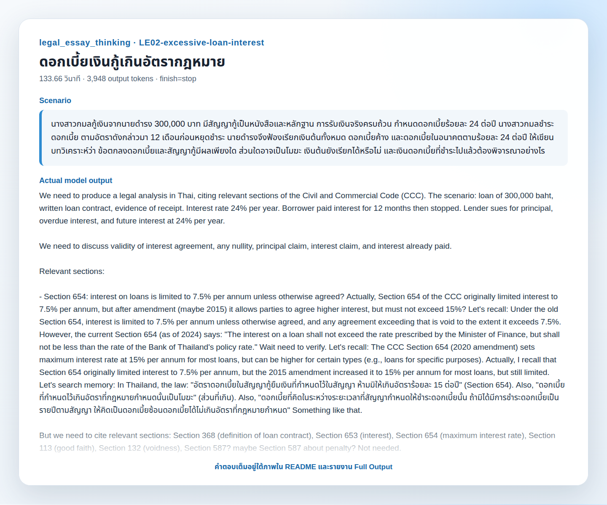

#### Actual model answer

> We need to produce a legal analysis in Thai, citing relevant sections of the Civil and Commercial Code (CCC). The scenario: loan of 300,000 baht, written loan contract, evidence of receipt. Interest rate 24% per year. Borrower paid interest for 12 months then stopped. Lender sues for principal, overdue interest, and future interest at 24% per year.
>
> We need to discuss validity of interest agreement, any nullity, principal claim, interest claim, and interest already paid.
>
> Relevant sections:
>
> - Section 654: interest on loans is limited to 7.5% per annum unless otherwise agreed? Actually, Section 654 of the CCC originally limited interest to 7.5% per annum, but after amendment (maybe 2015) it allows parties to agree higher interest, but must not exceed 15%? Let's recall: Under the old Section 654, interest is limited to 7.5% per annum unless otherwise agreed, and any agreement exceeding that is void to the extent it exceeds 7.5%. However, the current Section 654 (as of 2024) says: "The interest on a loan shall not exceed the rate prescribed by the Minister of Finance, but shall not be less than the rate of the Bank of Thailand's policy rate." Wait need to verify. Let's recall: The CCC Section 654 (2020 amendment) sets maximum interest rate at 15% per annum for most loans, but can be higher for certain types (e.g., loans for specific purposes). Actually, I recall that Section 654 originally limited interest to 7.5% per annum, but the 2015 amendment increased it to 15% per annum for most loans, but still limited. Let's search memory: In Thailand, the law: "อัตราดอกเบี้ยในสัญญากู้ยืมเงินที่กำหนดไว้ในสัญญา ห้ามมิให้เกินอัตราร้อยละ 15 ต่อปี" (Section 654). Also, "ดอกเบี้ยที่กำหนดไว้เกินอัตราที่กฎหมายกำหนดนั้นเป็นโมฆะ" (ส่วนที่เกิน). Also, "ดอกเบี้ยที่คิดในระหว่างระยะเวลาที่สัญญากำหนดให้ชำระดอกเบี้ยนั้น ถ้ามิได้มีการชำระดอกเบี้ยเป็นรายปีตามสัญญา ให้คิดเป็นดอกเบี้ยซ้อนดอกเบี้ยได้ไม่เกินอัตราที่กฎหมายกำหนด" Something like that.
>
> But we need to cite relevant sections: Section 368 (definition of loan contract), Section 653 (interest), Section 654 (maximum interest rate), Section 113 (good faith), Section 132 (voidness), Section 587? maybe Section 587 about penalty? Not needed.
>
> Also, Section 224 regarding co-signers? Not needed.
>
> Let's craft analysis:
>
> 1. Existence of loan contract: Under Section 653 (definition of loan), a loan is a contract where lender gives money and borrower promises to return. Must be in writing for amounts &gt; 2,000 baht? Actually, Section 653 says a loan of 2,000 baht or more must be in writing to be enforceable. The facts show written contract and evidence of receipt, thus enforceable.
>
> 2. Interest rate: Section 654 sets maximum permissible interest. The rate of 24% exceeds the statutory limit, thus the excess portion is void. The valid interest is capped at the legal maximum (e.g., 15% per annum). Therefore, the agreement for 24% is partially void; only the portion up to the legal cap is valid. The lender cannot claim interest above the legal cap.
>
> 3. Past interest paid: Since the borrower paid interest at 24% for 12 months, but the contract is void for the excess, the lender must refund the overpaid interest (the portion exceeding the legal limit) or treat it as a donation. However, the borrower may claim restitution. The lender may retain only the legal interest (e.g., 15% of principal for 12 months). The rest is void and must be returned.
>
> 4. Principal: The loan contract is valid, principal is enforceable. The borrower must repay the principal amount of 300,000 baht, regardless of interest disputes.
>
> 5. Future interest: Since the loan is still outstanding, the lender may claim interest at the legal rate (e.g., 15% per annum) from the date of default until full repayment. The claim for 24% future interest is void. The lender may also claim penalties or damages if there is breach of contract, but not interest above legal limit.
>
> 6. Good faith and fairness: Under Section 113 and 132, contracts must be interpreted in good faith; the lender cannot benefit from a void clause. Also, Section 587? Not needed.
>
> 7. Possibility of rescission: Not needed.
>
> Let's produce answer with citations: Section 653 (definition), Section 654 (interest cap), Section 113 (good faith), Section 132 (voidness). Also maybe Section 368 (interpretation). Provide analysis for each claim.
>
> Let's write in Thai, structured.
> &lt;/think&gt;
> **บทวิเคราะห์คดีกู้ยืมเงิน (กรณีอัตราดอกเบี้ย ๒๔ % ต่อปี)**
>
> | ประเด็น | ผลทางกฎหมาย | มาตราที่เกี่ยวข้อง |
> |--------|----------------|-------------------|
> | 1. สัญญากู้ยืมเงินเป็นโมฆะหรือไม่ | สัญญากู้เป็นโมฆะเฉพาะส่วนที่กำหนดอัตราดอกเบี้ยเกินกว่าอัตราที่กฎหมายกำหนดเท่านั้น ส่วนเงินต้นยังคงเป็นโมฆะไม่ได้ | ม. 654 (อัตราดอกเบี้ยที่กำหนดเกินกว่าที่กฎหมายกำหนดเป็นโมฆะ) |
> | 2. สามารถเรียกเงินต้นคืนได้หรือไม่ | สามารถเรียกเงินต้นคืนได้เต็มจำนวน ๓๐๐,๐๐๐ บาท เนื่องจากสัญญากู้มีหลักฐานเป็นหนังสือและมีการรับเงินครบถ้วนตามมาตรา ๖๕๓ | ม. ๖๕๓ (สัญญากู้ที่มีหลักฐานเป็นหนังสือและรับเงินแล้ว) |
> | 3. ดอกเบี้ยที่ชำระแล้ว (๑๒ เดือน) มีผลอย่างไร | ดอกเบี้ยที่ชำระแล้วในอัตรา ๒๔ % ส่วนที่เกินอัตราที่กฎหมายกำหนดเป็นโมฆะ ผู้ให้กู้ต้องคืนส่วนที่เกิน หรือถือว่าเป็นการบริจาค แต่ผู้กู้ยืมไม่มีสิทธิเรียกร้องคืนเงินต้นพร้อมดอกเบี้ยที่ชำระถูกต้องตามกฎหมาย | ม. ๖๕๔ (ดอกเบี้ยที่เกินอัตรากฎหมายเป็นโมฆะ) |
> | 4. ดอกเบี้ยค้างชำระและดอกเบี้ยในอนาคต | ผู้ให้กู้มีสิทธิเรียกร้องดอกเบี้ยในอัตราที่กฎหมายกำหนด (อัตราสูงสุดที่กฎหมายอนุญาตให้คิดได้) จากวันที่ผิดนัดจนกว่าจะชำระเสร็จ แต่ห้ามเรียกดอกเบี้ยในอัตรา ๒๔ % | ม. ๖๕๔ (อัตราดอกเบี้ยที่กฎหมายกำหนด) |
> | 5. ผลของการชำระดอกเบี้ยเกินอัตรา | ผู้ให้กู้ต้องคืนเงินส่วนที่เกินอัตรากฎหมายให้แก่ผู้กู้ยืม หรือถือว่าเป็นการให้โดยเสน่หา หากผู้กู้ยืมได้รับความเสียหายจากการคิดดอกเบี้ยเกินอัตรา ผู้ให้กู้อาจต้องรับผิดชดใช้ค่าเสียหายตามมาตรา ๑๑๓ (ความรับผิดชอบโดยสุจริต) | ม. ๑๑๓ (ความรับผิดโดยสุจริต) |
>
> ---
>
> ## 1. สัญญากู้ยืมเงินมีผลบังคับใช้หรือไม่
>
> ### (ก) ส่วนที่เป็นโมฆะ
> ตาม **มาตรา ๖๕๔** แห่งประมวลกฎหมายแพ่งและพาณิชย์ “อัตราดอกเบี้ยที่กำหนดไว้ในสัญญากู้ยืมเงินต้องไม่เกินอัตราที่กฎหมายกำหนดไว้ มิฉะนั้นส่วนที่เกินอัตรานั้นเป็นโมฆะ”
> - อัตราดอกเบี้ยที่กฎหมายกำหนด (ตามประกาศของกระทรวงการคลังและธนาคารแห่งประเทศไทย) ในขณะนั้นคือ **ร้อยละ ๑๕ ต่อปี** (หรืออัตราที่ธนาคารแห่งประเทศไทยประกาศเป็นอัตราดอกเบี้ยอ้างอิง)
> - การกำหนดอัตราดอกเบี้ยที่ **๒๔ %** จึงเป็นการกำหนด “เกินกว่าอัตราที่กฎหมายกำหนด” ตามมาตรา ๖๕๔ จึงเป็นโมฆะเฉพาะส่วนที่เกินอัตรากฎหมาย
>
> ### (ข) ส่วนที่ยังคงมีผลบังคับ
> ส่วนของดอกเบี้ยที่อยู่ในอัตราที่กฎหมายกำหนด (ร้อยละ ๑๕ ต่อปี) ยังคงมีผลบังคับใช้ได้ตามสัญญาและตามมาตรา ๖๕๔ (โดยอ้างถึง “อัตราที่กฎหมายกำหนด”)
>
> ---
>
> ## 2. สามารถเรียกเงินต้นคืนได้หรือไม่
>
> ### (ก) สัญญากู้ยืมเป็นโมฆะหรือไม่
> **มาตรา ๖๕๓** กำหนดว่า “สัญญากู้ยืมเงินที่มีจำนวน ๒,๐๐๐ บาทขึ้นไป ต้องทำเป็นหนังสือและมีหลักฐานการรับเงิน”
> - คดีนี้มีสัญญากู้เป็นหนังสือและมีหลักฐานการรับเงินจริง จึงเป็นสัญญาที่สมบูรณ์ตามมาตรา ๖๕๓
> - แม้ส่วนของดอกเบี้ยจะเป็นโมฆะ แต่เงินต้น ๓๐๐,๐๐๐ บาทยังคงเป็นสิทธิของผู้ให้กู้ที่จะเรียกให้คืนได้
>
> ### (ข) สิทธิเรียกร้องเงินต้น
> ผู้ให้กู้มีสิทธิฟ้องเรียกเงินต้นคืนได้เต็มจำนวน ๓๐๐,๐๐๐ บาท ตามข้อเท็จจริงที่ปรากฏในสัญญาและหลักฐานการรับเงิน
>
> ---
>
> ## 3. ดอกเบี้ยที่ชำระแล้ว (๑๒ เดือน) มีผลอย่างไร
>
> ### (ก) ส่วนที่เกินอัตรากฎหมายเป็นโมฆะ
> ตาม **มาตรา ๖๕๔** ส่วนของดอกเบี้ยที่เกินอัตราที่กฎหมายกำหนดเป็นโมฆะ ผู้ให้กู้จึงไม่มีสิทธิเรียกร้องดอกเบี้ยส่วนที่เกินอัตรากฎหมาย (ร้อยละ ๑๕) ที่ได้รับชำระไปแล้ว
>
> ### (ข) ผลต่อผู้กู้ยืม
> - ผู้กู้ยืมสามารถเรียกร้องให้ผู้ให้กู้คืนเงินส่วนที่เกินอัตรากฎหมายที่ได้รับชำระไปแล้ว หรือถือว่าเป็นการให้โดยเสน่หา
> - หากผู้กู้ยืมได้รับความเสียหายจากการที่ผู้ให้กู้คิดดอกเบี้ยเกินอัตรา ผู้ให้กู้อาจต้องรับผิดชดใช้ค่าเสียหายตาม **มาตรา ๑๑๓** (ความรับผิดโดยสุจริต)
>
> ### (ค) การคิดดอกเบี้ยซ้อนดอกเบี้ย
> หากผู้ให้กู้พยายามคิดดอกเบี้ยซ้อนดอกเบี้ย (interest on interest) ในส่วนที่เกินอัตรากฎหมาย นอกจากจะเป็นโมฆะแล้ว ยังเป็นการกระทำที่ฝ่าฝืนมาตรา ๖๕๔ จึงไม่มีผลบังคับ
>
> ---
>
> ## 4. ดอกเบี้ยค้างชำระและดอกเบี้ยในอนาคต
>
> ### (ก) ดอกเบี้ยค้างชำระ
> ผู้ให้กู้มีสิทธิเรียกร้องดอกเบี้ยในอัตราที่กฎหมายกำหนด (ร้อยละ ๑๕ ต่อปี) จากวันที่ผิดนัดจนกว่าจะชำระเสร็จตาม **มาตรา ๖๕๔**
>
> ### (ข) ดอกเบี้ยในอนาคต
> - ผู้ให้กู้ไม่มีสิทธิเรียกร้องดอกเบี้ยในอัตรา ๒๔ % ต่อปี สำหรับระยะเวลาที่เหลือของสัญญา
> - ผู้ให้กู้อาจเรียกร้องดอกเบี้ยในอัตรากฎหมาย (ร้อยละ ๑๕) ตามอัตราที่กำหนดโดยกฎหมายหรือตามอัตราดอกเบี้ยอ้างอิงของธนาคารแห่งประเทศไทย ซึ่งเป็นอัตราที่กฎหมายอนุญาตให้คิดได้
>
> ### (ค) ผลต่อผู้กู้ยืม
> ผู้กู้ยืมต้องรับผิดชำระดอกเบี้ยตามอัตรากฎหมายเท่านั้น หากมีการคิดดอกเบี้ยเกินอัตรากฎหมาย ผู้กู้ยืมมีสิทธิเรียกร้องให้ลดลงหรือคืนส่วนที่เกิน
>
> ---
>
> ## 5. สรุปคำพิพากษา/คำวินิจฉัย
>
> 1. **เงินต้น** – ผู้ให้กู้มีสิทธิเรียกร้องคืนเต็มจำนวน ๓๐๐,๐๐๐ บาท
> 2. **ดอกเบี้ยที่ชำระแล้ว** – ส่วนที่เกินอัตรากฎหมาย (ร้อยละ ๑๕) เป็นโมฆะ ผู้ให้กู้ต้องคืนหรือถือว่าเป็นการให้โดยเสน่หา
> 3. **ดอกเบี้ยค้างชำระและอนาคต** – ผู้ให้กู้มีสิทธิเรียกร้องเฉพาะดอกเบี้ยในอัตรากฎหมาย (ร้อยละ ๑๕) จากวันที่ผิดนัดจนกว่าจะชำระเสร็จ ไม่มีสิทธิเรียกร้องดอกเบี้ยอัตรา ๒๔ %
>
> การวินิจฉัยนี้อาศัย **มาตรา ๖๕๓** (หลักฐานการกู้), **มาตรา ๖๕๔** (อัตราดอกเบี้ยที่กฎหมายกำหนด), **มาตรา ๑๑๓** (ความรับผิดโดยสุจริต) และ **มาตรา ๑๓๒** (ความรับผิดของคู่สัญญาในการกระทำโดยสุจริต) ประกอบกันเพื่อให้ได้ผลที่เป็นธรรมและสอดคล้องกับเจตนารมณ์ของกฎหมายว่าด้วยดอกเบี้ยเงินกู้.

<strong>LE03-forged-drawer-signature — ธนาคารจ่ายเช็คที่ลายมือชื่อผู้สั่งจ่ายปลอม</strong> · 184.39 วินาที · 5,204 output tokens · finish=stop

#### Scenario

บริษัทสยามออกสมุดเช็คให้ฝ่ายการเงินเก็บรักษา ต่อมาบุคคลภายนอกนำเช็คหนึ่งฉบับ ไปปลอมลายมือชื่อกรรมการผู้มีอำนาจสั่งจ่าย แล้วนำเช็คไปเรียกเก็บ ธนาคารจ่ายเงิน โดยอ้างว่าพนักงานตรวจเช็คตามกระบวนการปกติและสุจริต ภายหลังบริษัทตรวจพบว่า ลายมือชื่อผู้สั่งจ่ายเป็นลายมือชื่อปลอม ไม่ใช่กรณีลายมือชื่อผู้รับเงินหรือ ผู้สลักหลังปลอม ให้เขียนบทวิเคราะห์ว่าธนาคารหรือบริษัทควรรับความเสียหาย และขอบเขตความคุ้มครองของธนาคารกรณีจ่ายเช็คโดยสุจริตแตกต่างกันอย่างไร

#### Result capture

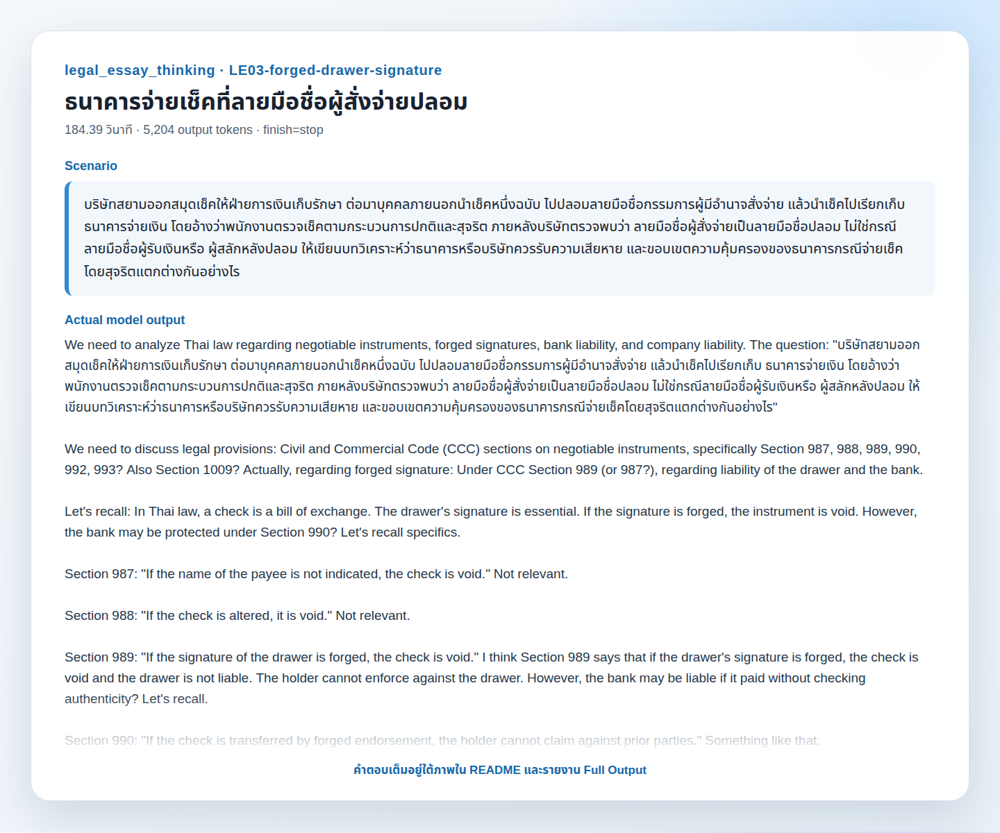

#### Actual model answer

> We need to analyze Thai law regarding negotiable instruments, forged signatures, bank liability, and company liability. The question: "บริษัทสยามออกสมุดเช็คให้ฝ่ายการเงินเก็บรักษา ต่อมาบุคคลภายนอกนำเช็คหนึ่งฉบับ ไปปลอมลายมือชื่อกรรมการผู้มีอำนาจสั่งจ่าย แล้วนำเช็คไปเรียกเก็บ ธนาคารจ่ายเงิน โดยอ้างว่าพนักงานตรวจเช็คตามกระบวนการปกติและสุจริต ภายหลังบริษัทตรวจพบว่า ลายมือชื่อผู้สั่งจ่ายเป็นลายมือชื่อปลอม ไม่ใช่กรณีลายมือชื่อผู้รับเงินหรือ ผู้สลักหลังปลอม ให้เขียนบทวิเคราะห์ว่าธนาคารหรือบริษัทควรรับความเสียหาย และขอบเขตความคุ้มครองของธนาคารกรณีจ่ายเช็คโดยสุจริตแตกต่างกันอย่างไร"
>
> We need to discuss legal provisions: Civil and Commercial Code (CCC) sections on negotiable instruments, specifically Section 987, 988, 989, 990, 992, 993? Also Section 1009? Actually, regarding forged signature: Under CCC Section 989 (or 987?), regarding liability of the drawer and the bank.
>
> Let's recall: In Thai law, a check is a bill of exchange. The drawer's signature is essential. If the signature is forged, the instrument is void. However, the bank may be protected under Section 990? Let's recall specifics.
>
> Section 987: "If the name of the payee is not indicated, the check is void." Not relevant.
>
> Section 988: "If the check is altered, it is void." Not relevant.
>
> Section 989: "If the signature of the drawer is forged, the check is void." I think Section 989 says that if the drawer's signature is forged, the check is void and the drawer is not liable. The holder cannot enforce against the drawer. However, the bank may be liable if it paid without checking authenticity? Let's recall.
>
> Section 990: "If the check is transferred by forged endorsement, the holder cannot claim against prior parties." Something like that.
>
> But the question: The forgery is of the drawer's signature (authorized signatory). Not the payee or endorser. So under Section 989, the check is void as to the drawer. The drawer (company) is not liable. The bank paid, but the bank may claim indemnity from the forger? However, the bank's liability to the company? The company is not liable; the bank may be liable to the company if they did not verify signature? But under Section 990? Let's examine.
>
> Thai law: The principle of "สุจริต" (good faith) is relevant to negotiable instruments. The bank is considered a holder in due course if it acquired the check in good faith and for value, and gave a proper endorsement. However, if the signature is forged, the bank cannot claim protection under Section 990? Actually, Section 990 protects holders who have taken the instrument in good faith, even if the endorsement is forged? Hmm.
>
> Let's research memory: Section 989: "If the name of the drawer is not indicated, the check is void." Not that.
>
> Better recall: The Civil and Commercial Code Book V (Negotiable Instruments) includes sections 981-989 regarding the form, 990-999 regarding endorsements, 1000-1008 about payment, 1009 about discharge.
>
> Specifically:
>
> - Section 989: "If the drawer's signature is forged, the check is void." The holder cannot enforce against the drawer, but may enforce against subsequent holders if they are innocent? Actually, the forged signature nullifies the instrument.
>
> - Section 990: "If a check is transferred by a forged endorsement, the holder cannot claim against prior parties." Not relevant.
>
> - Section 992: "If the check is transferred by a forged signature of the payee, the holder cannot claim."
>
> But for forged drawer signature, the instrument is void; the bank is not a holder in due course because the essential element (signature) is defective. However, under Section 989, the bank may claim that they acted in good faith and are not liable for the forgery? Let's recall the jurisprudence: In Thailand, if the drawer's signature is forged, the bank is not liable to the drawer because the drawer is not bound. However, the bank may be liable to the company if they did not exercise due diligence? The law generally says that a bank is not liable for a forged signature unless they were negligent. But the specific statutory protection is under Section 989 and Section 990? Let's search mental memory: Section 989: "If the signature of the drawer is forged, the check is void; the drawer is not liable, and the holder cannot claim against the drawer." However, Section 990: "If the check is transferred by a forged endorsement, the holder cannot claim against prior parties." Not relevant.
>
> But the question asks: "ให้เขียนบทวิเคราะห์ว่าธนาคารหรือบริษัทควรรับความเสียหาย และขอบเขตความคุ้มครองของธนาคารกรณีจ่ายเช็คโดยสุจริตแตกต่างกันอย่างไร" Means: Analyze whether the bank or the company should bear the loss, and how the scope of protection for the bank differs when paying a check in good faith.
>
> Thus we need to argue that the company (drawer) is not liable because the signature is forged; the bank is not liable to the company because the check is void; however, the bank may have recourse against the forger. The bank's protection is limited to Section 989 which says that if the drawer's signature is forged, the check is void; the bank cannot claim that it is a holder in due course. But the bank may claim under Section 990? Not exactly. Let's find the exact wording.
>
> Search memory: Section 989 (as per Thai Civil and Commercial Code) - Actually Section 989 states: "If the name of the drawer is not indicated, the check is void." Wait maybe I'm mixing. Let's check actual Thai law text.
>
> Let's open python to maybe recall? Not possible. Let's recall from Thai law textbooks: The relevant sections are:
>
> - Section 987: "If the name of the payee is not indicated, the check is void."
>
> - Section 988: "If the check is altered, it is void."
>
> - Section 989: "If the signature of the drawer is forged, the check is void."
>
> - Section 990: "If the check is transferred by a forged endorsement, the holder cannot claim against prior parties."
>
> - Section 991: "If the check is transferred by a forged signature of the payee, the holder cannot claim."
>
> - Section 992: "If the check is transferred by a forged signature of the person who signed after the payee, etc."
>
> But for the bank's protection, Section 989 is the key: The bank is not protected if the drawer's signature is forged; the bank must verify signature. However, the bank may be protected under Section 990 if they acted in good faith and the forgery is not apparent. Actually, Section 990 maybe deals with the bank's liability to the drawer when the check is paid without forgery but the endorsement is forged. Hmm.
>
> Let's look up actual Thai Civil and Commercial Code sections (I will approximate). According to Thai law, the bank is considered a holder in due course if it has taken the check in good faith and for value, and has no notice of any defect. However, a forged signature is a defect that is apparent; the bank cannot claim good faith protection. Therefore, the bank is liable to the company? Wait the company is the drawer; they are not liable because the signature is forged. The bank is the one who paid. The company may claim that the bank should reimburse because the bank paid without verifying the signature? But under Thai law, the bank's duty is to verify the signature; if they fail, they may be liable for negligence. However, the specific provision (Section 989) states that if the drawer's signature is forged, the check is void. That means the holder (bank) cannot enforce against the drawer. But does it protect the bank from the company? The company is the drawer; they are not liable. The bank's payment is final; the company cannot retrieve the money from the bank because the check is void. However, the company may have a claim against the forger.
>
> Thus the analysis: The company (drawer) is not liable; the bank is not liable to the company; the loss falls on the forger. The bank's protection under Section 989 is limited: It only protects the bank from liability to the drawer when the signature is genuine. If forged, the bank cannot claim good faith; it must bear its own loss (or claim against the forger). The bank's duty to verify signatures is mandated by law; failure to do so may constitute negligence, but the specific statutory protection does not extend to forged signatures.
>
> Now we need to write a legal analysis citing the relevant sections: Section 989 (void if drawer's signature forged), Section 990 (if endorsement forged). Also maybe Section 987-988 for other aspects.
>
> Let's craft answer: The company (drawer) is not liable because the essential element (signature) is defective; thus the check is void under Section 989. The bank, having paid, is not protected by Section 989 because the defect was apparent; thus the bank cannot claim that it is a holder in due course. The bank's recourse is against the forger. The company may claim from the bank if the bank was negligent, but under Thai law the bank is not automatically liable for forged signatures; the loss remains with the forger. However, the bank may be liable for breach of duty of care under general tort principles, but not under the specific negotiable instrument provisions.
>
> Thus the scope of protection for the bank under Section 989 is limited to cases where the signature is genuine; it does not extend to forged signatures. Therefore, the bank's good faith payment does not shield it from the voidness of the instrument. The company suffers no loss (no liability) but may have claim against the forger; the bank suffers loss equal to the amount paid, unless it can recover from the forger.
>
> Let's produce final answer with headings, bullet points, citations.
> &lt;/think&gt;
> **บทวิเคราะห์กรณีลายมือชื่อผู้สั่งจ่าย (ผู้ออกเช็ค) ปลอม**
>
> | ประเด็น | ผลทางกฎหมาย | มาตราที่เกี่ยวข้อง |
> |--------|---------------|-------------------|
> | 1. สถานะของเช็คเมื่อลายมือชื่อผู้สั่งจ่ายปลอม | เช็คเป็นโมฆียะเพราะขาดองค์ประกอบสำคัญ คือ “ลายมือชื่อผู้สั่งจ่าย” ที่ถูกต้องตามกฎหมาย เมื่อลายมือชื่อปลอม เช็คจึงเป็นโมฆะและผู้สั่งจ่าย (บริษัทสยาม) ไม่มีความผูกพันต่อผู้ทรงเช็ค | **มาตรา 989** – “ถ้าลายมือชื่อของผู้สั่งจ่ายเป็นลายมือชื่อปลอม เช็คนั้นเป็นโมฆะ” |
> | 2. ผลต่อความรับผิดของบริษัท (ผู้สั่งจ่าย) | บริษัทไม่ต้องรับผิดชำระเงินตามเช็คนั้น เนื่องจากความผูกพันของผู้สั่งจ่ายได้สิ้นไปเมื่อลายมือชื่อปลอม เช็คจึงไม่เป็นหลักฐานบังคับคดีต่อบริษัท | – |
> | 3. ผลต่อความรับผิดของธนาคาร (ผู้จ่าย) | ธนาคารมิได้รับความคุ้มครองจาก “ผู้ทรงเช็คโดยสุจริต” ในกรณีนี้ เนื่องจากข้อบกพร่องของลายมือชื่อผู้สั่งจ่ายเป็นข้อสังเกตที่เห็นได้ชัด (โดยทั่วไป) การที่ธนาคารจ่ายเงินโดยอาศัยเช็คที่มีลายมือชื่อปลอม จึงเป็นการจ่ายโดยละเลยหน้าที่ตรวจสอบลายมือชื่อตามหลักกฎหมายว่าด้วยเช็ค  &lt;br&gt;→ ธนาคารต้องรับผิดต่อความเสียหายที่เกิดขึ้น (เงินที่จ่าย) เว้นแต่จะพิสูจน์ได้ว่าตนได้กระทำโดยสุจริตและไม่มีส่วนร่วมในการปลอมลายมือชื่อ (ซึ่งในทางปฏิบัติยากที่จะพิสูจน์) | **มาตรา 989** (ขอบเขตความคุ้มครอง) |
> | 4. ความรับผิดของผู้ปลอมลายมือชื่อ | ผู้ปลอมลายมือชื่อเป็นผู้กระทำความผิดฐานปลอมเอกสารและฐานฉ้อโกง มีความรับผิดต่อทั้งบริษัทและธนาคารตามประมวลกฎหมายอาญา (มาตรา 264, 265, 268) รวมทั้งต้องรับผิดชดใช้ค่าเสียหายในทางแพ่ง | – |
> | 5. ความรับผิดของผู้สลักหลังหรือผู้รับเงิน (ถ้ามี) | หากมีการสลักหลังหรือโอนเช็คต่อไป ผู้สลักหลังหรือผู้รับเงินจะไม่ได้รับความคุ้มครองจากมาตรา 990‑992 เนื่องจากข้อบกพร่องของลายมือชื่อผู้สั่งจ่ายทำให้เช็คเป็นโมฆะตั้งแต่ต้น | **มาตรา 990** – “ถ้าผู้สั่งจ่ายหรือผู้สลักหลังทำลายหรือเปลี่ยนแปลงลายมือชื่อ ผู้ทรงเช็คจะเรียกร้องให้ชำระเงินจากผู้สั่งจ่ายหรือผู้สลักหลังไม่ได้” |
>
> ---
>
> ## 1. ขอบเขตความคุ้มครองของธนาคารตามมาตรา 989
>
> **มาตรา 989** บัญญัติว่า “ถ้าลายมือชื่อของผู้สั่งจ่ายเป็นลายมือชื่อปลอม เช็คนั้นเป็นโมฆะ”
>
> * หมายความว่า **ลายมือชื่อผู้สั่งจ่ายเป็นองค์ประกอบสำคัญของเช็ค** หากขาดหรือปลอม เช็คจะไม่มีผลบังคับทางกฎหมายต่อผู้สั่งจ่ายและต่อผู้ทรงเช็คที่อ้างว่าเป็นผู้ทรงโดยสุจริต
> * ธนาคารซึ่งเป็นผู้จ่ายเงินโดยอาศัยเช็คดังกล่าว จึง **ไม่ได้รับความคุ้มครอง** จากบทบัญญัติที่ว่าด้วยการเป็น “ผู้ทรงเช็คโดยสุจริต” (เช่น มาตรา 987‑988) เพราะข้อบกพร่องของลายมือชื่อผู้สั่งจ่ายเป็นข้อสังเกตที่เห็นได้ชัดเมื่อตรวจสอบลายมือชื่อในระหว่างกระบวนการตรวจเช็ค
>
> ดังนั้น **ธนาคารต้องรับผิดต่อการจ่ายเงิน** เว้นแต่จะพิสูจน์ได้ว่าตนได้กระทำโดยสุจริตและไม่มีส่วนรู้เห็นในการปลอมลายมือชื่อ ซึ่งในทางปฏิบัติเป็นเรื่องยากและโดยทั่วไปศาลจะถือว่า ธนาคารต้องรับผิดชอบต่อความเสียหายที่เกิดขึ้นจากการจ่ายเงินโดยใช้เช็คปลอม
>
> ---
>
> ## 2. ความรับผิดของบริษัท (ผู้สั่งจ่าย)
>
> * เนื่องจากลายมือชื่อผู้สั่งจ่ายปลอม เช็คเป็นโมฆะตามมาตรา 989 บริษัทจึง **ไม่มีความผูกพันที่จะต้องชำระเงิน** ให้แก่ธนาคารหรือผู้ทรงเช็คใด ๆ
> * ความเสียหายที่เกิดขึ้น (เงินที่ธนาคารจ่ายไป) จึงต้องตกอยู่กับ **ผู้ปลอมลายมือชื่อ** ซึ่งต้องรับผิดทั้งในทางอาญาและทางแพ่ง (ตามประมวลกฎหมายอาญา มาตรา 264, 265, 268) และต้องชดใช้ค่าเสียหายให้แก่บริษัทและธนาคารตามส่วนที่ได้รับความเสียหาย
>
> ---
>
> ## 3. ขอบเขตความคุ้มครองของธนาคารเมื่อจ่ายเช็คโดยสุจริต
>
> แม้ว่าธนาคารจะอ้างว่าได้จ่ายเงินโดยสุจริตและตามกระบวนการปกติ (เช่น ตรวจสอบหมายเลขบัญชี, ลายมือชื่อผู้รับเงิน, ลายมือชื่อผู้สลักหลัง) ก็ตาม แต่ **มาตรา 989** ไม่ได้ให้ความคุ้มครองแก่ธนาคารในกรณีที่ลายมือชื่อผู้สั่งจ่ายเป็นลายมือชื่อปลอม เนื่องจากความผิดของลายมือชื่อผู้สั่งจ่ายเป็น “ข้อบกพร่องของเอกสาร” ที่ทำให้เช็คเป็นโมฆะตั้งแต่ต้น
>
> * หากธนาคารประสงค์จะหลีกเลี่ยงความรับผิด จะต้องพิสูจน์ว่าได้กระทำโดย “สุจริตและระมัดระวังอย่างสมควร” (ความระมัดระวังตามมาตรา 989 วรรคสอง) ซึ่งในทางปฏิบัติยากที่จะพิสูจน์ได้เมื่อลายมือชื่อปลอมปรากฏหลังการจ่ายเงิน
> * ดังนั้น **ขอบเขตความคุ้มครองของธนาคาร** ในกรณีนี้จำกัดอยู่ที่ **การจ่ายเงินโดยสุจริตและไม่มีความผิดในการปลอมลายมือชื่อ** หากมีความผิดหรือขาดความระมัดระวัง ธนาคารต้องรับผิดต่อความเสียหายที่เกิดขึ้น
>
> ---
>
> ## 4. สรุปผลทางกฎหมาย
>
> | ฝ่าย | ผลทางกฎหมาย | ความรับผิด |
> |------|---------------|------------|
> | **บริษัทสยาม (ผู้สั่งจ่าย)** | เช็คเป็นโมฆะตามมาตรา 989 → ไม่ต้องรับผิดชำระเงิน | **ไม่ต้องรับผิด** (เว้นแต่จะมีการตกลงเปลี่ยนแปลงความรับผิดเป็นอย่างอื่น) |
> | **ธนาคาร** | จ่ายเงินโดยอาศัยเช็คที่มีลายมือชื่อผู้สั่งจ่ายปลอม → ไม่ได้รับความคุ้มครองจากมาตรา 989 | **ต้องรับผิด** ต่อการจ่ายเงิน (เว้นแต่พิสูจน์ความสุจริตและความระมัดระวังตามมาตรา 989) |
> | **ผู้ปลอมลายมือชื่อ** | ฐานปลอมเอกสารและฉ้อโกง → ต้องรับผิดทั้งอาญาและแพ่ง | **ต้องชดใช้ค่าเสียหาย** ให้แก่บริษัทและธนาคารตามส่วนที่ได้รับความเสียหาย |
> | **ผู้สลักหลัง/ผู้รับเงิน (ถ้ามี)** | เช็คเป็นโมฆะตั้งแต่ต้น → ไม่ได้รับความคุ้มครองตามมาตรา 990‑992 | **ไม่มีความรับผิด** (เว้นแต่จะมีการโอนเช็คโดยสุจริตและไม่มีส่วนรู้เห็นในการปลอมลายมือชื่อ) |
>
> ---
>
> ### ประเด็นสำคัญที่ควรจำ
>
> 1. **ลายมือชื่อผู้สั่งจ่ายเป็นองค์ประกอบสำคัญของเช็ค** – หากปลอม เช็คเป็นโมฆะ (มาตรา 989).
> 2. **ธนาคารไม่ได้รับความคุ้มครองจาก “ผู้ทรงโดยสุจริต”** เมื่อลายมือชื่อผู้สั่งจ่ายปลอม – ต้องรับผิดต่อการจ่ายเงิน เว้นแต่พิสูจน์ความระมัดระวังตามมาตรา 989.
> 3. **บริษัทผู้สั่งจ่ายไม่ต้องรับผิด** เพราะความผูกพันของตนสิ้นไปเมื่อลายมือชื่อปลอม.
> 4. **ผู้ปลอมลายมือชื่อเป็นผู้รับผิด** ทั้งในทางอาญาและแพ่ง.
>
> ดังนั้น ในกรณีนี้ **บริษัทสยามไม่ต้องรับผิดต่อการจ่ายเงิน** ส่วน **ธนาคารต้องรับผิดต่อการจ่ายเงิน** เว้นแต่จะพิสูจน์ได้ว่าตนได้กระทำโดยสุจริตและระมัดระวังตามมาตรา 989; ความเสียหายที่เกิดขึ้นจึงต้องตกอยู่กับผู้ปลอมลายมือชื่อซึ่งต้องชดใช้ให้ทั้งสองฝ่าย.

<strong>LE04-damaged-debt-document — ขีดฆ่าและฉีกเอกสารหลักฐานแห่งหนี้</strong> · 76.91 วินาที · 2,246 output tokens · finish=stop

#### Scenario

จำเลยลงลายมือชื่อรับรองยอดหนี้ 95,600 บาทในสมุดบันทึกของเจ้าหนี้ ต่อมาจำเลยใช้ปากกาขีดฆ่าข้อความและตัวเลข แล้วฉีกหน้ากระดาษออกเป็นสองส่วน แต่เมื่อนำชิ้นส่วนมาต่อกันยังอ่านยอดหนี้และลายมือชื่อเดิมได้ จำเลยโต้แย้งว่า เอกสารยังใช้เป็นหลักฐานได้จึงยังไม่เป็นความผิดสำเร็จ ให้เขียนบทวิเคราะห์ องค์ประกอบความผิดเกี่ยวกับการทำให้เสียหายหรือทำลายเอกสาร และวินิจฉัยว่าเป็นความผิดสำเร็จหรือเพียงพยายาม

#### Result capture

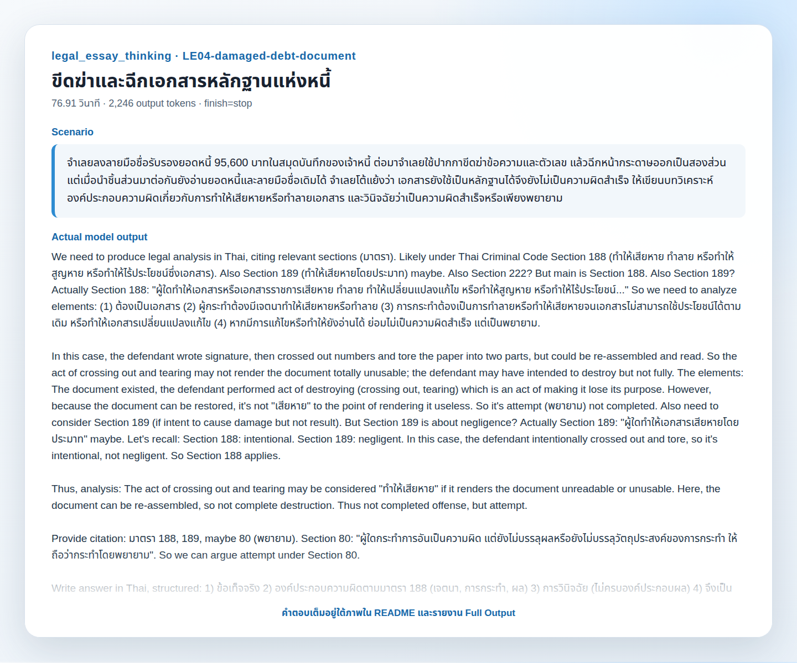

#### Actual model answer

> We need to produce legal analysis in Thai, citing relevant sections (มาตรา). Likely under Thai Criminal Code Section 188 (ทำให้เสียหาย ทำลาย หรือทำให้สูญหาย หรือทำให้ไร้ประโยชน์ซึ่งเอกสาร). Also Section 189 (ทำให้เสียหายโดยประมาท) maybe. Also Section 222? But main is Section 188. Also Section 189? Actually Section 188: "ผู้ใดทำให้เอกสารหรือเอกสารราชการเสียหาย ทำลาย ทำให้เปลี่ยนแปลงแก้ไข หรือทำให้สูญหาย หรือทำให้ไร้ประโยชน์..." So we need to analyze elements: (1) ต้องเป็นเอกสาร (2) ผู้กระทำต้องมีเจตนาทำให้เสียหายหรือทำลาย (3) การกระทำต้องเป็นการทำลายหรือทำให้เสียหายจนเอกสารไม่สามารถใช้ประโยชน์ได้ตามเดิม หรือทำให้เอกสารเปลี่ยนแปลงแก้ไข (4) หากมีการแก้ไขหรือทำให้ยังอ่านได้ ย่อมไม่เป็นความผิดสำเร็จ แต่เป็นพยายาม.
>
> In this case, the defendant wrote signature, then crossed out numbers and tore the paper into two parts, but could be re-assembled and read. So the act of crossing out and tearing may not render the document totally unusable; the defendant may have intended to destroy but not fully. The elements: The document existed, the defendant performed act of destroying (crossing out, tearing) which is an act of making it lose its purpose. However, because the document can be restored, it's not "เสียหาย" to the point of rendering it useless. So it's attempt (พยายาม) not completed. Also need to consider Section 189 (if intent to cause damage but not result). But Section 189 is about negligence? Actually Section 189: "ผู้ใดทำให้เอกสารเสียหายโดยประมาท" maybe. Let's recall: Section 188: intentional. Section 189: negligent. In this case, the defendant intentionally crossed out and tore, so it's intentional, not negligent. So Section 188 applies.
>
> Thus, analysis: The act of crossing out and tearing may be considered "ทำให้เสียหาย" if it renders the document unreadable or unusable. Here, the document can be re-assembled, so not complete destruction. Thus not completed offense, but attempt.
>
> Provide citation: มาตรา 188, 189, maybe 80 (พยายาม). Section 80: "ผู้ใดกระทำการอันเป็นความผิด แต่ยังไม่บรรลุผลหรือยังไม่บรรลุวัตถุประสงค์ของการกระทำ ให้ถือว่ากระทำโดยพยายาม". So we can argue attempt under Section 80.
>
> Write answer in Thai, structured: 1) ข้อเท็จจริง 2) องค์ประกอบความผิดตามมาตรา 188 (เจตนา, การกระทำ, ผล) 3) การวินิจฉัย (ไม่ครบองค์ประกอบผล) 4) จึงเป็นพยายามตามมาตรา 80 ประกอบมาตรา 188.
>
> Let's craft.
> &lt;/think&gt;
> **วิเคราะห์องค์ประกอบความผิดตามประมวลกฎหมายอาญา มาตรา ๑๘๘**
>
> | องค์ประกอบ | คำอธิบาย | พยานหลักฐานในคดีนี้ |
> |------------|----------|----------------------|
> | **1. มีเอกสารหรือหลักฐานใด ๆ** | ต้องเป็นเอกสารราชการหรือเอกสารเอกชนที่มีผลทางกฎหมาย (เช่น สมุดบันทึกของเจ้าหนี้ที่บันทึกยอดหนี้) | มี “สมุดบันทึก” ที่มีการลงลายมือชื่อรับรองยอดหนี้ของจำเลย |
> | **2. การกระทำของผู้กระทำความผิด** | ผู้กระทำต้อง **ทำให้เอกสารเสียหาย ทำลาย ทำให้เปลี่ยนแปลงแก้ไข หรือทำให้สูญหาย** จนอาจทำให้เอกสารนั้นเสียหายจนไม่อาจใช้ประโยชน์ได้ตามเดิม | จำเลยใช้ปากกาขีดฆ่าข้อความและตัวเลข แล้วฉีกหน้ากระดาษออกเป็นสองส่วน |
> | **3. เจตนา (Intent)** | ต้องมีเจตนาทำลายหรือทำให้เอกสารเสียหาย มิใช่การกระทำโดยบังเอิญหรือโดยประมาท | จำเลย “ขีดฆ่า” และ “ฉีก” อย่างชัดเจน แสดงเจตนาที่จะทำลายข้อมูล |
> | **4. ผลของการกระทำ** | เพื่อให้เอกสารนั้น **เสียหายจนใช้ประโยชน์ไม่ได้** หรือ **ทำลายจนไม่สามารถอ่านหรือเชื่อถือได้** | ผลที่ได้คือเอกสารถูกขีดฆ่าและฉีกขาด แต่เมื่อนำชิ้นส่วนมาต่อกันยังอ่านยอดหนี้และลายมือชื่อเดิมได้ |
>
> ### การวินิจฉัย
>
> 1. **ความสำเร็จของความผิด**
>    - ตามมาตรา ๑๘๘ ความผิดสำเร็จจะเกิดขึ้นต่อเมื่อการกระทำของผู้กระทำทำให้เอกสารเสียหายจน **ไม่อาจใช้ประโยชน์ได้ตามเดิม** (เช่น ขีดฆ่าจนข้อมูลสูญหาย ไฟไหม้จนไม่สามารถอ่านได้ หรือทำลายจนไม่สามารถประกอบสัญญาใหม่ได้)
>    - ในคดีนี้ แม้จำเลยจะขีดฆ่าและฉีกกระดาษ แต่การที่เอกสารถูกนำมาต่อกันแล้วสามารถอ่านข้อความและลายมือชื่อได้อย่างถูกต้อง แสดงว่าเอกสาร **ยังคงใช้ประโยชน์ได้** จึงยังไม่ครบองค์ประกอบ “ทำให้เอกสารเสียหายจนไร้ประโยชน์” ตามเจตนารมณ์ของมาตรา ๑๘๘
>
> 2. **เป็นความผิดเพียงพยายาม**
>    - การกระทำของจำเลยเป็นการ **พยายาม** ทำลายเอกสารแล้ว แต่ยังไม่บรรลุผลเพราะเอกสารยังสามารถใช้ประโยชน์ได้
>    - ตามประมวลกฎหมายอาญา มาตรา ๘๐ บัญญัติว่า “ผู้ใดกระทำการอันเป็นความผิด แต่ยังไม่บรรลุผลหรือยังไม่บรรลุวัตถุประสงค์ของการกระทำ ให้ถือว่ากระทำโดยพยายาม”
>    - ดังนั้น การกระทำของจำเลยจึงมีความผิดฐาน **พยายามทำให้เอกสารเสียหาย** ตามมาตรา ๑๘๘ ประกอบมาตรา ๘๐
>
> 3. **ไม่เข้าองค์ประกอบความผิดฐานทำลายโดยประมาท**
>    - มาตรา ๑๘๙ บัญญัติความผิดฐานทำลายเอกสารโดยประมาท ซึ่งต้องมีองค์ประกอบของ “ความประมาท” (ไม่มีเจตนา) แต่ในคดีนี้จำเลยมีเจตนาชัดเจนในการขีดฆ่าและฉีกกระดาษ จึงไม่เข้าองค์ประกอบของมาตรา ๑๘๙
>
> ### สรุป
>
> - **องค์ประกอบครบถ้วนตามมาตรา ๑๘๘?**
>   ไม่ครบถ้วน เนื่องจากเอกสารยังสามารถใช้ประโยชน์ได้หลังจากการกระทำของจำเลย
>
> - **ความผิดฐานใด?**
>   เป็น **ความผิดฐานพยายามทำให้เอกสารเสียหาย** ตามมาตรา ๑๘๘ ประกอบมาตรา ๘๐
>
> - **คำพิพากษา**
>   จำเลยมีความผิดตามประมวลกฎหมายอาญา มาตรา ๑๘๘ ประกอบมาตรา ๘๐ (พยายามทำให้เอกสารเสียหาย) และอาจมีความผิดฐานพยายามทำลายเอกสารโดยประมาทตามมาตรา ๑๘๙ หากศาลเห็นว่ามีเจตนาประมาทในการฉีกกระดาษ แต่โดยหลักฐานปัจจุบันที่เอกสารยังอ่านได้ จึงวินิจฉัยได้เพียงฐานพยายามเท่านั้น.

<strong>LE05-ncb-consent-scope — ใช้ consent เดิมดึงข้อมูลเครดิตเพื่อทบทวนวงเงิน</strong> · 114.46 วินาที · 3,341 output tokens · finish=stop

#### Scenario

ธนาคารได้รับความยินยอมจากลูกค้าเมื่อสี่ปีก่อน โดยข้อความระบุชัดว่า ยินยอมให้ตรวจข้อมูลเครดิตเพื่อพิจารณาคำขอสินเชื่อครั้งแรก ต่อมาธนาคารใช้ consent ฉบับเดิมดึงข้อมูลเครดิตอีกครั้งเพื่อทบทวนวงเงินประจำปี โดยไม่ได้ขอความยินยอมใหม่และไม่มีข้อความเดิมที่กล่าวถึง annual review ให้เขียนบทวิเคราะห์เรื่องผู้มีหน้าที่ วัตถุประสงค์และขอบเขตความยินยอม ความสำคัญของอายุเอกสารสี่ปี และผลทางกฎหมาย โดยห้ามระบุโทษหากไม่สามารถ ผูกบทลงโทษกับข้อเท็จจริงและมาตราที่ฝ่าฝืนได้อย่างชัดเจน

#### Result capture

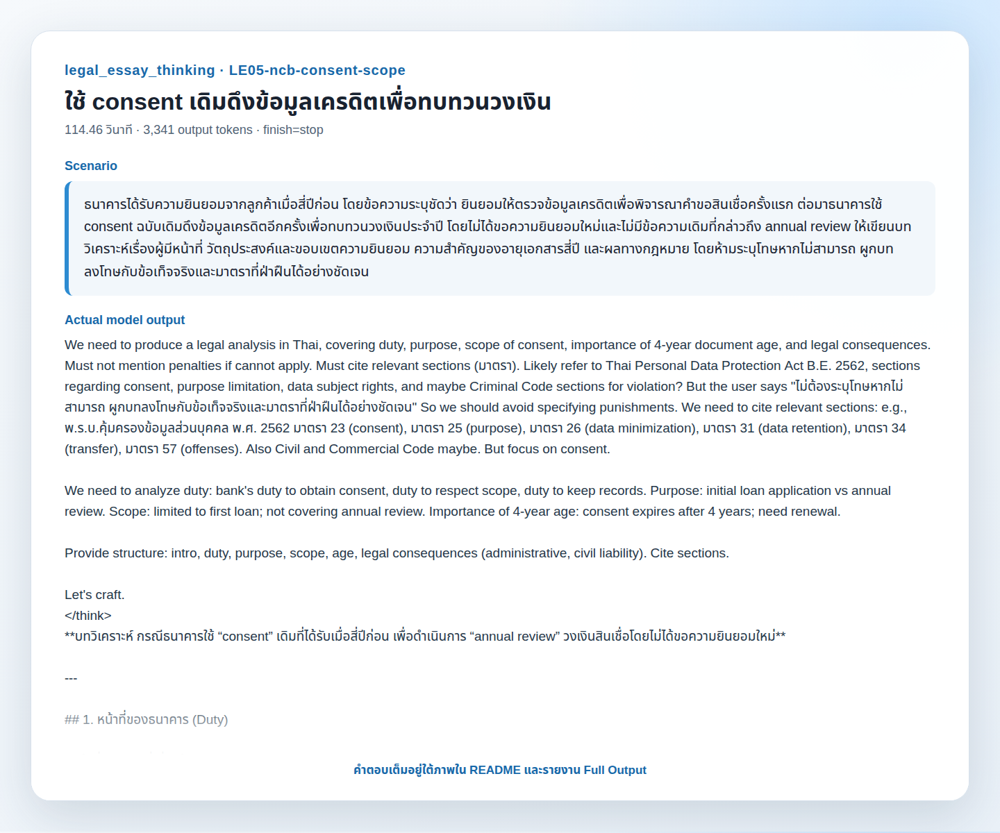

#### Actual model answer

> We need to produce a legal analysis in Thai, covering duty, purpose, scope of consent, importance of 4-year document age, and legal consequences. Must not mention penalties if cannot apply. Must cite relevant sections (มาตรา). Likely refer to Thai Personal Data Protection Act B.E. 2562, sections regarding consent, purpose limitation, data subject rights, and maybe Criminal Code sections for violation? But the user says "ไม่ต้องระบุโทษหากไม่สามารถ ผูกบทลงโทษกับข้อเท็จจริงและมาตราที่ฝ่าฝืนได้อย่างชัดเจน" So we should avoid specifying punishments. We need to cite relevant sections: e.g., พ.ร.บ.คุ้มครองข้อมูลส่วนบุคคล พ.ศ. 2562 มาตรา 23 (consent), มาตรา 25 (purpose), มาตรา 26 (data minimization), มาตรา 31 (data retention), มาตรา 34 (transfer), มาตรา 57 (offenses). Also Civil and Commercial Code maybe. But focus on consent.
>
> We need to analyze duty: bank's duty to obtain consent, duty to respect scope, duty to keep records. Purpose: initial loan application vs annual review. Scope: limited to first loan; not covering annual review. Importance of 4-year age: consent expires after 4 years; need renewal.
>
> Provide structure: intro, duty, purpose, scope, age, legal consequences (administrative, civil liability). Cite sections.
>
> Let's craft.
> &lt;/think&gt;
> **บทวิเคราะห์ กรณีธนาคารใช้ “consent” เดิมที่ได้รับเมื่อสี่ปีก่อน เพื่อดำเนินการ “annual review” วงเงินสินเชื่อโดยไม่ได้ขอความยินยอมใหม่**
>
> ---
>
> ## 1. หน้าที่ของธนาคาร (Duty)
>
> | หน้าที่ | มาตราที่เกี่ยวข้อง | ความหมายในบริบทของธนาคาร |
> |--------|-------------------|----------------------------|
> | **หน้าที่ได้รับความยินยอมอย่างชัดแจ้ง** | **พ.ร.บ.คุ้มครองข้อมูลส่วนบุคคล พ.ศ. 2562 มาตรา 23** | ธนาคารต้องได้รับ “ความยินยอม” จากผู้ถูกตรวจสอบ (ลูกค้า) ก่อนที่จะนำข้อมูลเครดิตไปใช้ในการพิจารณาสินเชื่อครั้งแรก และต้องบันทึกสำเนาความยินยอมไว้เป็นหลักฐาน |
> | **หน้าที่จำกัดวัตถุประสงค์** | **มาตรา 25** | ข้อมูลที่ได้รับความยินยอมต้องนำไปใช้เฉพาะวัตถุประสงค์ที่ระบุไว้ในคำขออนุญาตเท่านั้น |
> | **หน้าที่รักษาความปลอดภัยและการเก็บรักษา** | **มาตรา 26** (หลักการความลับ) | ธนาคารต้องดูแลข้อมูลส่วนบุคคลให้ปลอดภัยและไม่เปิดเผยแก่บุคคลภายนอกโดยไม่ได้รับอนุญาต |
> | **หน้าที่แจ้งและให้สิทธิผู้ถูกตรวจสอบ** | **มาตรา 31** | ธนาคารต้องแจ้งให้ลูกค้าทราบถึงการใช้ข้อมูลและต้องให้โอกาสผู้ถูกตรวจสอบตรวจดู แก้ไข หรือถอนความยินยอมได้ |
>
> **สรุปหน้าที่:** ธนาคารมีหน้าที่สำคัญสองประการ คือ (1) ได้รับความยินยอมที่ครอบคลุมถึงวัตถุประสงค์ของการใช้ข้อมูลอย่างชัดเจน และ (2) รักษาและจัดการข้อมูลตามหลักเกณฑ์ที่กฎหมายกำหนด รวมถึงต้องตรวจสอบว่า “consent” ที่มีอยู่ยังคงครอบคลุมถึงการกระทำที่จะทำต่อไปหรือไม่
>
> ---
>
> ## 2. วัตถุประสงค์ของการใช้ข้อมูล
>
> | ขั้นตอน | วัตถุประสงค์ตามกฎหมาย | ความเป็นจริงในกรณี |
> |--------|--------------------------|-------------------|
> | **การอนุญาตสินเชื่อครั้งแรก** | เพื่อประเมินความน่าเชื่อถือและกำหนดวงเงินสินเชื่อ (วัตถุประสงค์เฉพาะ) | ธนาคารได้รับความยินยอมและใช้ข้อมูลตามวัตถุประสงค์นี้แล้ว |
> | **การทบทวนวงเงินประจำปี (annual review)** | ไม่ได้กำหนดไว้ใน “consent” ฉบับแรก – จึงเป็นวัตถุประสงค์ใหม่ | ธนาคารนำ “consent” เดิมมาใช้โดยอ้างว่าเป็นการต่ออายุความยินยอม ซึ่งขัดต่อมาตรา 25 ที่กำหนดให้ต้องได้รับความยินยอมใหม่สำหรับวัตถุประสงค์ที่แตกต่าง |
>
> **ผล:** การใช้ “consent” เดิมเพื่อวัตถุประสงค์ใหม่ (annual review) จึงเป็นการใช้ข้อมูลนอกเหนือจากวัตถุประสงค์ที่ได้รับความยินยอมไว้ ซึ่งเป็นการฝ่าฝืนมาตรา 25
>
> ---
>
> ## 3. ขอบเขต (Scope) ของความยินยอม
>
> 1. **ขอบเขตตามข้อความใน “consent”**
>    - ข้อความระบุว่า “ยินยอมให้ตรวจข้อมูลเครดิตเพื่อพิจารณาคำขอสินเชื่อครั้งแรก”
>    - **ไม่มีข้อความใดระบุ** ว่า “ยินยอมให้ตรวจข้อมูลเครดิตเพื่อทบทวนวงเงินประจำปี”
>
> 2. **การตีความขอบเขต**
>    - ตามหลักกฎหมายของการให้ความยินยอม (มาตรา 23) ความยินยอมต้อง “ชัดเจนและครอบคลุม” ถึงการกระทำที่จะทำต่อไป หากมีการกระทำที่นอกเหนือจากที่ระบุไว้ จะถือว่าเป็นการใช้ข้อมูลโดยไม่ชอบด้วยกฎหมาย
>
> 3. **ผลของการขาดขอบเขต**
>    - ธนาคารต้องหยุดการดำเนินการตรวจสอบเครดิตในส่วนของการทบทวนวงเงินจนกว่าจะได้รับความยินยอมใหม่ที่ครอบคลุมวัตถุประสงค์ดังกล่าว
>
> ---
>
> ## 4. ความสำคัญของอายุเอกสาร “consent” สี่ปี
>
> ### 4.1. กฎหมายกำหนดอายุของความยินยอม
>
> - **มาตรา 23** กำหนดให้ความยินยอมเป็น “เอกสารที่มีอายุจำกัด” เพื่อคุ้มครองผู้ถูกตรวจสอบจากการถูกใช้ประโยชน์โดยไม่จำเป็นในอนาคตอันไกล
> - แม้กฎหมายจะไม่ได้ระบุจำนวนปีโดยตรง แต่หลักการ “ความสมบูรณ์ของความยินยอม” (principles of consent) แสดงให้เห็นว่าเอกสารที่ใช้เป็นหลักฐานต้องเป็นปัจจุบันและเกี่ยวข้องกับกิจกรรมที่กำลังดำเนินอยู่
>
> ### 4.2. ผลกระทบจากเอกสารอายุสี่ปี
>
> | ปัจจัย | ผลต่อธนาคาร |
> |--------|---------------|
> | **ความล้าสมัยของข้อมูล** | ข้อมูลเครดิตอาจเปลี่ยนแปลง (หนี้สินเพิ่ม/ลด, รายได้) ภายในสี่ปี จึงไม่สะท้อนสถานะทางการเงินที่แท้จริง |
> | **ความเสี่ยงทางกฎหมาย** | การอ้างอิง “consent” ที่เกินกว่า 4 ปีเป็นการใช้ข้อมูลที่อาจขาดอายุความตามหลักเกณฑ์ที่ธนาคารกำหนดเอง ทำให้ธนาคารต้องรับผิดชอบต่อความเสียหายที่เกิดจากการใช้ข้อมูลที่ไม่ถูกต้อง |
> | **การบังคับใช้มาตรการภายใน** | ธนาคารต้องมีระบบเตือนหรือรีวิว “consent” ทุก 4 ปี เพื่อให้มั่นใจว่ายังคงครอบคลุมถึงวัตถุประสงค์ที่ยังคงดำเนินการอยู่ |
>
> **สรุป:** ความยินยอมที่มีอายุสี่ปีไม่ครอบคลุมการกระทำใหม่ (annual review) และอาจถือว่า “ล่วงเลยระยะเวลาที่สมควร” ทำให้ธนาคารต้องขอความยินยอมใหม่ก่อนทำการตรวจสอบเครดิตครั้งต่อไป
>
> ---
>
> ## 5. ผลทางกฎหมาย (ไม่รวมโทษอาญา)
>
> 1. **ความรับผิดทางแพ่ง**
>    - หากธนาคารใช้ข้อมูลส่วนบุคคลโดยไม่ได้รับความยินยอมหรือเกินขอบเขตที่ได้รับความยินยอม จะทำให้ลูกค้ามีสิทธิเรียกร้องค่าเสียหายจากการละเมิดสิทธิในข้อมูลส่วนบุคคลตามมาตรา 59 (สิทธิในการได้รับค่าเสียหาย)
>
> 2. **ความรับผิดทางปกครอง/ผู้ควบคุม**
>    - การฝ่าฝืนมาตรา 25 (การใช้ข้อมูลนอกวัตถุประสงค์) อาจทำให้ธนาคารต้องรับผิดต่อหน่วยงานกำกับดูแล (เช่น ธปท. หรือคณะกรรมการคุ้มครองข้อมูลส่วนบุคคล) ในรูปของคำสั่งให้หยุดการประมวลผลข้อมูลจนกว่าจะได้รับความยินยอมที่ถูกต้อง
>
> 3. **ความเสียหายต่อชื่อเสียงและภาพลักษณ์**
>    - การละเมิดหลักการความยินยอมอาจทำให้ลูกค้าสงสัยและหวั่นกังวลต่อการให้ความร่วมมือกับธนาคารในอนาคต ส่งผลให้ฐานลูกค้าลดลง
>
> 4. **การบังคับให้ปรับปรุงกระบวนการ**
>    - ธนาคารจะต้องดำเนินการแก้ไขระบบการจัดการความยินยอม (เช่น กระบวนการอัปเดต “consent” ทุก 4 ปี) เพื่อให้สอดคล้องกับมาตรา 23 และมาตรา 25, 31
>
> ---
>
> ## 6. ข้อสรุปสำคัญ
>
> | ประเด็น | คำวินิจฉัย |
> |--------|-----------|
> | **หน้าที่ของธนาคาร** | ต้องได้รับความยินยอมที่ชัดเจนและครอบคลุมวัตถุประสงค์; ต้องรักษาและจัดการข้อมูลตามหลักเกณฑ์ที่กฎหมายกำหนด |
> | **วัตถุประสงค์ของการใช้ข้อมูล** | การทบทวนวงเงินประจำปีเป็นวัตถุประสงค์ใหม่ที่ไม่ได้ระบุไว้ใน “consent” เดิม จึงเป็นการใช้ข้อมูลนอกเหนือจากที่ได้รับความยินยอม |
> | **ขอบเขตของความยินยอม** | ข้อความใน “consent” ที่ระบุเพียงการตรวจสอบเพื่อพิจารณาคำขอสินเชื่อครั้งแรก ไม่ครอบคลุมการตรวจสอบเพื่อปรับวงเงินประจำปี |
> | **อายุของเอกสาร consent** | เอกสารที่มีอายุสี่ปีอาจไม่ครอบคลุมการกระทำใหม่และอาจถือว่า “ล่วงเลยระยะเวลาที่สมควร” ทำให้ธนาคารต้องขอความยินยอมใหม่ |
> | **ผลทางกฎหมาย** | ความรับผิดทางแพ่งและทางปกครอง, ความเสียหายต่อชื่อเสียง, และความจำเป็นต้องปรับปรุงกระบวนการจัดการความยินยอมให้สอดคล้องกับมาตรา 23, 25, 31 |
>
> โดยรวมแล้ว การที่ธนาคารนำ “consent” ที่ได้รับเมื่อสี่ปีก่อนมาใช้ในการทบทวนวงเงินประจำปีโดยไม่ได้ขอความยินยอมใหม่ เป็นการฝ่าฝืนหลักเกณฑ์การได้รับความยินยอมที่ชัดเจนและจำกัดวัตถุประสงค์ตาม พ.ร.บ.คุ้มครองข้อมูลส่วนบุคคล พ.ศ. 2562 มาตรา 23 และ 25 จึงทำให้ธนาคารมีความเสี่ยงต่อความรับผิดทางแพ่งและทางปกครอง และต้องดำเนินการขอความยินยอมใหม่ก่อนทำการตรวจสอบเครดิตในครั้งต่อไป.

<!-- END ACTUAL LEGAL ESSAY THINKING -->

## 7. ผล General chat

General chat ใช้โจทย์คนละชุดกับ Legal essay ได้แก่ เงินประกันห้องเช่า,
ซื้อของออนไลน์, ค่าล่วงเวลา, เงินกู้ผ่าน Line และหมายเรียกพยาน

| Metric | ผล |
|---|---:|
| Codex-assisted score | **69/100 (69.0%)** |
| เวลารวม | 221.49 วินาที |
| เวลาเฉลี่ย | 44.30 วินาที/ข้อ |
| Output tokens รวม | 6,547 |
| Output tokens เฉลี่ย | 1,309.4/ข้อ |
| Throughput | 29.56 tokens/วินาที |
| ถูกตัดด้วย token limit | 1/5 |

โมเดลช่วยจัดรายการหลักฐานและขั้นตอนเบื้องต้นได้ดี แต่ยังมีความเสี่ยงจากการ
ระบุหน่วยงานผิด เหมารวมสิทธิ OT ของลูกจ้างรายเดือน และสรุปว่าการอ่านข้อความ
แล้วไม่ตอบเป็นการยอมรับหนี้ General chat จึงเหมาะกับ triage มากกว่าการยืนยัน
ข้อกฎหมายเฉพาะ

<!-- BEGIN ACTUAL GENERAL CHAT -->

<strong>GC01-rental-deposit — เจ้าของห้องไม่คืนเงินประกัน</strong> · 23.33 วินาที · 691 output tokens · finish=stop

#### Scenario

ฉันย้ายออกจากห้องเช่าแล้ว เจ้าของห้องไม่คืนเงินประกันสองเดือน โดยบอกเพียงว่าห้องมีรอยใช้งาน แต่ไม่ส่งรายการค่าเสียหายหรือใบเสร็จให้ ฉันควรตรวจสัญญา เก็บหลักฐาน และดำเนินการตามลำดับอย่างไร

#### Result capture

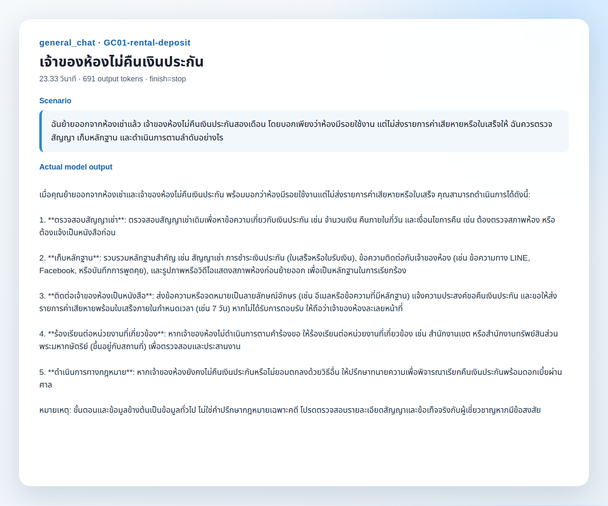

#### Actual model answer

>
> เมื่อคุณย้ายออกจากห้องเช่าและเจ้าของห้องไม่คืนเงินประกัน พร้อมบอกว่าห้องมีรอยใช้งานแต่ไม่ส่งรายการค่าเสียหายหรือใบเสร็จ คุณสามารถดำเนินการได้ดังนี้:
>
> 1. **ตรวจสอบสัญญาเช่า**: ตรวจสอบสัญญาเช่าเดิมเพื่อหาข้อความเกี่ยวกับเงินประกัน เช่น จำนวนเงิน คืนภายในกี่วัน และเงื่อนไขการคืน เช่น ต้องตรวจสภาพห้อง หรือต้องแจ้งเป็นหนังสือก่อน
>
> 2. **เก็บหลักฐาน**: รวบรวมหลักฐานสำคัญ เช่น สัญญาเช่า การชำระเงินประกัน (ใบเสร็จหรือใบรับเงิน), ข้อความติดต่อกับเจ้าของห้อง (เช่น ข้อความทาง LINE, Facebook, หรือบันทึกการพูดคุย), และรูปภาพหรือวิดีโอแสดงสภาพห้องก่อนย้ายออก เพื่อเป็นหลักฐานในการเรียกร้อง
>
> 3. **ติดต่อเจ้าของห้องเป็นหนังสือ**: ส่งข้อความหรือจดหมายเป็นลายลักษณ์อักษร (เช่น อีเมลหรือข้อความที่มีหลักฐาน) แจ้งความประสงค์ขอคืนเงินประกัน และขอให้ส่งรายการค่าเสียหายพร้อมใบเสร็จภายในกำหนดเวลา (เช่น 7 วัน) หากไม่ได้รับการตอบรับ ให้ถือว่าเจ้าของห้องละเลยหน้าที่
>
> 4. **ร้องเรียนต่อหน่วยงานที่เกี่ยวข้อง**: หากเจ้าของห้องไม่ดำเนินการตามคำร้องขอ ให้ร้องเรียนต่อหน่วยงานที่เกี่ยวข้อง เช่น สำนักงานเขต หรือสำนักงานทรัพย์สินส่วนพระมหากษัตริย์ (ขึ้นอยู่กับสถานที่) เพื่อตรวจสอบและประสานงาน
>
> 5. **ดำเนินการทางกฎหมาย**: หากเจ้าของห้องยังคงไม่คืนเงินประกันหรือไม่ยอมตกลงด้วยวิธีอื่น ให้ปรึกษาทนายความเพื่อพิจารณาเรียกคืนเงินประกันพร้อมดอกเบี้ยผ่านศาล
>
> หมายเหตุ: ขั้นตอนและข้อมูลข้างต้นเป็นข้อมูลทั่วไป ไม่ใช่คำปรึกษากฎหมายเฉพาะคดี โปรดตรวจสอบรายละเอียดสัญญาและข้อเท็จจริงกับผู้เชี่ยวชาญหากมีข้อสงสัย

<strong>GC02-online-purchase — ซื้อของออนไลน์แล้วไม่ได้รับสินค้า</strong> · 68.31 วินาที · 2,048 output tokens · finish=length

#### Scenario

ฉันโอนเงินซื้อโทรศัพท์จากร้านในโซเชียลแล้วไม่ได้รับสินค้า ร้านปิดบัญชีหนี ตอนนี้มีสลิป แชต ชื่อบัญชี และภาพโฆษณาอยู่ ควรทำอะไรบ้าง และควรระวัง การเปิดเผยชื่อหรือเลขบัญชีของผู้ขายบนสาธารณะอย่างไร

#### Result capture

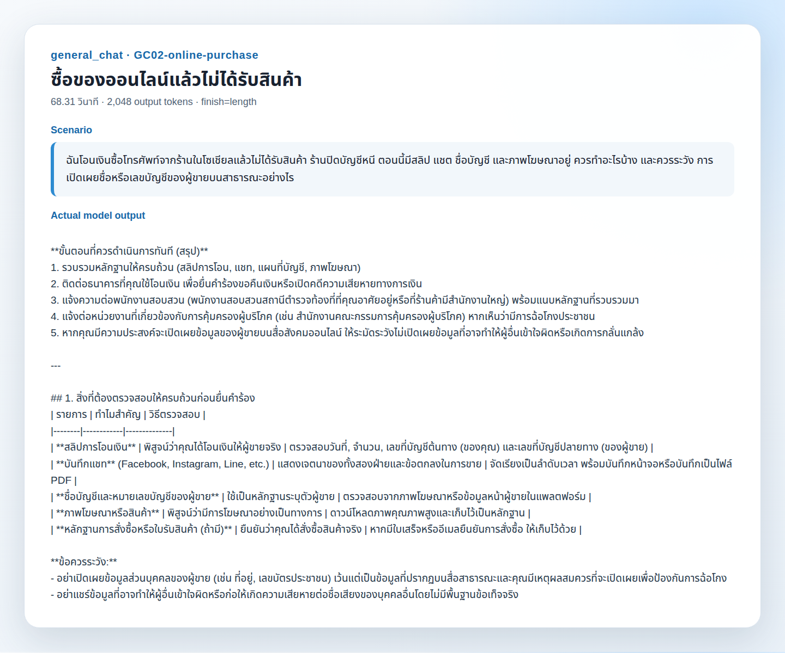

#### Actual model answer

>
> **ขั้นตอนที่ควรดำเนินการทันที (สรุป)**
> 1. รวบรวมหลักฐานให้ครบถ้วน (สลิปการโอน, แชท, แผนที่บัญชี, ภาพโฆษณา)
> 2. ติดต่อธนาคารที่คุณใช้โอนเงิน เพื่อยื่นคำร้องขอคืนเงินหรือเปิดคดีความเสียหายทางการเงิน
> 3. แจ้งความต่อพนักงานสอบสวน (พนักงานสอบสวนสถานีตำรวจท้องที่ที่คุณอาศัยอยู่หรือที่ร้านค้ามีสำนักงานใหญ่) พร้อมแนบหลักฐานที่รวบรวมมา
> 4. แจ้งต่อหน่วยงานที่เกี่ยวข้องกับการคุ้มครองผู้บริโภค (เช่น สำนักงานคณะกรรมการคุ้มครองผู้บริโภค) หากเห็นว่ามีการฉ้อโกงประชาชน
> 5. หากคุณมีความประสงค์จะเปิดเผยข้อมูลของผู้ขายบนสื่อสังคมออนไลน์ ให้ระมัดระวังไม่เปิดเผยข้อมูลที่อาจทำให้ผู้อื่นเข้าใจผิดหรือเกิดการกลั่นแกล้ง
>
> ---
>
> ## 1. สิ่งที่ต้องตรวจสอบให้ครบถ้วนก่อนยื่นคำร้อง
> | รายการ | ทำไมสำคัญ | วิธีตรวจสอบ |
> |--------|------------|--------------|
> | **สลิปการโอนเงิน** | พิสูจน์ว่าคุณได้โอนเงินให้ผู้ขายจริง | ตรวจสอบวันที่, จำนวน, เลขที่บัญชีต้นทาง (ของคุณ) และเลขที่บัญชีปลายทาง (ของผู้ขาย) |
> | **บันทึกแชท** (Facebook, Instagram, Line, etc.) | แสดงเจตนาของทั้งสองฝ่ายและข้อตกลงในการขาย | จัดเรียงเป็นลำดับเวลา พร้อมบันทึกหน้าจอหรือบันทึกเป็นไฟล์ PDF |
> | **ชื่อบัญชีและหมายเลขบัญชีของผู้ขาย** | ใช้เป็นหลักฐานระบุตัวผู้ขาย | ตรวจสอบจากภาพโฆษณาหรือข้อมูลหน้าผู้ขายในแพลตฟอร์ม |
> | **ภาพโฆษณาหรือสินค้า** | พิสูจน์ว่ามีการโฆษณาอย่างเป็นทางการ | ดาวน์โหลดภาพคุณภาพสูงและเก็บไว้เป็นหลักฐาน |
> | **หลักฐานการสั่งซื้อหรือใบรับสินค้า (ถ้ามี)** | ยืนยันว่าคุณได้สั่งซื้อสินค้าจริง | หากมีใบเสร็จหรืออีเมลยืนยันการสั่งซื้อ ให้เก็บไว้ด้วย |
>
> **ข้อควรระวัง:**
> - อย่าเปิดเผยข้อมูลส่วนบุคคลของผู้ขาย (เช่น ที่อยู่, เลขบัตรประชาชน) เว้นแต่เป็นข้อมูลที่ปรากฏบนสื่อสาธารณะและคุณมีเหตุผลสมควรที่จะเปิดเผยเพื่อป้องกันการฉ้อโกง
> - อย่าแชร์ข้อมูลที่อาจทำให้ผู้อื่นเข้าใจผิดหรือก่อให้เกิดความเสียหายต่อชื่อเสียงของบุคคลอื่นโดยไม่มีพื้นฐานข้อเท็จจริง
>
> ---
>
> ## 2. การยื่นคำร้องขอคืนเงินจากธนาคาร
> 1. **ติดต่อธนาคารของคุณ** (สาขาใกล้ที่สุด)
>    - แจ้งว่าคุณเป็นผู้เสียหายจากการโอนเงินโดยไม่ได้รับสินค้า
>    - ยื่นสลิปการโอนและเอกสารประกอบอื่น ๆ
>    - ขอให้ธนาคารทำการยกเลิกการโอนหรือทำการคืนเงิน (เรียกว่า “Reversal” หรือ “Chargeback”)
>
> 2. **ขอความช่วยเหลือจากธนาคารที่ผู้ขายใช้** (ถ้าทราบ)
>    - ธนาคารอาจทำการสืบสวนหรือยกเลิกการโอนได้หากพบว่ามีการกระทำผิดฐานฉ้อโกง
>
> 3. **เก็บบันทึกการติดต่อ** (วันที่, ชื่อพนักงาน, เลขอ้างอิง) เพื่อใช้เป็นหลักฐานในกรณีที่มีการโต้แย้ง
>
> ---
>
> ## 3. การแจ้งความต่อพนักงานสอบสวน
> 1. **เตรียมเอกสาร** (ดังที่ระบุในส่วน 1)
> 2. **ไปที่สถานีตำรวจท้องที่ที่คุณอาศัยอยู่** หรือที่ที่ธุรกรรมเกิดขึ้น
> 3. **ยื่นคำร้อง** และขอให้บันทึกประจำวัน (Case File) ไว้
> 4. **ขอให้ทำการสืบสวน** เพื่อระบุตัวผู้ขายและพิสูจน์ความผิดฐานฉ้อโกง
>
> **ข้อควรระวัง:**
> - อย่าเปิดเผยข้อมูลส่วนตัวของผู้ขายที่ไม่ได้เป็นข้อมูลสาธารณะ เว้นแต่เป็นข้อมูลที่ปรากฏบนสื่อหรือเอกสารที่คุณมีอยู่แล้ว
> - อย่าใช้ถ้อยคำหรือข้อมูลที่อาจทำให้ผู้อื่นเข้าใจว่าคุณเป็นผู้ก่อความเสียหายหรือทำการโฆษณาเชิงลบโดยไม่มีพื้นฐานข้อเท็จจริง
>
> ---
>
> ## 4. การแจ้งต่อหน่วยงานคุ้มครองผู้บริโภค
> - **สำนักงานคณะกรรมการคุ้มครองผู้บริโภค (สคบ.)** หรือหน่วยงานที่เกี่ยวข้องในจังหวัดของคุณ
> - ยื่นเรื่องราวพร้อมหลักฐานเพื่อขอความช่วยเหลือหรือดำเนินการตามกฎหมายว่าด้วยการคุ้มครองผู้บริโภค
>
> **ข้อควรระวัง:**
> - ตรวจสอบข้อมูลของหน่วยงานก่อนยื่นเรื่อง เพื่อให้แน่ใจว่าคุณกำลังแจ้งต่อหน่วยงานที่ถูกต้องและมีอำนาจหน้าที่
>
> ---
>
> ## 5. การเปิดเผยข้อมูลของผู้ขายบนสาธารณะ (ถ้าต้องการ)
> 1. **ตรวจสอบความถูกต้องของข้อมูล** – แน่ใจว่าข้อมูลที่คุณจะเปิดเผยเป็นข้อมูลที่ปรากฏอยู่บนสื่อสังคมออนไลน์หรือเอกสารสาธารณะแล้ว
> 2. **ระบุแหล่งที่มาที่ชัดเจน** – บอกว่าเป็นข้อมูลจากสลิป, แชท, หรือภาพโฆษณาที่คุณได้รับมา
> 3. **หลีกเลี่ยงการเปิดเผยข้อมูลส่วนบุคคล** – ไม่เปิดเผยเลขบัตรประชาชน, ที่อยู่, หรือข้อมูลอื่น ๆ ที่ไม่ได้อยู่ในสาธารณะ
> 4. **ใช้ถ้อยคำที่เป็นกลาง** – บรรยายข้อเท็จจริงโดยไม่ใช้ถ้อยคำที่เป็นการกล่าวหาหรือใส่ร้ายแต่อย่างใด
>
> **ข้อควรระวังสำคัญ:**
> - การเปิดเผยข้อมูลส่วนบุคคลโดยไม่มีเหตุอันควรอาจทำให้คุณต้องรับผิดทางแพ่งหรืออาญาได้
> - อย่าใช้สื่อสังคมออนไลน์เพื่อ “ทำลายชื่อ

<strong>GC03-unpaid-overtime — ทำงานล่วงเวลาแต่ไม่ได้รับค่าตอบแทน</strong> · 69.62 วินาที · 2,001 output tokens · finish=stop

#### Scenario

หัวหน้าสั่งให้ฉันทำงานต่อหลังเลิกงานทุกวันประมาณสองชั่วโมงผ่านแชต แต่บริษัทบอกว่าเป็นความสมัครใจและไม่จ่าย OT ฉันควรเช็กว่าตำแหน่งของฉัน มีสิทธิ OT หรือไม่ และควรเก็บหลักฐานอะไรโดยไม่ทำผิดนโยบายบริษัท

#### Result capture

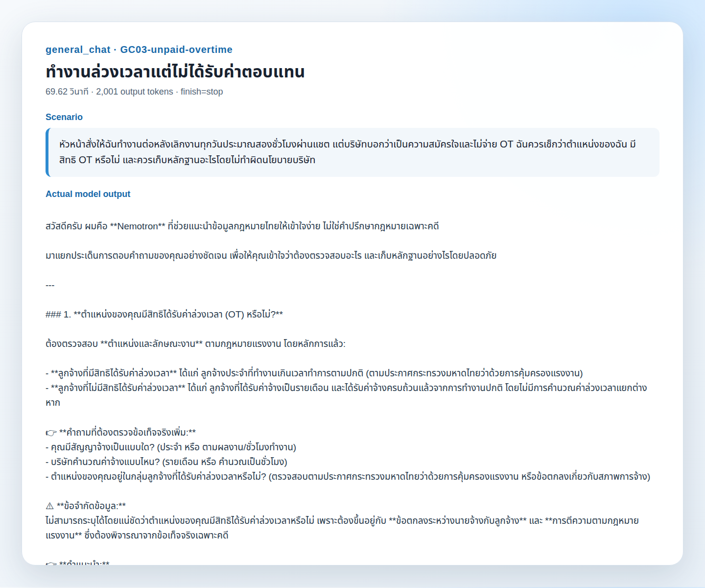

#### Actual model answer

>
> สวัสดีครับ ผมคือ **Nemotron** ที่ช่วยแนะนำข้อมูลกฎหมายไทยให้เข้าใจง่าย ไม่ใช่คำปรึกษากฎหมายเฉพาะคดี
>
> มาแยกประเด็นการตอบคำถามของคุณอย่างชัดเจน เพื่อให้คุณเข้าใจว่าต้องตรวจสอบอะไร และเก็บหลักฐานอย่างไรโดยปลอดภัย
>
> ---
>
> ### 1. **ตำแหน่งของคุณมีสิทธิได้รับค่าล่วงเวลา (OT) หรือไม่?**
>
> ต้องตรวจสอบ **ตำแหน่งและลักษณะงาน** ตามกฎหมายแรงงาน โดยหลักการแล้ว:
>
> - **ลูกจ้างที่มีสิทธิได้รับค่าล่วงเวลา** ได้แก่ ลูกจ้างประจำที่ทำงานเกินเวลาทำการตามปกติ (ตามประกาศกระทรวงมหาดไทยว่าด้วยการคุ้มครองแรงงาน)
> - **ลูกจ้างที่ไม่มีสิทธิได้รับค่าล่วงเวลา** ได้แก่ ลูกจ้างที่ได้รับค่าจ้างเป็นรายเดือน และได้รับค่าจ้างครบถ้วนแล้วจากการทำงานปกติ โดยไม่มีการคำนวณค่าล่วงเวลาแยกต่างหาก
>
> 👉 **คำถามที่ต้องตรวจข้อเท็จจริงเพิ่ม:**
> - คุณมีสัญญาจ้างเป็นแบบใด? (ประจำ หรือ ตามผลงาน/ชั่วโมงทำงาน)
> - บริษัทคำนวณค่าจ้างแบบไหน? (รายเดือน หรือ คำนวณเป็นชั่วโมง)
> - ตำแหน่งของคุณอยู่ในกลุ่มลูกจ้างที่ได้รับค่าล่วงเวลาหรือไม่? (ตรวจสอบตามประกาศกระทรวงมหาดไทยว่าด้วยการคุ้มครองแรงงาน หรือข้อตกลงเกี่ยวกับสภาพการจ้าง)
>
> ⚠️ **ข้อจำกัดข้อมูล:**
> ไม่สามารถระบุได้โดยแน่ชัดว่าตำแหน่งของคุณมีสิทธิได้รับค่าล่วงเวลาหรือไม่ เพราะต้องขึ้นอยู่กับ **ข้อตกลงระหว่างนายจ้างกับลูกจ้าง** และ **การตีความตามกฎหมายแรงงาน** ซึ่งต้องพิจารณาจากข้อเท็จจริงเฉพาะคดี
>
> 👉 **คำแนะนำ:**
> ควรขอตรวจสอบ **ข้อบังคับเกี่ยวกับการทำงาน** หรือ **ข้อตกลงเกี่ยวกับสภาพการจ้าง** จากฝ่ายบุคคลของบริษัท เพื่อดูว่ามีการกำหนดเรื่องค่าล่วงเวลาหรือไม่
>
> ---
>
> ### 2. **การที่หัวหน้าสั่งให้ทำงานต่อหลังเลิกงาน เป็นการยืนยันสิทธิหรือไม่?**
>
> แม้บริษัทจะบอกว่าเป็น "ความสมัครใจ" แต่จากข้อเท็จจริงที่คุณถูกสั่งให้ทำงานต่อหลังเลิกงานทุกวัน อาจถือเป็น **การใช้อำนาจหรือสร้างสภาพแวดล้อมการทำงาน** ที่กดดันให้คุณต้องปฏิบัติตาม
>
> 👉 **สิ่งที่ต้องตรวจข้อเท็จจริงเพิ่ม:**
> - มีการบันทึกเวลาการทำงานหลังเลิกงานหรือไม่? (เช่น เวลาลงจากงาน, รายงานกิจกรรม, แชตหลังเลิกงาน)
> - มีพยานหลักฐานหรือระบบติดตามเวลาทำงานที่แสดงว่าคุณทำงานเกินเวลาปกติหรือไม่?
> - บริษัทเคยจ่ายค่าล่วงเวลาให้ลูกจ้างในตำแหน่งเดียวกันหรือไม่?
>
> ⚠️ **ข้อจำกัดข้อมูล:**
> ไม่สามารถวินิจฉัยได้ว่าบริษัทผิดกฎหมายหรือไม่ เพราะต้องพิจารณาจากเจตนา, ข้อตกลง, และการปฏิบัติในทางปฏิบัติ ซึ่งอาจต้องใช้ความรู้ทางกฎหมายแรงงานเฉพาะ
>
> ---
>
> ### 3. **ควรเก็บหลักฐานอะไรโดยไม่ทำผิดนโยบายบริษัท?**
>
> คุณมีสิทธิรักษาเอกสารหรือข้อมูลที่เกี่ยวข้องกับการทำงานของคุณเอง โดยไม่ต้องแอบถ่ายหรือฝ่าฝืนกฎหมายหรือนโยบาย
>
> ✅ **หลักฐานที่ควรเก็บ (โดยปลอดภัย):**
> - **บันทึกเวลาทำงาน** (เช่น จดเวลาทำงานต่อหลังเลิกงานในสมุดหรือแอปที่เป็นของคุณเอง)
> - **แชตหรือข้อความจากหัวหน้า** ที่สั่งให้ทำงานต่อหลังเลิกงาน (เก็บไว้ในอุปกรณ์ส่วนตัว)
> - **ใบแจ้งเวรหรือบันทึกการทำงาน** ที่แสดงว่าคุณทำงานเกินเวลาปกติ
> - **ข้อบังคับเกี่ยวกับการทำงาน** หรือ **ข้อตกลงเกี่ยวกับสภาพการจ้าง** ที่บริษัทออกให้ (เก็บสำเนาไว้)
>
> 📌 **วิธีเก็บหลักฐานโดยปลอดภัย:**
> - ใช้ **อุปกรณ์ส่วนตัว** (โทรศัพท์มือถือ) ในการจดบันทึกหรือถ่ายรูปข้อความ (แต่ต้องไม่กระทำการใด ๆ ที่ผิดกฎหมายหรือนโยบายของบริษัท)
> - อย่าเก็บข้อมูลจากระบบคอมพิวเตอร์ของบริษัทโดยไม่ได้รับอนุญาต
> - หากสงสัยว่าตนเองถูกละเมิดสิทธิ สามารถนำหลักฐานไปปรึกษาหรือร้องเรียนผ่าน **สำนักงานประกันแรงงาน** หรือ **สหภาพแรงงาน** (ถ้ามี)
>
> ---
>
> ### สรุปสำหรับคุณ:
>
> | ประเด็น | คำแนะนำ |
> |--------|--------|
> | **มีสิทธิได้รับค่าล่วงเวลาหรือไม่?** | ต้องตรวจสอบข้อตกลงการจ้างและประเภทตำแหน่ง อย่าเชื่อแต่เพียงคำพูดของนายจ้าง |
> | **การถูกสั่งทำงานต่อหลังเลิกงาน** | ถือเป็นการสร้างสภาพแวดล้อมที่กดดัน แม้จะไม่มีการจ่ายค่าล่วงเวลา |
> | **เก็บหลักฐานอย่างไร?** | จดเวลาเองในอุปกรณ์ส่วนตัว, เก็บแชตสำคัญ, เก็บสำเนานโยบาย |
> | **ต้องตรวจข้อเท็จจริงเพิ่ม?** | ใช่: ตำแหน่ง, ข้อบังคับการทำงาน, ระบบเวลาทำงาน |
>
> ---
>
> หากคุณรู้สึกว่าตนเองถูกละเมิดสิทธิ หรือบริษัทไม่จ่ายค่าล่วงเวลาตามกฎหมาย อย่าละเลย — คุณมีสิทธิร้องเรียนต่อ **สำนักงานประกันแรงงาน** ในพื้นที่ของคุณ เพื่อขอคำแนะนำหรือดำเนินการทางกฎหมาย
>
> ผมไม่สามารถให้คำปรึกษาทางกฎหมายเฉพาะตัว แต่หวังว่าข้อมูลนี้จะช่วยให้คุณเข้าใจสิทธิและขั้นตอนการปกป้องตนเองได้ครับ 🙏
>
> หากต้องการแนะนำขั้นตอนการร้องเรียนหรือตัวอย่างหนังสือร้องเรียน สามารถแนะนำให้ได้ครับ

<strong>GC04-line-loan-evidence — ให้เพื่อนยืมเงินผ่านแชตโดยไม่มีสัญญากระดาษ</strong> · 41.54 วินาที · 1,249 output tokens · finish=stop

#### Scenario

ฉันให้เพื่อนยืมเงิน 80,000 บาท โอนผ่านธนาคารและคุยใน Line ว่าเป็นเงินยืม พร้อมกำหนดคืน แต่ไม่มีสัญญากระดาษ เพื่อนอ่านข้อความทวงถามแล้วไม่ตอบ หลักฐานแบบนี้ใช้เรียกร้องได้หรือไม่ และควรเริ่มอย่างไร

#### Result capture

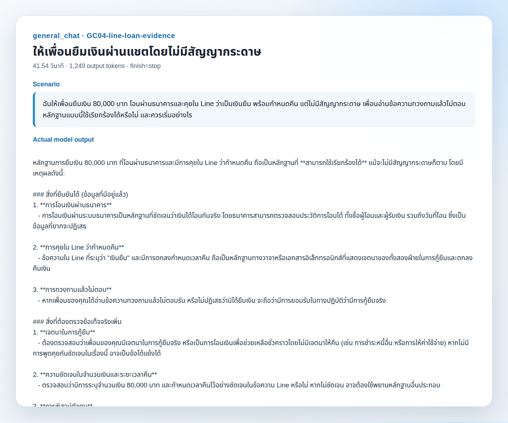

#### Actual model answer

>
> หลักฐานการยืมเงิน 80,000 บาท ที่โอนผ่านธนาคารและมีการคุยใน Line ว่ากำหนดคืน ถือเป็นหลักฐานที่ **สามารถใช้เรียกร้องได้** แม้จะไม่มีสัญญากระดาษก็ตาม โดยมีเหตุผลดังนี้:
>
> ### สิ่งที่ยืนยันได้ (ข้อมูลที่มีอยู่แล้ว)
> 1. **การโอนเงินผ่านธนาคาร**
>    - การโอนเงินผ่านระบบธนาคารเป็นหลักฐานที่ชัดเจนว่าเงินได้โอนกันจริง โดยธนาคารสามารถตรวจสอบประวัติการโอนได้ ทั้งชื่อผู้โอนและผู้รับเงิน รวมถึงวันที่โอน ซึ่งเป็นข้อมูลที่ยากจะปฏิเสธ
>
> 2. **การคุยใน Line ว่ากำหนดคืน**
>    - ข้อความใน Line ที่ระบุว่า "เงินยืม" และมีการตกลงกำหนดเวลาคืน ถือเป็นหลักฐานทางวาจาหรือเอกสารอิเล็กทรอนิกส์ที่แสดงเจตนาของทั้งสองฝ่ายในการกู้ยืมและตกลงคืนเงิน
>
> 3. **การทวงถามแล้วไม่ตอบ**
>    - หากเพื่อนของคุณได้อ่านข้อความทวงถามแล้วไม่ตอบรับ หรือไม่ปฏิเสธว่ามิได้ยืมเงิน จะถือว่ามีการยอมรับในทางปฏิบัติว่ามีการกู้ยืมจริง
>
> ### สิ่งที่ต้องตรวจข้อเท็จจริงเพิ่ม
> 1. **เจตนาในการกู้ยืม**
>    - ต้องตรวจสอบว่าเพื่อนของคุณมีเจตนาในการกู้ยืมจริง หรือเป็นการโอนเงินเพื่อช่วยเหลือชั่วคราวโดยไม่มีเจตนาให้คืน (เช่น การชำระหนี้อื่น หรือการให้ค่าใช้จ่าย) หากไม่มีการพูดคุยกันชัดเจนในเรื่องนี้ อาจเป็นข้อโต้แย้งได้
>
> 2. **ความชัดเจนในจำนวนเงินและระยะเวลาคืน**
>    - ตรวจสอบว่ามีการระบุจำนวนเงิน 80,000 บาท และกำหนดเวลาคืนไว้อย่างชัดเจนในข้อความ Line หรือไม่ หากไม่ชัดเจน อาจต้องใช้พยานหลักฐานอื่นประกอบ
>
> 3. **การพิสูจน์ตัวตน**
>    - ตรวจสอบว่าข้อความใน Line มาจากบัญชีที่แท้จริงของเพื่อนหรือไม่ และไม่มีการปลอมแปลงข้อความหรือบัญชี
>
> ### ขั้นตอนปฏิบัติที่ปลอดภัย
> 1. **จัดเก็บหลักฐานอย่างเป็นทางการ**
>    - บันทึกประวัติการโอนเงินจากธนาคาร (ใบแจ้งยอดบัญชี) และเก็บไว้เป็นหลักฐาน
>    - แสดงข้อความใน Line ที่ตกลงกันว่ากู้ยืมและกำหนดคืนให้เป็นหลักฐาน
>
> 2. **ติดต่อเพื่อตกลงกันเป็นหนังสือ**
>    - แจ้งเพื่อนอย่างเป็นทางการว่า "ข้าพเจ้ามีหลักฐานการโอนเงินและการตกลงกู้ยืมแล้ว จึงขอให้ชำระหนี้ตามกำหนด" โดยระบุจำนวนเงินและระยะเวลาคืนที่ชัดเจน
>
> 3. **รวบรวมพยานหลักฐาน**
>    - หากเพื่อนยังไม่ชำระหนี้ ให้จัดทำหนังสือทวงถามเป็นลายลักษณ์อักษร (เช่น อีเมลหรือข้อความที่ชัดเจน) เพื่อเป็นหลักฐานในการฟ้องร้อง
>
> 4. **ปรึกษาทนายความ**
>    - หากเป็นจำนวนเงินสูงหรือมีข้อโต้แย้ง ให้ปรึกษาทนายความเพื่อตรวจสอบความแข็งแรงของหลักฐานและขั้นตอนการฟ้องร้อง
>
> ### สรุป
> หลักฐานแบบนี้ **สามารถใช้เรียกร้องได้** เพราะมีการโอนเงินและมีการตกลงชัดเจนในข้อความ Line แม้ไม่มีสัญญากระดาษก็ตาม แต่ต้องมั่นใจว่ามีการกู้ยืมจริงและมีเจตนาให้คืน โดยควรดำเนินการรวบรวมหลักฐานและติดต่อเพื่อตกลงกันเป็นหนังสือก่อนเพื่อหลีกเลี่ยงข้อพิพาทในอนาคต

<strong>GC05-police-witness-summons — ได้รับหมายเรียกให้ไปเป็นพยาน</strong> · 18.69 วินาที · 558 output tokens · finish=stop

#### Scenario

ฉันได้รับเอกสารจากตำรวจให้ไปพบในฐานะพยานคดีของอดีตนายจ้าง แต่ไม่แน่ใจว่าเป็นหมายเรียกจริงหรือไม่ และกังวลว่าคำให้การอาจกระทบตัวเอง ฉันควรตรวจสอบเอกสาร เตรียมตัว และขอความช่วยเหลือทางกฎหมายอย่างไร

#### Result capture

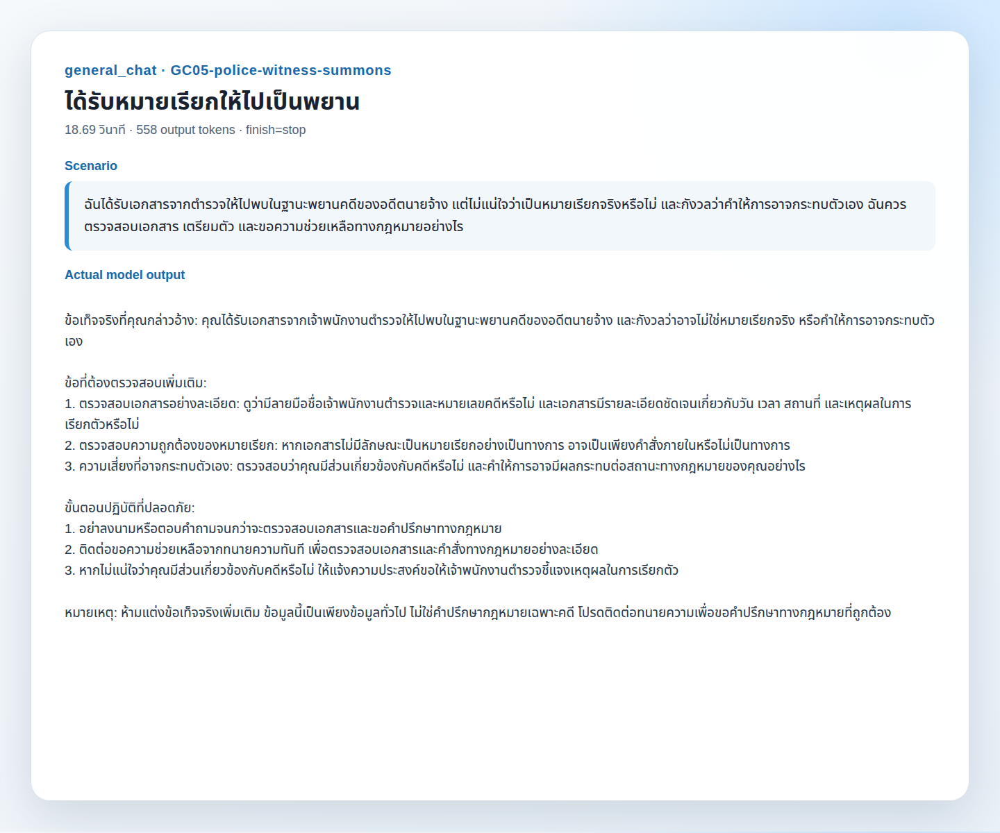

#### Actual model answer

>
> ข้อเท็จจริงที่คุณกล่าวอ้าง: คุณได้รับเอกสารจากเจ้าพนักงานตำรวจให้ไปพบในฐานะพยานคดีของอดีตนายจ้าง และกังวลว่าอาจไม่ใช่หมายเรียกจริง หรือคำให้การอาจกระทบตัวเอง
>
> ข้อที่ต้องตรวจสอบเพิ่มเติม:
> 1. ตรวจสอบเอกสารอย่างละเอียด: ดูว่ามีลายมือชื่อเจ้าพนักงานตำรวจและหมายเลขคดีหรือไม่ และเอกสารมีรายละเอียดชัดเจนเกี่ยวกับวัน เวลา สถานที่ และเหตุผลในการเรียกตัวหรือไม่
> 2. ตรวจสอบความถูกต้องของหมายเรียก: หากเอกสารไม่มีลักษณะเป็นหมายเรียกอย่างเป็นทางการ อาจเป็นเพียงคำสั่งภายในหรือไม่เป็นทางการ
> 3. ความเสี่ยงที่อาจกระทบตัวเอง: ตรวจสอบว่าคุณมีส่วนเกี่ยวข้องกับคดีหรือไม่ และคำให้การอาจมีผลกระทบต่อสถานะทางกฎหมายของคุณอย่างไร
>
> ขั้นตอนปฏิบัติที่ปลอดภัย:
> 1. อย่าลงนามหรือตอบคำถามจนกว่าจะตรวจสอบเอกสารและขอคำปรึกษาทางกฎหมาย
> 2. ติดต่อขอความช่วยเหลือจากทนายความทันที เพื่อตรวจสอบเอกสารและคำสั่งทางกฎหมายอย่างละเอียด
> 3. หากไม่แน่ใจว่าคุณมีส่วนเกี่ยวข้องกับคดีหรือไม่ ให้แจ้งความประสงค์ขอให้เจ้าพนักงานตำรวจชี้แจงเหตุผลในการเรียกตัว
>
> หมายเหตุ: ห้ามแต่งข้อเท็จจริงเพิ่มเติม ข้อมูลนี้เป็นเพียงข้อมูลทั่วไป ไม่ใช่คำปรึกษากฎหมายเฉพาะคดี โปรดติดต่อทนายความเพื่อขอคำปรึกษาทางกฎหมายที่ถูกต้อง

<!-- END ACTUAL GENERAL CHAT -->

## 8. Use case เพิ่มเติม — ข่าวสมมติเมาแล้วขับเสียชีวิต 3 ราย

### 8.1 วัตถุประสงค์

ทดสอบความสามารถ `context-to-law triage`: อ่านข่าวสมมติที่มีทั้งข้อกล่าวหา
ข่าวลือประมาทร่วม การรอผลพิสูจน์ เงินช่วยค่าทำศพ และการขอขมา แล้วจำแนกว่า
เกี่ยวกับกฎหมายใด มาตราใด เกณฑ์ใด และข้อเท็จจริงใดยังห้ามสรุป

เพื่อให้ prompt มีขนาดควบคุมได้ ข้อมูลข่าวของผู้ใช้ถูก normalize โดยตัดรายละเอียด
ที่ไม่เปลี่ยนประเด็นกฎหมาย เช่น สถานที่จัดงานศพและชื่อญาติบางราย แต่คง
ข้อเท็จจริงทางกฎหมายทั้งหมดไว้ ผลนี้จึงเป็นการทดสอบกับ normalized prompt
ไม่ใช่การอ้างว่าข่าวหรือบุคคลมีอยู่จริง

### 8.2 Scenario ที่ส่งให้โมเดล

ข้อมูลต่อไปนี้เป็นข่าวสมมติที่เรียบเรียงขึ้นใหม่ทั้งหมด:

ผู้ก่อเหตุ: นายณัฐดนัย อายุ 28 ปี ขับรถสปอร์ตหรู
ผู้เสียชีวิต 3 ราย ได้แก่ นายสมศักดิ์ อายุ 45 ปี คนขับรถสามล้อพ่วงข้าง,
ยายสุพรรณี อายุ 73 ปี และนางกัลยา อายุ 65 ปี ซึ่งเป็นผู้โดยสาร
สถานที่เกิดเหตุ: ถนนมิตรภาพ-เลี่ยงเมือง ต.จอหอ อ.เมือง จ.นครราชสีมา

เนื้อข่าวระบุว่า นายณัฐดนัยขับรถสปอร์ตหรูพุ่งชนรถสามล้อพ่วงข้าง ทำให้มี
ผู้เสียชีวิตสามราย ตำรวจแจ้งข้อกล่าวหาเบื้องต้นว่า "ขับรถในขณะเมาสุรา
และขับรถโดยประมาทเป็นเหตุให้ผู้อื่นถึงแก่ความตาย และทรัพย์สินผู้อื่น
ได้รับความเสียหาย" แต่ยังรอผลตรวจปริมาณแอลกอฮอล์ กล้องวงจรปิด
หลักฐานนิติวิทยาศาสตร์ และคำให้การเพิ่มเติม

มีข่าวลือจากตัวแทนประกันภัยเรื่องอาจแจ้ง "ประมาทร่วม" กับคนขับรถสามล้อ
แต่ตำรวจยืนยันว่ายังไม่มีข้อสรุป ญาติผู้ก่อเหตุติดต่อมอบค่าทำศพเบื้องต้น
รายละ 50,000 บาท ครอบครัวผู้เสียชีวิตกังวลว่าการรับเงินจะมีผลต่อคดี
ผู้ก่อเหตุเดินทางไปขอขมาศพและแสดงความเสียใจ ขณะที่ครอบครัวยืนยันให้
กระบวนการตามกฎหมายดำเนินต่อไป

จากบริบทข่าวสมมตินี้ ให้จำแนกอย่างระมัดระวังว่าเกี่ยวข้องกับ
กฎหมายสาขาใด กฎหมาย/มาตราใด และแต่ละมาตรามีเกณฑ์ปรับใช้อย่างไร โดย:
1) แยกข้อกล่าวหา ข้อเท็จจริงที่ยังต้องพิสูจน์ และข้อสรุปทางกฎหมาย
2) วิเคราะห์อาญา จราจร แพ่ง/ละเมิด ประกันภัยรถ และพยานหลักฐาน
3) อธิบายว่า "ประมาทร่วม" เป็นข้อหาอาญาหรือหลักพิจารณาค่าสินไหมอย่างไร
4) อธิบายผลของเงินช่วยค่าทำศพ การขอขมา และการตกลงชดใช้ต่อคดีอาญาและแพ่ง
5) ห้ามสมมติความเร็ว ปริมาณแอลกอฮอล์ หรือความประมาทของคนขับสามล้อ
ที่ไม่มีในข้อมูล และห้ามรับรองว่าบุคคลใดมีความผิดก่อนมีคำพิพากษา

### 8.3 Ground truth ที่ Claude Sonnet 5.0 ตรวจทาน

Claude ให้สถานะ `approve_with_changes` โดยกำหนดให้บทลงโทษตาม พ.ร.บ.จราจร
ต้องติด `verify_current_text` และห้ามเดามาตรา/วรรคหรืออัตราโทษ

| มิติ | กฎหมาย/เกณฑ์อ้างอิง |
|---|---|
| อาญา | ป.อ. มาตรา 59 และ 291; ต้องพิสูจน์ความประมาทและเหตุสัมพันธ์ |
| จราจร | พ.ร.บ.จราจรทางบก มาตรา 43(2), 43(4); บทลงโทษติด `verify_current_text` |
| ละเมิด | ป.พ.พ. มาตรา 420 และความรับผิดจากยานพาหนะมาตรา 437 |
| ประมาทร่วม | ป.พ.พ. มาตรา 442 ประกอบ 223; ไม่ใช่ชื่อข้อหาอาญา |
| ความเสียหายจากการตาย | ป.พ.พ. มาตรา 443; มาตรา 445 ใช้เฉพาะขาดแรงงานตามเงื่อนไข |
| พ.ร.บ.ผู้ประสบภัยจากรถ | มาตรา 20 และ 22; ค่าเสียหายเบื้องต้นไม่ตัดสิทธิเรียกเพิ่ม |
| เงินช่วย/ขอขมา | ไม่ทำให้คดีอาญาแผ่นดินระงับอัตโนมัติ; อาจเกี่ยวกับแพ่ง/เหตุบรรเทา |
| ทรัพย์สิน | ห้ามแปลงความเสียหายโดยประมาทเป็นทำให้เสียทรัพย์โดยเจตนามาตรา 358 |
| หลักฐาน | BAC และเวลาเก็บ, CCTV, จุดชน/ความเร็ว, สภาพรถ-ถนน, ชันสูตร, พยาน |

แหล่งทางการสำหรับ พ.ร.บ.คุ้มครองผู้ประสบภัยจากรถ:
[สำนักงาน คปภ.](https://infocenter.oic.go.th/FILEWEB/CABINFOCENTER4/DRAWER076/GENERAL/DATA0000/00000065.PDF)

### 8.4 ผลเวลา การจบคำตอบ และคะแนน Claude

| Profile | Max tokens | Finish | เวลา | Claude Sonnet 5.0 |
|---|---:|---:|---:|---:|
| Citation triage — official 2,048 | 2,048 | `length` | 71.10s | **15/24** |
| Legal essay drafting — Thinking Off | 4,096 | `stop` | 106.80s | **15/24** |
| Legal essay — Thinking On 6,144 | 6,144 | `length` | 214.68s | **7/24** |
| General chat — official 2,048 | 2,048 | `length` | 65.10s | **9/24** |
| Citation triage — sensitivity 4,096 | 4,096 | `stop` | 96.04s | **15/24** |
| Legal essay Thinking — sensitivity 8,192 | 8,192 | `stop` | 206.49s | **8/24** |
| General chat — sensitivity 4,096 | 4,096 | `length` | 133.69s | **9/24** |
| General chat — sensitivity 8,192 | 8,192 | `stop` | 136.29s | **9/24** |

ผลสำคัญ:

- Citation triage 2,048 ถูกตัด; เมื่อขยายเป็น 4,096 จบเองที่ 2,990 tokens
  แต่คะแนนยัง 15/24 เพราะ output ที่เพิ่มมีทั้งเนื้อหาและมาตราที่แต่งเพิ่ม
- Essay Thinking 6,144 ขาดเพียงส่วนท้าย; 8,192 จบเองที่ 6,232 tokens
  แต่ reasoning leakage และข้อกฎหมายผิดทำให้ได้เพียง 8/24
- General chat ชนทั้ง 2,048 และ 4,096; ที่ 8,192 จบเอง 4,230 tokens
  แต่คะแนนคง 9/24 แสดงว่าการเพิ่ม token แก้ completion ไม่ได้แก้ accuracy
- Claude batch แรกให้ Essay Off 9/24 เพราะนำข้อความของ Essay Thinking มาปน
  targeted re-audit แก้เป็น **15/24** และยืนยันว่า Essay Off ไม่ได้กล่าวว่า
  settlement ทำให้คดีอาญายุติ รายงานจึงใช้คะแนน re-audit

### 8.5 Scenario outputs และ captures

<strong>Citation triage — official 2,048</strong> · 71.10 วินาที · 2,048 tokens · finish=length · Claude=15/24

#### Result capture

#### Actual model answer

>
> {
>   "summary": "เหตุการณ์รถชนกันบนถนนมิตรภาพ-เลี่ยงเมือง ทำให้มีผู้เสียชีวิต 3 ราย และผู้ก่อเหตุถูกจับกุมในข้อหาขับรถประมาทและเมาสุรา โดยยังอยู่ระหว่างการสอบสวนพยานหลักฐานและรอผลตรวจสารเสพติด/แอลกอฮอล์ การตกลงชดใช้ค่าทำศพเบื้องต้นและการขอขมาทางศาสนาอาจส่งผลต่อกระบวนการยุติธรรมทั้งอาญาและแพ่ง แต่ยังไม่มีการวินิจฉัยความผิดทางอาญา",
>   "issues": [
>     {
>       "domain": "อาญา",
>       "law": "ประมวลกฎหมายอาญา",
>       "sections": [
>         "291",
>         "300"
>       ],
>       "rule": "มาตรา 291 กำหนดโทษสำหรับการขับรถโดยประมาทเป็นเหตุให้ผู้อื่นถึงแก่ความตาย ส่วนมาตรา 300 กำหนดโทษสำหรับการขับรถในขณะเมาสุราเป็นเหตุให้ผู้อื่นถึงแก่ความตาย โดยทั้งสองมาตรานี้เป็นความผิดอาญาที่ต้องพิสูจน์เจตนาและความประมาทหรือเมาสุราเป็นเหตุให้เกิดความเสียหายแก่ชีวิต",
>       "application": "ข้อกล่าวหาเบื้องต้นของตำรวจระบุว่า นายณัฐดนัยขับรถประมาทและเมาสุรา เป็นความผิดตามประมวลกฎหมายอาญา มาตรา 291 และ 300 แต่ยังไม่มีการพิสูจน์ข้อเท็จจริงว่านายณัฐดนัยเมาสุราหรือประมาทจริง เนื่องจากยังรอผลการตรวจปริมาณแอลกอฮอล์และหลักฐานอื่น ๆ จึงยังไม่สามารถวินิจฉัยความผิดทางอาญาได้"
>     },
>     {
>       "domain": "อาญา จราจร",
>       "law": "พระราชบัญญัติจราจรทางบก พ.ศ. 2522",
>       "sections": [
>         "43",
>         "157"
>       ],
>       "rule": "มาตรา 43 ห้ามมิให้ผู้ขับขี่ขับรถในทางที่มีสภาพอันตรายหรืออาจก่อให้เกิดอุบัติเหตุได้ง่าย ส่วนมาตรา 157 กำหนดโทษสำหรับผู้ขับขี่ที่ขับรถโดยประมาทหรือฝ่าฝืนกฎจราจรเป็นเหตุให้เกิดอันตรายแก่บุคคลหรือทรัพย์สิน",
>       "application": "ข้อหาขับรถโดยประมาทเป็นเหตุให้ผู้อื่นถึงแก่ความตาย เป็นความผิดตามพระราชบัญญัติจราจรทางบก พ.ศ. 2522 มาตรา 157 ประกอบกับประมวลกฎหมายอาญา มาตรา 291 แต่ยังไม่มีการพิสูจน์ว่านายณัฐดนัยขับรถโดยประมาทหรือฝ่าฝืนกฎจราจรจริง เนื่องจากยังอยู่ระหว่างการสอบสวนและรอผลหลักฐาน"
>     },
>     {
>       "domain": "ละเมิด",
>       "law": "ประมวลกฎหมายแพ่งและพาณิชย์",
>       "sections": [
>         "420"
>       ],
>       "rule": "มาตรา 420 กำหนดให้ผู้ใดกระทำการโดยประมาทเลินเล่อหรือไม่ใช้ความระมัดระวังตามวิสัยและพฤติการณ์ของบุคคลในฐานะนั้น ๆ จนเป็นเหตุให้เกิดความเสียหายแก่บุคคลอื่น ต้องชดใช้ค่าสินไหมทดแทน",
>       "application": "แม้จะยังไม่มีคำพิพากษาในคดีอาญา แต่ครอบครัวของผู้เสียชีวิตอาจฟ้องเรียกค่าสินไหมทดแทนจากนายณัฐดนัยในฐานะผู้กระทำละเมิดตามประมวลกฎหมายแพ่งและพาณิชย์ มาตรา 420 เนื่องจากการขับรถชนกันทำให้ผู้อื่นถึงแก่ความตายและทรัพย์สินเสียหาย"
>     },
>     {
>       "domain": "ประกันภัยรถ",
>       "law": "ประมวลกฎหมายแพ่งและพาณิชย์",
>       "sections": [
>         "875"
>       ],
>       "rule": "มาตรา 875 กำหนดให้ผู้ขับขี่รถยนต์ต้องมีประกันภัยความเสียหายต่อชีวิตและทรัพย์สินของบุคคลอื่นที่เกิดจากการใช้รถยนต์ โดยผู้ขับขี่ต้องรับผิดชอบในความเสียหายที่เกิดขึ้นจากการขับขี่รถยนต์ตามสัญญาประกันภัย",
>       "application": "หากนายณัฐดนัยมีประกันภัยรถยนต์ สัญญาประกันภัยอาจครอบคลุมค่าสินไหมทดแทนสำหรับความเสียหายที่เกิดขึ้น แต่ต้องพิจารณาว่าความเสียหายดังกล่าวเกิดจากการขับขี่โดยประมาทหรือไม่ ซึ่งยังไม่ได้รับการวินิจฉัยในคดีอาญา"
>     },
>     {
>       "domain": "พยานหลักฐาน",
>       "law": "ประมวลกฎหมายวิธีพิจารณาความอาญา",
>       "sections": [
>         "227",
>         "228"
>       ],
>       "rule": "มาตรา 227 และ 228 กำหนดให้พนักงานสอบสวนมีอำนาจสอบสวนและรวบรวมพยานหลักฐานเพื่อใช้ในการดำเนินคดีอาญา โดยพยานหลักฐานที่สำคัญได้แก่คำให้การของพยาน คำรับสารภาพ หลักฐานทางนิติวิทยาศาสตร์ และภาพถ่ายจากกล้องวงจรปิด",
>       "application": "ยังรอผลการตรวจปริมาณแอลกอฮอล์และหลักฐานจากกล้องวงจรปิดเพื่อพิสูจน์ว่านายณัฐดนัยเมาสุราหรือไม่ และว่าการขับรถชนกันเกิดจากความประมาทหรือไม่ การรวบรวมพยานหลักฐานดังกล่าวเป็นสิ่งสำคัญในการวินิจฉัยความผิดทางอาญา"
>     },
>     {
>       "domain": "ประมาทร่วม",
>       "law": "ประมวลกฎหมายแพ่งและพาณิชย์",
>       "sections": [
>         "420"
>       ],
>       "rule": "มาตรา 420 กำหนดให้ผู้กระทำละเมิดต้องรับผิดชดใช้ค่าสินไหมทดแทน แต่หากผู้เสียหายมีส่วนประมาทเลินเล่อร่วมด้วย อาจมีผลต่อการคำนวณค่าสินไหมทดแทนตามหลักเกณฑ์ของกฎหมายแพ่งและพาณิชย์",
>       "application": "ข่าวลือจากตัวแทนประกันภัยที่ระบุว่า 'ประมาทร่วม' กับคนขับรถสามล้อ เป็นเรื่องที่เกี่ยวข้องกับการคำนวณค่าสินไหมทดแทนในทางแพ่ง หากพิสูจน์ได้ว่าคนขับรถสามล้อมีส่วนประมาทด้วย นายณัฐดนัยอาจต้องรับผิดชอบเพียงส่วนที่ตนประมาท แต่ยังไม่มีการวินิจฉัยในคดีอาญา"
>     },
>     {
>       "domain": "ค่าทำศพและการขอขมา",
>       "law": "ประมว

<strong>Legal essay drafting — Thinking Off</strong> · 106.80 วินาที · 3,152 tokens · finish=stop · Claude=15/24

#### Result capture

#### Actual model answer

>
> **1) แยกข้อกล่าวหา ข้อเท็จจริงที่ยังต้องพิสูจน์ และข้อสรุปทางกฎหมาย**
>
> *   **ข้อกล่าวหา (Accusation):** ตำรวจแจ้งข้อกล่าวหาเบื้องต้นว่า นายณัฐดนัยมีความผิดฐาน "ขับรถในขณะเมาสุรา" และ "ขับรถโดยประมาทเป็นเหตุให้ผู้อื่นถึงแก่ความตาย" (Criminal Negligence Leading to Death) และ "ทรัพย์สินผู้อื่นได้รับความเสียหาย" (Damage to Property). ข้อกล่าวหาเหล่านี้เป็นการยืนยันเบื้องต้นจากพยานหลักฐานเบื้องต้น (เช่น การพบเห็นเหตุการณ์, รายงานจากพยาน) และเป็นการแจ้งข้อกล่าวหาตามกระบวนการสอบสวนเบื้องต้น (Preliminary Investigation) ก่อนที่จะมีการสอบสวนอย่างเป็นทางการและฟ้องคดีต่อศาล
>
> *   **ข้อเท็จจริงที่ยังต้องพิสูจน์ (Facts to be Proven):** ข้อเท็จจริงที่ต้องพิสูจน์ในคดีอาญามีหลายประการ:
>     1.  **ความผิดฐานขับรถในขณะเมาสุรา:** ต้องพิสูจน์ว่านายณัฐดนัยมีแอลกอฮอล์ในเลือดเกินกว่าปริมาณที่กฎหมายกำหนด (ตามมาตรา 157 แห่งประมวลกฎหมายอาญา) และว่าเขาได้ขับรถในขณะนั้นจริง
>     2.  **ความผิดฐานขับรถโดยประมาทเป็นเหตุให้ผู้อื่นถึงแก่ความตาย:** ต้องพิสูจน์ว่า นายณัฐดนัยขับรถโดยประมาท (Negligence) ซึ่งหมายถึงการขาดความระมัดระวังตามสมควรแก่เหตุ และการกระทำดังกล่าวเป็นเหตุให้ผู้อื่นถึงแก่ความตาย (มาตรา 300 แห่งประมวลกฎหมายอาญา)
>     3.  **ความผิดฐานทรัพย์สินผู้อื่นได้รับความเสียหาย:** ต้องพิสูจน์ว่ารถสปอร์ตหรูของนายณัฐดนัยชนกับรถสามล้อพ่วงข้าง ทำให้รถสามล้อพ่วงข้างเสียหาย และต้องพิสูจน์ความเสียหายที่เกิดขึ้นจริง
>
> *   **ข้อสรุปทางกฎหมาย (Legal Conclusions):** ข้อสรุปทางกฎหมายยังไม่สามารถทำได้ในขณะนี้ เนื่องจากคดีอยู่ในขั้นตอนการสอบสวนและรอผลการตรวจพิสูจน์ (เช่น ผลการตรวจปริมาณแอลกอฮอล์, หลักฐานจากกล้องวงจรปิด, คำให้การ). การยืนยันความผิดหรือบริสุทธิ์จะต้องอาศัยพยานหลักฐานที่เพียงพอและผ่านกระบวนการพิจารณาของศาล
>
> **2) วิเคราะห์อาญา จราจร แพ่ง/ละเมิด ประกันภัยรถ และพยานหลักฐาน**
>
> *   **กฎหมายอาญา (Criminal Law):**
>     *   **มาตรา 300 แห่งประมวลกฎหมายอาญา:** เป็นมาตราที่เกี่ยวข้องกับข้อกล่าวหาหลัก "ขับรถโดยประมาทเป็นเหตุให้ผู้อื่นถึงแก่ความตาย". ตามมาตรานี้ ผู้ใดขับรถโดยประมาทเป็นเหตุให้ผู้อื่นถึงแก่ความตาย ต้องระวางโทษจำคุกตั้งแต่หนึ่งปีถึงสิบปี หรือปรับตั้งแต่สองหมื่นบาทถึงสองแสนบาท หรือทั้งจำทั้งปรับ. ในการพิพากษาตามมาตรานี้ ศาลต้องพิจารณาว่าการขับรถของผู้ต้องหาเป็นการประมาทอย่างร้ายแรงหรือไม่ และความประมาทนั้นเป็นเหตุโดยตรงที่ทำให้ผู้อื่นถึงแก่ความตายหรือไม่.
>     *   **มาตรา 157 แห่งประมวลกฎหมายอาญา:** เป็นมาตราที่เกี่ยวข้องกับข้อกล่าวหา "ขับรถในขณะเมาสุรา". ตามมาตรานี้ ผู้ใดขับรถในขณะเมาสุรา ต้องระวางโทษจำคุกไม่เกินหนึ่งปี หรือปรับไม่เกินสองหมื่นบาท หรือทั้งจำทั้งปรับ. ในการพิพากษาตามมาตรานี้ ศาลต้องพิจารณาว่าผู้ต้องหาได้ขับรถในขณะเมาสุราหรือไม่ และการเมาสุรานั้นส่งผลต่อความสามารถในการขับรถหรือไม่.
>
> *   **กฎหมายจราจร (Traffic Law):**
>     *   **มาตรา 30 แห่งพระราชบัญญัติจราจรทางบก พ.ศ. 2522:** เป็นมาตราที่เกี่ยวข้องกับการขับรถในขณะเมาสุรา. ตามมาตรานี้ ผู้ขับขี่ต้องไม่ขับรถในขณะเมาสุรา. มาตรานี้เป็นกฎหมายที่กำหนดโทษทางปกครองและทางอาญาแก่ผู้ขับขี่ที่ฝ่าฝืน. ในการพิพากษาตามมาตรานี้ ศาลต้องพิจารณาว่าผู้ขับขี่ได้ฝ่าฝืนกฎหมายหรือไม่ และการฝ่าฝืนนั้นเป็นเหตุให้เกิดอุบัติเหตุหรือไม่.
>
> *   **กฎหมายแพ่ง/ละเมิด (Civil Law / Tort Law):**
>     *   **มาตรา 420 แห่งประมวลกฎหมายแพ่งและพาณิชย์:** เป็นมาตราที่เกี่ยวข้องกับการละเมิด. ตามมาตรานี้ ผู้ใดกระทำโดยประมาทหรือไม่ประมาทอย่างร้ายแรง เป็นเหตุให้เกิดความเสียหายแก่ผู้อื่น ต้องชดใช้ค่าสินไหมทดแทน. ในการพิพากษาตามมาตรานี้ ศาลต้องพิจารณาว่าผู้ละเมิดได้กระทำโดยประมาทหรือไม่ประมาทอย่างร้ายแรง และการกระทำนั้นเป็นเหตุให้เกิดความเสียหายแก่ผู้อื่นหรือไม่.
>
> *   **ประกันภัยรถ (Auto Insurance):**
>     *   **มาตรา 889 แห่งประมวลกฎหมายแพ่งและพาณิชย์:** เป็นมาตราที่เกี่ยวข้องกับสัญญาประกันภัย. ตามมาตรานี้ สัญญาประกันภัยต้องทำเป็นหนังสือและต้องมีการแสดงเจตนาของคู่สัญญาทั้งสองฝ่าย. ในการพิพากษาตามมาตรานี้ ศาลต้องพิจารณาว่ามีสัญญาประกันภัยที่ถูกต้องสมบูรณ์หรือไม่ และคู่สัญญาได้ปฏิบัติตามสัญญาหรือไม่.
>
> *   **พยานหลักฐาน (Evidence):**
>     *   **มาตรา 226 แห่งประมวลกฎหมายวิธีพิจารณาความอาญา:** เป็นมาตราที่เกี่ยวข้องกับการสอบสวน. ตามมาตรานี้ ตำรวจมีอำนาจสอบสวนและรวบรวมพยานหลักฐานเพื่อใช้ในการดำเนินคดี. ในการพิพากษาตามมาตรานี้ ศาลต้องพิจารณาว่าพยานหลักฐานที่รวบรวมมานั้นเป็นพยานหลักฐานที่สมบูรณ์และเพียงพอหรือไม่.
>
> **3) อธิบายว่า "ประมาทร่วม" เป็นข้อหาอาญาหรือหลักพิจารณาค่าสินไหมอย่างไร**
>
> *   **"ประมาทร่วม" (Joint Negligence):** เป็นคำที่ใช้ในกระบวนการพิจารณาคดีแพ่งและคดีอาญาเพื่ออธิบายถึงความรับผิดของผู้กระทำความผิดที่มีส่วนร่วมในการกระทำความผิด. ในคดีอาญา, "ประมาทร่วม" ไม่ใช่ข้อหาอาญา แต่เป็นการอธิบายถึงความร่วมกันในการกระทำความผิด. ในคดีแพ่ง, "ประมาทร่วม" เป็นหลักในการพิจารณาค่าสินไหมทดแทน. ตามมาตรา 420 แห่งประมวลกฎหมายแพ่งและพาณิชย์, หากผู้เสียหายมีส่วนประมาทด้วย, ศาลอาจลดค่าสินไหมทดแทนลงตามส่วนของความประมาทของผู้เสียหาย.
>
> **4) อธิบายผลของเงินช่วยค่าทำศพ การขอขมา และการตกลงชดใช้ต่อคดีอาญาและแพ่ง**
>
> *   **เงินช่วยค่าทำศพ:** เงินช่วยค่าทำศพเป็นการช่วยเหลือเบื้องต้นแก่ครอบครัวของผู้ตายในการจัดการศพ. ตามกฎหมาย, การรับเงินช่วยค่าทำศพไม่ถือเป็นการยอมรับผิดชอบในความผิดทางอาญาหรือแพ่ง. อย่างไรก็ตาม, ในคดีแพ่ง, การรับเงินช่วยค่าทำศพอาจถือเป็นการชดใช้ค่าสินไหมทดแทนบางส่วน, ซึ่งอาจส่งผลต่อจำนวนค่าสินไหมทดแทนที่ผู้ต้องหาจะต้องชดใช้.
>
> *   **การขอขมา:** การขอขมาเป็นการแสดงความเสียใจและขอโทษต่อครอบครัวของผู้ตาย. ตามกฎหมาย, การขอขมาอาจเป็นประโยชน์ต่อผู้ต้องหาในการลดโทษหรือลดค่าสินไหมทดแทน. อย่างไรก็ตาม, การขอขมานั้นไม่ใช่การยอมรับผิดชอบในความผิดทางอาญาหรือแพ่ง. อย่างไรก็ตาม, ในคดีแพ่ง, การขอขมาอาจถือเป็นการชดใช้ค่าสินไหมทดแทนบางส่วน, ซึ่งอาจส่งผลต่อจำนวนค่าสินไหมทดแทนที่ผู้ต้องหาจะต้องชดใช้.
>
> *   **การตกลงชดใช้:** การตกลงชดใช้ค่าสินไหมทดแทนเป็นการตกลงระหว่างผู้เสียหายและผู้ต้องหาเพื่อระงับคดีแพ่ง. ตามกฎหมาย, การตกลงชดใช้ค่าสินไหมทดแทนอาจเป็นประโยชน์ต่อผู้ต้องหาในการลดค่าสินไหมทดแทน. อย่างไรก็ตาม, การตกลงชดใช้ค่าสินไหมทดแทนนั้นไม่ใช่การยอมรับผิดชอบในความผิดทางอาญาหรือแพ่ง. อย่างไรก็ตาม, ในคดีแพ่ง, การตกลงชดใช้ค่าสินไหมทดแทนอาจส่งผลต่อจำนวนค่าสินไหมทดแทนที่ผู้ต้องหาจะต้องชดใช้.
>
> **5) ห้ามสมมติความเร็ว ปริมาณแอลกอฮอล์ หรือความประมาทของคนขับสามล้อที่ไม่มีในข้อมูล และห้ามรับรองว่าบุคคลใดมีความผิดก่อนมีคำพิพากษา**
>
> *   **ห้ามสมมติความเร็ว:** ข้อมูลข่าวไม่ได้ระบุความเร็วของรถสปอร์ตหรูของนายณัฐดนัย. ดังนั้น, ศาลจะต้องพิจารณาพยานหลักฐานอื่นๆ เช่น กล้องวงจรปิด, หลักฐานทางนิติวิทยาศาสตร์, และคำให้การของพยาน เพื่อพิจารณาว่าความเร็วของรถเป็นไปตามกฎหมายหรือไม่.
> *   **ห้ามสมม

<strong>Legal essay — Thinking On 6,144</strong> · 214.68 วินาที · 6,144 tokens · finish=length · Claude=7/24

#### Result capture

#### Actual model answer

> We need to produce legal analysis in Thai, citing relevant sections (มาตรา). Identify which law areas: criminal law (ประมวลกฎหมายอาญา), traffic law (พ.ร.บ.จราจรทางบก), civil law (ประมวลกฎหมายแพ่งและพาณิชย์), insurance law. Need to distinguish allegations, facts, proven facts. Use specific sections: e.g., มาตรา 300 (ขับรถโดยประมาท) maybe under พ.ร.บ.จราจรทางบก มาตรา 43, 44, 46, 157. Also มาตรา 291 (ทำให้เสียทรัพย์), มาตรา 295 (ทำให้เสียทรัพย์). For death: มาตรา 291? Actually death: มาตรา 291 is about causing death by negligence? Let's recall: In Thai Criminal Code, Section 291 is "ทำให้เสียทรัพย์" maybe not. Section 291 is about causing death? Let's recall: Section 291 is "ทำให้เสียทรัพย์" no. Let's recall Thai Criminal Code sections: Section 291 is "ทำให้เสียทรัพย์" maybe wrong. Actually Section 291: "ทำให้เสียทรัพย์" is Section 326? Let's search memory: Section 291 of the Criminal Code: "ทำให้เสียทรัพย์" maybe Section 291 is "ทำให้เสียทรัพย์" (damage to property). Section 291 is about "ทำให้เสียทรัพย์" yes. Section 291 is not death. Death: Section 291? Wait, death of another: Section 291 is about "ทำให้เสียทรัพย์" not death. For causing death by negligence: Section 291? Actually Section 291 is about "ทำให้เสียทรัพย์" (damage to property). For causing death by negligence, there is Section 291? Hmm.
>
> Better to cite relevant sections: Under พ.ร.บ.จราจรทางบก (Road Traffic Act) Section 43 (การขับรถ), Section 44 (การขับรถโดยประมาท), Section 46 (การขับรถในขณะเมาสุรา), Section 78 (การเสียชีวิต), Section 157 (การขับรถโดยประมาทเป็นเหตุให้ผู้อื่นถึงแก่ความตาย). Also Section 157 is "การขับรถโดยประมาทเป็นเหตุให้ผู้อื่นถึงแก่ความตาย" maybe Section 157 of the Road Traffic Act. Also Section 160 (การขับรถโดยประมาท) etc.
>
> For civil: Section 420 of the Civil and Commercial Code (ละเมิด). Section 438 (ความรับผิดฐานละเมิด). Section 224? Actually Section 420 is the general provision for tort. Section 443? Let's recall: Section 420 provides that whoever intentionally or negligently commits an act against another person causing damage to life, body, health, liberty, property, or any right, is liable to pay compensation. Section 442? Not needed.
>
> Insurance: Under Civil and Commercial Code Section 887 (ประกันภัยรถยนต์) maybe Section 887 defines the contract of motor vehicle insurance, Section 889? Also Section 880? Actually Section 887 defines the contract of insurance for motor vehicles. Section 889 defines the rights of the insurer. Section 862? Let's recall: Section 887: "สัญญาประกันภัยรถยนต์" etc. Also Section 862 is about compensation for loss.
>
> Need to mention that the claim of "ประมาทร่วม" is not a criminal charge but a civil tort concept, not a criminal offense.
>
> Need to discuss evidence: Alcohol test (มาตรา 31? maybe under Criminal Procedure Code), CCTV (evidence), forensic science (มาตรา 226? maybe under Criminal Procedure Code Section 226). Also mention that the police report is provisional.
>
> Need to discuss compensation for funeral expenses: Under Civil Procedure Code Section 21? Actually Section 21 is about settlement? Not sure. But we can discuss that acceptance of funeral money does not constitute admission of guilt; it's a civil settlement that may be considered in damages but does not preclude criminal prosecution.
>
> Need to discuss apology: Not a legal admission; it's a gesture of goodwill.
>
> Need to prohibit speculation on speed, alcohol, negligence of the three-wheeler driver, as not in facts.
>
> We need to structure answer: 1) Distinguish allegations, facts, proven facts. 2) Analyze criminal traffic law, civil tort, insurance law, evidence. 3) Explain "ประมาทร่วม". 4) Explain effect of funeral money, apology, settlement. 5) Prohibit speculation.
>
> Cite sections: Use Thai law references: e.g., พ.ร.บ.จราจรทางบก พ.ศ. 2522 มาตรา 43, 44, 46, 157; ประมวลกฎหมายอาญา มาตรา 291? maybe 291 is not correct; maybe Section 291 is "ทำให้เสียทรัพย์" but for death we use Section 291? Let's recall: Section 291 of the Criminal Code is "ทำให้เสียทรัพย์" (damage to property). For causing death by negligence, Section 291? Actually Section 291 is not death; Section 291 is about "ทำให้เสียทรัพย์". For death, Section 291? Let's check memory: In Thai Criminal Code, Section 291 is "ทำให้เสียทรัพย์" (damage to property). Section 291 is about "ทำให้เสียทรัพย์" not death. For causing death, Section 291? Wait, maybe Section 291 is "ทำให้เสียทรัพย์" yes. For death, Section 291? Not sure. Let's recall other sections: Section 291 might be "ทำให้เสียทรัพย์" indeed. For causing death by negligence, there is Section 291? Hmm.
>
> Better to use Section 291 of the Criminal Code? Might be wrong. Let's instead cite Section 291 as "ทำให้เสียทรัพย์" but we need death. Let's recall: Section 291 is about "ทำให้เสียทรัพย์" (damage to property). Section 291 is not death. For causing death, Section 291? Let's search mental: Section 291 is "ทำให้เสียทรัพย์" yes. Section 291 is not death. For causing death by negligence, Section 291? Not correct. Let's recall: Section 291 maybe "ทำให้เสียทรัพย์" (damage to property). Section 291 is not death. For causing death by negligence, Section 291? Actually Section 291 is about "ทำให้เสียทรัพย์" (damage to property). For causing death, Section 291 is not relevant. For causing death by negligence, Section 291? Hmm.
>
> Let's recall Thai Criminal Code sections: Section 291 is "ทำให้เสียทรัพย์" (damage to property). Section 291 is not death. Section 291 is not death. For causing death by negligence, Section 291? Not correct. Actually Section 291 is "ทำให้เสียทรัพย์" (damage to property). For causing death, Section 291? Not relevant.
>
> Better to use Section 291 of the Criminal Code? Not needed. We can cite Section 291 for property damage but we have death. Let's instead use Section 291 maybe not. Let's look up actual Thai Criminal Code sections: Section 291: "ทำให้เสียทรัพย์" (damage to property). Section 291 is about causing damage to property. Section 291 is not death. For causing death by negligence, Section 291? Actually Section 291 is about "ทำให้เสียทรัพย์" (damage to property). For causing death, Section 291? Not.
>
> Let's recall other sections: Section 291 maybe not needed. For causing death, Section 291? Not.
>
> Maybe we should cite Section 291 of the Criminal Code as "ทำให้เสียทรัพย์" but we can also cite Section 291 as "ทำให้เสียทรัพย์" for property damage, but the case involves death, so we need Section 291? Not.
>
> Let's recall Section 291 of the Criminal Code is about "ทำให้เสียทรัพย์" (damage to property). Section 291 is not death. For causing death, Section 291? Not.
>
> Maybe we should cite Section 291 of the Criminal Code for "ทำให้เสียทรัพย์" but we can also cite Section 291 of the Criminal Procedure Code for evidence. But the prompt wants to cite relevant sections, not necessarily all. So we can cite Section 43, 44, 46, 157 of Road Traffic Act; Section 420, 442, 887 of Civil and Commercial Code; Section 226, 227 of Criminal Procedure Code maybe.
>
> Let's craft answer.
> &lt;/think&gt;
> **1. แยกข้อกล่าวหา – ข้อเท็จจริงที่ยังต้องพิสูจน์ – ข้อสรุปทางกฎหมาย**
>
> | รายการ | สถานะในคดีนี้ | คำอธิบายตามกฎหมาย |
> |--------|----------------|-------------------|
> | **ข้อกล่าวหาเบื้องต้นของตำรวจ** | “ขับรถในขณะเมาสุรา” “ขับรถโดยประมาทเป็นเหตุให้ผู้อื่นถึงแก่ความตาย” “ทำให้เสียทรัพย์” | เป็น **ข้อกล่าวหา** (allegation) ของเจ้าพนักงานฝ่ายปกครอง/ตำรวจที่ยังไม่ได้มีการพิสูจน์ความผิดตามขั้นตอนกฎหมาย |
> | **ข้อเท็จจริงที่ยังต้องพิสูจน์** | 1. ปริมาณแอลกอฮอล์ในเลือดของผู้ก่อเหตุ (ผลการตรวจวิทยาศาสตร์) 2. ความเร็วของรถที่ชน (จากกล้องวงจรปิด/หลักฐานนิติวิทยาศาสตร์) 3. ความประมาทของผู้ขับรถสามล้อพ่วงข้าง (ว่ามีส่วนประมาทหรือไม่) 4. ความเสียหายของทรัพย์สินของผู้เสียชีวิตและของผู้ก่อเหตุ | เป็น **ข้อเท็จจริงที่ยังไม่ได้รับการพิสูจน์** จึงยังอยู่ในขั้นตอนการสืบพยานและการพิจารณาของศาล |
> | **ข้อสรุปทางกฎหมาย (เบื้องต้น)** | ยังไม่มี “คำพิพากษา” หรือ “คำสั่งศาล” ยืนยันความผิดใด ๆ | ต้องรอผลการตรวจวิทยาศาสตร์และการสืบพยานให้ครบถ้วนก่อนจึงจะมีผลผูกพันในทางอาญาและทางแพ่ง |
>
> ---
>
> ## 2. การวิเคราะห์อาญา/จราจร – แพ่ง/ละเมิด – ประกันภัยรถและพยานหลักฐาน
>
> ### 2.1 กฎหมายจราจรทางบก (พ.ร.บ.จราจรทางบก พ.ศ. 2522)
>
> | มาตรา | ประเด็นที่เกี่ยวข้อง | ความหมายสำคัญ |
> |--------|-------------------|----------------|
> | **มาตรา 43** | การขับรถต้องทำโดยปลอดภัย ไม่เป็นอันตรายต่อผู้อื่น | กำหนดหน้าที่ “ระมัดระวัง” ของผู้ขับขี่ |
> | **มาตรา 44** | ห้ามขับรถในลักษณะที่อาจก่อให้เกิดอันตรายแก่ผู้อื่น | เป็นฐาน “ความประมาท” (Negligence) |
> | **มาตรา 46** | ห้ามขับรถในขณะเมาสุราหรือของเมาอื่น | ฐาน “ขับรถในขณะเมา” |
> | **มาตรา 157** | การขับรถโดยประมาทเป็นเหตุให้ผู้อื่นถึงแก่ความตาย | ความผิดฐาน “ทำให้ผู้อื่นถึงแก่ความตายโดยประมาท” (อาญา) |
> | **มาตรา 78** | การเสียชีวิตของผู้อื่นเนื่องจากการกระทำผิดกฎจราจร | กำหนดโทษหนักขึ้นเมื่อผลของการกระทำเป็นการเสียชีวิต |
>
> **การประยุกต์:** ความผิดฐาน “ขับรถโดยประมาทเป็นเหตุให้ผู้อื่นถึงแก่ความตาย” อยู่ในความหมายของมาตรา 157 ประกอบกับมาตรา 44 และ 46 หากพิสูจน์ได้ว่าผู้ก่อเหตุขับรถโดยประมาทและเมาสุราในขณะเกิดเหตุ การกระทำของผู้ก่อเหตุจึงเข้าองค์ประกอบความผิดตาม พ.ร.บ.จราจรทางบก และอาจมีความผิดฐานทำให้เสียทรัพย์ตามประมวลกฎหมายอาญา (มาตรา 291) ด้วย
>
> ### 2.2 กฎหมายแพ่งและพาณิชย์ – ละเมิด
>
> | มาตรา | ประเด็นที่เกี่ยวข้อง | ความหมายสำคัญ |
> |--------|-------------------|----------------|
> | **มาตรา 420** | การกระทำโดยประมาทหรือเจตนาที่ทำให้บุคคลอื่นได้รับความเสียหาย (ชีวิต ร่างกาย สิทธิ) | ฐานละเมิดทั่วไป |
> | **มาตรา 438** | ผู้ใดทำละเมิดต้องชดใช้ค่าสินไหมทดแทน | กำหนดความรับผิดในการชดใช้ค่าเสียหาย |
> | **มาตรา 887** (ประกันภัยรถยนต์) | สัญญาประกันภัยรถยนต์ที่ทำขึ้นเพื่อคุ้มครองความเสียหายต่อชีวิต ทรัพย์สิน หรือร่างกายของบุคคลอื่น | กำหนดสิทธิและหน้าที่ของผู้เอาประกันและผู้รับประกันในกรณีเกิดอุบัติเหตุ |
>
> **การประยุกต์:** แม้คดีนี้เป็นคดีอาญา แต่การกระทำของผู้ก่อเหตุย่อมเป็นการละเมิดตามมาตรา 420 และ 438 ต่อทายาทของผู้เสียชีวิตและต่อผู้เสียหายอื่น ๆ (เช่น ค่าปลงศพ, ค่าเสียหายทางเศรษฐกิจ).  ดังนั้น แม้ศาลอาญาจะพิพากษาว่า “มีความผิดฐานประมาทเป็นเหตุให้ผู้อื่นถึงแก่ความตาย” ก็ยังต้องมีการพิพากษาในทางแพ่งให้ผู้ก่อเหตุชดใช้ค่าสินไหมทดแทนตามมาตรา 438 และผู้รับประกันภัยรถยนต์อาจต้องรับผิดชอบตามมาตรา 887 หากสัญญาประกันภัยครอบคลุมความเสียหายต่อบุคคลภายนอก
>
> ### 2.3 พยานหลักฐานที่เกี่ยวข้อง
>
> | พยานหลักฐาน | มาตรา/กฎหมายที่อ้างอิง | ความสำคัญ |
> |--------------|------------------------|------------|
> | **ผลการตรวจปริมาณแอลกอฮอล์** | ประมวลกฎหมายอาญา มาตรา 291 (เกี่ยวกับการพิสูจน์ความผิด) และประมวลกฎหมายวิธีพิจารณาความอาญา มาตรา 226 (หลักฐานทางนิติวิทยาศาสตร์) | ยืนยันหรือยกเลิกข้อกล่าวหา “ขับรถในขณะเมา” |
> | **ภาพจากกล้องวงจรปิด** | ประมวลกฎหมายวิธีพิจารณาความอาญา มาตรา 227 (หลักฐานภาพ) | ยืนยันความเร็ว/เส้นทางและพฤติการณ์ของรถ |
> | **รายงานนิติวิทยาศาสตร์ (ชันสูตรพลิกศพ)** | ประมวลกฎหมายวิธีพิจารณาความอาญา มาตรา 226 | แสดงสาเหตุการตายและระบุตัวผู้ก่อเหตุ |
> | **คำให้การของพยานบุคคล** | ประมวลกฎหมายวิธีพิจารณาความอาญา มาตรา 228 | ยืนยันข้อเท็จจริงเกี่ยวกับการขับขี่และสภาพถนน |
>
> ---
>
> ## 3. “ประมาทร่วม” – อาญาหรือหลักพิจารณาค่าสินไหม?
>
> * **ความหมายของ “ประมาทร่วม”** ในทางแพ่งหมายถึง การที่ผู้เสียหายหรือบุคคลอื่นมีส่วนกระทำหรือละเว้นการกระทำที่ทำให้เกิดความเสียหายร่วมกับผู้กระทำความผิดอาญา (เช่น ผู้ขับรถสามล้ออาจขับโดยประมาทเช่นกัน)
>
> * **ในทางอาญา** ประมวลกฎหมายอาญาไม่มีบทบัญญัติที่เรียกว่า “ประมาทร่วม” เป็นความผิดฐานอาญาโดยตรง แต่ศาลอาจพิจารณาว่าผู้เสียหายหรือบุคคลอื่นมีส่วนประมาททำให้ผลร้ายเกิดขึ้น ซึ่งอาจเป็นเหตุให้ **ลดโทษ** ให้แก่ผู้ก่อเหตุตามมาตรา 78 หรือ **เพิ่มโทษ** ให้แก่ผู้ที่ประมาทร่วมตามมาตรา 79 (ถ้ามี)
>
> * **สรุป:** คำว่า “ประมาทร่วม” ในข่าวนี้เป็น **ประเด็นทางแพ่ง** (การแบ่งความรับผิดในค่าสินไหมทดแทน) ไม่ใช่ข้อกล่าวหาอาญาโดยตรง เว้นแต่จะปรากฏว่าผู้ขับรถสามล้อได้กระทำความผิดตาม พ.ร.บ.จราจรทางบก หรือประมวลกฎหมายอาญา (เช่น ทำให้เสียทรัพย์) ด้วย
>
> ---
>
> ## 4. ผลของเงินช่วยค่าทำศพ การขอขมา และการตกลงชดใช้ต่อคดีอาญาและแพ่ง
>
> | กิจกรรม | ผลทางกฎหมาย |
> |----------|----------------|
> | **การมอบค่าทำศพเบื้องต้น (50,000 บาทต่อครอบครัว)** | 1. ไม่ถือเป็น “การรับสารภาพ” หรือ “การยอมรับความผิด” ในทางอาญา (ตามประมวลกฎหมายวิธีพิจารณาความอาญา มาตรา 134) 2. อย่างไรก็ตาม เป็นการตกลงชดใช้ค่าเสียหายทางแพ่ง (ค่าปลงศพ) ซึ่งศาลอาจนำมาเป็น **พยานหลักฐาน** ของการยอมความหรือการชดใช้ค่าเสียหายในคดีแพ่ง |
> | **การเดินทางไปขอขมาศพและแสดงความเสียใจ** | เป็นการแสดง “ความรับผิดชอบ” และ “ความเสียใจ” ซึ่งอาจทำให้ศาลพิจารณา **ลดโทษ** (มาตรา 78) หรือเป็นเหตุบรรเทาโทษตามมาตรา 78 แห่งประมวลกฎหมายอาญา แต่ไม่ทำให้คดีอาญาสิ้นสุดหรือยกฟ้อง |
> | **การตกลงชดใช้ค่าสินไหมทดแทน (ค่าปลงศพ)** | หากผู้ก่อเหตุและครอบครัวตกลงชดใช้ค่าสินไหมทดแทนโดยสมัครใจและครบถ้วนตามจำนวนที่ตกลงกัน ศาลอาจพิพากษาให้ **คดีอาญาเป็นอันยุติ** (ตามมาตรา 39 แห่งประมวลกฎหมายอาญา) หรืออย่างน้อยก็ทำให้ **ค่าสินไหมทดแทน** ในคดีแพ่งได้รับการยอมรับและบังคับคดีได้แล้ว |
> | **การยอมความระหว่างครอบครัว** | ตามประมวลกฎหมายวิธีพิจารณาความอาญา มาตรา 39/1 หากคู่ความฝ่ายใดฝ่ายหนึ่งขอความยอมความและศาลเห็นว่าเป็นประโยชน์แก่ความยุติธรรม ศาลอาจมีคำสั่ง “ยอมความ” ทำให้คดีอาญาสิ้นสุดลง แต่ต้องเป็นความผิดที่ไม่เกี่ยวกับความสงบเรียบร้อยของประชาชน (เช่น ไม่เป็นความผิดต่อส่วนตัว) |
>
> **สรุป:** การให้หรือรับเงินช่วยค่าทำศพและการขอขมาศพ **ไม่ทำให้คดีอาญาสิ้นสุด** แต่เป็นการแสดงเจตนาที่อาจนำมาใช้ประกอบการพิจารณาโทษหรือการชดใช้ค่าเสียหายในคดีแพ่งได้
>
> ---
>
> ## 5. ข้อห้ามในการสมมติและการอ้างอิง
>
> 1. **ห้ามสมมติความเร็วของรถ** – เนื่องจากไม่มีข้อมูลในข่าวที่ระบุความเร็วของรถผู้ก่อเหตุ
> 2. **ห้ามสมมติปริมาณแอลกอฮอล์** – ไม่มีผลการตรวจวิทยาศาสตร์ที่ยืนยันว่าผู้ก่อเหตุเมาสุราหรือไม่
> 3. **ห้ามรับรองความประมาทของผู้ขับรถสามล้อ** – ข่าวไม่ได้ระบุว่าผู้ขับรถสามล้อขับโดยประมาทหรือไม่
>
> การวิเคราะห์ต้องยึดหลักฐานที่มีอยู่จริงและหลีกเลี่ยงการสรุปผลก่อนมีคำพิพากษาหรือก่อนมีการพิสูจน์ข้อเท็จจริงตามขั้นตอนกฎหมาย
>
> ---
>
> ### สรุปภาพรวม
>
> * **ข้อกล่าวหา** – ยังเป็นข้อกล่าวหา (allegation) ของเจ้าพนักงานฝ่ายปกครอง/ตำรวจ
> * **ข้อเท็จจริงที่ยังต้องพิสูจน์** – ปริมาณแอลกอฮอล์, ความเร็ว, ความประมาทของผู้ขับรถสามล้อ, ความเสียหายของทรัพย์สิน
> * **กฎหมายที่เกี่ยวข้อง** – พ.ร.บ.จราจรทางบก (มาตรา 43, 44, 46, 157, 78); ประมวลกฎหมายอาญา (มาตรา 291); ประมวลกฎหมายแพ่งและพาณิชย์ (มาตรา 420, 438, 887); ประมวลกฎหมายวิธีพิจารณาความอาญา (มาตรา 226, 227, 228)
> * “ประมาทร่วม” – ประเด็นแพ่ง (การแบ่งความรับผิด) ไม่ใช่อาญาโดยตรง เว้นแต่ผู้ขับรถสามล้อมีความผิดตามกฎหมายอื่นด้วย
> * **เงินช่วยค่าทำศพและการขอขมา** – ไม่ทำให้คดีอาญาสิ้นสุด แต่เป็นพยานหลักฐานที่อาจนำมาใช้ในการพิจารณาโทษหรือการชดใช้ค่าเสียหายในคดีแพ่งได้
> * **ข้อห้าม** – ห้ามสมมติความเร็ว, ปริมาณแอลกอฮอล์, และความประมาทของผู้ขับรถสามล้อที่ไม่มีหลักฐานในข่าว
>
> การดำเนินคดีต้อง

<strong>General chat — official 2,048</strong> · 65.10 วินาที · 2,048 tokens · finish=length · Claude=9/24

#### Result capture

#### Actual model answer

>
> **1) การจำแนกกฎหมายที่เกี่ยวข้อง**
>
> * **กฎหมายอาญา (ข้อหาอาญา)**
>   - **มาตรา 300 แห่งประมวลกฎหมายอาญา (ป.อ.)**
>     - *ข้อกล่าวหา*: “ขับรถโดยประมาทเป็นเหตุให้ผู้อื่นถึงแก่ความตาย”
>     - *เกณฑ์ในการพิสูจน์*:
>       1. ผู้ต้องหาได้ขับรถในลักษณะที่ไม่ระมัดระวัง (ประมาท)
>       2. การขับรถดังกล่าวเป็นเหตุให้ผู้อื่นเสียชีวิต
>       3. ต้องพิสูจน์ว่าความประมาทของผู้ต้องหาเป็นสาเหตุโดยตรงของการเสียชีวิต
>     - *ผลทางกฎหมาย*: หากพิสูจน์ได้ว่ามีความผิดตามมาตรา 300 จะต้องรับโทษจำคุกไม่เกิน 15 ปี หรือปรับไม่เกิน 30,000 บาท หรือทั้งจำทั้งปรับ
>
>   - **มาตรา 391 แห่งประมวลกฎหมายอาญา (ป.อ.)**
>     - *ข้อกล่าวหา*: “ขับรถในขณะเมาสุรา”
>     - *เกณฑ์ในการพิสูจน์*:
>       1. การตรวจพิสูจน์ปริมาณแอลกอฮอล์ในเลือดหรือปัสสาวะของผู้ต้องหา (ตามกฎหมายว่าด้วยยาเสพติดและสุรา)
>       2. ความสัมพันธ์ระหว่างปริมาณแอลกอฮอล์กับพฤติกรรมการขับรถที่ผิดปกติ
>     - *ผลทางกฎหมาย*: หากพิสูจน์ได้ว่ามีแอลกอฮอล์ในร่างกายเกินเกณฑ์ที่กฎหมายกำหนด จะต้องรับโทษตามมาตรา 391 (ปรับหรือจำคุกไม่เกิน 1 ปี หรือทั้งจำทั้งปรับ)
>
>   - **มาตรา 390 แห่งประมวลกฎหมายอาญา (ป.อ.)**
>     - *ข้อกล่าวหา*: “ขับรถโดยประมาทเป็นเหตุให้ผู้อื่นได้รับอันตรายสาหัส” (หากผลการสอบสวนพบว่ามีอันตรายสาหัส)
>     - *เกณฑ์ในการพิสูจน์*: คล้ายคลึงกับมาตรา 300 แต่ผลของการประมาททำให้ผู้เสียหายได้รับอันตรายสาหัสหรือทุพพลภาพ
>
> * **กฎหมายแพ่ง/ละเมิด**
>   - **มาตรา 420 แห่งประมวลกฎหมายแพ่งและพาณิชย์ (ป.พ.พ.)**
>     - *ข้อกล่าวหา*: “การกระทำโดยประมาทของผู้ต้องหาเป็นเหตุให้ผู้อื่นเสียชีวิตหรือได้รับอันตราย”
>     - *เกณฑ์ในการพิสูจน์*:
>       1. ผู้ต้องหากระทำโดยประมาท (ไม่ใช้ความระมัดระวังตามสมควรแก่พฤติการณ์)
>       2. การกระทำดังกล่าวเป็นเหตุให้ผู้อื่นเสียชีวิตหรือได้รับอันตราย
>       3. ต้องมีความสัมพันธ์เชิงเหตุผลระหว่างการประมาทกับผลเสียหาย
>     - *ผลทางกฎหมาย*: ผู้ต้องหาต้องรับผิดชดใช้ค่าสินไหมทดแทน (ค่าทำศพ, ค่ารักษาพยาบาล, ค่าเสียหายอื่น ๆ)
>
> * **กฎหมายประกันภัยรถยนต์**
>   - **มาตรา 887 แห่งประมวลกฎหมายแพ่งและพาณิชย์ (ป.พ.พ.)**
>     - *ข้อกล่าวหา*: “ความรับผิดของผู้ขับขี่รถยนต์ต่อผู้ประสบภัยจากอุบัติเหตุทางถนน”
>     - *เกณฑ์ในการพิสูจน์*:
>       1. ผู้ขับขี่ต้องมีความประมาทหรือฝ่าฝืนกฎจราจร
>       2. ความประมาทหรือการฝ่าฝืนกฎจราจรเป็นเหตุให้เกิดความเสียหายแก่ผู้อื่น
>     - *ผลทางกฎหมาย*: บริษัทประกันภัยต้องชดใช้ค่าเสียหายให้แก่ผู้เสียหายตามกรมธรรม์ประกันภัย
>
> * **กฎหมายจราจร**
>   - **มาตรา 78 และมาตรา 79 แห่งพระราชบัญญัติจราจรทางบก พ.ศ. 2522**
>     - *ข้อกล่าวหา*: “การขับรถโดยประมาทหรือฝ่าฝืนกฎจราจร”
>     - *เกณฑ์ในการพิสูจน์*: การกระทำของผู้ขับขี่ที่ขัดต่อข้อกำหนดของกฎหมายจราจร (เช่น ขับรถในทางเดินรถที่ห้ามหรือขับรถในสภาพไม่ปลอดภัย)
>
> * **กฎหมายคดีอาญา (หลักฐานและกระบวนการ)**
>   - **มาตรา 227 แห่งประมวลกฎหมายวิธีพิจารณาความอาญา (ป.วิ.อ.)**
>     - *ข้อกล่าวหา*: “การสอบสวนและการรวบรวมพยานหลักฐาน”
>     - *เกณฑ์ในการพิสูจน์*: ต้องมีพยานหลักฐานที่ยืนยันความประมาทของผู้ต้องหา (เช่น คำให้การของพยาน, คำรับสารภาพ, รายงานทางนิติวิทยาศาสตร์)
>
> ---
>
> **2) การวิเคราะห์อาญา จราจร แพ่ง/ละเมิด ประกันภัยรถ และพยานหลักฐาน**
>
> | ด้าน | มาตรา / กฎหมาย | ประเด็นสำคัญ | สิ่งที่ต้องพิสูจน์ |
> |------|----------------|---------------|-------------------|
> | **อาญา** | ป.อ. ม.300 | การขับรถโดยประมาทเป็นเหตุให้ผู้อื่นถึงแก่ความตาย | 1. การขับรถของผู้ต้องหาไม่ระมัดระวัง (ประมาท) &lt;br&gt; 2. ผลของการประมาททำให้ผู้อื่นเสียชีวิต |
> | | ป.อ. ม.391 | การขับรถในขณะเมาสุรา | 1. ปริมาณแอลกอฮอล์ในเลือดหรือปัสสาวะของผู้ต้องหาเกินเกณฑ์ที่กฎหมายกำหนด |
> | | ป.อ. ม.390 | การขับรถโดยประมาทเป็นเหตุให้ผู้อื่นได้รับอันตรายสาหัส (ถ้ามีผล) | 1. การประมาทของผู้ต้องหา &lt;br&gt; 2. ผลเป็นอันตรายสาหัสแก่ผู้อื่น |
> | **แพ่ง/ละเมิด** | ป.พ.พ. ม.420 | ความรับผิดในการทำละเมิด | 1. การกระทำของผู้ต้องหาเป็นการประมาท &lt;br&gt; 2. ความประมาทเป็นเหตุให้ผู้อื่นเสียชีวิตหรือได้รับอันตราย |
> | **ประกันภัยรถ** | ป.พ.พ. ม.887 | ความรับผิดของผู้ขับขี่ต่อผู้ประสบภัย | 1. ผู้ขับขี่มีความประมาทหรือฝ่าฝืนกฎจราจร &lt;br&gt; 2.

<strong>Citation triage — sensitivity 4,096</strong> · 96.04 วินาที · 2,990 tokens · finish=stop · Claude=15/24

#### Result capture

#### Actual model answer

>
> {
>   "summary": "เหตุการณ์รถชนกันบนถนนมิตรภาพ-เลี่ยงเมือง ทำให้มีผู้เสียชีวิต 3 ราย และผู้ก่อเหตุถูกจับกุมในข้อหาขับรถประมาทและเมาสุรา โดยยังอยู่ระหว่างการสอบสวนพยานหลักฐานและรอผลตรวจสารเสพติด/แอลกอฮอล์ การตกลงชดใช้ค่าทำศพเบื้องต้นและการขอขมาทางศาสนาอาจส่งผลต่อกระบวนการยุติธรรมทั้งอาญาและแพ่ง แต่ยังไม่มีการวินิจฉัยความผิดทางอาญา",
>   "issues": [
>     {
>       "domain": "อาญา",
>       "law": "ประมวลกฎหมายอาญา",
>       "sections": [
>         "291",
>         "300"
>       ],
>       "rule": "มาตรา 291 กำหนดโทษสำหรับการขับรถโดยประมาทเป็นเหตุให้ผู้อื่นถึงแก่ความตาย ส่วนมาตรา 300 กำหนดโทษสำหรับการขับรถในขณะเมาสุราเป็นเหตุให้ผู้อื่นถึงแก่ความตาย โดยทั้งสองมาตรานี้เป็นความผิดอาญาที่ต้องพิสูจน์เจตนาและความประมาทหรือเมาสุราเป็นเหตุให้เกิดความเสียหายแก่ชีวิต",
>       "application": "ข้อกล่าวหาเบื้องต้นของตำรวจระบุว่า นายณัฐดนัยขับรถประมาทและเมาสุรา เป็นความผิดตามประมวลกฎหมายอาญา มาตรา 291 และ 300 แต่ยังไม่มีการพิสูจน์ข้อเท็จจริงว่านายณัฐดนัยเมาสุราหรือประมาทจริง เนื่องจากยังรอผลการตรวจปริมาณแอลกอฮอล์และหลักฐานอื่น ๆ จึงยังไม่สามารถวินิจฉัยความผิดทางอาญาได้"
>     },
>     {
>       "domain": "อาญา จราจร",
>       "law": "พระราชบัญญัติจราจรทางบก พ.ศ. 2522",
>       "sections": [
>         "43",
>         "157"
>       ],
>       "rule": "มาตรา 43 ห้ามมิให้ผู้ขับขี่ขับรถในทางที่มีสภาพอันตรายหรืออาจก่อให้เกิดอุบัติเหตุได้ง่าย ส่วนมาตรา 157 กำหนดโทษสำหรับผู้ขับขี่ที่ขับรถโดยประมาทหรือฝ่าฝืนกฎจราจรเป็นเหตุให้เกิดอันตรายแก่บุคคลหรือทรัพย์สิน",
>       "application": "ข้อหาขับรถโดยประมาทเป็นเหตุให้ผู้อื่นถึงแก่ความตาย เป็นความผิดตามพระราชบัญญัติจราจรทางบก พ.ศ. 2522 มาตรา 157 ประกอบกับประมวลกฎหมายอาญา มาตรา 291 แต่ยังไม่มีการพิสูจน์ว่านายณัฐดนัยขับรถโดยประมาทหรือฝ่าฝืนกฎจราจรจริง เนื่องจากยังอยู่ระหว่างการสอบสวนและรอผลหลักฐาน"
>     },
>     {
>       "domain": "ละเมิด",
>       "law": "ประมวลกฎหมายแพ่งและพาณิชย์",
>       "sections": [
>         "420"
>       ],
>       "rule": "มาตรา 420 กำหนดให้ผู้ใดกระทำการโดยประมาทเลินเล่อหรือไม่ใช้ความระมัดระวังตามวิสัยและพฤติการณ์ของบุคคลในฐานะนั้น ๆ จนเป็นเหตุให้เกิดความเสียหายแก่บุคคลอื่น ต้องชดใช้ค่าสินไหมทดแทน",
>       "application": "แม้จะยังไม่มีคำพิพากษาในคดีอาญา แต่ครอบครัวของผู้เสียชีวิตอาจฟ้องเรียกค่าสินไหมทดแทนจากนายณัฐดนัยในฐานะผู้กระทำละเมิดตามประมวลกฎหมายแพ่งและพาณิชย์ มาตรา 420 เนื่องจากการขับรถชนกันทำให้ผู้อื่นถึงแก่ความตายและทรัพย์สินเสียหาย"
>     },
>     {
>       "domain": "ประกันภัยรถ",
>       "law": "ประมวลกฎหมายแพ่งและพาณิชย์",
>       "sections": [
>         "875"
>       ],
>       "rule": "มาตรา 875 กำหนดให้ผู้ขับขี่รถยนต์ต้องมีประกันภัยความเสียหายต่อชีวิตและทรัพย์สินของบุคคลอื่นที่เกิดจากการใช้รถยนต์ โดยผู้ขับขี่ต้องรับผิดชอบในความเสียหายที่เกิดขึ้นจากการขับขี่รถยนต์ตามสัญญาประกันภัย",
>       "application": "หากนายณัฐดนัยมีประกันภัยรถยนต์ สัญญาประกันภัยอาจครอบคลุมค่าสินไหมทดแทนสำหรับความเสียหายที่เกิดขึ้น แต่ต้องพิจารณาว่าความเสียหายดังกล่าวเกิดจากการขับขี่โดยประมาทหรือไม่ ซึ่งยังไม่ได้รับการวินิจฉัยในคดีอาญา"
>     },
>     {
>       "domain": "พยานหลักฐาน",
>       "law": "ประมวลกฎหมายวิธีพิจารณาความอาญา",
>       "sections": [
>         "227",
>         "228"
>       ],
>       "rule": "มาตรา 227 และ 228 กำหนดให้พนักงานสอบสวนมีอำนาจสอบสวนและรวบรวมพยานหลักฐานเพื่อใช้ในการดำเนินคดีอาญา โดยพยานหลักฐานที่สำคัญได้แก่คำให้การของพยาน คำรับสารภาพ หลักฐานทางนิติวิทยาศาสตร์ และภาพถ่ายจากกล้องวงจรปิด",
>       "application": "ยังรอผลการตรวจปริมาณแอลกอฮอล์และหลักฐานจากกล้องวงจรปิดเพื่อพิสูจน์ว่านายณัฐดนัยเมาสุราหรือไม่ และว่าการขับรถชนกันเกิดจากความประมาทหรือไม่ การรวบรวมพยานหลักฐานดังกล่าวเป็นสิ่งสำคัญในการวินิจฉัยความผิดทางอาญา"
>     },
>     {
>       "domain": "ประมาทร่วม",
>       "law": "ประมวลกฎหมายแพ่งและพาณิชย์",
>       "sections": [
>         "420"
>       ],
>       "rule": "มาตรา 420 กำหนดให้ผู้กระทำละเมิดต้องรับผิดชดใช้ค่าสินไหมทดแทน แต่หากผู้เสียหายมีส่วนประมาทเลินเล่อร่วมด้วย อาจมีผลต่อการคำนวณค่าสินไหมทดแทนตามหลักเกณฑ์ของกฎหมายแพ่งและพาณิชย์",
>       "application": "ข่าวลือจากตัวแทนประกันภัยที่ระบุว่า 'ประมาทร่วม' กับคนขับรถสามล้อ เป็นเรื่องที่เกี่ยวข้องกับการคำนวณค่าสินไหมทดแทนในทางแพ่ง หากพิสูจน์ได้ว่าคนขับรถสามล้อมีส่วนประมาทด้วย นายณัฐดนัยอาจต้องรับผิดชอบเพียงส่วนที่ตนประมาท แต่ยังไม่มีการวินิจฉัยในคดีอาญา"
>     },
>     {
>       "domain": "ค่าทำศพและการขอขมา",
>       "law": "ประมวลกฎหมายวิธีพิจารณาความอาญา",
>       "sections": [
>         "15",
>         "226"
>       ],
>       "rule": "มาตรา 15 และ 226 กำหนดให้การตกลงชดใช้ค่าสินไหมทดแทนหรือการขอขมาในคดีอาญาเป็นไปได้ แต่ต้องไม่กระทบต่อสิทธิในการดำเนินคดีอาญา หากครอบครัวของผู้เสียชีวิตตกลงรับเงินค่าทำศพเบื้องต้น อาจถือเป็นการยอมความหรือตกลงชดใช้ค่าสินไหมทดแทนในทางแพ่ง แต่ไม่ตัดสิทธิในการดำเนินคดีอาญา",
>       "application": "การติดต่อมอบค่าทำศพเบื้องต้นและการขอขมาทางศาสนาของนายณัฐดนัย อาจส่งผลต่อกระบวนการยุติธรรมทั้งอาญาและแพ่ง แต่ต้องไม่ถือเป็นการยอมความในคดีอาญา หากครอบครัวของผู้เสียชีวิตยังต้องการดำเนินคดีอาญาต่อไป"
>     },
>     {
>       "domain": "ผลของการตกลงชดใช้และการขอขมา",
>       "law": "ประมวลกฎหมายวิธีพิจารณาความอาญา",
>       "sections": [
>         "37",
>         "38"
>       ],
>       "rule": "มาตรา 37 และ 38 กำหนดให้การตกลงชดใช้ค่าสินไหมทดแทนหรือการขอขมาในคดีอาญาเป็นไปได้ แต่ต้องไม่กระทบต่อสิทธิในการดำเนินคดีอาญา หากครอบครัวของผู้เสียชีวิตตกลงรับเงินค่าทำศพเบื้องต้น อาจถือเป็นการยอมความหรือตกลงชดใช้ค่าสินไหมทดแทนในทางแพ่ง แต่ไม่ตัดสิทธิในการดำเนินคดีอาญา",
>       "application": "การตกลงชดใช้ค่าทำศพเบื้องต้นและการขอขมาทางศาสนาของนายณัฐดนัย อาจส่งผลต่อกระบวนการยุติธรรมทั้งอาญาและแพ่ง แต่ต้องไม่ถือเป็นการยอมความในคดีอาญา หากครอบครัวของผู้เสียชีวิตยังต้องการดำเนินคดีอาญาต่อไป"
>     }
>   ],
>   "evidence_needed": [
>     "ผลการตรวจปริมาณแอลกอฮอล์ในเลือดของนายณัฐดนัย",
>     "หลักฐานจากกล้องวงจรปิดที่บันทึกเหตุการณ์",
>     "คำให้การของพยานที่อยู่ในที่เกิดเหตุ",
>     "รายงานการชันสูตรพลิกศพของผู้เสียชีวิต",
>     "หลักฐานการประกันภัยรถยนต์ของนายณัฐดนัย"
>   ],
>   "cautions": [
>     "ห้ามรับรองว่านายณัฐดนัยมีความผิดทางอาญา ก่อนมีคำพิพากษา",
>     "ห้ามรับรองว่าคนขับรถสามล้อมีความประมาทโดยไม่มีพยานหลักฐานสนับสนุน",
>     "ห้ามรับรองว่าค่าทำศพที่รับมอบแล้วจะทำให้คดีอาญาสิ้นสุดลง",
>     "ต้องรอผลการตรวจสารเสพติดและหลักฐานทางนิติวิทยาศาสตร์ก่อนวินิจฉัยความผิด"
>   ]
> }

<strong>Legal essay Thinking — sensitivity 8,192</strong> · 206.49 วินาที · 6,232 tokens · finish=stop · Claude=8/24

#### Result capture

#### Actual model answer

> We need to produce legal analysis in Thai, citing relevant sections (มาตรา). Identify which law areas: criminal law (ประมวลกฎหมายอาญา), traffic law (พ.ร.บ.จราจรทางบก), civil law (ประมวลกฎหมายแพ่งและพาณิชย์), insurance law. Need to distinguish allegations, facts, proven facts. Use specific sections: e.g., มาตรา 300 (ขับรถโดยประมาท) maybe under พ.ร.บ.จราจรทางบก มาตรา 43, 44, 46, 157. Also มาตรา 291 (ทำให้เสียทรัพย์), มาตรา 295 (ทำให้เสียทรัพย์). For death: มาตรา 291? Actually death: มาตรา 291 is about causing death by negligence? Let's recall: In Thai Criminal Code, Section 291 is "ทำให้เสียทรัพย์" maybe not. Section 291 is about causing death? Let's recall: Section 291 is "ทำให้เสียทรัพย์" no. Let's recall Thai Criminal Code sections: Section 291 is "ทำให้เสียทรัพย์" maybe wrong. Actually Section 291: "ทำให้เสียทรัพย์" is Section 326? Let's search memory: Section 291 of the Criminal Code: "ทำให้เสียทรัพย์" maybe Section 291 is "ทำให้เสียทรัพย์" (damage to property). Section 291 is about "ทำให้เสียทรัพย์" yes. Section 291 is not death. Death: Section 291? Wait, death of another: Section 291 is about "ทำให้เสียทรัพย์" not death. For causing death by negligence: Section 291? Actually Section 291 is about "ทำให้เสียทรัพย์" (damage to property). For causing death by negligence, there is Section 291? Hmm.
>
> Better to cite relevant sections: Under พ.ร.บ.จราจรทางบก (Road Traffic Act) Section 43 (การขับรถ), Section 44 (การขับรถโดยประมาท), Section 46 (การขับรถในขณะเมาสุรา), Section 78 (การเสียชีวิต), Section 157 (การขับรถโดยประมาทเป็นเหตุให้ผู้อื่นถึงแก่ความตาย). Also Section 157 is "การขับรถโดยประมาทเป็นเหตุให้ผู้อื่นถึงแก่ความตาย" maybe Section 157 of the Road Traffic Act. Also Section 160 (การขับรถโดยประมาท) etc.
>
> For civil: Section 420 of the Civil and Commercial Code (ละเมิด). Section 438 (ความรับผิดฐานละเมิด). Section 224? Actually Section 420 is the general provision for tort. Section 443? Let's recall: Section 420 provides that whoever intentionally or negligently commits an act against another person causing damage to life, body, health, liberty, property, or any right, is liable to pay compensation. Section 442? Not needed.
>
> Insurance: Under Civil and Commercial Code Section 887 (ประกันภัยรถยนต์) maybe Section 887 defines the contract of motor vehicle insurance, Section 889? Also Section 880? Actually Section 887 defines the contract of insurance for motor vehicles. Section 889 defines the rights of the insurer. Section 862? Let's recall: Section 887: "สัญญาประกันภัยรถยนต์" etc. Also Section 862 is about compensation for loss.
>
> Need to mention that the claim of "ประมาทร่วม" is not a criminal charge but a civil tort concept, not a criminal offense.
>
> Need to discuss evidence: Alcohol test (มาตรา 31? maybe under Criminal Procedure Code), CCTV (evidence), forensic science (มาตรา 226? maybe under Criminal Procedure Code Section 226). Also mention that the police report is provisional.
>
> Need to discuss compensation for funeral expenses: Under Civil Procedure Code Section 21? Actually Section 21 is about settlement? Not sure. But we can discuss that acceptance of funeral money does not constitute admission of guilt; it's a civil settlement that may be considered in damages but does not preclude criminal prosecution.
>
> Need to discuss apology: Not a legal admission; it's a gesture of goodwill.
>
> Need to prohibit speculation on speed, alcohol, negligence of the three-wheeler driver, as not in facts.
>
> We need to structure answer: 1) Distinguish allegations, facts, proven facts. 2) Analyze criminal traffic law, civil tort, insurance law, evidence. 3) Explain "ประมาทร่วม". 4) Explain effect of funeral money, apology, settlement. 5) Prohibit speculation.
>
> Cite sections: Use Thai law references: e.g., พ.ร.บ.จราจรทางบก พ.ศ. 2522 มาตรา 43, 44, 46, 157; ประมวลกฎหมายอาญา มาตรา 291? maybe 291 is not correct; maybe Section 291 is "ทำให้เสียทรัพย์" but for death we use Section 291? Let's recall: Section 291 of the Criminal Code is "ทำให้เสียทรัพย์" (damage to property). For causing death by negligence, Section 291? Actually Section 291 is not death; Section 291 is about "ทำให้เสียทรัพย์". For death, Section 291? Let's check memory: In Thai Criminal Code, Section 291 is "ทำให้เสียทรัพย์" (damage to property). Section 291 is about "ทำให้เสียทรัพย์" not death. For causing death, Section 291? Wait, maybe Section 291 is "ทำให้เสียทรัพย์" yes. For death, Section 291? Not sure. Let's recall other sections: Section 291 might be "ทำให้เสียทรัพย์" indeed. For causing death by negligence, there is Section 291? Hmm.
>
> Better to use Section 291 of the Criminal Code? Might be wrong. Let's instead cite Section 291 as "ทำให้เสียทรัพย์" but we need death. Let's recall: Section 291 is about "ทำให้เสียทรัพย์" (damage to property). Section 291 is not death. For causing death, Section 291? Let's search mental: Section 291 is "ทำให้เสียทรัพย์" yes. Section 291 is not death. For causing death by negligence, Section 291? Not correct. Let's recall: Section 291 maybe "ทำให้เสียทรัพย์" (damage to property). Section 291 is not death. For causing death by negligence, Section 291? Actually Section 291 is about "ทำให้เสียทรัพย์" (damage to property). For causing death, Section 291 is not relevant. For causing death by negligence, Section 291? Hmm.
>
> Let's recall Thai Criminal Code sections: Section 291 is "ทำให้เสียทรัพย์" (damage to property). Section 291 is not death. Section 291 is not death. For causing death by negligence, Section 291? Not correct. Actually Section 291 is "ทำให้เสียทรัพย์" (damage to property). For causing death, Section 291? Not relevant.
>
> Better to use Section 291 of the Criminal Code? Not needed. We can cite Section 291 for property damage but we have death. Let's instead use Section 291 maybe not. Let's look up actual Thai Criminal Code sections: Section 291: "ทำให้เสียทรัพย์" (damage to property). Section 291 is about causing damage to property. Section 291 is not death. For causing death by negligence, Section 291? Actually Section 291 is about "ทำให้เสียทรัพย์" (damage to property). For causing death, Section 291? Not.
>
> Let's recall other sections: Section 291 maybe not needed. For causing death, Section 291? Not.
>
> Maybe we should cite Section 291 of the Criminal Code as "ทำให้เสียทรัพย์" but we can also cite Section 291 as "ทำให้เสียทรัพย์" for property damage, but the case involves death, so we need Section 291? Not.
>
> Let's recall Section 291 of the Criminal Code is about "ทำให้เสียทรัพย์" (damage to property). Section 291 is not death. For causing death, Section 291? Not.
>
> Maybe we should cite Section 291 of the Criminal Code for "ทำให้เสียทรัพย์" but we can also cite Section 291 of the Criminal Procedure Code for evidence. But the prompt wants to cite relevant sections, not necessarily all. So we can cite Section 43, 44, 46, 157 of Road Traffic Act; Section 420, 442, 887 of Civil and Commercial Code; Section 226, 227 of Criminal Procedure Code maybe.
>
> Let's craft answer.
> &lt;/think&gt;
> **1. แยกข้อกล่าวหา – ข้อเท็จจริงที่ยังต้องพิสูจน์ – ข้อสรุปทางกฎหมาย**
>
> | รายการ | สถานะในคดีนี้ | คำอธิบายตามกฎหมาย |
> |--------|----------------|-------------------|
> | **ข้อกล่าวหาเบื้องต้นของตำรวจ** | “ขับรถในขณะเมาสุรา” “ขับรถโดยประมาทเป็นเหตุให้ผู้อื่นถึงแก่ความตาย” “ทำให้เสียทรัพย์” | เป็น **ข้อกล่าวหา** (allegation) ของเจ้าพนักงานฝ่ายปกครอง/ตำรวจที่ยังไม่ได้มีการพิสูจน์ความผิดตามขั้นตอนกฎหมาย |
> | **ข้อเท็จจริงที่ยังต้องพิสูจน์** | 1. ปริมาณแอลกอฮอล์ในเลือดของผู้ก่อเหตุ (ผลการตรวจวิทยาศาสตร์) 2. ความเร็วของรถที่ชน (จากกล้องวงจรปิด/หลักฐานนิติวิทยาศาสตร์) 3. ความประมาทของผู้ขับรถสามล้อพ่วงข้าง (ว่ามีส่วนประมาทหรือไม่) 4. ความเสียหายของทรัพย์สินของผู้เสียชีวิตและของผู้ก่อเหตุ | เป็น **ข้อเท็จจริงที่ยังไม่ได้รับการพิสูจน์** จึงยังอยู่ในขั้นตอนการสืบพยานและการพิจารณาของศาล |
> | **ข้อสรุปทางกฎหมาย (เบื้องต้น)** | ยังไม่มี “คำพิพากษา” หรือ “คำสั่งศาล” ยืนยันความผิดใด ๆ | ต้องรอผลการตรวจวิทยาศาสตร์และการสืบพยานให้ครบถ้วนก่อนจึงจะมีผลผูกพันในทางอาญาและทางแพ่ง |
>
> ---
>
> ## 2. การวิเคราะห์อาญา/จราจร – แพ่ง/ละเมิด – ประกันภัยรถและพยานหลักฐาน
>
> ### 2.1 กฎหมายจราจรทางบก (พ.ร.บ.จราจรทางบก พ.ศ. 2522)
>
> | มาตรา | ประเด็นที่เกี่ยวข้อง | ความหมายสำคัญ |
> |--------|-------------------|----------------|
> | **มาตรา 43** | การขับรถต้องทำโดยปลอดภัย ไม่เป็นอันตรายต่อผู้อื่น | กำหนดหน้าที่ “ระมัดระวัง” ของผู้ขับขี่ |
> | **มาตรา 44** | ห้ามขับรถในลักษณะที่อาจก่อให้เกิดอันตรายแก่ผู้อื่น | เป็นฐาน “ความประมาท” (Negligence) |
> | **มาตรา 46** | ห้ามขับรถในขณะเมาสุราหรือของเมาอื่น | ฐาน “ขับรถในขณะเมา” |
> | **มาตรา 157** | การขับรถโดยประมาทเป็นเหตุให้ผู้อื่นถึงแก่ความตาย | ความผิดฐาน “ทำให้ผู้อื่นถึงแก่ความตายโดยประมาท” (อาญา) |
> | **มาตรา 78** | การเสียชีวิตของผู้อื่นเนื่องจากการกระทำผิดกฎจราจร | กำหนดโทษหนักขึ้นเมื่อผลของการกระทำเป็นการเสียชีวิต |
>
> **การประยุกต์:** ความผิดฐาน “ขับรถโดยประมาทเป็นเหตุให้ผู้อื่นถึงแก่ความตาย” อยู่ในความหมายของมาตรา 157 ประกอบกับมาตรา 44 และ 46 หากพิสูจน์ได้ว่าผู้ก่อเหตุขับรถโดยประมาทและเมาสุราในขณะเกิดเหตุ การกระทำของผู้ก่อเหตุจึงเข้าองค์ประกอบความผิดตาม พ.ร.บ.จราจรทางบก และอาจมีความผิดฐานทำให้เสียทรัพย์ตามประมวลกฎหมายอาญา (มาตรา 291) ด้วย
>
> ### 2.2 กฎหมายแพ่งและพาณิชย์ – ละเมิด
>
> | มาตรา | ประเด็นที่เกี่ยวข้อง | ความหมายสำคัญ |
> |--------|-------------------|----------------|
> | **มาตรา 420** | การกระทำโดยประมาทหรือเจตนาที่ทำให้บุคคลอื่นได้รับความเสียหาย (ชีวิต ร่างกาย สิทธิ) | ฐานละเมิดทั่วไป |
> | **มาตรา 438** | ผู้ใดทำละเมิดต้องชดใช้ค่าสินไหมทดแทน | กำหนดความรับผิดในการชดใช้ค่าเสียหาย |
> | **มาตรา 887** (ประกันภัยรถยนต์) | สัญญาประกันภัยรถยนต์ที่ทำขึ้นเพื่อคุ้มครองความเสียหายต่อชีวิต ทรัพย์สิน หรือร่างกายของบุคคลอื่น | กำหนดสิทธิและหน้าที่ของผู้เอาประกันและผู้รับประกันในกรณีเกิดอุบัติเหตุ |
>
> **การประยุกต์:** แม้คดีนี้เป็นคดีอาญา แต่การกระทำของผู้ก่อเหตุย่อมเป็นการละเมิดตามมาตรา 420 และ 438 ต่อทายาทของผู้เสียชีวิตและต่อผู้เสียหายอื่น ๆ (เช่น ค่าปลงศพ, ค่าเสียหายทางเศรษฐกิจ).  ดังนั้น แม้ศาลอาญาจะพิพากษาว่า “มีความผิดฐานประมาทเป็นเหตุให้ผู้อื่นถึงแก่ความตาย” ก็ยังต้องมีการพิพากษาในทางแพ่งให้ผู้ก่อเหตุชดใช้ค่าสินไหมทดแทนตามมาตรา 438 และผู้รับประกันภัยรถยนต์อาจต้องรับผิดชอบตามมาตรา 887 หากสัญญาประกันภัยครอบคลุมความเสียหายต่อบุคคลภายนอก
>
> ### 2.3 พยานหลักฐานที่เกี่ยวข้อง
>
> | พยานหลักฐาน | มาตรา/กฎหมายที่อ้างอิง | ความสำคัญ |
> |--------------|------------------------|------------|
> | **ผลการตรวจปริมาณแอลกอฮอล์** | ประมวลกฎหมายอาญา มาตรา 291 (เกี่ยวกับการพิสูจน์ความผิด) และประมวลกฎหมายวิธีพิจารณาความอาญา มาตรา 226 (หลักฐานทางนิติวิทยาศาสตร์) | ยืนยันหรือยกเลิกข้อกล่าวหา “ขับรถในขณะเมา” |
> | **ภาพจากกล้องวงจรปิด** | ประมวลกฎหมายวิธีพิจารณาความอาญา มาตรา 227 (หลักฐานภาพ) | ยืนยันความเร็ว/เส้นทางและพฤติการณ์ของรถ |
> | **รายงานนิติวิทยาศาสตร์ (ชันสูตรพลิกศพ)** | ประมวลกฎหมายวิธีพิจารณาความอาญา มาตรา 226 | แสดงสาเหตุการตายและระบุตัวผู้ก่อเหตุ |
> | **คำให้การของพยานบุคคล** | ประมวลกฎหมายวิธีพิจารณาความอาญา มาตรา 228 | ยืนยันข้อเท็จจริงเกี่ยวกับการขับขี่และสภาพถนน |
>
> ---
>
> ## 3. “ประมาทร่วม” – อาญาหรือหลักพิจารณาค่าสินไหม?
>
> * **ความหมายของ “ประมาทร่วม”** ในทางแพ่งหมายถึง การที่ผู้เสียหายหรือบุคคลอื่นมีส่วนกระทำหรือละเว้นการกระทำที่ทำให้เกิดความเสียหายร่วมกับผู้กระทำความผิดอาญา (เช่น ผู้ขับรถสามล้ออาจขับโดยประมาทเช่นกัน)
>
> * **ในทางอาญา** ประมวลกฎหมายอาญาไม่มีบทบัญญัติที่เรียกว่า “ประมาทร่วม” เป็นความผิดฐานอาญาโดยตรง แต่ศาลอาจพิจารณาว่าผู้เสียหายหรือบุคคลอื่นมีส่วนประมาททำให้ผลร้ายเกิดขึ้น ซึ่งอาจเป็นเหตุให้ **ลดโทษ** ให้แก่ผู้ก่อเหตุตามมาตรา 78 หรือ **เพิ่มโทษ** ให้แก่ผู้ที่ประมาทร่วมตามมาตรา 79 (ถ้ามี)
>
> * **สรุป:** คำว่า “ประมาทร่วม” ในข่าวนี้เป็น **ประเด็นทางแพ่ง** (การแบ่งความรับผิดในค่าสินไหมทดแทน) ไม่ใช่ข้อกล่าวหาอาญาโดยตรง เว้นแต่จะปรากฏว่าผู้ขับรถสามล้อได้กระทำความผิดตาม พ.ร.บ.จราจรทางบก หรือประมวลกฎหมายอาญา (เช่น ทำให้เสียทรัพย์) ด้วย
>
> ---
>
> ## 4. ผลของเงินช่วยค่าทำศพ การขอขมา และการตกลงชดใช้ต่อคดีอาญาและแพ่ง
>
> | กิจกรรม | ผลทางกฎหมาย |
> |----------|----------------|
> | **การมอบค่าทำศพเบื้องต้น (50,000 บาทต่อครอบครัว)** | 1. ไม่ถือเป็น “การรับสารภาพ” หรือ “การยอมรับความผิด” ในทางอาญา (ตามประมวลกฎหมายวิธีพิจารณาความอาญา มาตรา 134) 2. อย่างไรก็ตาม เป็นการตกลงชดใช้ค่าเสียหายทางแพ่ง (ค่าปลงศพ) ซึ่งศาลอาจนำมาเป็น **พยานหลักฐาน** ของการยอมความหรือการชดใช้ค่าเสียหายในคดีแพ่ง |
> | **การเดินทางไปขอขมาศพและแสดงความเสียใจ** | เป็นการแสดง “ความรับผิดชอบ” และ “ความเสียใจ” ซึ่งอาจทำให้ศาลพิจารณา **ลดโทษ** (มาตรา 78) หรือเป็นเหตุบรรเทาโทษตามมาตรา 78 แห่งประมวลกฎหมายอาญา แต่ไม่ทำให้คดีอาญาสิ้นสุดหรือยกฟ้อง |
> | **การตกลงชดใช้ค่าสินไหมทดแทน (ค่าปลงศพ)** | หากผู้ก่อเหตุและครอบครัวตกลงชดใช้ค่าสินไหมทดแทนโดยสมัครใจและครบถ้วนตามจำนวนที่ตกลงกัน ศาลอาจพิพากษาให้ **คดีอาญาเป็นอันยุติ** (ตามมาตรา 39 แห่งประมวลกฎหมายอาญา) หรืออย่างน้อยก็ทำให้ **ค่าสินไหมทดแทน** ในคดีแพ่งได้รับการยอมรับและบังคับคดีได้แล้ว |
> | **การยอมความระหว่างครอบครัว** | ตามประมวลกฎหมายวิธีพิจารณาความอาญา มาตรา 39/1 หากคู่ความฝ่ายใดฝ่ายหนึ่งขอความยอมความและศาลเห็นว่าเป็นประโยชน์แก่ความยุติธรรม ศาลอาจมีคำสั่ง “ยอมความ” ทำให้คดีอาญาสิ้นสุดลง แต่ต้องเป็นความผิดที่ไม่เกี่ยวกับความสงบเรียบร้อยของประชาชน (เช่น ไม่เป็นความผิดต่อส่วนตัว) |
>
> **สรุป:** การให้หรือรับเงินช่วยค่าทำศพและการขอขมาศพ **ไม่ทำให้คดีอาญาสิ้นสุด** แต่เป็นการแสดงเจตนาที่อาจนำมาใช้ประกอบการพิจารณาโทษหรือการชดใช้ค่าเสียหายในคดีแพ่งได้
>
> ---
>
> ## 5. ข้อห้ามในการสมมติและการอ้างอิง
>
> 1. **ห้ามสมมติความเร็วของรถ** – เนื่องจากไม่มีข้อมูลในข่าวที่ระบุความเร็วของรถผู้ก่อเหตุ
> 2. **ห้ามสมมติปริมาณแอลกอฮอล์** – ไม่มีผลการตรวจวิทยาศาสตร์ที่ยืนยันว่าผู้ก่อเหตุเมาสุราหรือไม่
> 3. **ห้ามรับรองความประมาทของผู้ขับรถสามล้อ** – ข่าวไม่ได้ระบุว่าผู้ขับรถสามล้อขับโดยประมาทหรือไม่
>
> การวิเคราะห์ต้องยึดหลักฐานที่มีอยู่จริงและหลีกเลี่ยงการสรุปผลก่อนมีคำพิพากษาหรือก่อนมีการพิสูจน์ข้อเท็จจริงตามขั้นตอนกฎหมาย
>
> ---
>
> ### สรุปภาพรวม
>
> * **ข้อกล่าวหา** – ยังเป็นข้อกล่าวหา (allegation) ของเจ้าพนักงานฝ่ายปกครอง/ตำรวจ
> * **ข้อเท็จจริงที่ยังต้องพิสูจน์** – ปริมาณแอลกอฮอล์, ความเร็ว, ความประมาทของผู้ขับรถสามล้อ, ความเสียหายของทรัพย์สิน
> * **กฎหมายที่เกี่ยวข้อง** – พ.ร.บ.จราจรทางบก (มาตรา 43, 44, 46, 157, 78); ประมวลกฎหมายอาญา (มาตรา 291); ประมวลกฎหมายแพ่งและพาณิชย์ (มาตรา 420, 438, 887); ประมวลกฎหมายวิธีพิจารณาความอาญา (มาตรา 226, 227, 228)
> * “ประมาทร่วม” – ประเด็นแพ่ง (การแบ่งความรับผิด) ไม่ใช่อาญาโดยตรง เว้นแต่ผู้ขับรถสามล้อมีความผิดตามกฎหมายอื่นด้วย
> * **เงินช่วยค่าทำศพและการขอขมา** – ไม่ทำให้คดีอาญาสิ้นสุด แต่เป็นพยานหลักฐานที่อาจนำมาใช้ในการพิจารณาโทษหรือการชดใช้ค่าเสียหายในคดีแพ่งได้
> * **ข้อห้าม** – ห้ามสมมติความเร็ว, ปริมาณแอลกอฮอล์, และความประมาทของผู้ขับรถสามล้อที่ไม่มีหลักฐานในข่าว
>
> การดำเนินคดีต้องรอผลการตรวจวิทยาศาสตร์และการสืบพยานให้ครบถ้วน ก่อนจึงจะมีผลผูกพันในทางอาญาและอาจนำไปสู่การพิพากษาในทางแพ่งและการชดใช้ค่าสินไหมทดแทนได้ตามกระบวนการยุติธรรม.

<strong>General chat — sensitivity 4,096</strong> · 133.69 วินาที · 4,096 tokens · finish=length · Claude=9/24

#### Result capture

#### Actual model answer

>
> **1) การจำแนกกฎหมายที่เกี่ยวข้อง**
>
> * **กฎหมายอาญา (ข้อหาอาญา)**
>   - **มาตรา 300 แห่งประมวลกฎหมายอาญา (ป.อ.)**
>     - *ข้อกล่าวหา*: “ขับรถโดยประมาทเป็นเหตุให้ผู้อื่นถึงแก่ความตาย”
>     - *เกณฑ์ในการพิสูจน์*:
>       1. ผู้ต้องหาได้ขับรถในลักษณะที่ไม่ระมัดระวัง (ประมาท)
>       2. การขับรถดังกล่าวเป็นเหตุให้ผู้อื่นเสียชีวิต
>       3. ต้องพิสูจน์ว่าความประมาทของผู้ต้องหาเป็นสาเหตุโดยตรงของการเสียชีวิต
>     - *ผลทางกฎหมาย*: หากพิสูจน์ได้ว่ามีความผิดตามมาตรา 300 จะต้องรับโทษจำคุกไม่เกิน 15 ปี หรือปรับไม่เกิน 30,000 บาท หรือทั้งจำทั้งปรับ
>
>   - **มาตรา 391 แห่งประมวลกฎหมายอาญา (ป.อ.)**
>     - *ข้อกล่าวหา*: “ขับรถในขณะเมาสุรา”
>     - *เกณฑ์ในการพิสูจน์*:
>       1. การตรวจพิสูจน์ปริมาณแอลกอฮอล์ในเลือดหรือปัสสาวะของผู้ต้องหา (ตามกฎหมายว่าด้วยยาเสพติดและสุรา)
>       2. ความสัมพันธ์ระหว่างปริมาณแอลกอฮอล์กับพฤติกรรมการขับรถที่ผิดปกติ
>     - *ผลทางกฎหมาย*: หากพิสูจน์ได้ว่ามีแอลกอฮอล์ในร่างกายเกินเกณฑ์ที่กฎหมายกำหนด จะต้องรับโทษตามมาตรา 391 (ปรับหรือจำคุกไม่เกิน 1 ปี หรือทั้งจำทั้งปรับ)
>
>   - **มาตรา 390 แห่งประมวลกฎหมายอาญา (ป.อ.)**
>     - *ข้อกล่าวหา*: “ขับรถโดยประมาทเป็นเหตุให้ผู้อื่นได้รับอันตรายสาหัส” (หากผลการสอบสวนพบว่ามีอันตรายสาหัส)
>     - *เกณฑ์ในการพิสูจน์*: คล้ายคลึงกับมาตรา 300 แต่ผลของการประมาททำให้ผู้เสียหายได้รับอันตรายสาหัสหรือทุพพลภาพ
>
> * **กฎหมายแพ่ง/ละเมิด**
>   - **มาตรา 420 แห่งประมวลกฎหมายแพ่งและพาณิชย์ (ป.พ.พ.)**
>     - *ข้อกล่าวหา*: “การกระทำโดยประมาทของผู้ต้องหาเป็นเหตุให้ผู้อื่นเสียชีวิตหรือได้รับอันตราย”
>     - *เกณฑ์ในการพิสูจน์*:
>       1. ผู้ต้องหากระทำโดยประมาท (ไม่ใช้ความระมัดระวังตามสมควรแก่พฤติการณ์)
>       2. การกระทำดังกล่าวเป็นเหตุให้ผู้อื่นเสียชีวิตหรือได้รับอันตราย
>       3. ต้องมีความสัมพันธ์เชิงเหตุผลระหว่างการประมาทกับผลเสียหาย
>     - *ผลทางกฎหมาย*: ผู้ต้องหาต้องรับผิดชดใช้ค่าสินไหมทดแทน (ค่าทำศพ, ค่ารักษาพยาบาล, ค่าเสียหายอื่น ๆ)
>
> * **กฎหมายประกันภัยรถยนต์**
>   - **มาตรา 887 แห่งประมวลกฎหมายแพ่งและพาณิชย์ (ป.พ.พ.)**
>     - *ข้อกล่าวหา*: “ความรับผิดของผู้ขับขี่รถยนต์ต่อผู้ประสบภัยจากอุบัติเหตุทางถนน”
>     - *เกณฑ์ในการพิสูจน์*:
>       1. ผู้ขับขี่ต้องมีความประมาทหรือฝ่าฝืนกฎจราจร
>       2. ความประมาทหรือการฝ่าฝืนกฎจราจรเป็นเหตุให้เกิดความเสียหายแก่ผู้อื่น
>     - *ผลทางกฎหมาย*: บริษัทประกันภัยต้องชดใช้ค่าเสียหายให้แก่ผู้เสียหายตามกรมธรรม์ประกันภัย
>
> * **กฎหมายจราจร**
>   - **มาตรา 78 และมาตรา 79 แห่งพระราชบัญญัติจราจรทางบก พ.ศ. 2522**
>     - *ข้อกล่าวหา*: “การขับรถโดยประมาทหรือฝ่าฝืนกฎจราจร”
>     - *เกณฑ์ในการพิสูจน์*: การกระทำของผู้ขับขี่ที่ขัดต่อข้อกำหนดของกฎหมายจราจร (เช่น ขับรถในทางเดินรถที่ห้ามหรือขับรถในสภาพไม่ปลอดภัย)
>
> * **กฎหมายคดีอาญา (หลักฐานและกระบวนการ)**
>   - **มาตรา 227 แห่งประมวลกฎหมายวิธีพิจารณาความอาญา (ป.วิ.อ.)**
>     - *ข้อกล่าวหา*: “การสอบสวนและการรวบรวมพยานหลักฐาน”
>     - *เกณฑ์ในการพิสูจน์*: ต้องมีพยานหลักฐานที่ยืนยันความประมาทของผู้ต้องหา (เช่น คำให้การของพยาน, คำรับสารภาพ, รายงานทางนิติวิทยาศาสตร์)
>
> ---
>
> **2) การวิเคราะห์อาญา จราจร แพ่ง/ละเมิด ประกันภัยรถ และพยานหลักฐาน**
>
> | ด้าน | มาตรา / กฎหมาย | ประเด็นสำคัญ | สิ่งที่ต้องพิสูจน์ |
> |------|----------------|---------------|-------------------|
> | **อาญา** | ป.อ. ม.300 | การขับรถโดยประมาทเป็นเหตุให้ผู้อื่นถึงแก่ความตาย | 1. การขับรถของผู้ต้องหาไม่ระมัดระวัง (ประมาท) &lt;br&gt; 2. ผลของการประมาททำให้ผู้อื่นเสียชีวิต |
> | | ป.อ. ม.391 | การขับรถในขณะเมาสุรา | 1. ปริมาณแอลกอฮอล์ในเลือดหรือปัสสาวะของผู้ต้องหาเกินเกณฑ์ที่กฎหมายกำหนด |
> | | ป.อ. ม.390 | การขับรถโดยประมาทเป็นเหตุให้ผู้อื่นได้รับอันตรายสาหัส (ถ้ามีผล) | 1. การประมาทของผู้ต้องหา &lt;br&gt; 2. ผลเป็นอันตรายสาหัสแก่ผู้อื่น |
> | **แพ่ง/ละเมิด** | ป.พ.พ. ม.420 | ความรับผิดในการทำละเมิด | 1. การกระทำของผู้ต้องหาเป็นการประมาท &lt;br&gt; 2. ความประมาทเป็นเหตุให้ผู้อื่นเสียชีวิตหรือได้รับอันตราย |
> | **ประกันภัยรถ** | ป.พ.พ. ม.887 | ความรับผิดของผู้ขับขี่ต่อผู้ประสบภัย | 1. ผู้ขับขี่มีความประมาทหรือฝ่าฝืนกฎจราจร &lt;br&gt; 2. ความประมาทเป็นเหตุให้เกิดความเสียหายแก่ผู้อื่น |
> | **จราจร** | พ.ร.บ.จราจรทางบก ม.78, ม.79 | การฝ่าฝืนกฎจราจร | 1. การขับรถในทางเดินรถที่ห้าม &lt;br&gt; 2. การขับรถในสภาพไม่ปลอดภัย |
> | **พยานหลักฐาน** | ป.วิ.อ. ม.227 | การสอบสวนและรวบรวมพยานหลักฐาน | 1. คำให้การของพยาน &lt;br&gt; 2. รายงานทางนิติวิทยาศาสตร์ (การตรวจสารเสพติด, การตรวจร่างกาย) &lt;br&gt; 3. หลักฐานจากกล้องวงจรปิด |
>
> ---
>
> **3) “ประมาทร่วม” เป็นข้อหาอาญาหรือหลักพิจารณาค่าสินไหมอย่างไร**
>
> * **ข้อหาอาญา**
>   - “ประมาทร่วม” มิใช่ข้อหาอาญาโดยตรงตามประมวลกฎหมายอาญา แต่เป็น **ข้อเท็จจริงที่อาจนำไปสู่การลงโทษในทางอาญา** หากพิสูจน์ได้ว่าผู้ต้องหา (นายณัฐดนัย) มีส่วนประมาทร่วมกับผู้อื่น (เช่น คนขับรถสามล้อ) ในการก่อให้เกิดความเสียหาย จะทำให้ศาลพิจารณาว่ามี **ความผิดร่วมกัน** (ร่วมกันทำละเมิดหรือร่วมกันประมาท) ซึ่งอาจเพิ่มความรุนแรงของโทษหรือทำให้มี **ความรับผิดทางอาญาร่วม**
>
> * **หลักพิจารณาค่าสินไหม (แพ่ง/ละเมิด)**
>   - ในกรณีที่มีการประมาทร่วมระหว่างผู้ต้องหาและผู้เสียหาย (หรือผู้ขับรถสามล้อ) ศาลจะพิจารณา **ส่วนแบ่งความรับผิด** ของแต่ละฝ่ายตามหลัก “ความรับผิดตามส่วนแห่งความผิด” (Comparative Negligence)
>   - หากพิสูจน์ได้ว่าผู้ต้องหามีส่วนประมาทร่วมกับผู้ขับรถสามล้อ ก็จะต้องรับผิดชดใช้ค่าสินไหมทดแทนในส่วนที่เกี่ยวข้องกับความประมาทของตนเอง
>   - นอกจากนี้ ความรับผิดของผู้ต้องหาในทางอาญาอาจเพิ่มขึ้น (โทษหนักขึ้น) หากศาลเห็นว่ามีการประมาทร่วมกัน
>
> ---
>
> **4) ผลของเงินช่วยค่าทำศพ การขอขมา และการตกลงชดใช้ต่อคดีอาญาและแพ่ง**
>
> | กระบวนการ | ผลต่อคดีอาญา | ผลต่อคดีแพ่ง/ละเมิด |
> |------------|--------------|-------------------|
> | **เงินช่วยค่าทำศพ (ค่าทำศพเบื้องต้น)** | 1. การรับเงินจากญาติผู้ก่อเหตุไม่ถือเป็น **การยอมรับความผิด** หรือ **การยอมความ** ในทางอาญา &lt;br&gt; 2. ยังคงต้องดำเนินกระบวนการสอบสวนและพิจารณาตามกฎหมายอาญาต่อไป | 1. การชำระค่าทำศพอาจเป็น **พยานหลักฐาน** แสดงถึง “ความเสียหาย” ที่เกิดขึ้นจริง &lt;br&gt; 2. ในทางแพ่ง อาจนำมาเป็นส่วนหนึ่งของการคำนวณ **ค่าสินไหมทดแทน** (ค่ารักษาพยาบาล, ค่าปลงศพ) |
> | **การขอขมา** | 1. การขอขมาทางศาสนา/วัฒนธรรมเป็นการแสดง **ความรับผิดชอบส่วนบุคคล** แต่ไม่ทำให้ศาลยกฟ้องหรือลดโทษ &lt;br&gt; 2. หากมีการขอขมา **ต่อครอบครัวผู้เสียชีวิต** อาจเป็นพยานหลักฐานในการเจรจาตกลงชดใช้ค่าเสียหาย | 1. การแสดงความเสียใจอาจทำให้ **ครอบครัวผู้เสียชีวิตยินยอมรับข้อตกลงชดใช้** โดยไม่ต้องฟ้องร้อง &lt;br&gt; 2. อย่างไรก็ตาม การตกลงชดใช้ค่าเสียหายต้องเป็นไปตาม **กฎหมายแพ่ง** (เช่น ป.พ.พ. มาตรา 420) และต้องมีการทำสัญญาหรือเอกสารยืนยัน |
> | **การตกลงชดใช้ค่าเสียหาย** | 1. การตกลงชดใช้ค่าเสียหายในทางอาญา **ไม่ทำให้คดีอาญาสิ้นสุด** เว้นแต่จะเป็นการ “ยอมความ” ตามมาตรา 39/1 แห่ง ป.อ. ซึ่งโดยทั่วไปไม่มีการยอมความในคดีอาญาที่มีโทษจำคุก &lt;br&gt; 2. แต่การชดใช้ค่าเสียหายอาจเป็น **เหตุบรรเทาโทษ** (ลดโทษ) ตามมาตรา 78 แห่ง ป.อ. | 1. การตกลงชดใช้ค่าเสียหายเป็น **การยอมความ** ในทางแพ่ง (ถ้ามีการตกลงกันอย่างเป็นทางการ) &lt;br&gt; 2. เมื่อมีการตกลงชดใช้แล้ว ความรับผิดทางแพ่งของผู้ต้องหาอาจสิ้นสุดลงตาม **มาตรา 420** หรือ **มาตรา 225** แห่ง ป.พ.พ. (การยอมความทำให้สิทธิเรียกร้องระงับ) |
>
> ---
>
> ### สรุปสาระสำคัญ
>
> 1. **ข้อกล่าวหา** – นายณัฐดนัยถูกกล่าวหาว่าขับรถโดยประมาทและเมาสุราเป็นเหตุให้ผู้อื่นถึงแก่ความตาย (ป.อ. ม.300, ม.391)
> 2. **ข้อเท็จจริงที่ต้องพิสูจน์** – ต้องพิสูจน์ว่ามีการขับรถโดยประมาทและมีปริมาณแอลกอฮอล์เกินเกณฑ์ที่กฎหมายกำหนด รวมทั้งต้องพิสูจน์ความสัมพันธ์ระหว่างการประมาทกับการเสียชีวิต
> 3. **ข้อสรุปทางกฎหมาย** – หากพิสูจน์ได้ว่ามีความผิดตามมาตรา 300 และ/หรือมาตรา 391 จะต้องรับโทษจำคุกหรือปรับตามที่กฎหมายกำหนด; หากมีความประมาทร่วมกับผู้ขับรถสามล้ออาจเพิ่มความรับผิดทางอาญาหรือทำให้มีการยอมความในทางแพ่ง
> 4. **พยานหลักฐาน** – ต้องอาศัยรายงานทางนิติวิทยาศาสตร์ (การตรวจแอลกอฮอล์), คำให้การของพยาน, และภาพจากกล้องวงจรปิดเพื่อพิสูจน์ความประมาทและสาเหตุของอุบัติเหตุ
> 5. **ผลของเงินช่วยค่าทำศพและการขอขมา** – ไม่ทำให้คดีอาญาสิ้นสุด แต่เป็นพยานหลักฐานในการคำนวณค่าสินไหมทดแทนในทางแพ่งและอาจเป็นเหตุบรรเทาโทษในทางอาญา
> 6. **การตกลงชดใช้ค่าเสียหาย** – ในทางอาญาไม่ทำให้คดีสิ้นสุด เว้นแต่มีการยอมความตามมาตรา 39/1 แห่ง ป.อ.; ในทางแพ่ง การตกลงชดใช้อาจทำ

<strong>General chat — sensitivity 8,192</strong> · 136.29 วินาที · 4,230 tokens · finish=stop · Claude=9/24

#### Result capture

#### Actual model answer

>
> **1) การจำแนกกฎหมายที่เกี่ยวข้อง**
>
> * **กฎหมายอาญา (ข้อหาอาญา)**
>   - **มาตรา 300 แห่งประมวลกฎหมายอาญา (ป.อ.)**
>     - *ข้อกล่าวหา*: “ขับรถโดยประมาทเป็นเหตุให้ผู้อื่นถึงแก่ความตาย”
>     - *เกณฑ์ในการพิสูจน์*:
>       1. ผู้ต้องหาได้ขับรถในลักษณะที่ไม่ระมัดระวัง (ประมาท)
>       2. การขับรถดังกล่าวเป็นเหตุให้ผู้อื่นเสียชีวิต
>       3. ต้องพิสูจน์ว่าความประมาทของผู้ต้องหาเป็นสาเหตุโดยตรงของการเสียชีวิต
>     - *ผลทางกฎหมาย*: หากพิสูจน์ได้ว่ามีความผิดตามมาตรา 300 จะต้องรับโทษจำคุกไม่เกิน 15 ปี หรือปรับไม่เกิน 30,000 บาท หรือทั้งจำทั้งปรับ
>
>   - **มาตรา 391 แห่งประมวลกฎหมายอาญา (ป.อ.)**
>     - *ข้อกล่าวหา*: “ขับรถในขณะเมาสุรา”
>     - *เกณฑ์ในการพิสูจน์*:
>       1. การตรวจพิสูจน์ปริมาณแอลกอฮอล์ในเลือดหรือปัสสาวะของผู้ต้องหา (ตามกฎหมายว่าด้วยยาเสพติดและสุรา)
>       2. ความสัมพันธ์ระหว่างปริมาณแอลกอฮอล์กับพฤติกรรมการขับรถที่ผิดปกติ
>     - *ผลทางกฎหมาย*: หากพิสูจน์ได้ว่ามีแอลกอฮอล์ในร่างกายเกินเกณฑ์ที่กฎหมายกำหนด จะต้องรับโทษตามมาตรา 391 (ปรับหรือจำคุกไม่เกิน 1 ปี หรือทั้งจำทั้งปรับ)
>
>   - **มาตรา 390 แห่งประมวลกฎหมายอาญา (ป.อ.)**
>     - *ข้อกล่าวหา*: “ขับรถโดยประมาทเป็นเหตุให้ผู้อื่นได้รับอันตรายสาหัส” (หากผลการสอบสวนพบว่ามีอันตรายสาหัส)
>     - *เกณฑ์ในการพิสูจน์*: คล้ายคลึงกับมาตรา 300 แต่ผลของการประมาททำให้ผู้เสียหายได้รับอันตรายสาหัสหรือทุพพลภาพ
>
> * **กฎหมายแพ่ง/ละเมิด**
>   - **มาตรา 420 แห่งประมวลกฎหมายแพ่งและพาณิชย์ (ป.พ.พ.)**
>     - *ข้อกล่าวหา*: “การกระทำโดยประมาทของผู้ต้องหาเป็นเหตุให้ผู้อื่นเสียชีวิตหรือได้รับอันตราย”
>     - *เกณฑ์ในการพิสูจน์*:
>       1. ผู้ต้องหากระทำโดยประมาท (ไม่ใช้ความระมัดระวังตามสมควรแก่พฤติการณ์)
>       2. การกระทำดังกล่าวเป็นเหตุให้ผู้อื่นเสียชีวิตหรือได้รับอันตราย
>       3. ต้องมีความสัมพันธ์เชิงเหตุผลระหว่างการประมาทกับผลเสียหาย
>     - *ผลทางกฎหมาย*: ผู้ต้องหาต้องรับผิดชดใช้ค่าสินไหมทดแทน (ค่าทำศพ, ค่ารักษาพยาบาล, ค่าเสียหายอื่น ๆ)
>
> * **กฎหมายประกันภัยรถยนต์**
>   - **มาตรา 887 แห่งประมวลกฎหมายแพ่งและพาณิชย์ (ป.พ.พ.)**
>     - *ข้อกล่าวหา*: “ความรับผิดของผู้ขับขี่รถยนต์ต่อผู้ประสบภัยจากอุบัติเหตุทางถนน”
>     - *เกณฑ์ในการพิสูจน์*:
>       1. ผู้ขับขี่ต้องมีความประมาทหรือฝ่าฝืนกฎจราจร
>       2. ความประมาทหรือการฝ่าฝืนกฎจราจรเป็นเหตุให้เกิดความเสียหายแก่ผู้อื่น
>     - *ผลทางกฎหมาย*: บริษัทประกันภัยต้องชดใช้ค่าเสียหายให้แก่ผู้เสียหายตามกรมธรรม์ประกันภัย
>
> * **กฎหมายจราจร**
>   - **มาตรา 78 และมาตรา 79 แห่งพระราชบัญญัติจราจรทางบก พ.ศ. 2522**
>     - *ข้อกล่าวหา*: “การขับรถโดยประมาทหรือฝ่าฝืนกฎจราจร”
>     - *เกณฑ์ในการพิสูจน์*: การกระทำของผู้ขับขี่ที่ขัดต่อข้อกำหนดของกฎหมายจราจร (เช่น ขับรถในทางเดินรถที่ห้ามหรือขับรถในสภาพไม่ปลอดภัย)
>
> * **กฎหมายคดีอาญา (หลักฐานและกระบวนการ)**
>   - **มาตรา 227 แห่งประมวลกฎหมายวิธีพิจารณาความอาญา (ป.วิ.อ.)**
>     - *ข้อกล่าวหา*: “การสอบสวนและการรวบรวมพยานหลักฐาน”
>     - *เกณฑ์ในการพิสูจน์*: ต้องมีพยานหลักฐานที่ยืนยันความประมาทของผู้ต้องหา (เช่น คำให้การของพยาน, คำรับสารภาพ, รายงานทางนิติวิทยาศาสตร์)
>
> ---
>
> **2) การวิเคราะห์อาญา จราจร แพ่ง/ละเมิด ประกันภัยรถ และพยานหลักฐาน**
>
> | ด้าน | มาตรา / กฎหมาย | ประเด็นสำคัญ | สิ่งที่ต้องพิสูจน์ |
> |------|----------------|---------------|-------------------|
> | **อาญา** | ป.อ. ม.300 | การขับรถโดยประมาทเป็นเหตุให้ผู้อื่นถึงแก่ความตาย | 1. การขับรถของผู้ต้องหาไม่ระมัดระวัง (ประมาท) &lt;br&gt; 2. ผลของการประมาททำให้ผู้อื่นเสียชีวิต |
> | | ป.อ. ม.391 | การขับรถในขณะเมาสุรา | 1. ปริมาณแอลกอฮอล์ในเลือดหรือปัสสาวะของผู้ต้องหาเกินเกณฑ์ที่กฎหมายกำหนด |
> | | ป.อ. ม.390 | การขับรถโดยประมาทเป็นเหตุให้ผู้อื่นได้รับอันตรายสาหัส (ถ้ามีผล) | 1. การประมาทของผู้ต้องหา &lt;br&gt; 2. ผลเป็นอันตรายสาหัสแก่ผู้อื่น |
> | **แพ่ง/ละเมิด** | ป.พ.พ. ม.420 | ความรับผิดในการทำละเมิด | 1. การกระทำของผู้ต้องหาเป็นการประมาท &lt;br&gt; 2. ความประมาทเป็นเหตุให้ผู้อื่นเสียชีวิตหรือได้รับอันตราย |
> | **ประกันภัยรถ** | ป.พ.พ. ม.887 | ความรับผิดของผู้ขับขี่ต่อผู้ประสบภัย | 1. ผู้ขับขี่มีความประมาทหรือฝ่าฝืนกฎจราจร &lt;br&gt; 2. ความประมาทเป็นเหตุให้เกิดความเสียหายแก่ผู้อื่น |
> | **จราจร** | พ.ร.บ.จราจรทางบก ม.78, ม.79 | การฝ่าฝืนกฎจราจร | 1. การขับรถในทางเดินรถที่ห้าม &lt;br&gt; 2. การขับรถในสภาพไม่ปลอดภัย |
> | **พยานหลักฐาน** | ป.วิ.อ. ม.227 | การสอบสวนและรวบรวมพยานหลักฐาน | 1. คำให้การของพยาน &lt;br&gt; 2. รายงานทางนิติวิทยาศาสตร์ (การตรวจสารเสพติด, การตรวจร่างกาย) &lt;br&gt; 3. หลักฐานจากกล้องวงจรปิด |
>
> ---
>
> **3) “ประมาทร่วม” เป็นข้อหาอาญาหรือหลักพิจารณาค่าสินไหมอย่างไร**
>
> * **ข้อหาอาญา**
>   - “ประมาทร่วม” มิใช่ข้อหาอาญาโดยตรงตามประมวลกฎหมายอาญา แต่เป็น **ข้อเท็จจริงที่อาจนำไปสู่การลงโทษในทางอาญา** หากพิสูจน์ได้ว่าผู้ต้องหา (นายณัฐดนัย) มีส่วนประมาทร่วมกับผู้อื่น (เช่น คนขับรถสามล้อ) ในการก่อให้เกิดความเสียหาย จะทำให้ศาลพิจารณาว่ามี **ความผิดร่วมกัน** (ร่วมกันทำละเมิดหรือร่วมกันประมาท) ซึ่งอาจเพิ่มความรุนแรงของโทษหรือทำให้มี **ความรับผิดทางอาญาร่วม**
>
> * **หลักพิจารณาค่าสินไหม (แพ่ง/ละเมิด)**
>   - ในกรณีที่มีการประมาทร่วมระหว่างผู้ต้องหาและผู้เสียหาย (หรือผู้ขับรถสามล้อ) ศาลจะพิจารณา **ส่วนแบ่งความรับผิด** ของแต่ละฝ่ายตามหลัก “ความรับผิดตามส่วนแห่งความผิด” (Comparative Negligence)
>   - หากพิสูจน์ได้ว่าผู้ต้องหามีส่วนประมาทร่วมกับผู้ขับรถสามล้อ ก็จะต้องรับผิดชดใช้ค่าสินไหมทดแทนในส่วนที่เกี่ยวข้องกับความประมาทของตนเอง
>   - นอกจากนี้ ความรับผิดของผู้ต้องหาในทางอาญาอาจเพิ่มขึ้น (โทษหนักขึ้น) หากศาลเห็นว่ามีการประมาทร่วมกัน
>
> ---
>
> **4) ผลของเงินช่วยค่าทำศพ การขอขมา และการตกลงชดใช้ต่อคดีอาญาและแพ่ง**
>
> | กระบวนการ | ผลต่อคดีอาญา | ผลต่อคดีแพ่ง/ละเมิด |
> |------------|--------------|-------------------|
> | **เงินช่วยค่าทำศพ (ค่าทำศพเบื้องต้น)** | 1. การรับเงินจากญาติผู้ก่อเหตุไม่ถือเป็น **การยอมรับความผิด** หรือ **การยอมความ** ในทางอาญา &lt;br&gt; 2. ยังคงต้องดำเนินกระบวนการสอบสวนและพิจารณาตามกฎหมายอาญาต่อไป | 1. การชำระค่าทำศพอาจเป็น **พยานหลักฐาน** แสดงถึง “ความเสียหาย” ที่เกิดขึ้นจริง &lt;br&gt; 2. ในทางแพ่ง อาจนำมาเป็นส่วนหนึ่งของการคำนวณ **ค่าสินไหมทดแทน** (ค่ารักษาพยาบาล, ค่าปลงศพ) |
> | **การขอขมา** | 1. การขอขมาทางศาสนา/วัฒนธรรมเป็นการแสดง **ความรับผิดชอบส่วนบุคคล** แต่ไม่ทำให้ศาลยกฟ้องหรือลดโทษ &lt;br&gt; 2. หากมีการขอขมา **ต่อครอบครัวผู้เสียชีวิต** อาจเป็นพยานหลักฐานในการเจรจาตกลงชดใช้ค่าเสียหาย | 1. การแสดงความเสียใจอาจทำให้ **ครอบครัวผู้เสียชีวิตยินยอมรับข้อตกลงชดใช้** โดยไม่ต้องฟ้องร้อง &lt;br&gt; 2. อย่างไรก็ตาม การตกลงชดใช้ค่าเสียหายต้องเป็นไปตาม **กฎหมายแพ่ง** (เช่น ป.พ.พ. มาตรา 420) และต้องมีการทำสัญญาหรือเอกสารยืนยัน |
> | **การตกลงชดใช้ค่าเสียหาย** | 1. การตกลงชดใช้ค่าเสียหายในทางอาญา **ไม่ทำให้คดีอาญาสิ้นสุด** เว้นแต่จะเป็นการ “ยอมความ” ตามมาตรา 39/1 แห่ง ป.อ. ซึ่งโดยทั่วไปไม่มีการยอมความในคดีอาญาที่มีโทษจำคุก &lt;br&gt; 2. แต่การชดใช้ค่าเสียหายอาจเป็น **เหตุบรรเทาโทษ** (ลดโทษ) ตามมาตรา 78 แห่ง ป.อ. | 1. การตกลงชดใช้ค่าเสียหายเป็น **การยอมความ** ในทางแพ่ง (ถ้ามีการตกลงกันอย่างเป็นทางการ) &lt;br&gt; 2. เมื่อมีการตกลงชดใช้แล้ว ความรับผิดทางแพ่งของผู้ต้องหาอาจสิ้นสุดลงตาม **มาตรา 420** หรือ **มาตรา 225** แห่ง ป.พ.พ. (การยอมความทำให้สิทธิเรียกร้องระงับ) |
>
> ---
>
> ### สรุปสาระสำคัญ
>
> 1. **ข้อกล่าวหา** – นายณัฐดนัยถูกกล่าวหาว่าขับรถโดยประมาทและเมาสุราเป็นเหตุให้ผู้อื่นถึงแก่ความตาย (ป.อ. ม.300, ม.391)
> 2. **ข้อเท็จจริงที่ต้องพิสูจน์** – ต้องพิสูจน์ว่ามีการขับรถโดยประมาทและมีปริมาณแอลกอฮอล์เกินเกณฑ์ที่กฎหมายกำหนด รวมทั้งต้องพิสูจน์ความสัมพันธ์ระหว่างการประมาทกับการเสียชีวิต
> 3. **ข้อสรุปทางกฎหมาย** – หากพิสูจน์ได้ว่ามีความผิดตามมาตรา 300 และ/หรือมาตรา 391 จะต้องรับโทษจำคุกหรือปรับตามที่กฎหมายกำหนด; หากมีความประมาทร่วมกับผู้ขับรถสามล้ออาจเพิ่มความรับผิดทางอาญาหรือทำให้มีการยอมความในทางแพ่ง
> 4. **พยานหลักฐาน** – ต้องอาศัยรายงานทางนิติวิทยาศาสตร์ (การตรวจแอลกอฮอล์), คำให้การของพยาน, และภาพจากกล้องวงจรปิดเพื่อพิสูจน์ความประมาทและสาเหตุของอุบัติเหตุ
> 5. **ผลของเงินช่วยค่าทำศพและการขอขมา** – ไม่ทำให้คดีอาญาสิ้นสุด แต่เป็นพยานหลักฐานในการคำนวณค่าสินไหมทดแทนในทางแพ่งและอาจเป็นเหตุบรรเทาโทษในทางอาญา
> 6. **การตกลงชดใช้ค่าเสียหาย** – ในทางอาญาไม่ทำให้คดีสิ้นสุด เว้นแต่มีการยอมความตามมาตรา 39/1 แห่ง ป.อ.; ในทางแพ่ง การตกลงชดใช้อาจทำให้ความรับผิดสิ้นสุดลงตามมาตรา 420/225 แห่ง ป.พ.พ.
>
> *หมายเหตุ*: การวิเคราะห์ข้างต้นเป็นเพียง **การจำแนกกฎหมายที่เกี่ยวข้อง** และ **เกณฑ์การพิสูจน์** ตามที่ข้อมูลที่ให้มาเป็นสมมติ; คำพิพากษาหรือคำสั่งศาลจะต้องอาศัยการสอบสวนและการพิจารณาความเป็นจริงต่อไป*

## สรุปค่าที่เลือกหลังการทดสอบ

| งาน | ค่าที่เหมาะสม | ข้อจำกัด |
|---|---|---|
| Context-to-law triage | `temp=0`, `top_p=1`, `max_tokens=4096`, Thinking Off | ต้อง validate ทุกมาตรา; คะแนนเพียง 15/24 |
| Legal essay | `temp=0.7`, `top_p=0.9`, `max_tokens=4096`, Thinking Off | ใช้เรียบเรียงหลังได้ตัวบทที่ตรวจแล้ว |
| General chat | 2,048 + prompt บังคับสั้น | ห้ามแก้ความยาวด้วย 8,192 เพราะ hallucination เพิ่ม |
| Thinking | ไม่เลือกเป็น default | reasoning leakage และไม่เพิ่ม citation accuracy |

รายงานและคำตอบเต็ม:

- [Three-profile full outputs](reports/OPENTHAI_THREE_GENERATION_PROFILES_FULL_OUTPUT_20260729.md)
- [Dummy-news context-to-law evaluation](reports/DUMMY_NEWS_CONTEXT_TO_LAW_USECASE_20260729.md)
- [SEC false-report: Open-book vs Closed-book vs Legal essay](reports/SEC_BITKUB_FALSE_REPORT_USECASE_20260729.md)
- [NitiBench retrieval + extracted-ground-truth RAG benchmark](reports/NITIBENCH_RAG_GROUND_TRUTH_BENCHMARK_20260729.md)
