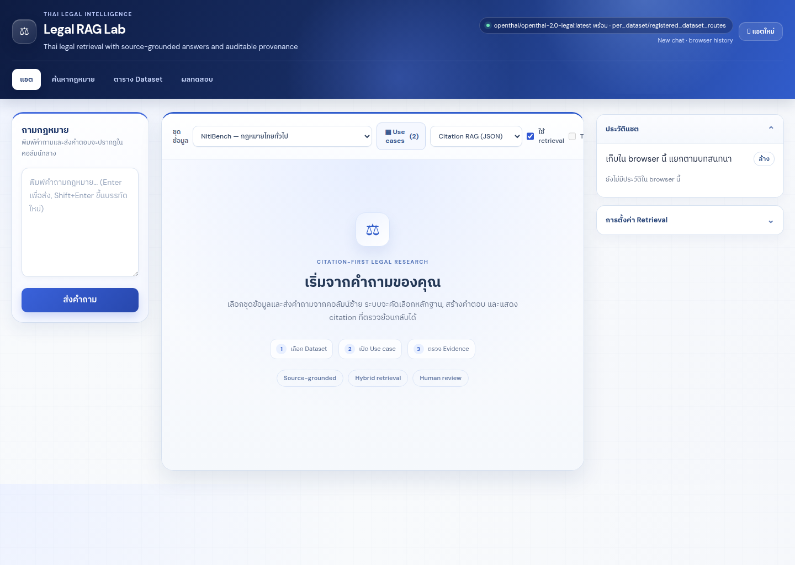
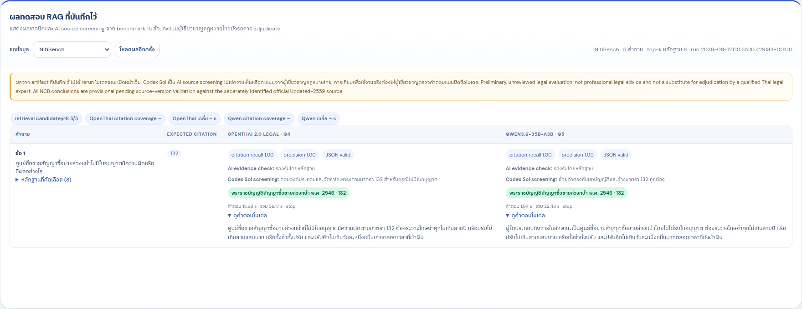
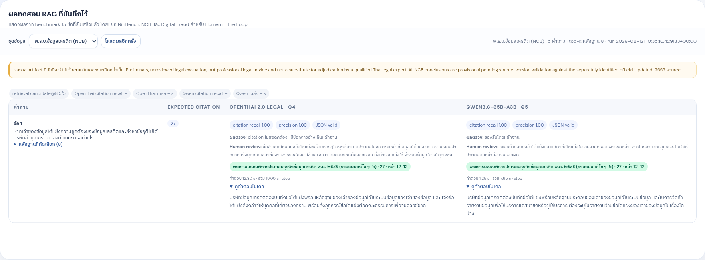
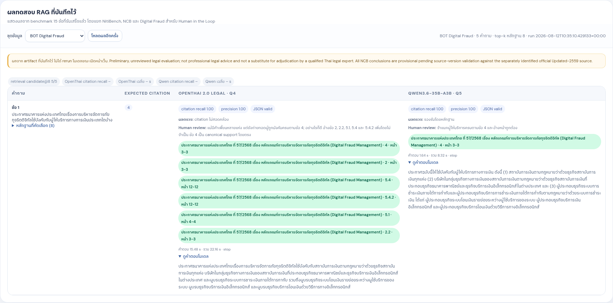

# OpenThai 2.0 Legal: ทดสอบ Thai Legal RAG ด้วย Ollama (Q4)

ผลทดสอบอิสระของ [OpenThai 2.0 Legal](https://huggingface.co/iapp/openthai2.0-legal-thaillm-nemotron-3-nano-30b-a3b)
ผ่าน Ollama Q4 เทียบกับ `Qwen3.6-35B-A3B` บน llama.cpp Q5

> ผลนี้เป็น **preliminary / unreviewed** ไม่ใช่คำแนะนำหรือคำวินิจฉัยทางกฎหมาย
> ก่อนใช้งานจริงต้องให้ผู้เชี่ยวชาญกฎหมายไทยตรวจตัวบทฉบับปัจจุบัน ข้อเท็จจริง และข้อยกเว้น
>
> **การตีความคะแนน:** expected-citation coverage, grounded citation และผล `Codex Sol` ด้านล่างเป็นตัวชี้วัดเชิงเทคนิค/AI source screening เท่านั้น ไม่ใช่คะแนนหรือความเห็นจากผู้เชี่ยวชาญกฎหมายไทย และไม่ใช้จัดอันดับว่าโมเดลใด “ดีกว่า” โดยรวม

## หน้าจอ Legal RAG Workbench

หน้าแชตถูกออกแบบเป็น workbench: คอลัมน์ซ้ายใช้กรอกและส่งคำถามเท่านั้น, ส่วนกลางเลือกชุดข้อมูล/Use case และแสดงคำตอบพร้อมหลักฐาน, ส่วนขวาเก็บประวัติและการตั้งค่า retrieval. มีแท็บแยกสำหรับค้นกฎหมาย, ตรวจตาราง corpus และตรวจผล benchmark.



## ชุดข้อมูล

| Dataset | แหล่งข้อมูล | Corpus | Provenance |
|---|---|---:|---|
| NitiBench | [VISAI-AI/NitiBench](https://huggingface.co/datasets/VISAI-AI/nitibench) | 3,934 chunks | ระดับมาตรา; source store ไม่มี page field |
| พ.ร.บ. การประกอบธุรกิจข้อมูลเครดิต พ.ศ. ๒๕๔๕ (NCB) | [BOT principal text Updated-2559](https://www.bot.or.th/content/dam/bot/documents/th/laws-and-rules/laws-and-regulations/legal-department/7-ncb-act/7-1-ncb-act/7.1.2-Law_TH_CreditBureau%20Updated-2559.pdf) | 225 units | 73 parent + 152 child; corpus ใช้งานจริงรวมฉบับแก้ไข 1–6 |
| Digital Fraud Management | [BOT 2568/0254](https://www.bot.or.th/content/dam/bot/fipcs/documents/FPG/2568/ThaiPDF/25680254.pdf) | 54 units | ระดับข้อ/ข้อย่อย พร้อมเลขหน้า |
| NCSA Cloud Security Framework | [NCSA cloud-security page](https://www.ncsa.or.th/page/cloudsecurity) | 326 units | 24 page parents + 326 atomic children; แยก cell/รายการ CSC-CSP และเลขหน้า PDF |

PDF NCB จาก BOT ที่ระบุ `Updated-2559` ใช้เป็นเอกสารหลักสำหรับตรวจเทียบ แต่ยังไม่รวม
ฉบับที่ 6 ปี 2565 จึงไม่ใช้แทน corpus ฉบับรวม 1–6 และไม่สร้าง amendment-only dataset แยก

> **หมายเหตุเรื่องลักษณะข้อมูล:** NCB, Digital Fraud และ NCSA Cloud เป็น corpus ที่ extract จากตัวบทต้นทาง
> โดยแยกตามมาตรา/ข้อ/ข้อย่อย, parent-child, การอ้างอิงข้าม และเลขหน้า PDF เพื่อใช้ retrieval
> ไม่ใช่ชุดคำถาม-คำตอบที่สร้างจาก scenario หรือเหตุการณ์จริง. คำถาม benchmark มีไว้ทดสอบ
> การค้นคืนและการตอบหลังจากสร้าง corpus แล้วเท่านั้น และไม่ถูกนำเข้า embedding หรือ retrieval corpus.
>
> สำหรับ NCSA Cloud ใช้ Doc#16122 ที่เคย ingest ไว้ (SHA-256 `96fb…9269e2`, PDF pp. 465–488):
> ตรวจ source-to-child ซ้ำแล้ว 326/326 child fragments ย้อนพบใน OCR หน้าที่อ้างถึง และ 99/99 table cells
> มี child citation. ลิงก์ Drive ที่รับมาไม่เผยชื่อ/แฮชไฟล์ จึงไม่ได้อ้างว่าเป็นไฟล์เดียวกันโดยตรง.

## Hybrid RAG ที่ใช้จริง

```text
คำถาม → Dense + Sparse retrieval → Hybrid fusion → BGE rerank → evidence 8 รายการ → JSON answer + citation
```

| ขั้นตอน / parameter | ค่าที่ใช้ | หมายเหตุ |
|---|---|---|
| Embedding | Qwen3-Embedding-4B, 2,560 มิติ, L2-normalized | passage มีเฉพาะตัวบทกฎหมาย |
| Candidate ก่อน rerank | 20 ต่อ corpus | ไม่ปะปนเอกสารข้าม dataset ก่อน retrieval |
| NitiBench fusion | Milvus dense cosine + Thai BM25 + native RRF | ตามด้วย BGE rerank |
| NCB fusion | parent/child hybrid + explicit-reference expansion | คง parent/child และมาตราที่อ้างถึง |
| Digital Fraud fusion | dense + Thai lexical RRF + explicit-reference closure | คงข้อ/ข้อย่อยและ page provenance |
| NCSA Cloud fusion | atomic evidence hierarchy + dense/Thai lexical RRF + BGE rerank | citation address แยกข้อ/บทบาท CSC-CSP/รายการ/หน้า |
| Reranker | BGE-M3 cross-encoder | rerank หลักฐานก่อนส่งโมเดล |
| Final evidence (`top_k`) | 8 | OpenThai และ Qwen ได้ evidence ชุดเดียวกัน |
| Generation | temperature 0.0, top_p 1.0, max_tokens 2,048, seed 42, thinking off | JSON answer + citations |
| Leakage control | expected citation / เฉลย ใช้หลัง inference | ไม่เข้า embedding, retriever, reranker หรือ prompt |

## ผลรายข้อ: ตัวชี้วัดเทคนิคและ AI source screening

ผลในคอลัมน์โมเดลเป็น `expected-citation coverage · Codex Sol AI screening` โดย `coverage` วัดว่า citation ที่โมเดลเลือกครอบคลุมรายการ expected หลัง inference หรือไม่—not whether every material proposition in the Thai answer is legally correct.

- `supported` = สาระสำคัญตามหลักฐานที่รับเข้า benchmark
- `partial` = แก่นคำตอบมีหลักฐาน แต่ actor, เงื่อนไข, scope หรือส่วนสำคัญขาด/คลาดเคลื่อน
- `over-citation` = คำตอบมีสาระรองรับ แต่มี citation ที่ไม่จำเป็นหรือไม่ตรงข้ออ้าง

ทุกแถวที่เป็น `partial` หรือ `over-citation` ควรให้ผู้ตรวจมนุษย์เปิดคำตอบเต็มและตัวบทต้นทางก่อนอนุมัติ. สำหรับทุกแถว รวมถึง `supported` ผู้เชี่ยวชาญกฎหมายไทยยังต้อง adjudicate เมื่อจะใช้ผลเพื่อเปรียบเทียบโมเดลหรือใช้ในงานจริง.

### 1) NitiBench

| คำถาม | Expected citation | OpenThai Q4<br>(AI screen) | Qwen Q5<br>(AI screen) | เหตุผล / จุดให้คนพิจารณา |
|---|---|---|---|---|
| ศูนย์ซื้อขายสัญญาซื้อขายล่วงหน้าไม่มีใบอนุญาตมีความผิดหรือมีผลอย่างไร | มาตรา 132 | 1.00 · supported | 1.00 · supported | โทษจำคุก ปรับ และปรับรายวันตรงตัวบท |
| การเช่าถือสวนมีหลักเกณฑ์ตามกฎหมายอย่างไร | มาตรา 565 | 1.00 · supported | 1.00 · supported | หลักเกณฑ์การเช่าถือสวนตรงตัวบท; Qwen กล่าวถึงนาซึ่งเกินคำถามแต่ไม่เปลี่ยนผล |
| ผู้เยาว์เป็นบุตรบุญธรรมของบุคคลหลายคนได้หรือไม่ | มาตรา 1598/26 | 1.00 · **partial** | 1.00 · supported | OpenThai สื่อข้อห้ามและข้อยกเว้นได้ แต่ใช้คำเรียกผู้รับบุตรบุญธรรมผิดและข้อความผิดรูป จึงต้องตรวจ actor |
| สัญญาบัญชีเดินสะพัดมีลักษณะและผลทางกฎหมายอย่างไร | มาตรา 856 | 1.00 · supported | 1.00 · supported | นิยามและผลการหักกลบลบหนี้ตรงตัวบท |
| ผู้ถือหุ้นของบริษัทจำกัดต้องรับผิดในหนี้ของบริษัทเพียงใด | มาตรา 1096 | 1.00 · supported | 1.00 · supported | รับผิดไม่เกินจำนวนเงินที่ยังส่งใช้ไม่ครบตรงตัวบท |

### 2) NCB — พ.ร.บ. การประกอบธุรกิจข้อมูลเครดิต

| คำถาม | Expected citation | OpenThai Q4<br>(AI screen) | Qwen Q5<br>(AI screen) | เหตุผล / จุดให้คนพิจารณา |
|---|---|---|---|---|
| หากเจ้าของข้อมูลโต้แย้งความถูกต้องของข้อมูลเครดิตและยังหาข้อยุติไม่ได้ บริษัทข้อมูลเครดิตต้องดำเนินการอย่างไร | มาตรา 27 | 1.00 · **partial** | 1.00 · supported | OpenThai ไม่กล่าวถึงหน้าที่ระบุข้อโต้แย้งในรายงาน และทำให้สิทธิอุทธรณ์ของเจ้าของข้อมูลดูเป็นหน้าที่ของบริษัท |
| บริษัทข้อมูลเครดิตเปิดเผยข้อมูลแก่สมาชิกหรือผู้ใช้บริการเพื่อวิเคราะห์สินเชื่อได้ภายใต้เงื่อนไขใด | มาตรา 20 | 1.00 · supported + **over-citation** | 1.00 · supported | สาระความยินยอมถูกต้อง แต่ OpenThai อ้างมาตราใกล้เคียงเกินจำเป็น; คนตรวจควรตัด citation ให้เหลือมาตรา 20 |
| เมื่อเจ้าของข้อมูลขอตรวจสอบหรือขอแก้ไขข้อมูลเครดิต บริษัทข้อมูลเครดิตหรือสมาชิกต้องแจ้งผลภายในระยะเวลาใด | มาตรา 26 | 1.00 · supported | 1.00 · supported | กำหนด 30 วันนับแต่ได้รับคำขอและหน้าที่แจ้งเหตุผลตรงตัวบท |
| เมื่อลูกค้าถูกปฏิเสธสินเชื่อเพราะข้อมูลเครดิต ผู้ให้บริการต้องแจ้งเหตุผลและให้สิทธิใดแก่ลูกค้า | มาตรา 28 | 1.00 · **partial** | 1.00 · supported | OpenThai เรียกสิทธิขอตรวจสอบภายใน 30 วันว่า “อุทธรณ์” และข้อความระบุ actor/ธุรกรรมผิดรูป |
| บริษัทข้อมูลเครดิตหรือผู้ประมวลผลข้อมูลเปิดเผยข้อมูลนอกวัตถุประสงค์ที่กฎหมายกำหนดมีโทษอย่างไร | มาตรา 51 | 1.00 · supported | 1.00 · supported | โทษสูงสุดจำคุก 3 ปี ปรับ 300,000 บาท หรือทั้งจำทั้งปรับตรงตัวบท |

### 3) BOT Digital Fraud Management

| คำถาม | Expected citation | OpenThai Q4<br>(AI screen) | Qwen Q5<br>(AI screen) | เหตุผล / จุดให้คนพิจารณา |
|---|---|---|---|---|
| ประกาศธนาคารแห่งประเทศไทยเรื่องการบริหารจัดการภัยทุจริตดิจิทัลใช้บังคับกับผู้ให้บริการทางการเงินประเภทใดบ้าง | ข้อ 4 | 1.00 · supported + **over-citation** | 1.00 · supported | OpenThai ระบุขอบเขตได้ครบ แต่ควรอ้างข้อ 4 โดยตรงแทนข้อใกล้เคียงหลายข้อ |
| ผู้ให้บริการทางการเงินต้องกำหนดนโยบายและการกำกับดูแลการบริหารจัดการภัยทุจริตดิจิทัลอย่างไร | ข้อ 5.3.1, 5.3.1(2) | 0.50 · **partial** | 1.00 · supported | OpenThai ขาดโครงสร้าง governance สำคัญ และเปลี่ยน “อย่างสม่ำเสมอ” เป็น “อย่างสมบูรณ์” ซึ่งมีความหมายต่างกัน |
| ผู้ให้บริการทางการเงินต้องมีการติดตามและตรวจจับความผิดปกติจากการทำธุรกรรมทางการเงินอย่างไร | ข้อ 5.3.2(2), 5.3.2(2.1) | 0.50 · supported | 1.00 · supported | สาระการติดตามเชิงรุกและความเสี่ยงทั้งสองกลุ่มถูกต้อง แต่ OpenThai ไม่อ้างครบทุกข้อย่อยที่คาดไว้ |
| เมื่อเกิดภัยทุจริตดิจิทัล ผู้ให้บริการทางการเงินต้องกำหนดระยะเวลากระบวนการและดูแลลูกค้าที่ได้รับผลกระทบอย่างไร | ข้อ 5.3.2(4.2), 5.3.2(4.3) | 0.50 · **partial** | 1.00 · supported | OpenThai ครอบคลุมเวลา/การติดต่อกลับตาม 4.2 แต่ขาดการดูแล เยียวยา และเงื่อนไขตาม 4.3 |
| ผู้ให้บริการทางการเงินต้องรายงานข้อมูลเกี่ยวกับการบริหารจัดการภัยทุจริตดิจิทัลต่อธนาคารแห่งประเทศไทยอย่างไร | ข้อ 5.3.5 | 1.00 · supported | 1.00 · supported | หน้าที่ส่งรายงานตามกำหนดและให้ข้อมูลเพิ่มเติมรายกรณีตรงตัวบท |

### 4) NCSA Cloud Security Framework

ตารางนี้วัด **source-grounded atomic citation** เท่านั้น: citation จะผ่านเมื่อ resolver ระบุได้เป็น
ข้อกำหนดเดียวในหลักฐานที่ส่งให้โมเดล โดยสำหรับ CSC/CSP ต้องระบุบทบาท/รายการให้แยกกัน;
หัวข้อกว้างที่มีหลายบทบาทจึงไม่ถูกนับเป็น citation ที่ตรวจสอบเครื่องได้ แม้ใจความคำตอบจะคล้ายตัวบท.
ยังไม่มี Codex Sol หรือผู้เชี่ยวชาญกฎหมายไทยตรวจ “ความถูกต้องเชิงสาระ” ของ 5 ข้อนี้.

| คำถาม | Expected atomic citation | OpenThai Q4<br>(coverage) | Qwen Q5<br>(coverage) | เหตุผล / จุดให้คนพิจารณา |
|---|---|---:|---:|---|
| หน่วยงานที่ใช้ public cloud ต้องคำนึงถึงหลักเกณฑ์ใดเกี่ยวกับข้อมูลหรือระบบสารสนเทศ | ข้อ 4 · เนื้อความ · p.466 | 1.00 | 1.00 | ทั้งคู่ระบุข้อ 4 ได้; ตรวจถ้อยคำเรื่องระดับผลกระทบกับตัวบทฉบับใช้งานจริง |
| ข้อมูลส่วนบุคคลบน public cloud ต้องจัดระดับผลกระทบด้านความลับขั้นต่ำเท่าใด | ข้อ 5 · เนื้อความ · p.466 | 1.00 | 1.00 | ทั้งคู่ตอบ “ระดับกลาง”; ให้คนตรวจ scope ของข้อ 5 เพิ่มเติม |
| CSC/CSP ต้องตกลงและบันทึกความรับผิดชอบด้านความปลอดภัยอย่างไร | 5.1.2.1 · CSC/CSP · ก · p.474 | 0.00 | 1.00 | OpenThai อ้างเพียงหัวข้อ 5.1.2.1 จึงไม่บอก actor; Qwen แยก CSC และ CSP ครบ |
| CSC/CSP ต้องขอหรือให้หลักฐานเอกสารด้านมาตรการควบคุมอย่างไร | 5.1.3.5 · CSC/CSP · ก · p.476 | 0.00 | 1.00 | OpenThai ขาด role/item; Qwen มี expected anchors ครบ แต่มี citation เพิ่ม จึงควรตรวจ scope ต่อ |
| CSC/CSP มีหน้าที่ใดเรื่องช่องโหว่ทางเทคนิค | 5.2.6.8 · CSC/CSP · ก · p.484 | 0.00 | 1.00 | OpenThai อ้างหัวข้อกว้างเดียว; Qwen แยกหน้าที่ของทั้งสองฝ่ายได้ |

#### วิธีอ่านผล Digital Fraud ของ OpenThai Q4

- **ข้อ 4 (scope):** สาระครบและ citation ข้อ 4 ถูกต้อง; ข้อสังเกตคืออ้างข้ออื่นเกินจำเป็น จึงไม่ใช่คำตอบผิด.
- **ข้อ 5.3.1 (governance):** AI screening ให้ `partial` เพราะคำตอบขาดโครงสร้างผู้กำกับดูแลบางส่วน และแทนคำว่า “อย่างสม่ำเสมอ” ด้วย “อย่างสมบูรณ์”; ผู้เชี่ยวชาญไทยต้องตัดสินว่าความต่างนี้กระทบสาระสำคัญเพียงใด.
- **ข้อ 5.3.2 (monitoring):** expected-citation coverage 0.50 เพราะอ้างไม่ครบข้อย่อยที่ตั้งไว้ แต่ AI screening เห็นว่าสาระ monitoring หลักยังรองรับได้ จึงเป็นตัวอย่างว่าค่า coverage ต่ำไม่ได้แปลว่าคำตอบผิด.
- **ข้อ 5.3.2 (4.2)–(4.3) (customer response):** AI screening ให้ `partial` เพราะคำตอบครอบคลุม timeline/การติดต่อกลับ แต่ไม่กล่าวถึงการดูแลที่เป็นธรรม ผู้รับผิดชอบ การปลดระงับ และการเยียวยาในอีก limb ของคำถาม.
- **ข้อ 5.3.5 (reporting):** สาระและ citation ตรงตาม requirement.

ดังนั้นค่า `70%` ของ OpenThai คือ **expected-citation coverage** สำหรับ fixed 5 questions—not a Thai legal-expert correctness score.

## ภาพตัวอย่างคำถามและคำตอบที่รันจริง

ภาพต่อไปนี้ capture จากแท็บ **ผลทดสอบ** ของเว็บ RAG (หลักฐาน top-k 8) โดยเปิดคำตอบเต็มของทั้งสองโมเดลสำหรับคำถามข้อแรกของแต่ละชุดข้อมูล ผลเป็น benchmark record ที่บันทึกไว้ ไม่ใช่การรันสด และยังต้องให้ผู้เชี่ยวชาญกฎหมายตรวจทานก่อนใช้ตัดสินใจ

### NitiBench — มาตรา 132



### NCB — มาตรา 27



### Digital Fraud Management — ข้อ 4



## สรุปตัวชี้วัดเชิงเทคนิคหลังผลรายข้อ

การค้นคืนพบ expected citation ใน top-8 ครบ 20/20 ข้อ และ JSON parse ได้ครบทั้งสองโมเดล. แยกตารางตามโมเดลเพื่อลดความสับสน; ทั้งสองตารางเป็น technical/AI screening ไม่ใช่ leaderboard คุณภาพกฎหมายหรือคะแนนผู้เชี่ยวชาญกฎหมายไทย.

### OpenThai 2.0 Legal · Ollama Q4

| Dataset | Expected-citation coverage | Codex Sol AI source screening | เวลา end-to-end เฉลี่ย |
|---|---:|---:|---:|
| NitiBench | 100% | 4 supported + 1 partial | 21.73s |
| NCB (รวมฉบับแก้ไข 1–6) | 100% | 3 supported + 2 partial | 18.85s |
| Digital Fraud | 70% | 3 supported + 2 partial | 21.18s |
| NCSA Cloud | 40% | ยังไม่ทำ Codex Sol screening; 3 ข้อหลุดเพราะไม่ระบุ CSC/CSP/item ใน citation | 20.76s |
| **รวม 20 ข้อ** | **77.5%** | **10 supported + 5 partial (เฉพาะ 15 ข้อเดิม); NCSA รอผู้ตรวจ** | **20.63s** |

### Qwen3.6-35B-A3B · llama.cpp Q5

| Dataset | Expected-citation coverage | Codex Sol AI source screening | เวลา end-to-end เฉลี่ย |
|---|---:|---:|---:|
| NitiBench | 100% | 5 supported | 10.69s |
| NCB (รวมฉบับแก้ไข 1–6) | 100% | 5 supported | 7.70s |
| Digital Fraud | 100% | 5 supported | 8.83s |
| NCSA Cloud | 100% | ยังไม่ทำ Codex Sol screening; atomic citation grounded ครบ 5/5 | 9.66s |
| **รวม 20 ข้อ** | **100%** | **15 supported (15 ข้อเดิม); NCSA รอผู้ตรวจเชิงสาระ** | **9.22s** |

### การให้คะแนนหลักที่ต้องใช้ผู้เชี่ยวชาญกฎหมายไทย

ยังไม่มีผู้เชี่ยวชาญกฎหมายไทย adjudicate คำตอบทั้ง 40 ชิ้น ดังนั้น **ยังไม่มีคะแนนหลักที่ใช้เปรียบเทียบ OpenThai กับ Qwen**. ก่อนประกาศผลเปรียบเทียบ ให้ผู้เชี่ยวชาญอย่างน้อย 2 คนตรวจแบบปิดชื่อโมเดล โดยใช้ตัวบทภาษาไทยที่มีผลใช้บังคับเป็นหลัก และแยกคะแนนดังนี้:

| มิติที่ผู้เชี่ยวชาญตรวจ | น้ำหนัก | สิ่งที่ต้องเทียบจากคำตอบไทย |
|---|---:|---|
| สาระข้อกฎหมายและผลทางกฎหมาย | 40% | หลัก/ข้อห้าม/สิทธิ/โทษ ถูกต้องตามตัวบทหรือไม่ |
| ผู้มีหน้าที่ เงื่อนไข และข้อยกเว้น | 25% | ไม่สลับ actor, modality, ระยะเวลา หรือเงื่อนไขสำคัญ |
| ความครบถ้วนตามขอบเขตคำถาม | 20% | ตอบครบทุกส่วนที่โจทย์ถาม ไม่ขาด limb สำคัญ |
| Citation และ page provenance | 10% | อ้างตรงข้อกำหนด ไม่อ้างข้อใกล้เคียงเกินจำเป็น |
| ภาษาไทยเชิงกฎหมายและความชัดเจน | 5% | คำเพี้ยนไม่เปลี่ยนความหมาย และสื่อสารให้ผู้ใช้ไทยเข้าใจ |

หากผู้ตรวจสองคนเห็นต่างอย่างมีนัยสำคัญ ให้ผู้เชี่ยวชาญคนที่สาม adjudicate พร้อมบันทึกเหตุผลระดับ claim. `Codex Sol` ใช้ได้เพียงช่วยคัดแถวที่เสี่ยงต่อการตกหล่น/สลับ actor/อ้างเกิน—not replace this Thai legal-expert review.

| ข้อสรุป | ความหมาย |
|---|---|
| Retrieval | ทั้งสองโมเดลได้รับ evidence เดียวกัน และ retrieval พบ expected citation ครบ 20/20 ใน top-8 |
| AI source screening (ไม่ใช่ expert score) | Qwen ได้ `supported` มากกว่าตาม Codex Sol ใน fixed 15 cases เดิม; NCSA เพิ่มเฉพาะการตรวจ atomic citation จึงยังไม่มี expert/AI semantic score |
| Thai legal-expert score | ยังไม่มี; ต้องตรวจแบบปิดชื่อโมเดลตาม rubric ด้านบนก่อนสรุปผลเปรียบเทียบ |
| Human approval gate | ห้าม approve เฉพาะจาก citation; เปิดตรวจคำตอบเต็มและตัวบททุกแถวที่เป็น partial หรือ over-citation |
| เวลา | Qwen เร็วกว่ารอบนี้ แต่เป็น sequential run และคนละ runtime/quantization ไม่ใช่ production benchmark |

## ผลเสริม: PostgreSQL เทียบ Milvus

Baseline NitiBench 5 ข้อ แยกจากการเทียบโมเดลข้างต้น

| Metric | PostgreSQL hybrid RRF | Milvus native BM25 + RRF |
|---|---:|---:|
| Candidate recall@20 | 100% | 100% |
| Citation recall / precision | 100% / 100% | 100% / 100% |
| Exact citation set | 5/5 | 5/5 |
| Retrieval เฉลี่ย | 1.630s | 0.057s |
| End-to-end เฉลี่ย | 9.156s | 7.280s |

PostgreSQL ใช้ dense pgvector + FTS/pg_trgm + application RRF (`k=60`); Milvus ใช้ dense cosine + Thai 3/4-character n-gram BM25 + native RRF (`k=80`). เวลามาจากคนละ run/cache จึงใช้เปรียบเทียบเชิงสำรวจเท่านั้น

## ข้อจำกัด

- เป็น fixed benchmark 20 ข้อ ไม่ใช่ตัวอย่างสุ่มหรือ coverage ของกฎหมายไทยทั้งหมด
- Citation ตรง ไม่ได้หมายความว่าคำตอบเป็นคำวินิจฉัยทางกฎหมายที่ครบถ้วน
- Codex Sol เป็น independent model review ไม่ใช่ Thai legal-expert adjudication
- Repository นี้ไม่มี model weights, credential, token หรือ chat session
