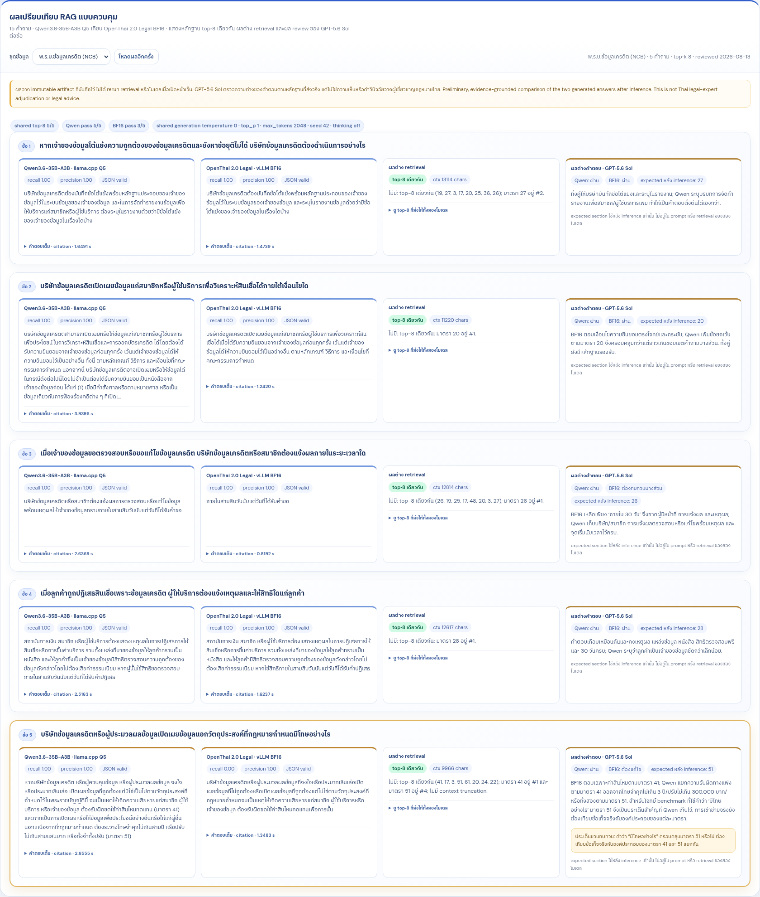
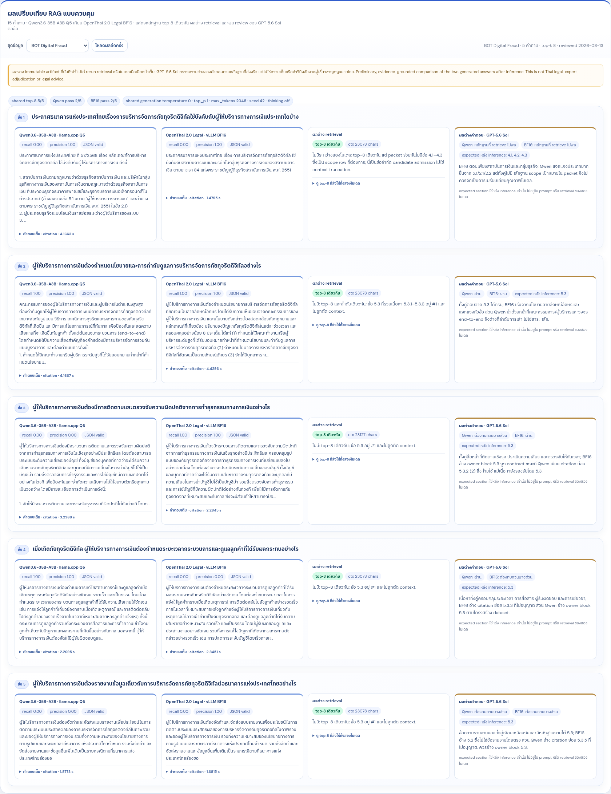

# OpenThai 2.0 Legal × Qwen3.6: Thai RAG test

นี่คือบันทึกการทดลองให้ **Qwen3.6-35B-A3B Q5** และ **OpenThai 2.0 Legal BF16**
ตอบคำถามจากหลักฐานกฎหมายภาษาไทยชุดเดียวกัน รวม 15 คำถามจาก NitiBench, NCB และ
Digital Fraud อย่างละ 5 ข้อ

| Model | Runtime |
|---|---|
| Qwen3.6-35B-A3B | llama.cpp · Q5 · port 8081 |
| [OpenThai 2.0 Legal](https://huggingface.co/iapp/openthai2.0-legal-thaillm-nemotron-3-nano-30b-a3b) | vLLM 0.25.1 · BF16 |

## ชุดข้อมูลที่นำมาลอง

| Dataset | ที่มาและการจัดข้อมูล | ชุดข้อมูล |
|---|---|---|
| NitiBench | ชุดคำถาม/ตัวบทจาก [VISAI-AI/NitiBench](https://huggingface.co/datasets/VISAI-AI/nitibench) | frozen evidence packet |
| NCB | Codex จัดโครงสร้างจากเอกสาร BOT: 9 หมวด, 66 มาตรา, ตัด footer; มาตรา 20/1 และ 31/1 รวมในมาตราหลัก | [Hugging Face](https://huggingface.co/datasets/thodsapon/thai-ncb-digital-fraud-structural-rag) |
| Digital Fraud | Codex จัดโครงสร้างจากประกาศ BOT 57/2568: 6 parent และ 11 child ระดับ `X.X` | [Hugging Face](https://huggingface.co/datasets/thodsapon/thai-ncb-digital-fraud-structural-rag) |

ชุด NCB และ Digital Fraud ที่จัดโครงสร้างแล้วอยู่บน Hugging Face โดยเก็บ source URL, หน้า PDF
และความสัมพันธ์ parent/child ไว้ให้ตามรอยได้ ส่วน PDF, embedding และเฉลยของ benchmark ไม่ได้อยู่ใน repo นี้.

## สิ่งที่ทั้งสองโมเดลเห็น

ในแต่ละคำถาม ทั้งสองโมเดลได้รับ system prompt และหลักฐาน 8 แถวในลำดับเดียวกัน แนวคำสั่งมีหน้าตาแบบนี้:

```text
ตอบภาษาไทยโดยใช้เฉพาะหลักฐานที่ส่งให้
เลือกข้อกฎหมายที่ตอบเรื่องหน้าที่ เงื่อนไข หรือผลที่คำถามกำลังถาม
เก็บว่าใครต้องทำอะไร ภายใต้เงื่อนไขหรือกำหนดเวลาใด หากมีระบุไว้
อ้างอิงเฉพาะชื่อกฎหมายและเลขข้อจากหลักฐานที่ให้
ตอบเป็น JSON: answer + citations
```

| Parameter | Value |
|---|---:|
| หลักฐานต่อคำถาม | top‑8 rows, ordered packet เดียวกัน |
| temperature | 0.0 |
| top_p | 1.0 |
| max_tokens | 2,048 |
| seed | 42 |
| thinking | off |
| expected citation | คำนวณคะแนนหลังสร้างคำตอบแล้ว |

สำหรับ NitiBench ใช้ frozen label-free hybrid packet ที่เตรียมไว้แล้ว ส่วน NCB และ Digital Fraud
ใช้ Thai lexical + character 3/4-gram เพื่อเตรียมหลักฐานของรอบนี้ ก่อนส่ง context ชุดเดียวกันให้ Qwen และ OpenThai.

## ชุดข้อมูลถูกจัดอย่างไร

### NCB

NCB ใช้ `มาตรา` เป็นหน่วยค้นและอ้างอิง แต่ละมาตราบอก parent ว่าอยู่หมวดใด พร้อมหน้า PDF ต้นทาง.
มาตรา `20/1` รวมอยู่กับ `20` และ `31/1` รวมอยู่กับ `31` จึงได้ 66 child ตามโครงสร้างของการทดสอบ
โดยเนื้อหามาตราแทรกยังอยู่กับ child เจ้าของ.

### Digital Fraud

Digital Fraud ไม่ได้เขียนเป็นมาตราแบบ NCB จึงใช้ 6 ข้อหลักเป็น parent และใช้ข้อระดับ `X.X`
ทั้ง 11 ข้อเป็นหน่วยค้นและอ้างอิง. หัวข้อ `X.X.X` และระดับลึกกว่าจะอยู่ในเนื้อหาของ `X.X` เจ้าของ
เช่น `5.3` มี `5.3.1`–`5.3.6` อยู่ด้วย จึงไม่มี row หรือ citation แยกสำหรับ `X.X.X`.

## ผลที่ได้ในรอบนี้

ตารางนี้สรุปผลจากคำถามคงที่ทั้ง 15 ข้อ โดย `expected-citation recall` เป็นค่าที่คำนวณหลังโมเดลตอบเสร็จแล้ว.

| Dataset / 5 ข้อ | Model | JSON valid | grounded citations | expected-citation recall | mean answer time |
|---|---|---:|---:|---:|---:|
| NitiBench | Qwen Q5 | 5/5 | 5/5 | 1.00 | 1.3370 s |
| NitiBench | OpenThai BF16 | 5/5 | 5/5 | 1.00 | 0.8820 s |
| NCB | Qwen Q5 | 5/5 | 5/5 | 1.00 | 2.7195 s |
| NCB | OpenThai BF16 | 5/5 | 5/5 | 0.80 | 1.3014 s |
| Digital Fraud | Qwen Q5 | 5/5 | 3/5 | 0.40 | 3.1433 s |
| Digital Fraud | OpenThai BF16 | 5/5 | 4/5 | 0.40 | 2.5440 s |

## ดูคำตอบทีละชุด

ภาพแต่ละชุดมี 5 คำถาม และวางคำตอบ Qwen, คำตอบ OpenThai BF16, หลักฐาน top‑8 และข้อความเปรียบเทียบไว้ข้างกัน.

### NitiBench


### NCB



### Digital Fraud



## หนึ่งคำถามที่ชวนคิด: มาตรา 51

**คำถาม:** บริษัทข้อมูลเครดิตหรือผู้ประมวลผลข้อมูลเปิดเผยข้อมูลนอกวัตถุประสงค์ที่กฎหมายกำหนดมีโทษอย่างไร

หลักฐาน top‑8 ที่ส่งให้ทั้งสองโมเดลเหมือนกันคือ `41, 17, 3, 51, 61, 20, 24, 22`.
มาตรา 41 มาเป็นอันดับ 1 ส่วนมาตรา 51 มาเป็นอันดับ 4.

> มาตรา 51 บริษัทข้อมูลเครดิตหรือผู้ประมวลผลข้อมูลที่เปิดเผยหรือให้ข้อมูลแก่สมาชิกหรือผู้ใช้บริการเพื่อประโยชน์อย่างอื่น หรือแก่ผู้อื่นนอกเหนือจากที่กำหนดในมาตรา 20 ต้องระวางโทษจำคุกไม่เกินสามปี หรือปรับไม่เกินสามแสนบาท หรือทั้งจำทั้งปรับ

| Qwen Q5 | OpenThai BF16 |
|---|---|
| อ้างมาตรา 41 และ 51; แยกค่าสินไหมจากโทษจำคุก/ปรับ | อ้างมาตรา 41; ตอบเรื่องค่าสินไหมทดแทน |

จุดที่น่าสังเกตคือคำว่า **“มีโทษอย่างไร”** ทำให้เกิดคำถามต่อว่า มาตรา 41 และมาตรา 51 ควรถูกเล่าแยกกันหรือไม่
และการที่มาตรา 41 ถูกจัดมาก่อน ส่งผลต่อรูปแบบคำตอบอย่างไร
