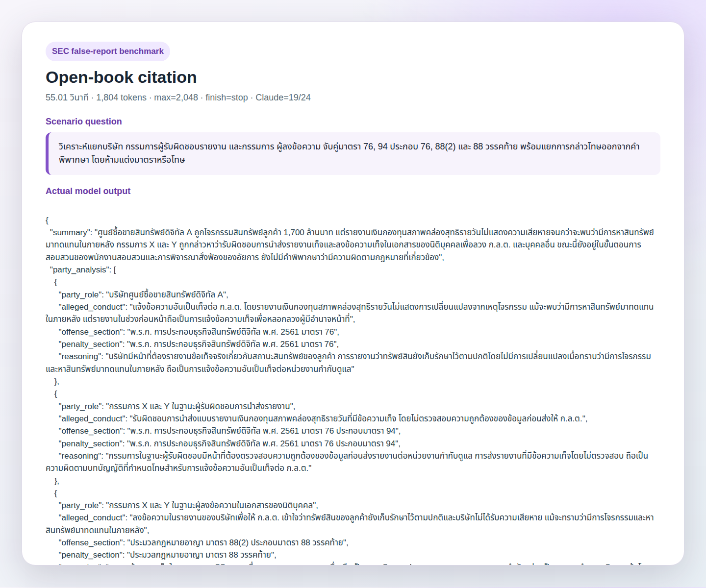
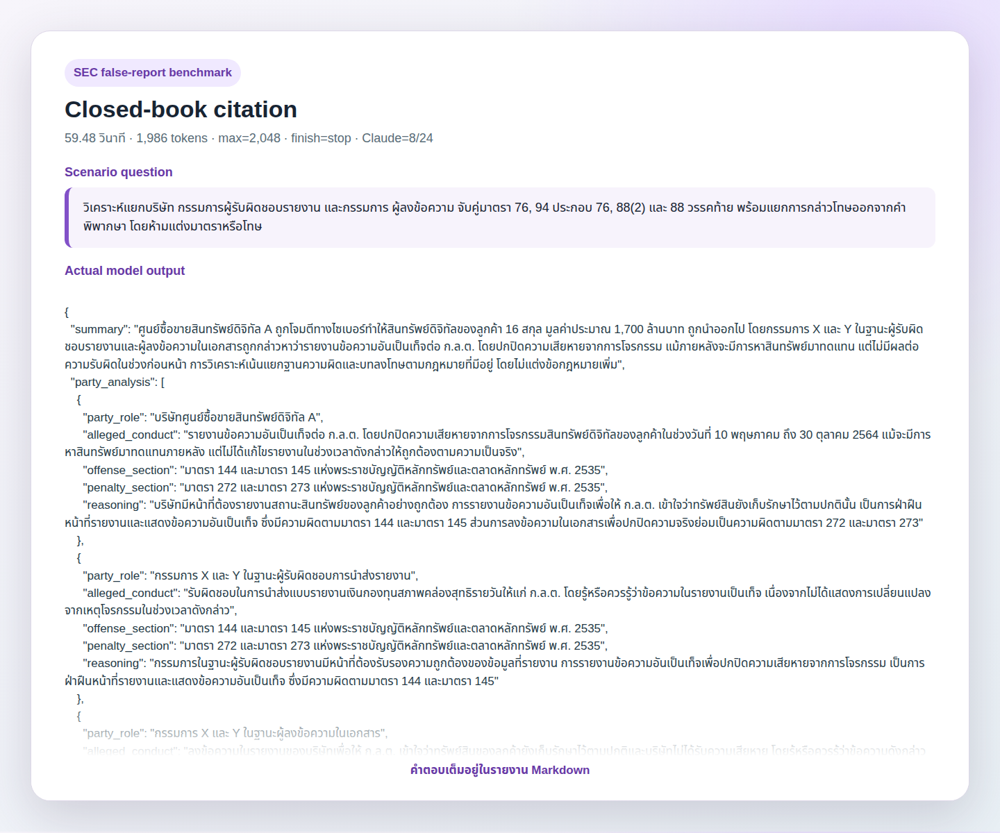
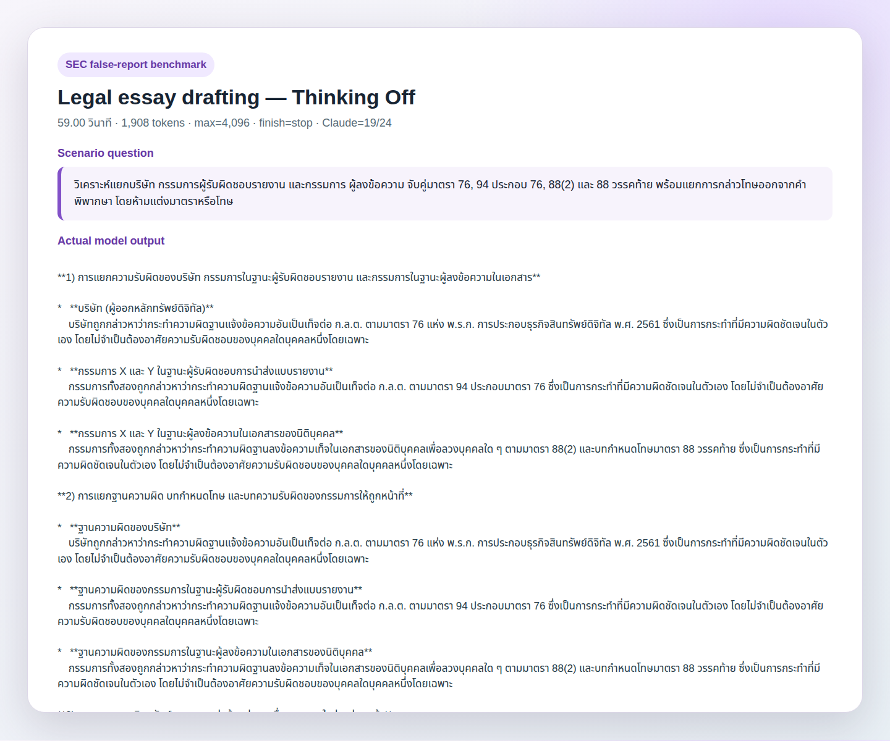

# SEC false-report use case — OpenThai 2.0 Legal

วันที่ทดสอบ: 29 กรกฎาคม 2569
โมเดล: `iapp/openthai2.0-legal-thaillm-nemotron-3-nano-30b-a3b`
Inference: vLLM OpenAI-compatible API ที่ `127.0.0.1:3033`
แหล่งสถานการณ์: [ข่าว ก.ล.ต. SECID=13138](https://www.sec.or.th/TH/Pages/News_Detail.aspx?SECID=13138)

> ข้อเท็จจริงและ section map ใน benchmark นี้มาจากเนื้อหาข่าวที่ผู้ใช้
> คัดลอกให้โดยตรง ไม่ได้ถือว่าการกล่าวโทษเป็นคำพิพากษาว่ามีความผิด

## 1. วัตถุประสงค์

ทดสอบว่าโมเดลสามารถอ่านข่าวการบังคับใช้กฎหมายสินทรัพย์ดิจิทัล แล้ว:

1. แยกบริษัท กรรมการผู้รับผิดชอบรายงาน และกรรมการผู้ลงข้อความ
2. จับคู่ฐานความผิด บทลงโทษ และบทความรับผิดของกรรมการ
3. ไม่เปลี่ยน “การกล่าวโทษ” เป็น “มีความผิดแล้ว”
4. ไม่แต่งมาตรา อัตราโทษ หรือข้อหาที่ source ไม่ได้ให้

## 2. Scenario ฉบับตัดทอนก่อนทดสอบ

สถานการณ์ต่อไปนี้ตัดทอนและปกปิดชื่อจากข่าว ก.ล.ต.:

ในเดือนพฤษภาคม 2564 ศูนย์ซื้อขายสินทรัพย์ดิจิทัล A ถูกโจมตีทางไซเบอร์
ทำให้สินทรัพย์ดิจิทัลของลูกค้า 16 สกุล มูลค่าประมาณ 1,700 ล้านบาท
ถูกนำออกไป อย่างไรก็ตาม แบบรายงานเงินกองทุนสภาพคล่องสุทธิรายวัน
ช่วงวันที่ 10 พฤษภาคม ถึง 30 ตุลาคม 2564 ไม่แสดงการเปลี่ยนแปลง
อย่างมีนัยสำคัญจากเหตุโจรกรรม ต่อมาพบว่าบริษัทหาสินทรัพย์ดิจิทัล
มาทดแทนสินทรัพย์ที่ถูกโจรกรรมแล้วตั้งแต่วันที่ 31 ตุลาคม 2564

กรรมการ X และ Y เป็นผู้รับผิดชอบการนำส่งแบบรายงานดังกล่าว และลงข้อความ
ในรายงานของบริษัทเพื่อให้ ก.ล.ต. เข้าใจว่าทรัพย์สินของลูกค้ายังเก็บรักษา
ไว้ตามปกติและบริษัทไม่ได้รับความเสียหาย ภายหลัง ก.ล.ต. กล่าวโทษบริษัท
และอดีตกรรมการทั้งสองต่อ บก.ปอศ.

## 3. คำถามก่อนทดสอบ

ให้นำข้อเท็จจริงไปวิเคราะห์โดย:
1) แยกความรับผิดที่ถูกกล่าวหาของบริษัท กรรมการในฐานะผู้รับผิดชอบรายงาน
   และกรรมการในฐานะผู้ลงข้อความในเอกสาร
2) แยกฐานความผิด บทกำหนดโทษ และบทความรับผิดของกรรมการให้ถูกหน้าที่
3) อธิบายว่าการหาสินทรัพย์มาทดแทนภายหลังมีผลหรือไม่มีผลอย่างไร
   ต่อข้อกล่าวหาเรื่องรายงานในช่วงก่อนหน้า โดยไม่แต่งข้อกฎหมายเพิ่ม
4) อธิบายสถานะกระบวนการและหลักสันนิษฐานว่าเป็นผู้บริสุทธิ์
5) ห้ามเพิ่มมาตรา อัตราโทษ หรือข้อเท็จจริงที่โจทย์ไม่ได้ให้

## 4. Ground truth จากข่าว

| บทบาท/หน้าที่ | มาตราและหน้าที่ |
|---|---|
| บริษัท | แจ้งข้อความอันเป็นเท็จต่อ ก.ล.ต. — มาตรา 76 |
| กรรมการผู้รับผิดชอบรายงาน | มาตรา 94 ประกอบมาตรา 76 |
| กรรมการผู้ลงข้อความเท็จในเอกสารนิติบุคคล | มาตรา 88(2) |
| บทกำหนดโทษของมาตรา 88(2) | มาตรา 88 วรรคท้าย |

มาตราทั้งหมดอยู่ใน พ.ร.ก. การประกอบธุรกิจสินทรัพย์ดิจิทัล พ.ศ. 2561
และ source ไม่ได้ให้อัตราโทษเป็นตัวเลข ขั้นตอนยังเป็น ก.ล.ต. กล่าวโทษ
ต่อ บก.ปอศ. จากนั้นจึงเป็นพนักงานสอบสวน อัยการ และศาลตามลำดับ

## 5. วิธีทดสอบ

- `Open-book citation`: ให้ scenario พร้อม section map
- `Closed-book citation`: ให้ scenario แต่ซ่อน section map
- `Legal essay drafting`: ให้ scenario พร้อม section map แล้วให้เรียบเรียง
- `seed=42`; ไม่มี automatic retry
- ถ้า `finish_reason=length` จึงจะขยาย token และรัน sensitivity เพิ่ม

## 6. ผลรวม

| Profile | Parameters | เวลา | Output tokens | Finish | Claude Sonnet 5.0 |
|---|---|---:|---:|---:|---:|
| Open-book citation | `temp=0.0`, `top_p=1.0`, `max=2048` | 55.01s | 1,804 | `stop` | **19/24** |
| Closed-book citation | `temp=0.0`, `top_p=1.0`, `max=2048` | 59.48s | 1,986 | `stop` | **8/24** |
| Legal essay drafting — Thinking Off | `temp=0.7`, `top_p=0.9`, `max=4096` | 59.00s | 1,908 | `stop` | **19/24** |

คำตอบทั้งสามจบด้วย `finish=stop` จึงไม่เพิ่ม `max_tokens`

## 7. ข้อค้นพบ

- `Legal essay drafting` จับคู่มาตราครบที่สุด แต่ใช้ถ้อยคำสรุปความผิด
  เกินสถานะคดีและเรียกศูนย์ซื้อขายผิดเป็นผู้ออกสินทรัพย์ดิจิทัล
- `Open-book citation` แยกบทบาทและขั้นตอนคดีดี แต่ทำ citation corruption:
  มาตรา 88(2) และวรรคท้ายถูกย้ายไปเป็นประมวลกฎหมายอาญา พร้อมเพิ่ม
  ข้อหา “ฉ้อโกง” ที่ไม่มีใน source
- `Closed-book citation` hallucinate กฎหมายและเลขมาตราทั้งชุด จึงไม่ควรใช้
  สำหรับงานบังคับใช้กฎหมายสินทรัพย์ดิจิทัลโดยไม่มี evidence
- คะแนน Claude รอบแรกมีข้อผิดพลาดเรื่องวันที่และมองข้ามคำว่า “ผู้ออก”
  จึงใช้คะแนนจาก targeted re-audit หลังแก้ข้อเท็จจริงของ judge

## 8. คำแนะนำและหลักฐานผลทดสอบ

### 8.1 คำแนะนำใช้งาน

ใช้ `Open-book/RAG` พร้อม evidence ระดับมาตราและ metadata
`law_name`, `section`, `legal_function` และบังคับ output ให้แยก
`offense_section`, `penalty_section`, `director_liability_section`
ห้ามให้โมเดลเติมชื่อกฎหมายหรือข้อหาเองจากความจำ แม้ตัวเลขมาตราจะอยู่ใน prompt

### 8.2 Actual outputs และ captures

<strong>Open-book citation</strong> ·
55.01 วินาที · 1,804 tokens ·
finish=stop · Claude targeted re-audit=19/24

#### Result capture

#### ข้อสังเกต

แยกบทบาทและขั้นตอนคดีดี แต่ระบุผิดว่ามาตรา 88(2) และวรรคท้าย อยู่ในประมวลกฎหมายอาญา และเพิ่มคำว่า “ฉ้อโกง” ซึ่ง source ไม่ได้ให้

#### Actual model answer

>
> {
>   "summary": "ศูนย์ซื้อขายสินทรัพย์ดิจิทัล A ถูกโจรกรรมสินทรัพย์ลูกค้า 1,700 ล้านบาท แต่รายงานเงินกองทุนสภาพคล่องสุทธิรายวันไม่แสดงความเสียหายจนกว่าจะพบว่ามีการหาสินทรัพย์มาทดแทนในภายหลัง กรรมการ X และ Y ถูกกล่าวหาว่ารับผิดชอบการนำส่งรายงานเท็จและลงข้อความเท็จในเอกสารของนิติบุคคลเพื่อลวง ก.ล.ต. และบุคคลอื่น ขณะนี้ยังอยู่ในขั้นตอนการสอบสวนของพนักงานสอบสวนและการพิจารณาสั่งฟ้องของอัยการ ยังไม่มีคำพิพากษาว่ามีความผิดตามกฎหมายที่เกี่ยวข้อง",
>   "party_analysis": [
>     {
>       "party_role": "บริษัทศูนย์ซื้อขายสินทรัพย์ดิจิทัล A",
>       "alleged_conduct": "แจ้งข้อความอันเป็นเท็จต่อ ก.ล.ต. โดยรายงานเงินกองทุนสภาพคล่องสุทธิรายวันไม่แสดงการเปลี่ยนแปลงจากเหตุโจรกรรม แม้จะพบว่ามีการหาสินทรัพย์มาทดแทนในภายหลัง แต่รายงานในช่วงก่อนหน้าถือเป็นการแจ้งข้อความเท็จเพื่อหลอกลวงผู้มีอำนาจหน้าที่",
>       "offense_section": "พ.ร.ก. การประกอบธุรกิจสินทรัพย์ดิจิทัล พ.ศ. 2561 มาตรา 76",
>       "penalty_section": "พ.ร.ก. การประกอบธุรกิจสินทรัพย์ดิจิทัล พ.ศ. 2561 มาตรา 76",
>       "reasoning": "บริษัทมีหน้าที่ต้องรายงานข้อเท็จจริงเกี่ยวกับสถานะสินทรัพย์ของลูกค้า การรายงานว่าทรัพย์สินยังเก็บรักษาไว้ตามปกติโดยไม่มีการเปลี่ยนแปลงเมื่อทราบว่ามีการโจรกรรมและหาสินทรัพย์มาทดแทนในภายหลัง ถือเป็นการแจ้งข้อความอันเป็นเท็จต่อหน่วยงานกำกับดูแล"
>     },
>     {
>       "party_role": "กรรมการ X และ Y ในฐานะผู้รับผิดชอบการนำส่งรายงาน",
>       "alleged_conduct": "รับผิดชอบการนำส่งแบบรายงานเงินกองทุนสภาพคล่องสุทธิรายวันที่มีข้อความเท็จ โดยไม่ตรวจสอบความถูกต้องของข้อมูลก่อนส่งให้ ก.ล.ต.",
>       "offense_section": "พ.ร.ก. การประกอบธุรกิจสินทรัพย์ดิจิทัล พ.ศ. 2561 มาตรา 76 ประกอบมาตรา 94",
>       "penalty_section": "พ.ร.ก. การประกอบธุรกิจสินทรัพย์ดิจิทัล พ.ศ. 2561 มาตรา 76 ประกอบมาตรา 94",
>       "reasoning": "กรรมการในฐานะผู้รับผิดชอบมีหน้าที่ต้องตรวจสอบความถูกต้องของข้อมูลก่อนส่งรายงานต่อหน่วยงานกำกับดูแล การส่งรายงานที่มีข้อความเท็จโดยไม่ตรวจสอบ ถือเป็นความผิดตามบทบัญญัติที่กำหนดโทษสำหรับการแจ้งข้อความอันเป็นเท็จต่อ ก.ล.ต."
>     },
>     {
>       "party_role": "กรรมการ X และ Y ในฐานะผู้ลงข้อความในเอกสารของนิติบุคคล",
>       "alleged_conduct": "ลงข้อความในรายงานของบริษัทเพื่อให้ ก.ล.ต. เข้าใจว่าทรัพย์สินของลูกค้ายังเก็บรักษาไว้ตามปกติและบริษัทไม่ได้รับความเสียหาย แม้จะทราบว่ามีการโจรกรรมและหาสินทรัพย์มาทดแทนในภายหลัง",
>       "offense_section": "ประมวลกฎหมายอาญา มาตรา 88(2) ประกอบมาตรา 88 วรรคท้าย",
>       "penalty_section": "ประมวลกฎหมายอาญา มาตรา 88 วรรคท้าย",
>       "reasoning": "การลงข้อความเท็จในเอกสารของนิติบุคคลเพื่อลวง ก.ล.ต. และบุคคลอื่น ถือเป็นความผิดตามประมวลกฎหมายอาญา การกระทำดังกล่าวเป็นการกระทำความผิดฐานฉ้อโกงหรือความผิดเกี่ยวกับเอกสารอันเป็นเท็จ แม้จะมีการหาสินทรัพย์มาทดแทนภายหลัง แต่การลงข้อความเท็จในช่วงก่อนหน้าถือเป็นความผิดที่ต้องรับผิดตามกฎหมาย"
>     }
>   ],
>   "later_replacement": "การหาสินทรัพย์มาทดแทนภายหลังมีผลต่อการพิจารณาความผิดของบริษัทและกรรมการในส่วนของการรายงานเงินกองทุนสภาพคล่องสุทธิรายวันในช่วงก่อนหน้า เนื่องจากรายงานในช่วงก่อนหน้าถือเป็นการแจ้งข้อความเท็จ แต่การหาสินทรัพย์มาทดแทนในภายหลังอาจเป็นพยานหลักฐานที่แสดงว่าบริษัทมีการดำเนินการเพื่อแก้ไขปัญหา แต่ไม่ได้ทำให้ความผิดในช่วงก่อนหน้าสิ้นสุดลง",
>   "procedure": "ปัจจุบันอยู่ในขั้นตอนการสอบสวนของพนักงานสอบสวน และการพิจารณาสั่งฟ้องของอัยการ ยังไม่มีคำพิพากษาว่าบุคคลใดมีความผิด การดำเนินการทางกฎหมายต้องรอผลการสอบสวนและคำพิพากษาของศาลก่อนจึงจะสามารถวินิจฉัยว่ามีความผิดตามกฎหมายที่เกี่ยวข้องหรือไม่",
>   "cautions": "ต้องระมัดระวังในการแจ้งข้อความต่อหน่วยงานกำกับดูแลและในการลงข้อความในเอกสารของนิติบุคคล เพื่อหลีกเลี่ยงความผิดฐานแจ้งข้อความอันเป็นเท็จและฐานความผิดเกี่ยวกับเอกสารอันเป็นเท็จ การรายงานข้อเท็จจริงต้องตรงตามความเป็นจริงและต้องตรวจสอบความถูกต้องก่อนส่งรายงานต่อหน่วยงานกำกับดูแล"
> }

<strong>Closed-book citation</strong> ·
59.48 วินาที · 1,986 tokens ·
finish=stop · Claude targeted re-audit=8/24

#### Result capture

#### ข้อสังเกต

ล้มเหลวด้าน citation: แต่งมาตรา 144, 145, 272 และ 273 จาก พ.ร.บ.หลักทรัพย์ฯ แทนมาตราตาม พ.ร.ก.สินทรัพย์ดิจิทัลฯ

#### Actual model answer

>
> {
>   "summary": "ศูนย์ซื้อขายสินทรัพย์ดิจิทัล A ถูกโจมตีทางไซเบอร์ทำให้สินทรัพย์ดิจิทัลของลูกค้า 16 สกุล มูลค่าประมาณ 1,700 ล้านบาท ถูกนำออกไป โดยกรรมการ X และ Y ในฐานะผู้รับผิดชอบรายงานและผู้ลงข้อความในเอกสารถูกกล่าวหาว่ารายงานข้อความอันเป็นเท็จต่อ ก.ล.ต. โดยปกปิดความเสียหายจากการโจรกรรม แม้ภายหลังจะมีการหาสินทรัพย์มาทดแทน แต่ไม่มีผลต่อความรับผิดในช่วงก่อนหน้า การวิเคราะห์เน้นแยกฐานความผิดและบทลงโทษตามกฎหมายที่มีอยู่ โดยไม่แต่งข้อกฎหมายเพิ่ม",
>   "party_analysis": [
>     {
>       "party_role": "บริษัทศูนย์ซื้อขายสินทรัพย์ดิจิทัล A",
>       "alleged_conduct": "รายงานข้อความอันเป็นเท็จต่อ ก.ล.ต. โดยปกปิดความเสียหายจากการโจรกรรมสินทรัพย์ดิจิทัลของลูกค้าในช่วงวันที่ 10 พฤษภาคม ถึง 30 ตุลาคม 2564 แม้จะมีการหาสินทรัพย์มาทดแทนภายหลัง แต่ไม่ได้แก้ไขรายงานในช่วงเวลาดังกล่าวให้ถูกต้องตามความเป็นจริง",
>       "offense_section": "มาตรา 144 และมาตรา 145 แห่งพระราชบัญญัติหลักทรัพย์และตลาดหลักทรัพย์ พ.ศ. 2535",
>       "penalty_section": "มาตรา 272 และมาตรา 273 แห่งพระราชบัญญัติหลักทรัพย์และตลาดหลักทรัพย์ พ.ศ. 2535",
>       "reasoning": "บริษัทมีหน้าที่ต้องรายงานสถานะสินทรัพย์ของลูกค้าอย่างถูกต้อง การรายงานข้อความอันเป็นเท็จเพื่อให้ ก.ล.ต. เข้าใจว่าทรัพย์สินยังเก็บรักษาไว้ตามปกตินั้น เป็นการฝ่าฝืนหน้าที่รายงานและแสดงข้อความอันเป็นเท็จ ซึ่งมีความผิดตามมาตรา 144 และมาตรา 145 ส่วนการลงข้อความในเอกสารเพื่อปกปิดความจริงย่อมเป็นความผิดตามมาตรา 272 และมาตรา 273"
>     },
>     {
>       "party_role": "กรรมการ X และ Y ในฐานะผู้รับผิดชอบการนำส่งรายงาน",
>       "alleged_conduct": "รับผิดชอบในการนำส่งแบบรายงานเงินกองทุนสภาพคล่องสุทธิรายวันให้แก่ ก.ล.ต. โดยรู้หรือควรรู้ว่าข้อความในรายงานเป็นเท็จ เนื่องจากไม่ได้แสดงการเปลี่ยนแปลงจากเหตุโจรกรรมในช่วงเวลาดังกล่าว",
>       "offense_section": "มาตรา 144 และมาตรา 145 แห่งพระราชบัญญัติหลักทรัพย์และตลาดหลักทรัพย์ พ.ศ. 2535",
>       "penalty_section": "มาตรา 272 และมาตรา 273 แห่งพระราชบัญญัติหลักทรัพย์และตลาดหลักทรัพย์ พ.ศ. 2535",
>       "reasoning": "กรรมการในฐานะผู้รับผิดชอบรายงานมีหน้าที่ต้องรับรองความถูกต้องของข้อมูลที่รายงาน การรายงานข้อความอันเป็นเท็จเพื่อปกปิดความเสียหายจากการโจรกรรม เป็นการฝ่าฝืนหน้าที่รายงานและแสดงข้อความอันเป็นเท็จ ซึ่งมีความผิดตามมาตรา 144 และมาตรา 145"
>     },
>     {
>       "party_role": "กรรมการ X และ Y ในฐานะผู้ลงข้อความในเอกสาร",
>       "alleged_conduct": "ลงข้อความในรายงานของบริษัทเพื่อให้ ก.ล.ต. เข้าใจว่าทรัพย์สินของลูกค้ายังเก็บรักษาไว้ตามปกติและบริษัทไม่ได้รับความเสียหาย โดยรู้หรือควรรู้ว่าข้อความดังกล่าวเป็นเท็จ",
>       "offense_section": "มาตรา 144 และมาตรา 145 แห่งพระราชบัญญัติหลักทรัพย์และตลาดหลักทรัพย์ พ.ศ. 2535",
>       "penalty_section": "มาตรา 272 และมาตรา 273 แห่งพระราชบัญญัติหลักทรัพย์และตลาดหลักทรัพย์ พ.ศ. 2535",
>       "reasoning": "กรรมการในฐานะผู้ลงข้อความในเอกสารมีหน้าที่ต้องลงข้อความที่ถูกต้องและเป็นธรรมชาติ การลงข้อความอันเป็นเท็จเพื่อปกปิดความเสียหายจากการโจรกรรม เป็นการฝ่าฝืนหน้าที่รายงานและแสดงข้อความอันเป็นเท็จ ซึ่งมีความผิดตามมาตรา 144 และมาตรา 145"
>     }
>   ],
>   "later_replacement": "การหาสินทรัพย์มาทดแทนภายหลังวันที่ 31 ตุลาคม 2564 ไม่มีผลต่อความรับผิดในช่วงก่อนหน้า เนื่องจากความผิดเกิดขึ้นจากการรายงานข้อความอันเป็นเท็จและปกปิดความเสียหายในช่วงเวลาดังกล่าว การแก้ไขสถานะสินทรัพย์ภายหลังไม่สามารถลบล้างความผิดที่เกิดขึ้นในอดีตได้",
>   "procedure": "กระบวนการพิจารณาของ ก.ล.ต. และ บก.ปอศ. เกี่ยวกับการรายงานข้อความอันเป็นเท็จและปกปิดความเสียหายจากการโจรกรรม โดยต้องพิจารณาหลักฐานทางเทคนิคและเอกสารหลักฐานการโจรกรรมเพื่อพิสูจน์ว่ามีการรายงานข้อความอันเป็นเท็จจริงหรือไม่ และต้องพิจารณาความรับผิดชอบของกรรมการในฐานะผู้รับผิดชอบรายงานและผู้ลงข้อความในเอกสารตามบทบัญญัติแห่งกฎหมายว่าด้วยหลักทรัพย์และตลาดหลักทรัพย์",
>   "cautions": "การรายงานข้อความอันเป็นเท็จต่อ ก.ล.ต. เป็นความผิดที่มีโทษหนัก ทั้งในด้านอาญาและวินัย การปกปิดความเสียหายจากการโจรกรรมสินทรัพย์ดิจิทัลของลูกค้าเป็นการละเมิดหน้าที่รายงานและแสดงข้อความอันเป็นเท็จ ซึ่งอาจส่งผลกระทบต่อความเชื่อมั่นของนักลงทุนและตลาดทุน การหาสินทรัพย์มาทดแทนภายหลังไม่สามารถลบล้างความผิดที่เกิดขึ้นในอดีตได้ และกรรมการต้องรับผิดชอบในฐานะผู้รับผิดชอบรายงานและผู้ลงข้อความในเอกสารตามบทบัญญัติแห่งกฎหมายว่าด้วยหลักทรัพย์และตลาดหลักทรัพย์"
> }

<strong>Legal essay drafting — Thinking Off</strong> ·
59.00 วินาที · 1,908 tokens ·
finish=stop · Claude targeted re-audit=19/24

#### Result capture

#### ข้อสังเกต

จับคู่มาตราครบที่สุด แต่เรียกศูนย์ซื้อขายผิดเป็นผู้ออกสินทรัพย์ดิจิทัล และใช้คำว่า “มีความผิดชัดเจน” ซึ่งหนักเกินสถานะเพียงการกล่าวโทษ

#### Actual model answer

>
> **1) การแยกความรับผิดของบริษัท กรรมการในฐานะผู้รับผิดชอบรายงาน และกรรมการในฐานะผู้ลงข้อความในเอกสาร**
>
> *   **บริษัท (ผู้ออกหลักทรัพย์ดิจิทัล)**
>     บริษัทถูกกล่าวหาว่ากระทำความผิดฐานแจ้งข้อความอันเป็นเท็จต่อ ก.ล.ต. ตามมาตรา 76 แห่ง พ.ร.ก. การประกอบธุรกิจสินทรัพย์ดิจิทัล พ.ศ. 2561 ซึ่งเป็นการกระทำที่มีความผิดชัดเจนในตัวเอง โดยไม่จำเป็นต้องอาศัยความรับผิดชอบของบุคคลใดบุคคลหนึ่งโดยเฉพาะ
>
> *   **กรรมการ X และ Y ในฐานะผู้รับผิดชอบการนำส่งแบบรายงาน**
>     กรรมการทั้งสองถูกกล่าวหาว่ากระทำความผิดฐานแจ้งข้อความอันเป็นเท็จต่อ ก.ล.ต. ตามมาตรา 94 ประกอบมาตรา 76 ซึ่งเป็นการกระทำที่มีความผิดชัดเจนในตัวเอง โดยไม่จำเป็นต้องอาศัยความรับผิดชอบของบุคคลใดบุคคลหนึ่งโดยเฉพาะ
>
> *   **กรรมการ X และ Y ในฐานะผู้ลงข้อความในเอกสารของนิติบุคคล**
>     กรรมการทั้งสองถูกกล่าวหาว่ากระทำความผิดฐานลงข้อความเท็จในเอกสารของนิติบุคคลเพื่อลวงบุคคลใด ๆ ตามมาตรา 88(2) และบทกำหนดโทษมาตรา 88 วรรคท้าย ซึ่งเป็นการกระทำที่มีความผิดชัดเจนในตัวเอง โดยไม่จำเป็นต้องอาศัยความรับผิดชอบของบุคคลใดบุคคลหนึ่งโดยเฉพาะ
>
> **2) การแยกฐานความผิด บทกำหนดโทษ และบทความรับผิดของกรรมการให้ถูกหน้าที่**
>
> *   **ฐานความผิดของบริษัท**
>     บริษัทถูกกล่าวหาว่ากระทำความผิดฐานแจ้งข้อความอันเป็นเท็จต่อ ก.ล.ต. ตามมาตรา 76 แห่ง พ.ร.ก. การประกอบธุรกิจสินทรัพย์ดิจิทัล พ.ศ. 2561 ซึ่งเป็นการกระทำที่มีความผิดชัดเจนในตัวเอง โดยไม่จำเป็นต้องอาศัยความรับผิดชอบของบุคคลใดบุคคลหนึ่งโดยเฉพาะ
>
> *   **ฐานความผิดของกรรมการในฐานะผู้รับผิดชอบการนำส่งแบบรายงาน**
>     กรรมการทั้งสองถูกกล่าวหาว่ากระทำความผิดฐานแจ้งข้อความอันเป็นเท็จต่อ ก.ล.ต. ตามมาตรา 94 ประกอบมาตรา 76 ซึ่งเป็นการกระทำที่มีความผิดชัดเจนในตัวเอง โดยไม่จำเป็นต้องอาศัยความรับผิดชอบของบุคคลใดบุคคลหนึ่งโดยเฉพาะ
>
> *   **ฐานความผิดของกรรมการในฐานะผู้ลงข้อความในเอกสารของนิติบุคคล**
>     กรรมการทั้งสองถูกกล่าวหาว่ากระทำความผิดฐานลงข้อความเท็จในเอกสารของนิติบุคคลเพื่อลวงบุคคลใด ๆ ตามมาตรา 88(2) และบทกำหนดโทษมาตรา 88 วรรคท้าย ซึ่งเป็นการกระทำที่มีความผิดชัดเจนในตัวเอง โดยไม่จำเป็นต้องอาศัยความรับผิดชอบของบุคคลใดบุคคลหนึ่งโดยเฉพาะ
>
> **3) ผลของการหาสินทรัพย์มาทดแทนต่อข้อกล่าวหาเรื่องรายงานในช่วงก่อนหน้า**
>
> การหาสินทรัพย์มาทดแทนภายหลังไม่มีผลต่อข้อกล่าวหาเรื่องรายงานในช่วงก่อนหน้า เนื่องจากข้อกล่าวหาเรื่องรายงานในช่วงก่อนหน้ามีความผิดชัดเจนในตัวเอง โดยไม่จำเป็นต้องอาศัยความรับผิดชอบของบุคคลใดบุคคลหนึ่งโดยเฉพาะ
>
> **4) สถานะกระบวนการและหลักสันนิษฐานว่าเป็นผู้บริสุทธิ์**
>
> *   **สถานะกระบวนการ**
>     ข่าวระบุเพียงว่า ก.ล.ต. กล่าวโทษต่อ บก.ปอศ. ขั้นถัดไปคือ การสอบสวนของพนักงานสอบสวน การพิจารณาสั่งฟ้องของอัยการ และการพิจารณาของศาล ตามลำดับ ยังไม่มีคำพิพากษาว่าบุคคลใดมีความผิด
>
> *   **หลักสันนิษฐานว่าเป็นผู้บริสุทธิ์**
>     ตามหลักสันนิษฐานว่าเป็นผู้บริสุทธิ์ บุคคลใดบุคคลหนึ่งต้องรับผิดชอบในความผิดทางอาญาต่อเมื่อได้มีการพิสูจน์แล้วว่ากระทำความผิดทางอาญา ดังนั้น จนกว่าจะมีคำพิพากษาของศาลว่าบุคคลใดมีความผิด บุคคลนั้นต้องถือว่าบริสุทธิ์
>
> **สรุป**
>
> *   บริษัทและกรรมการทั้งสองถูกกล่าวหาว่ากระทำความผิดฐานแจ้งข้อความอันเป็นเท็จต่อ ก.ล.ต. ตามมาตรา 76 แห่ง พ.ร.ก. การประกอบธุรกิจสินทรัพย์ดิจิทัล พ.ศ. 2561 และมาตรา 94 ประกอบมาตรา 76 ตามลำดับ
> *   กรรมการทั้งสองถูกกล่าวหาว่ากระทำความผิดฐานลงข้อความเท็จในเอกสารของนิติบุคคลเพื่อลวงบุคคลใด ๆ ตามมาตรา 88(2) และบทกำหนดโทษมาตรา 88 วรรคท้าย
> *   การหาสินทรัพย์มาทดแทนภายหลังไม่มีผลต่อข้อกล่าวหาเรื่องรายงานในช่วงก่อนหน้า
> *   ข่าวระบุเพียงว่า ก.ล.ต. กล่าวโทษต่อ บก.ปอศ. ขั้นถัดไปคือ การสอบสวนของพนักงานสอบสวน การพิจารณาสั่งฟ้องของอัยการ และการพิจารณาของศาล ตามลำดับ ยังไม่มีคำพิพากษาว่าบุคคลใดมีความผิด
> *   ตามหลักสันนิษฐานว่าเป็นผู้บริสุทธิ์ บุคคลใดบุคคลหนึ่งต้องรับผิดชอบในความผิดทางอาญาต่อเมื่อได้มีการพิสูจน์แล้วว่ากระทำความผิดทางอาญา ดังนั้น จนกว่าจะมีคำพิพากษาของศาลว่าบุคคลใดมีความผิด บุคคลนั้นต้องถือว่าบริสุทธิ์

