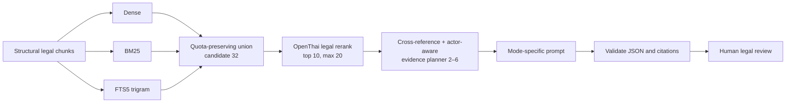

# OpenThai 2.0 Legal: Advanced Hybrid RAG Evaluation

วันที่ทดสอบ: 29 กรกฎาคม 2026

ผู้ทดสอบ: เจ้าของ repository นี้และ Codex ในฐานะผู้จัดทำระบบทดสอบ/ผู้ประเมินผล

สถานะ: การทดสอบอิสระ ไม่ใช่ผลรับรองจากผู้พัฒนาโมเดล และไม่ใช่คำแนะนำทางกฎหมาย

เอกสารประกอบ: [วิธีทดสอบ](METHODOLOGY.md) ·
[Codex judgement ราย scenario](CODEX_JUDGEMENT.md) ·
[วิเคราะห์ failure](FAILURE_ANALYSIS.md)

## 1. โมเดลที่ทดสอบ

[`iapp/openthai2.0-legal-thaillm-nemotron-3-nano-30b-a3b`](https://huggingface.co/iapp/openthai2.0-legal-thaillm-nemotron-3-nano-30b-a3b)
เป็นโมเดลกฎหมายไทยแบบ open-weight ที่เผยแพร่โดยทีม OpenThai/AIEAT/iApp
บนฐานสถาปัตยกรรม NVIDIA Nemotron 3 Nano 30B A3B การทดสอบนี้รันโมเดล
ด้วย vLLM ผ่าน OpenAI-compatible API บนเครื่อง local

ต้นฉบับของโมเดลระบุรูปแบบใช้งานหลักสามแบบ:

| Mode | temperature | top_p | max_tokens | thinking |
|---|---:|---:|---:|---|
| Citation answering — RAG หรือ closed-book | 0.0 | 1.0 | 2,048 | off |
| Legal essay drafting | 0.7 | 0.9 | 4,096 | on หรือ off |
| Legal essay drafting เมื่อเปิด thinking | 0.7 | 0.9 | 6,144 | on |
| General legal chat | 0.7 | 0.9 | 2,048 | off |

การทดสอบใช้ค่าข้างต้นโดยไม่รวมผลข้าม mode และใช้ context window ของ vLLM
ที่ 32,768 tokens ไม่ได้ตีความว่า `max_tokens` คือ context window

เอกสารอ้างอิง:

- [Hugging Face model card](https://huggingface.co/iapp/openthai2.0-legal-thaillm-nemotron-3-nano-30b-a3b)
- [OpenThai 2.0 Legal API documentation](https://iapp.co.th/docs/llm/openthai2p0-legal)
- [OpenThai 2.0 Legal RAG tutorial](https://iapp.co.th/openmodels/openthai2p0-legal-rag-tutorial)
- [VISAI-AI/NitiBench](https://huggingface.co/datasets/VISAI-AI/nitibench)

## 2. คำตอบสั้นที่สุด

OpenThai 2.0 Legal ให้ผลดีที่สุดเมื่อระบบหา “มาตราที่ถูกต้องและมีจำนวนน้อย”
แล้วส่งให้ตอบแบบ open-book:

- Open-book echo: ถูกทั้ง citation recall และ precision **9/9**
- NCB focused Citation RAG หลัง optimize: **5/5 scenarios**
- NitiBench advanced selection จาก 10 candidates: ถูกครบทั้ง recall และ
  precision **5/9**; พบมาตราที่ต้องใช้ครบ **6/9**
- Closed-book control แบบถามมาตราเจาะจงข้ามกฎหมาย: **0/5 แบบ strict**
  โดยหนึ่งกรณีตอบเลขมาตราหลักถูกแต่ไม่ครบอนุมาตรา

ดังนั้น production flow ที่เหมาะสมไม่ใช่ “ค้น top-k แล้วส่งทั้งหมด” แต่เป็น
**high-recall candidate generation → legal rerank → cross-reference expansion
→ focused evidence packet → citation validation → human review**

## 3. การเตรียมข้อมูลที่ใช้

ระบบแบ่งกฎหมายตามโครงสร้าง ไม่ตัดตามจำนวนตัวอักษร:

```json
{
  "law_name": "พระราชบัญญัติการประกอบธุรกิจข้อมูลเครดิต พ.ศ. 2545",
  "section": "24",
  "content": "ข้อความมาตราฉบับเต็ม ...",
  "page_start": 18,
  "page_end": 18,
  "source_url": "แหล่งต้นฉบับ",
  "effective_date": "ถ้ามี",
  "content_hash": "ใช้ตรวจเวอร์ชัน"
}
```

หลักที่ใช้:

1. หนึ่งมาตราต่อหนึ่ง chunk และเก็บ `law_name` + `section`
2. เก็บข้อความเดิมและ page provenance; normalization ใช้ใน index เท่านั้น
3. แปลงเลขไทยเพื่อการค้น แต่ไม่ทับข้อความต้นฉบับ
4. เก็บความเชื่อมโยง “มาตราหน้าที่ → มาตราบทลงโทษ” และมาตราที่อ้างถึงกัน
5. ตรวจ duplicate, section ที่หาย, OCR noise, header/footer และข้อความขาด
6. บันทึกแหล่งที่มา วันที่มีผล และ hash เพื่อรองรับการเปลี่ยนแปลงกฎหมาย

แนวทางนี้สอดคล้องกับคำแนะนำต้นฉบับที่ให้แบ่งหนึ่งมาตราต่อหนึ่ง chunk
พร้อม metadata ของชื่อกฎหมายและมาตรา และใกล้เคียงรูปแบบ NitiBench
มากกว่าการใช้ recursive character chunks

## 4. Retrieval ที่พัฒนาและทดสอบ

ระบบรองรับ retrieval profiles:

- Dense embedding
- BM25
- SQLite FTS5 trigram
- Weighted hybrid
- Reciprocal Rank Fusion (RRF)
- Adaptive hybrid
- Legal advanced hybrid

Legal advanced ไม่รวมคะแนน cosine, BM25 และ FTS ดิบเข้าด้วยกันโดยตรง
เพราะสเกลต่างกัน แต่สร้าง candidate union แบบรักษา quota:

```text
dense 2 รายการ → BM25 1 รายการ → FTS5 1 รายการ → วนซ้ำ
```

จากนั้นเพิ่ม actor-aware ordering, Thai legal query expansion และมาตรา
บทลงโทษที่ตัวบทอ้างโยง ก่อนส่ง candidate 32 chunks ให้ OpenThai rerank
แล้วลดเหลือ focused evidence 2–6 chunks สำหรับตอบจริง



## 5. ผล Retrieval

### 5.1 NitiBench sample 115 คำถาม

ตัวเลข embedding ถูก precompute และไม่รวมเวลา embedding ใน latency:

| Profile | k | Hit rate | Macro section recall | MRR | Mean search |
|---|---:|---:|---:|---:|---:|
| BM25 | 20 | 81.74% | 81.74% | 0.6734 | 106.32 ms |
| FTS5 | 20 | 81.74% | 81.74% | 0.6405 | 15.92 ms |
| Dense | 20 | 88.70% | 85.52% | 0.7389 | 7.12 ms |
| RRF hybrid | 20 | 87.83% | 85.58% | 0.7220 | 139.37 ms |
| Legal advanced | 20 | **92.17%** | **89.00%** | **0.7418** | 160.48 ms |

Hybrid ไม่ได้ชนะทุกค่า `k`: ที่ `k=5` dense มี hit rate 80.00% ขณะที่
legal advanced 80.87% และ RRF ลดเหลือ 76.52% จึงไม่ควรถือว่า fusion
ใด ๆ จะดีกว่า dense โดยอัตโนมัติ ต้องวัดกับ corpus และ question mix จริง

### 5.2 NCB realistic scenarios 13 ข้อ

| Stage | Candidate recall | OpenThai reranker recall |
|---|---:|---:|
| Baseline | 96.15% | 82.05% |
| หลัง optimize | **100.00%** | **91.03%** |

สิ่งที่ช่วย:

- ใช้ fact pattern เดิมสำหรับ dense embedding และขยายคำเฉพาะ lexical channel
- ขยาย candidate จากรายการสั้นเป็น 32
- รักษา quota ของ dense/BM25/FTS แทนการ fuse คะแนนดิบ
- เพิ่ม context ต่อ candidate เป็น 1,200 ตัวอักษร
- เชื่อมมาตราบทลงโทษจากข้อความ cross-reference

อย่างไรก็ตาม reranker ยังไม่ถึง 100% จึงต้องมี focused evidence planner
และ validator หลัง rerank

## 6. ผล Generation แยกตาม mode

### 6.1 Citation answering — NCB focused RAG

| Scenario | Expected | Evidence ที่ส่งตอบ | Citations | Recall | Precision | เวลา |
|---|---|---|---|---:|---:|---:|
| พนักงานเผยแพร่รายงานเครดิตใน Line | 24, 54 | 24, 54 | 24, 54 | 100% | 100% | 12.47 s |
| ใช้ข้อมูลเครดิตทำ cross-selling | 20, 22 | 20, 22 | 20, 22 | 100% | 100% | 17.70 s |
| ใบอนุญาตและสิทธิประกอบธุรกิจ | 6, 9 | 6, 9 | 6, 9 | 100% | 100% | 14.06 s |
| ปฏิเสธสินเชื่อและการโต้แย้ง | 26, 27, 28 | 28, 27, 26 | 26, 27, 28 | 100% | 100% | 17.81 s |
| วงจรข้อมูลต้องห้าม/ต่างประเทศ/เกินกำหนด | 10, 12, 13 | 10, 12, 13 | 10, 12, 13 | 100% | 100% | 16.70 s |

ค่าเฉลี่ย 15.75 วินาทีต่อคำตอบ ผล 5/5 นี้เป็น **focused scenario
evaluation** ไม่ใช่หลักฐานว่าใช้ได้ 100% กับคำถาม NCB ทุกชนิด

### 6.2 Open-book echo เทียบ selection

ใช้ NitiBench 9 ข้อจากหลายกฎหมาย:

| Mode | Exact citation set | Macro recall | Macro precision |
|---|---:|---:|---:|
| Echo — ส่งเฉพาะมาตราที่ถูก | **9/9** | **100.00%** | **100.00%** |
| Advanced selection — ส่ง top 10 | 5/9 | 66.67% | 61.11% |

ใน selection โมเดลพลาดสามแบบ:

- มาตราที่ถูกอยู่ลำดับ 6 แต่เลือก near-miss ลำดับต้น
- ชื่อกฎหมายและเลขมาตราใกล้กันจนเลือกผิดกฎหมาย
- ตอบมาตราถูกและเพิ่มมาตราใกล้เคียง ทำให้ recall ผ่านแต่ precision ลด

นี่เป็นหลักฐานว่าการได้ retrieval recall สูงยังไม่เท่ากับคำตอบ citation
ถูกต้อง ระบบต้องวัด “มาตราถูกอยู่ใน context หรือไม่” และ “โมเดลเลือก
เฉพาะมาตราที่ใช้จริงหรือไม่” แยกกัน

### 6.3 Closed-book control

| Scenario | Ground-truth assertion | โมเดลตอบ | Strict result |
|---|---|---|---:|
| แบบรายงานหลักทรัพย์เท็จ | 302/1 | 264, 265 | ไม่ผ่าน |
| ส่งออกช่อดอกกัญชาไม่มีใบอนุญาต | 46, 78 | 102 | ไม่ผ่าน |
| บุคคลต้องห้ามเข้าเมือง | 12(7), 12(8) | 12 | ไม่ผ่านแบบ strict |
| ข้อมูลสุขภาพตาม PDPA | 26 | 24 | ไม่ผ่าน |
| ร้านอาหาร/สถานบริการที่ข้อมูลไม่พอ | ควรงดเดามาตรา | ประมวลกฎหมายที่ดิน 108 | ไม่ผ่าน abstention |

ผล strict 0/5 ชุดนี้เป็นชุดควบคุมขนาดเล็ก และ ground truth สี่ข้อแรก
มาจากตัวอย่างที่ผู้ใช้จัดเตรียม จึงยังต้องตรวจ primary law ก่อนนำไปอ้างเป็น
legal benchmark แต่เพียงพอจะสรุปว่าไม่ควรใช้ closed-book สำหรับงานที่
ต้องการเลขมาตราแม่นยำ

### 6.4 Legal essay

| Profile | Cases | Section-anchor result | เวลาเฉลี่ย | ข้อสังเกต |
|---|---:|---:|---:|---|
| 4,096, thinking off | 2 | 2/2 พบมาตราที่คาด | 41.68 s | ภาษาไทยตรงงานกว่า แต่ยังมีข้อสรุปทางกฎหมายที่ต้องตรวจ |
| 6,144, thinking on | 2 | 1 case ครบ, 1 case recall 50% | 109.35 s | ช้ากว่า 2.62 เท่าและมี reasoning ภาษาอังกฤษปน |

ทั้งสอง profile ไม่ชน `max_tokens` จึงไม่พบหลักฐานว่าการเพิ่มเป็น 6,144
ช่วยคุณภาพในสองกรณีนี้ การเปิด thinking เป็นความสามารถที่ควรทดสอบ
แยกตาม serving template; รอบนี้ไม่เหมาะเป็นค่าเริ่มต้นใน UI

Legal essay ตอบได้โดยไม่ต้องมี RAG หากโจทย์ให้มาตราและข้อเท็จจริงที่
ต้องวิเคราะห์มาแล้ว แต่ถ้าต้องค้นมาตราเองหรืออ้างข้อความตัวบทปัจจุบัน
ควรให้ RAG/primary sources ก่อนร่าง

### 6.5 General legal chat ต่อเนื่อง

ทดสอบสาม turn ใน PostgreSQL session เดียว:

1. อธิบาย consent ตามกฎหมายข้อมูลเครดิตด้วยภาษาทั่วไป
2. ขอ checklist จากคำตอบก่อนหน้า
3. ขอให้ลดเหลือ 5 ข้อและระบุจุดที่ฝ่ายกฎหมายต้องตรวจ

ระบบคง session และดึงมาตรา 20 ต่อเนื่องครบ 3 turn ใช้เวลาเฉลี่ย 24.73
วินาที คงภาษาไทยและรูปแบบตามคำสั่งได้ แต่พบข้อความอธิบายบางส่วนที่
กว้างหรือไม่ตรงถ้อยคำตัวบท จึงเหมาะกับการอธิบาย/ร่าง checklist มากกว่า
การรับรอง legal conclusion

## 7. Codex judge

Codex ประเมินจากผลดิบโดยแยกสิ่งที่ตรวจได้เชิงกลออกจากการอ่านเชิงคุณภาพ:

| มิติ | วิธีตรวจ | ผล |
|---|---|---|
| Retrieval coverage | expected section อยู่ใน candidates หรือไม่ | ดีมากเมื่อ candidate 20–32; NCB optimized 100% |
| Citation recall | อ้าง expected section ครบหรือไม่ | Echo 100%; selection 66.67%; NCB focused 100% |
| Citation precision | อ้างเฉพาะมาตราที่ใช้หรือไม่ | Echo 100%; selection 61.11%; NCB focused 100% |
| Groundedness | citation ต้องอยู่ใน supplied context | validator ตรวจและปฏิเสธ citation นอก context |
| Legal substance | ข้อความอธิบายตรงบทบัญญัติ/สถานะคดีหรือไม่ | ยังพบ overclaim และคำอธิบายกว้างใน essay/chat |
| Abstention | เมื่อหลักฐานไม่พอหยุดเดาหรือไม่ | closed-book evidence-gap ไม่ผ่าน |
| Conversation | จำบริบทและทำตามรูปแบบต่อเนื่องหรือไม่ | ผ่าน 3/3 turns ใน session เดียว |

Codex ไม่รวมคะแนนเหล่านี้เป็นตัวเลข model score เดียว เพราะ retrieval,
selection, drafting และ legal correctness เป็นคนละปัญหา การรวมคะแนนจะ
ปิดบัง failure mode ที่ต้องแก้คนละจุด

## 8. Vector database

โค้ดเดียวกันรองรับ dense backend ต่อไปนี้ โดย BM25 และ FTS5 อยู่ข้าง
application:

| Backend | รูปแบบที่ smoke test | Index 73 chunks | Search | ผล sections |
|---|---|---:|---:|---|
| Qdrant | Local embedded | 889.49 ms | 2.59 ms | ตรงกัน |
| Chroma | PersistentClient | 506.32 ms | 36.03 ms | ตรงกัน |
| Milvus | Milvus Lite | 1,933.16 ms | 259.48 ms | ตรงกัน |

ตัวเลขนี้เป็น single-query smoke test ไม่ใช่ production performance
benchmark ส่วน Docker Compose ผ่านการ validate configuration แต่เครื่อง
ทดสอบไม่มี Docker daemon จึงไม่ได้อ้างว่า standalone containers ผ่าน
runtime test

## 9. Recommendation

ค่าที่แนะนำสำหรับ corpus ลักษณะเดียวกับการทดสอบ:

```text
chunk: one section per chunk
metadata: law_name, section, page, source_url, effective_date, content_hash
candidate_k: 32
hybrid quota: dense 2 : BM25 1 : FTS5 1
OpenThai rerank: top_k 10, hard maximum 20
answer evidence: 2–6 chunks
rerank excerpt: 1,200 characters per chunk
citation generation: temperature 0.0, top_p 1.0, max_tokens 2,048, thinking off
legal essay default: temperature 0.7, top_p 0.9, max_tokens 4,096, thinking off
general legal chat: temperature 0.7, top_p 0.9, max_tokens 2,048, thinking off
```

ควรให้มนุษย์ตรวจต่อเมื่อ:

- ตัวบทอาจแก้ไขใหม่หรือมีประกาศ/กฎลำดับรอง
- ต้องวินิจฉัยองค์ประกอบความผิด เจตนา ความรับผิด หรือบทลงโทษ
- มีข้อเท็จจริงขัดแย้ง ประเด็นพยานหลักฐาน หรือสถานะคดี
- โมเดลอ้างมาตรานอก evidence หรือเพิ่มมาตราที่ retriever ไม่ส่ง
- ใช้คำตอบเพื่ออนุมัติสินเชื่อ ลงโทษบุคลากร แจ้งหน่วยงาน หรือดำเนินคดี

## 10. ไฟล์ผลดิบ

- [`opengpt_modes.json`](../../results/advanced-hybrid-rag-20260729/opengpt_modes.json)
- [`nitibench_generation_selection.json`](../../results/advanced-hybrid-rag-20260729/nitibench_generation_selection.json)
- [`nitibench_hybrid_profiles.json`](../../results/advanced-hybrid-rag-20260729/nitibench_hybrid_profiles.json)
- [`retrieval_profiles.json`](../../results/advanced-hybrid-rag-20260729/retrieval_profiles.json)
- [`live_openthai_rerank_13.json`](../../results/advanced-hybrid-rag-20260729/live_openthai_rerank_13.json)
- [`live_openthai_rerank_13_optimized.json`](../../results/advanced-hybrid-rag-20260729/live_openthai_rerank_13_optimized.json)
- [`vector_backend_smoke.json`](../../results/advanced-hybrid-rag-20260729/vector_backend_smoke.json)

ผลดิบเก็บ prompt, answer, evidence, citation, usage และเวลาสำหรับตรวจซ้ำ
โดยไม่อัปโหลด model weights, database credentials, token หรือ chat session
ส่วนบุคคล
