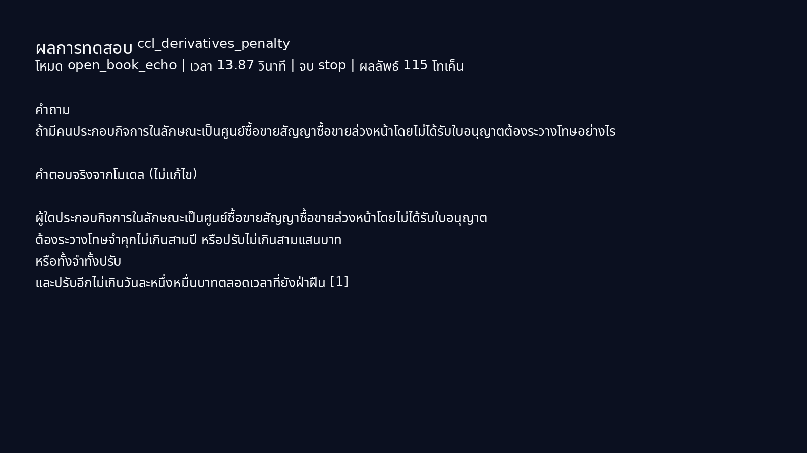
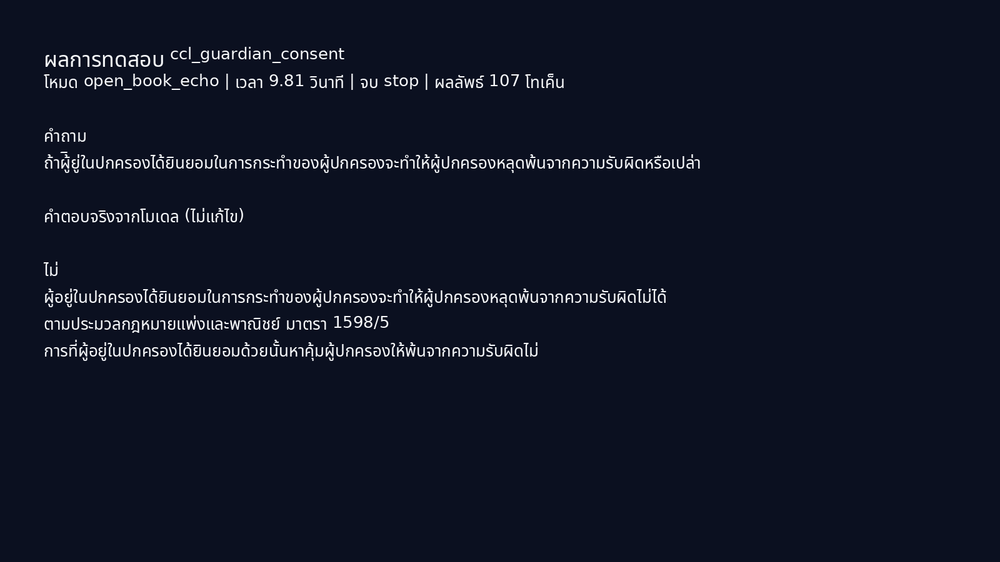
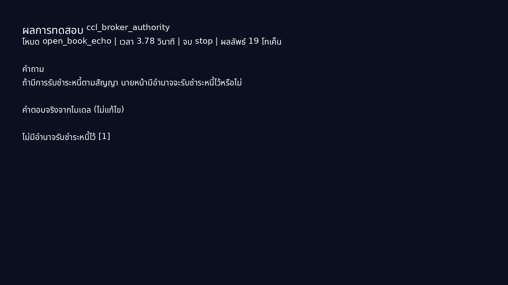
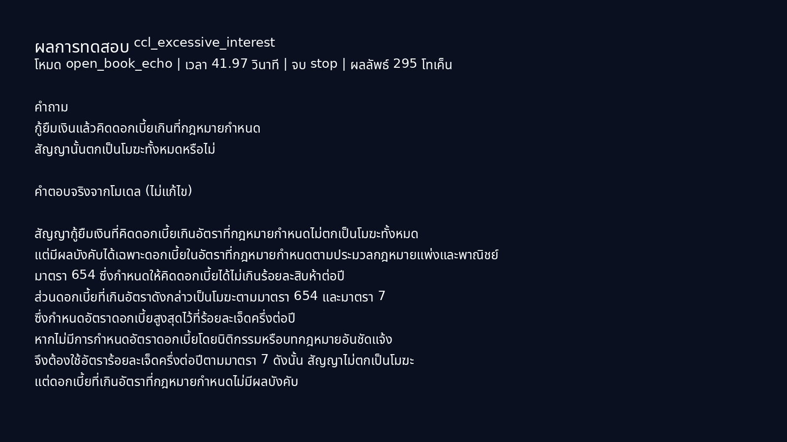
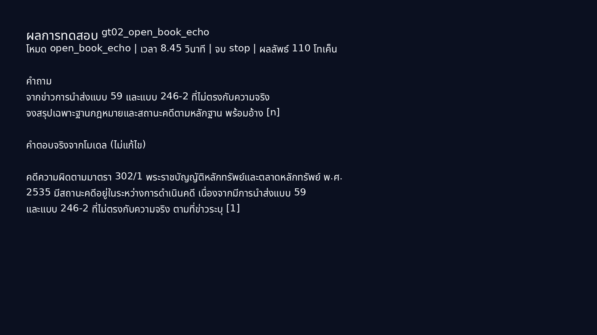
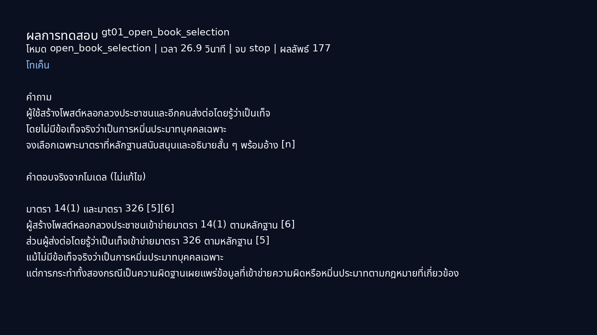
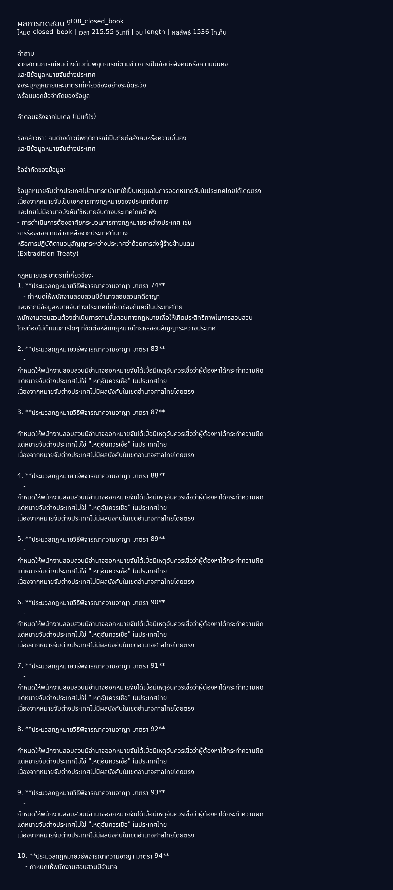
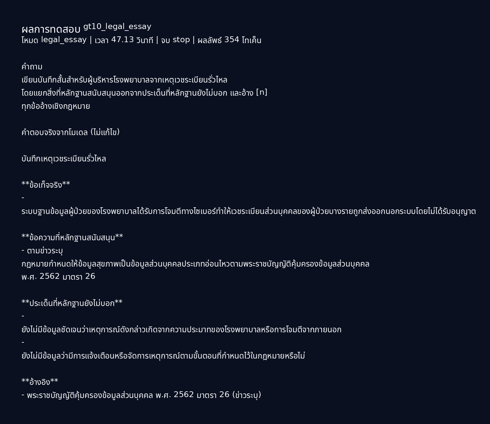

# NitiBench + extracted-ground-truth RAG benchmark — 29 Jul 2026

## Scope and safeguards

This is an independent diagnostic run of OpenThai 2.0 Legal, not a benchmark by
the model developer and not legal advice. It uses the locally served
`iapp/openthai2.0-legal-thaillm-nemotron-3-nano-30b-a3b` through vLLM at
`127.0.0.1:3033`, with Qwen3-Embedding-4B at `127.0.0.1:8082`.

No Claude, other LLM judge, or automatic retry was used. Results are raw model
outputs plus deterministic checks; they are not a legal correctness certification.

## Data preparation

- **NitiBench**: `VISAI-AI/nitibench`, revision
  [`9f75697075e0f5691e3b821037b908c05f1821a7`](https://huggingface.co/datasets/VISAI-AI/nitibench/tree/9f75697075e0f5691e3b821037b908c05f1821a7), MIT.
  Only `law_name`, `section_num`, and `section_content` from `relevant_laws` /
  `reference_laws` were indexed. Questions, answers, and reference answers were
  excluded.
- The resulting independent SQLite vector store has **3,934** NitiBench chunks:
  3,833 CCL and 101 Tax. NitiBench is a benchmark/test set rather than a complete
  primary-law corpus; this store is appropriate for controlled evaluation, not a
  production legal knowledge base.
- The supplied `example with ground truth` folder was normalized into 10 source
  records. Stated law/section evidence became **20 source-reported chunks** in a
  separate collection. The explanation/ground-truth answer field was never
  indexed. Eight ordinary records were eligible for generation; two sensitive
  criminal/political news records were retained only as provenance and excluded.
- News-reported sections are not substituted for official statute text. Prompts
  instruct the model to say “ข่าวระบุ” (the news reports) rather than treating
  these excerpts as primary law.

## Retrieval measurement (NitiBench)

A deterministic stratified set of **539** questions was used: 489 CCL (up to 24
per law) and all 50 Tax. A hit is exact matching of the expected stored legal
chunk ID; multi-section Recall@5 is averaged per question.

| Metric | Result |
|---|---:|
| Recall@1 | 65.49% |
| Recall@3 | 82.19% |
| Recall@5 | 85.90% |
| MRR@5 | 73.78% |
| Mean multi-section Recall@5 | 83.80% |
| CCL Recall@5 | 88.75% |
| Tax Recall@5 | 58.00% |
| Query embedding / vector search | 23.49 s / 20.41 s |

The 30.75-point CCL–Tax gap means this embedding/retrieval configuration needs
separate Tax tuning; a combined score alone would be misleading.

## Generation setup

This diagnostic uses a fixed seed (42), `enable_thinking=false`, and concise
output caps to make the scenarios reviewable: Citation/RAG and closed-book
`temperature=0.0`, `top_p=1.0`, `max_tokens=1,536`; legal essay
`temperature=0.7`, `top_p=0.9`, `max_tokens=2,048`.

These are **diagnostic caps**, not a replacement for the longer recommended
production profiles documented in the repository (citation 2,048; legal essay
4,096/6,144). In particular, any `finish=length` result must not be regarded as
a complete answer.

## Scenario results

Open-book echo supplies only the designated evidence. Open-book selection
supplies same-case near-miss sections. Closed-book supplies no evidence. The
NitiBench CCL items are in-domain statute questions; the supplied-ground-truth
items are source-reported-news examples and are deliberately labelled as such.

| Scenario | Mode | Seconds | Output tokens | Finish | Expected sections | Mentioned | Section coverage | Citation validity |
|---|---|---:|---:|---|---|---|---:|---:|
| `ccl_derivatives_penalty` | open_book_echo | 13.87 | 115 | stop | 132 | — | 0.0 | 1.00 |
| `ccl_guardian_consent` | open_book_echo | 9.81 | 107 | stop | 1598/5 | 1598/5 | 1.0 | 0.00 |
| `ccl_broker_authority` | open_book_echo | 3.78 | 19 | stop | 849 | — | 0.0 | 1.00 |
| `ccl_excessive_interest` | open_book_echo | 41.97 | 295 | stop | 173 | — | 0.0 | 0.00 |
| `gt02_open_book_echo` | open_book_echo | 8.45 | 110 | stop | 302/1 | 302/1 | 1.0 | 1.00 |
| `gt01_open_book_selection` | open_book_selection | 26.90 | 177 | stop | 14(1), 14(5) | 14(1) | 0.5 | 1.00 |
| `gt08_closed_book` | closed_book | 215.55 | 1536 | length | 12(7), 12(8) | — | 0.0 | 0.00 |
| `gt10_legal_essay` | legal_essay | 47.13 | 354 | stop | 26 | 26 | 1.0 | 0.00 |

**How to read the last columns.** “Mentioned” is a literal section-string check,
not a legal correctness score. Citation validity is the fraction of `[n]`
citations that point to a supplied item; an answer with no `[n]` scores 0. A
character-trigram overlap with the reference answer is retained in
`results.json` as a diagnostic proxy only and is not reported as accuracy.

## Findings

1. Retrieval is strong on CCL but materially weaker on Tax. Do not use the Tax
   aggregate as evidence of production coverage without adding authoritative tax
   statutes and evaluating per law.
2. The first CCL echo answer matches the reference wording closely and cites its
   evidence, but does not print the retrieved section number. Two other CCL
   answers are concise and substantively aligned with their retrieved passages
   but omit the requested `[n]` evidence marker or section identifier. Citation
   formatting must therefore be validated by the application layer.
3. The open-book selection case is a useful negative result: it selected section
   14(1) but incorrectly brought in Penal Code section 326 despite the prompt
   excluding individual defamation, and omitted 14(5). Evidence availability
   alone does not guarantee correct subset selection.
4. The closed-book immigration example reached the 1,536-token cap after
   **215.55 seconds**, did not name the source-reported sections 12(7)/(8), and
   introduced unrelated procedural provisions. This is a concrete reason to use
   verified RAG for high-stakes, section-specific work rather than relying on
   closed-book recall.
5. The legal-essay PDPA example correctly identifies section 26 and separates
   evidence gaps, but fails the requested `[n]` citation marker. It is usable as
   a drafting starting point only after source/citation verification.

## Raw result captures

The following captures render unedited model output. They do not contain model
weights, API keys, database credentials, ground-truth answer fields, or a copy
of the raw input news articles.

<code>ccl_derivatives_penalty</code> — raw output capture and short text excerpt

> ผู้ใดประกอบกิจการในลักษณะเป็นศูนย์ซื้อขายสัญญาซื้อขายล่วงหน้าโดยไม่ได้รับใบอนุญาต ต้องระวางโทษจำคุกไม่เกินสามปี หรือปรับไม่เกินสามแสนบาท หรือทั้งจำทั้งปรับ และปรับอีกไม่เกินวันละหนึ่งหมื่นบาทตลอดเวลาที่ยังฝ่าฝืน [1]

<code>ccl_guardian_consent</code> — raw output capture and short text excerpt

> ไม่ ผู้อยู่ในปกครองได้ยินยอมในการกระทำของผู้ปกครองจะทำให้ผู้ปกครองหลุดพ้นจากความรับผิดไม่ได้ ตามประมวลกฎหมายแพ่งและพาณิชย์ มาตรา 1598/5 การที่ผู้อยู่ในปกครองได้ยินยอมด้วยนั้นหาคุ้มผู้ปกครองให้พ้นจากความรับผิดไม่

<code>ccl_broker_authority</code> — raw output capture and short text excerpt

> ไม่มีอำนาจรับชำระหนี้ไว้ [1]

<code>ccl_excessive_interest</code> — raw output capture and short text excerpt

> สัญญากู้ยืมเงินที่คิดดอกเบี้ยเกินอัตราที่กฎหมายกำหนดไม่ตกเป็นโมฆะทั้งหมด แต่มีผลบังคับได้เฉพาะดอกเบี้ยในอัตราที่กฎหมายกำหนดตามประมวลกฎหมายแพ่งและพาณิชย์ มาตรา 654 ซึ่งกำหนดให้คิดดอกเบี้ยได้ไม่เกินร้อยละสิบห้าต่อปี ส่วนดอกเบี้ยที่เกินอัตราดังกล่าวเป็นโมฆะตามมาตรา 654 และมาตรา 7 ซึ่งกำหนดอัตราดอกเบี้ยสูงสุดไว้ที่ร้อยละเจ็ดครึ่งต่อปี หากไม่มีการกำหนดอัตราดอกเบี้ยโดยนิติกรรมหรือบทกฎหมายอันชัดแจ้ง จึงต้องใช้อัตราร้อยละเจ็ดครึ่งต่อปีตามมาตรา 7 ดังนั้น สัญญาไม่ตกเป็นโมฆะ แต่ดอกเบี้ยที่เกินอัตราที่กฎหมายกำหนดไม่มีผลบังคับ

<code>gt02_open_book_echo</code> — raw output capture and short text excerpt

> คดีความผิดตามมาตรา 302/1 พระราชบัญญัติหลักทรัพย์และตลาดหลักทรัพย์ พ.ศ. 2535 มีสถานะคดีอยู่ในระหว่างการดำเนินคดี เนื่องจากมีการนำส่งแบบ 59 และแบบ 246-2 ที่ไม่ตรงกับความจริง ตามที่ข่าวระบุ [1]

<code>gt01_open_book_selection</code> — raw output capture and short text excerpt

> มาตรา 14(1) และมาตรา 326 [5][6] ผู้สร้างโพสต์หลอกลวงประชาชนเข้าข่ายมาตรา 14(1) ตามหลักฐาน [6] ส่วนผู้ส่งต่อโดยรู้ว่าเป็นเท็จเข้าข่ายมาตรา 326 ตามหลักฐาน [5] แม้ไม่มีข้อเท็จจริงว่าเป็นการหมิ่นประมาทบุคคลเฉพาะ แต่การกระทำทั้งสองกรณีเป็นความผิดฐานเผยแพร่ข้อมูลที่เข้าข่ายความผิดหรือหมิ่นประมาทตามกฎหมายที่เกี่ยวข้อง

<code>gt08_closed_book</code> — raw output capture and short text excerpt

> ข้อกล่าวหา: คนต่างด้าวมีพฤติการณ์เป็นภัยต่อสังคมหรือความมั่นคง และมีข้อมูลหมายจับต่างประเทศ ข้อจำกัดของข้อมูล: - ข้อมูลหมายจับต่างประเทศไม่สามารถนำมาใช้เป็นเหตุผลในการออกหมายจับในประเทศไทยได้โดยตรง เนื่องจากหมายจับเป็นเอกสารทางกฎหมายของประเทศต้นทาง และไทยไม่มีอำนาจบังคับใช้หมายจับต่างประเทศโดยลำพัง - การดำเนินการต้องอาศัยกระบวนการทางกฎหมายระหว่างประเทศ เช่น การร้องขอความช่วยเหลือจากประเทศต้นทาง หรือการปฏิบัติตามอนุสัญญาระหว่างประเทศว่าด้วยการส่งผู้ร้ายข้ามแดน (Extradition Treaty) กฎหมายและมาตราที่เกี่ยวข้อง: 1. **ประมวลกฎหมายวิธีพิจารณาความอาญา มาตรา 74** - กำหนดให้พนักงานสอบสวนมีอำนาจสอบสวนคดีอาญา และหากมีข้อมูลหมายจับต่างประเทศที่เกี่ยวข้อง

<code>gt10_legal_essay</code> — raw output capture and short text excerpt

> บันทึกเหตุเวชระเบียนรั่วไหล **ข้อเท็จจริง** - ระบบฐานข้อมูลผู้ป่วยของโรงพยาบาลได้รับการโจมตีทางไซเบอร์ทำให้เวชระเบียนส่วนบุคคลของผู้ป่วยบางรายถูกส่งออกนอกระบบโดยไม่ได้รับอนุญาต **ข้อความที่หลักฐานสนับสนุน** - ตามข่าวระบุ กฎหมายกำหนดให้ข้อมูลสุขภาพเป็นข้อมูลส่วนบุคคลประเภทอ่อนไหวตามพระราชบัญญัติคุ้มครองข้อมูลส่วนบุคคล พ.ศ. 2562 มาตรา 26 **ประเด็นที่หลักฐานยังไม่บอก** - ยังไม่มีข้อมูลชัดเจนว่าเหตุการณ์ดังกล่าวเกิดจากความประมาทของโรงพยาบาลหรือการโจมตีจากภายนอก - ยังไม่มีข้อมูลว่ามีการแจ้งเตือนหรือจัดการเหตุการณ์ตามขั้นตอนที่กำหนดไว้ในกฎหมายหรือไม่ **อ้างอิง** - พระราชบัญญัติคุ้มครองข้อมูลส่วนบุคคล พ.ศ. 2562 มาตรา 26 (ข่าวระบุ)

## Reproducibility

Local, non-versioned artifacts:

- `rag_webui_8083/data/nitibench_vectors.sqlite3` — 3,954 total chunks including
  the separate 20-chunk source-evidence collection; intentionally not committed.
- `nitibench_rag_benchmark_20260729/results.json` — raw result data, including
  timings, output tokens, retrieval hits, and unedited answers.

The preparation and benchmark scripts are retained in the local model workspace.
No raw sensitive source record is published in this repository.
